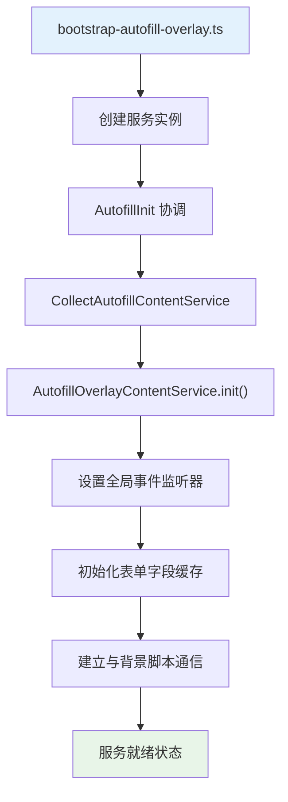
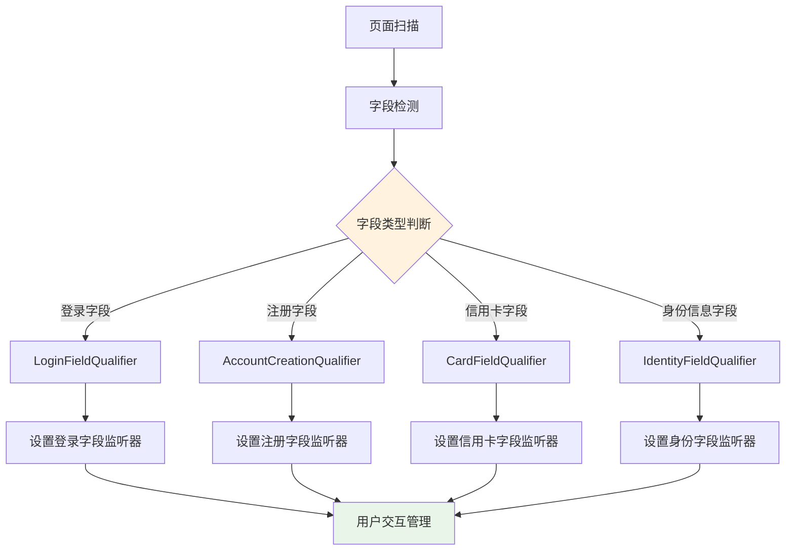
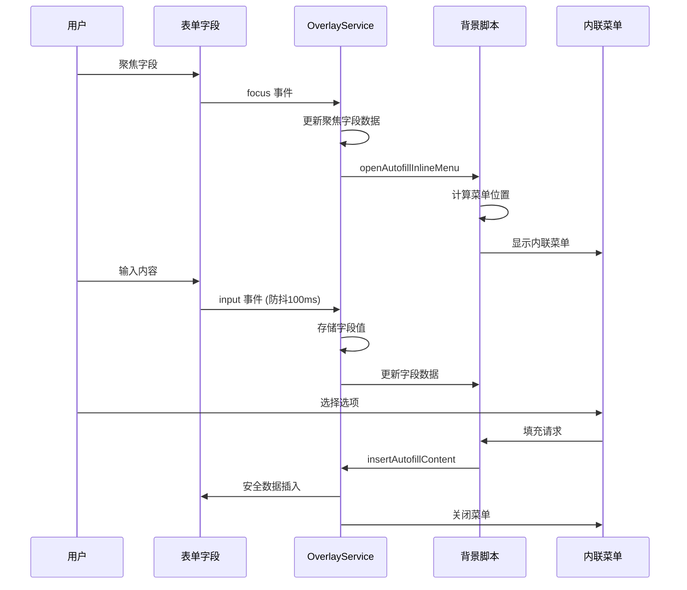
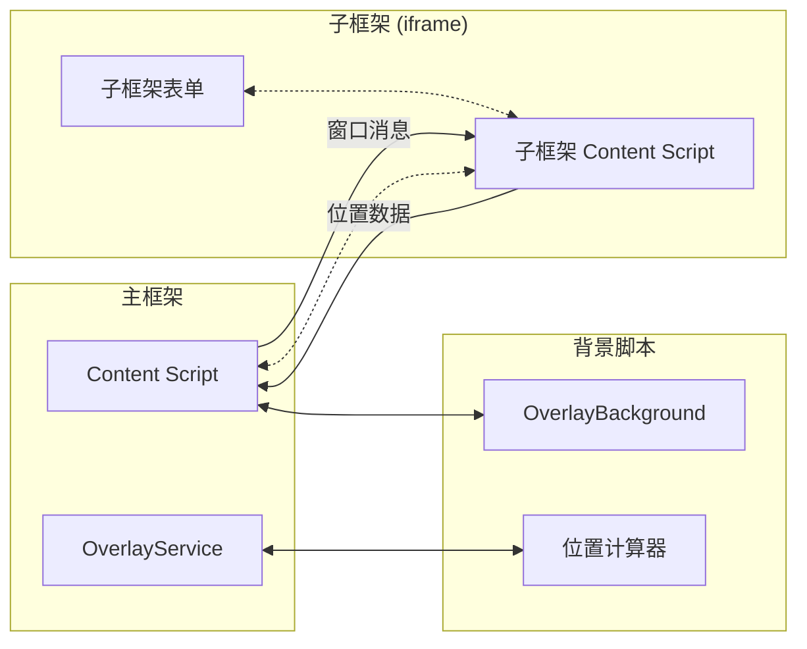
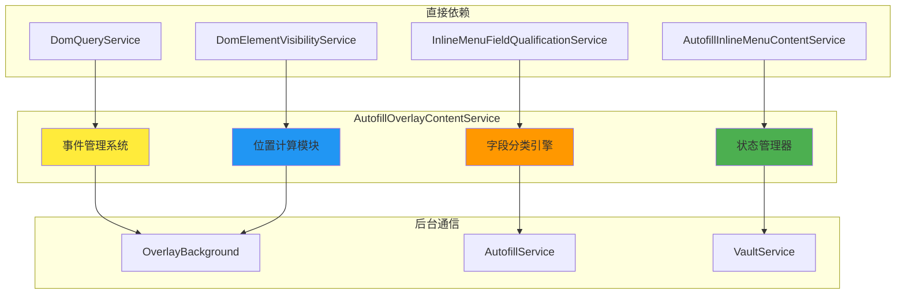
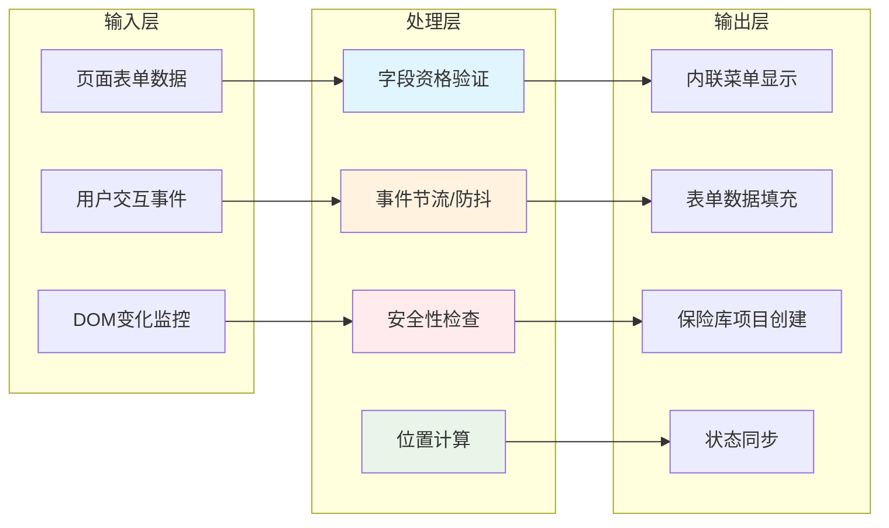
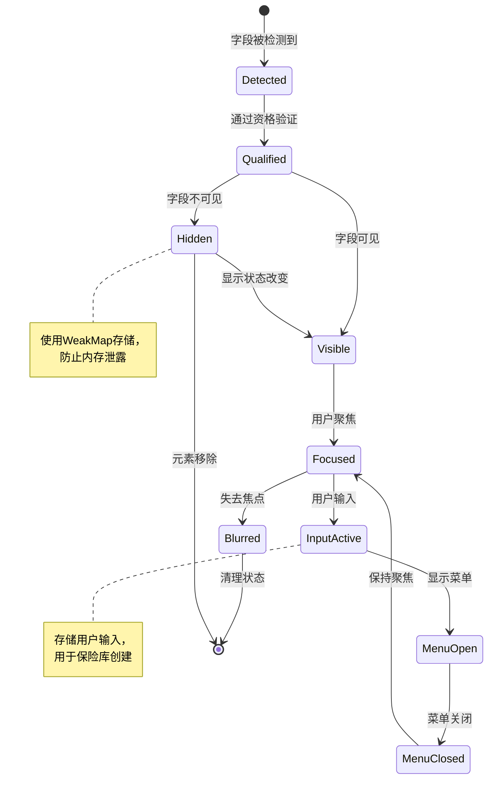
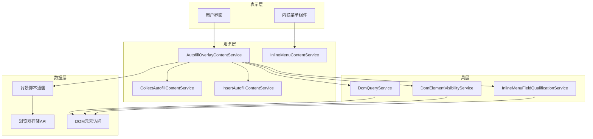
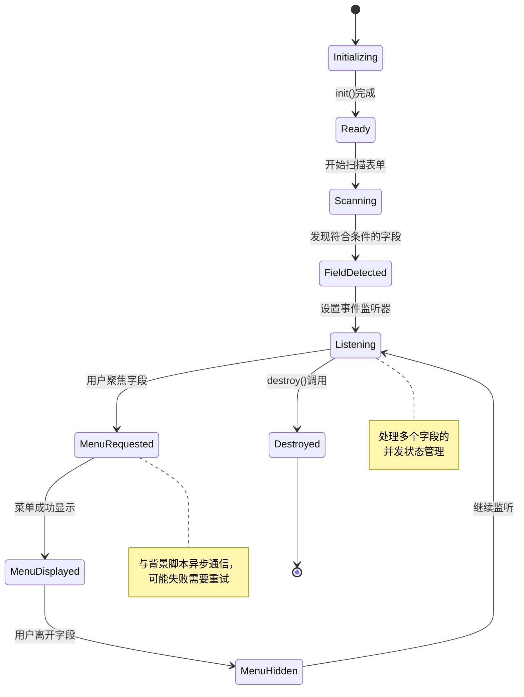

# AutofillOverlayContentService 深度分析

## 概览

`AutofillOverlayContentService` 是 Bitwarden 浏览器扩展中的核心服务，负责管理表单字段的内联自动填充菜单功能。该服务充当表单检测、用户交互处理和后台脚本通信之间的协调层，是整个自动填充生态系统的关键组件。

## 主要功能流程

### 1. 服务初始化流程



**初始化关键步骤:**

1. **依赖注入**: 获取 DomQueryService、DomElementVisibilityService 等依赖服务
2. **事件系统设置**: 初始化事件处理器记忆化系统
3. **全局监听器**: 设置文档级别的事件监听器
4. **数据结构初始化**: 创建表单字段映射和缓存结构

### 2. 表单字段发现与分类流程



**字段分类逻辑 (src/autofill/services/autofill-overlay-content.service.ts:1048-1096):**

```typescript
// 复杂的字段资格验证决策树
private isFieldQualifiedForInlineMenu(
  formFieldElement: ElementWithOpId<FormFieldElement>,
  autofillFieldData: AutofillField,
  pageDetails: AutofillPageDetails,
): boolean {
  // 1. 基础验证：禁用、只读、可见性检查
  if (autofillFieldData.readonly || autofillFieldData.disabled || !autofillFieldData.viewable) {
    return false;
  }

  // 2. 字段类型验证：密码、邮件、用户名字段
  if (this.shouldDisableInlineMenuOnField(autofillFieldData, pageDetails)) {
    return false;
  }

  // 3. DOM 元素验证：确保元素仍在文档中
  if (!formFieldElement.isConnected) {
    return false;
  }

  // 4. 用户设置验证：检查内联菜单是否启用
  return this.userSettings?.enableInlineMenu;
}
```

### 3. 用户交互事件处理流程



**事件处理器记忆化系统:**

```typescript
// 防止内存泄露的事件处理器缓存机制
private useEventHandlersMemo = (eventHandler: EventListener, memoIndex: string) => {
  return this.eventHandlersMemo[memoIndex] || (this.eventHandlersMemo[memoIndex] = eventHandler);
};

// 节流重新定位处理器 (250ms)
const repositionHandler = this.useEventHandlersMemo(
  throttle(this.handleOverlayRepositionEvent, 250),
  AUTOFILL_OVERLAY_HANDLE_REPOSITION,
);

// 防抖输入处理器 (100ms)
const inputHandler = this.useEventHandlersMemo(
  debounce(this.handleFormFieldInputEvent, 100),
  AUTOFILL_OVERLAY_HANDLE_FORM_FIELD_INPUT,
);
```

### 4. 跨框架通信架构



**复杂的子框架位置计算 (src/autofill/services/autofill-overlay-content.service.ts:1360-1538):**

```typescript
// 递归iframe偏移计算算法
private async getSubFrameOffsets(): Promise<SubFrameOffsetData> {
  // 生成26种不同的URL格式用于框架识别
  const urlVariations = [
    globalThis.location.href,
    globalThis.location.origin + globalThis.location.pathname,
    globalThis.location.origin,
    // ... 23种其他变体
  ];

  // 递归遍历父框架层级
  let currentWindow = globalThis.parent;
  let depth = 0;
  const maxDepth = 10; // 防止无限递归

  while (currentWindow !== globalThis.top && depth < maxDepth) {
    // 向父框架发送位置请求消息
    currentWindow.postMessage({
      command: AUTOFILL_OVERLAY_ELEMENT_POSITION,
      data: { urls: urlVariations }
    }, "*");

    depth++;
    currentWindow = currentWindow.parent;
  }

  // 等待所有框架响应并计算最终偏移
  return this.calculateSubFrameOffsets();
}
```

## 核心组件交互图

### 依赖关系网络



### 数据流架构



## 复杂难懂部分深度解析

### 1. 事件管理系统的复杂性

**问题**: 该服务需要管理大量不同类型的事件监听器，同时避免内存泄露和重复监听器创建。

**解决方案分析**:

```typescript
// 记忆化事件处理器系统
private eventHandlersMemo: { [key: string]: EventListener } = {};

// 核心记忆化函数
private useEventHandlersMemo = (eventHandler: EventListener, memoIndex: string) => {
  // 如果已存在，返回缓存的处理器；否则创建新的并缓存
  return this.eventHandlersMemo[memoIndex] || (this.eventHandlersMemo[memoIndex] = eventHandler);
};

// 实际使用示例
private setupFormFieldEventListeners(formFieldElement, autofillFieldData) {
  // 聚焦事件 - 使用记忆化处理器
  const focusHandler = this.useEventHandlersMemo(
    this.handleFormFieldFocusEvent.bind(this),
    `${AUTOFILL_OVERLAY_HANDLE_FORM_FIELD_FOCUS}_${autofillFieldData.opid}`
  );

  // 输入事件 - 防抖处理
  const inputHandler = this.useEventHandlersMemo(
    debounce(this.handleFormFieldInputEvent.bind(this), 100),
    `${AUTOFILL_OVERLAY_HANDLE_FORM_FIELD_INPUT}_${autofillFieldData.opid}`
  );

  // 模糊事件 - 延迟处理
  const blurHandler = this.useEventHandlersMemo(
    this.createDelayedBlurHandler(),
    `${AUTOFILL_OVERLAY_HANDLE_FORM_FIELD_BLUR}_${autofillFieldData.opid}`
  );
}
```

**复杂性解读**:

- **内存管理**: 通过键值对缓存避免创建重复的事件监听器
- **生命周期管理**: 每个字段使用唯一标识符 (opid) 来区分监听器
- **性能优化**: 节流和防抖机制防止过度触发

### 2. 提交按钮检测算法的复杂性

**问题**: 需要在各种不同的表单实现中可靠地检测提交行为，包括标准表单、无表单按钮、动态生成的按钮等。

**算法分析 (src/autofill/services/autofill-overlay-content.service.ts:518-544)**:

```typescript
private findSubmitElementsInFormElement(formElement: HTMLFormElement): HTMLElement[] {
  const submitElements: HTMLElement[] = [];

  // 第一阶段：标准提交元素
  const genericSubmitElement = formElement.querySelector("[type='submit']");
  if (genericSubmitElement) {
    submitElements.push(genericSubmitElement as HTMLElement);
  }

  // 第二阶段：按钮元素查找
  const buttonElements = Array.from(formElement.querySelectorAll("button, [type='button']"));
  for (const buttonElement of buttonElements) {
    // 检查按钮文本是否包含提交相关关键词
    if (this.buttonElementHasSubmitKeyword(buttonElement)) {
      submitElements.push(buttonElement as HTMLElement);
    }
  }

  // 第三阶段：链接元素作为后备
  if (!submitElements.length) {
    const anchorElements = Array.from(formElement.querySelectorAll("a"));
    for (const anchorElement of anchorElements) {
      if (this.buttonElementHasSubmitKeyword(anchorElement)) {
        submitElements.push(anchorElement);
      }
    }
  }

  return submitElements;
}

// 关键词检测逻辑
private buttonElementHasSubmitKeyword(element: HTMLElement): boolean {
  const submitKeywords = ["submit", "confirm", "continue", "next", "save", "登录", "提交", "保存"];
  const elementText = element.textContent?.toLowerCase().trim() || "";
  const elementValue = (element as HTMLInputElement).value?.toLowerCase().trim() || "";

  return submitKeywords.some(keyword =>
    elementText.includes(keyword) || elementValue.includes(keyword)
  );
}
```

**复杂性挑战**:

1. **多语言支持**: 需要识别不同语言的提交关键词
2. **DOM结构变化**: 处理动态生成的按钮和表单
3. **优先级排序**: 三级查找策略确保找到最合适的提交元素
4. **性能考虑**: 避免过度的DOM查询和遍历

### 3. iframe跨框架通信的复杂性

**问题**: 在嵌套iframe环境中准确计算元素位置和建立通信通道。

**解决方案深度解析**:

```typescript
// URL变体生成 - 用于iframe识别
private generateUrlVariations(): string[] {
  const variations: string[] = [];
  const location = globalThis.location;

  // 基础URL格式
  variations.push(location.href);
  variations.push(location.origin + location.pathname);
  variations.push(location.origin);

  // 处理查询参数变体
  const urlWithoutQuery = location.origin + location.pathname;
  variations.push(urlWithoutQuery);

  // 处理哈希变体
  if (location.hash) {
    variations.push(urlWithoutQuery + location.hash);
  }

  // 处理协议变体
  if (location.protocol === "https:") {
    variations.push(location.href.replace("https://", "http://"));
  } else if (location.protocol === "http:") {
    variations.push(location.href.replace("http://", "https://"));
  }

  // 处理www前缀变体
  if (location.hostname.startsWith("www.")) {
    variations.push(location.href.replace("www.", ""));
  } else {
    variations.push(location.href.replace("://", "://www."));
  }

  return [...new Set(variations)]; // 去重
}

// 跨框架消息处理
private handleWindowMessage = (event: MessageEvent) => {
  // 安全性检查
  if (!this.isValidMessageOrigin(event.origin)) {
    return;
  }

  // 消息类型检查
  if (event.data?.command !== AUTOFILL_OVERLAY_ELEMENT_POSITION) {
    return;
  }

  // 处理位置请求
  const { data } = event.data;
  const frameOffsets = this.calculateFrameOffsets(data.urls);

  // 回复位置信息
  event.source?.postMessage({
    command: AUTOFILL_OVERLAY_ELEMENT_POSITION_RESPONSE,
    data: frameOffsets
  }, event.origin);
};
```

**技术挑战**:

1. **安全边界**: 确保跨框架通信的安全性
2. **URL匹配**: 处理各种URL格式变体以准确识别框架
3. **递归计算**: 处理多层嵌套iframe的位置计算
4. **异步协调**: 管理多个异步位置计算请求

### 4. 字段状态管理的复杂性

**数据结构设计**:

```typescript
// 主要字段映射 - 可见字段
private formFieldElements = new Map<
  ElementWithOpId<FormFieldElement>,
  AutofillField
>();

// 隐藏字段映射 - 使用WeakMap防止内存泄露
private hiddenFormFieldElements = new WeakMap<
  ElementWithOpId<FormFieldElement>,
  AutofillField
>();

// 用户填充字段 - 用于保险库项目创建
private userFilledFields: Record<string, FillableFormFieldElement> = {};

// 聚焦字段数据 - 用于位置计算和菜单显示
private focusedFieldData: FocusedFieldData | null = null;

// 最近聚焦的字段 - 用于状态管理
private mostRecentlyFocusedField: ElementWithOpId<FormFieldElement> | null = null;
```

**状态转换复杂性**:



### 5. 性能优化策略的复杂性

**事件节流和防抖实现**:

```typescript
// 自定义节流实现 - 用于位置重新计算
private throttle<T extends (...args: any[]) => void>(
  func: T,
  delay: number
): (...args: Parameters<T>) => void {
  let timeoutId: number | null = null;
  let lastExecTime = 0;

  return (...args: Parameters<T>) => {
    const now = Date.now();

    if (now - lastExecTime > delay) {
      // 立即执行
      lastExecTime = now;
      func.apply(this, args);
    } else if (!timeoutId) {
      // 延迟执行
      timeoutId = globalThis.setTimeout(() => {
        lastExecTime = Date.now();
        func.apply(this, args);
        timeoutId = null;
      }, delay - (now - lastExecTime));
    }
  };
}

// 自定义防抖实现 - 用于输入处理
private debounce<T extends (...args: any[]) => void>(
  func: T,
  delay: number
): (...args: Parameters<T>) => void {
  let timeoutId: number | null = null;

  return (...args: Parameters<T>) => {
    if (timeoutId) {
      globalThis.clearTimeout(timeoutId);
    }

    timeoutId = globalThis.setTimeout(() => {
      func.apply(this, args);
      timeoutId = null;
    }, delay);
  };
}
```

**Intersection Observer 优化**:

```typescript
// 现代浏览器API用于精确位置计算
private setupIntersectionObserver() {
  if (!globalThis.IntersectionObserver) {
    // 降级到传统方法
    return this.setupLegacyPositioning();
  }

  this.intersectionObserver = new IntersectionObserver((entries) => {
    entries.forEach(entry => {
      const element = entry.target as ElementWithOpId<FormFieldElement>;
      const fieldData = this.formFieldElements.get(element);

      if (fieldData && entry.isIntersecting !== fieldData.viewable) {
        // 更新可见性状态
        fieldData.viewable = entry.isIntersecting;

        if (entry.isIntersecting && element === this.mostRecentlyFocusedField) {
          // 元素重新可见且为聚焦字段，重新显示菜单
          this.repositionOverlay();
        }
      }
    });
  }, {
    threshold: [0, 0.1, 1.0], // 多阈值检测
    rootMargin: '10px' // 提前检测边缘情况
  });
}
```

## 架构设计模式分析

### 1. 服务层架构模式



**设计原则**:

- **单一责任**: 每个服务只负责特定功能领域
- **依赖注入**: 构造函数注入保证可测试性
- **接口隔离**: 通过明确的服务边界降低耦合
- **开放封闭**: 可扩展但对修改封闭的设计

### 2. 观察者模式实现

```typescript
// 事件驱动的状态管理
class AutofillOverlayContentService {
  private observers: Map<string, Set<EventListener>> = new Map();

  // 注册观察者
  public subscribe(eventType: string, callback: EventListener): void {
    if (!this.observers.has(eventType)) {
      this.observers.set(eventType, new Set());
    }
    this.observers.get(eventType)!.add(callback);
  }

  // 移除观察者
  public unsubscribe(eventType: string, callback: EventListener): void {
    this.observers.get(eventType)?.delete(callback);
  }

  // 通知所有观察者
  private notify(eventType: string, data: any): void {
    this.observers.get(eventType)?.forEach((callback) => {
      try {
        callback(data);
      } catch (error) {
        console.error(`Observer callback error for ${eventType}:`, error);
      }
    });
  }
}
```

### 3. 状态机模式



## 安全性考虑

### 1. 内容安全策略 (CSP) 合规性

```typescript
// 确保所有动态内容符合CSP要求
private createSecureIframe(url: string): HTMLIFrameElement {
  const iframe = globalThis.document.createElement('iframe');

  // 设置安全属性
  iframe.setAttribute('sandbox', 'allow-scripts allow-same-origin');
  iframe.setAttribute('src', url);
  iframe.style.border = 'none';
  iframe.style.position = 'absolute';

  // 防止clickjacking攻击
  iframe.setAttribute('frameborder', '0');
  iframe.setAttribute('scrolling', 'no');

  return iframe;
}

// DOM操作前的安全验证
private validateElementSafety(element: HTMLElement): boolean {
  // 确保元素仍在文档中
  if (!element.isConnected) {
    return false;
  }

  // 验证元素来源
  if (element.ownerDocument !== globalThis.document) {
    console.warn('Cross-document element access attempt blocked');
    return false;
  }

  // 检查元素是否被恶意修改
  if (element.hasAttribute('data-bitwarden-ignored')) {
    return false;
  }

  return true;
}
```

### 2. 输入验证和净化

```typescript
// 用户输入安全处理
private sanitizeFieldValue(value: string): string {
  // 移除潜在的脚本内容
  const scriptPattern = /<script\b[^<]*(?:(?!<\/script>)<[^<]*)*<\/script>/gi;
  let sanitized = value.replace(scriptPattern, '');

  // 限制长度防止DoS攻击
  const MAX_FIELD_LENGTH = 10000;
  if (sanitized.length > MAX_FIELD_LENGTH) {
    sanitized = sanitized.substring(0, MAX_FIELD_LENGTH);
  }

  // HTML实体编码
  sanitized = sanitized
    .replace(/&/g, '&amp;')
    .replace(/</g, '&lt;')
    .replace(/>/g, '&gt;')
    .replace(/"/g, '&quot;')
    .replace(/'/g, '&#x27;');

  return sanitized;
}

// 消息验证
private validateMessage(message: any): boolean {
  if (!message || typeof message !== 'object') {
    return false;
  }

  // 验证消息结构
  const requiredFields = ['command', 'data'];
  if (!requiredFields.every(field => message.hasOwnProperty(field))) {
    return false;
  }

  // 验证命令白名单
  const allowedCommands = [
    'openAutofillInlineMenu',
    'closeAutofillInlineMenu',
    'updateFocusedFieldData'
  ];

  if (!allowedCommands.includes(message.command)) {
    console.warn(`Blocked unauthorized command: ${message.command}`);
    return false;
  }

  return true;
}
```

## 性能监控与调试

### 1. 性能指标收集

```typescript
// 性能监控装饰器
private performance = {
  startTime: new Map<string, number>(),

  start(operation: string): void {
    this.startTime.set(operation, performance.now());
  },

  end(operation: string): number {
    const start = this.startTime.get(operation);
    if (!start) return 0;

    const duration = performance.now() - start;
    this.startTime.delete(operation);

    // 记录性能数据
    if (duration > 100) { // 超过100ms的操作
      console.warn(`Slow operation detected: ${operation} took ${duration.toFixed(2)}ms`);
    }

    return duration;
  }
};

// 在关键操作中使用
private async setupOverlayListeners(pageDetails: AutofillPageDetails): Promise<void> {
  this.performance.start('setupOverlayListeners');

  try {
    // 执行设置逻辑
    await this.processPageDetails(pageDetails);
  } finally {
    this.performance.end('setupOverlayListeners');
  }
}
```

### 2. 调试信息系统

```typescript
// 调试日志系统
private debug = {
  enabled: false, // 生产环境中为false

  log(category: string, message: string, data?: any): void {
    if (!this.enabled) return;

    const timestamp = new Date().toISOString();
    const logEntry = {
      timestamp,
      category,
      message,
      data: data ? JSON.stringify(data, null, 2) : undefined
    };

    console.group(`[AutofillOverlay] ${category}`);
    console.log(message);
    if (data) console.log(data);
    console.groupEnd();

    // 存储到会话存储用于调试
    const logs = JSON.parse(sessionStorage.getItem('bitwarden-debug-logs') || '[]');
    logs.push(logEntry);

    // 限制日志数量
    if (logs.length > 100) {
      logs.splice(0, 50);
    }

    sessionStorage.setItem('bitwarden-debug-logs', JSON.stringify(logs));
  }
};

// 在关键路径中使用调试
private handleFormFieldFocusEvent = (event: FocusEvent): void => {
  this.debug.log('FieldFocus', 'Field focus event triggered', {
    elementId: (event.target as HTMLElement).id,
    elementType: (event.target as HTMLElement).tagName,
    timestamp: Date.now()
  });

  // 继续处理逻辑...
};
```

## 未来改进建议

### 1. 代码质量改进

**类型安全加强**:

- 移除 `@ts-strict-ignore` 注释
- 为所有DOM操作添加严格类型定义
- 使用类型守卫替换 `any` 类型

**代码复杂度降低**:

- 将大型方法拆分为更小的、单一职责的函数
- 提取复杂的条件逻辑到独立的决策类中
- 使用策略模式替换复杂的if-else链

### 2. 性能优化机会

**内存管理**:

- 实现更精确的事件监听器清理机制
- 使用对象池模式重用频繁创建的对象
- 优化大型数据结构的访问模式

**异步优化**:

- 使用Web Workers处理复杂的DOM计算
- 实现更精细的请求批处理和缓存
- 采用虚拟化技术处理大量表单字段

### 3. 用户体验增强

**响应性改进**:

- 实现预测性菜单预加载
- 优化动画和过渡效果
- 增强移动设备适配

**可访问性提升**:

- 完善键盘导航支持
- 增强屏幕阅读器兼容性
- 提供高对比度主题支持

## 总结

`AutofillOverlayContentService` 是一个功能丰富但复杂度很高的服务，它成功地在浏览器扩展的受限环境中实现了复杂的用户交互功能。其主要特点包括:

**优势**:

- 全面的事件处理和状态管理
- 强大的跨框架兼容性
- 良好的性能优化机制
- 严格的安全性考虑

**挑战**:

- 高度复杂的代码结构需要深入理解才能维护
- 大量的异步操作和状态管理增加了调试难度
- 与多个外部系统的集成增加了故障点

**建议**:

- 通过重构降低复杂度
- 加强单元测试覆盖率
- 改进文档和代码注释
- 考虑使用状态管理库简化状态逻辑

该服务展现了现代浏览器扩展开发中的高级模式和最佳实践，同时也揭示了在复杂系统中平衡功能性、性能和可维护性的挑战。
