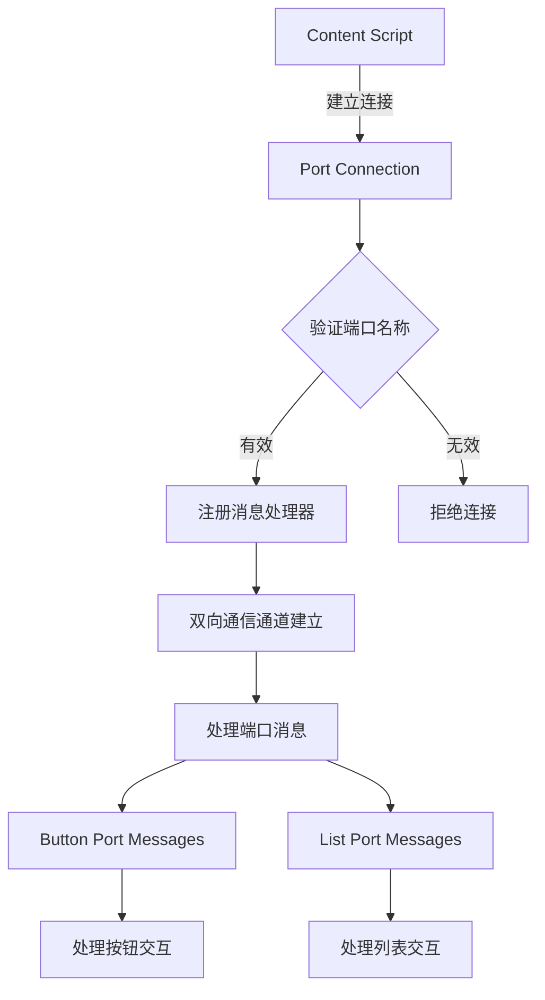
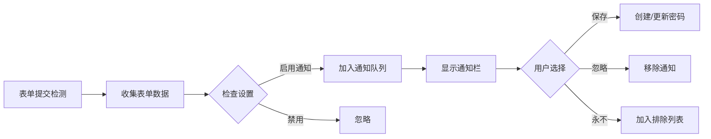
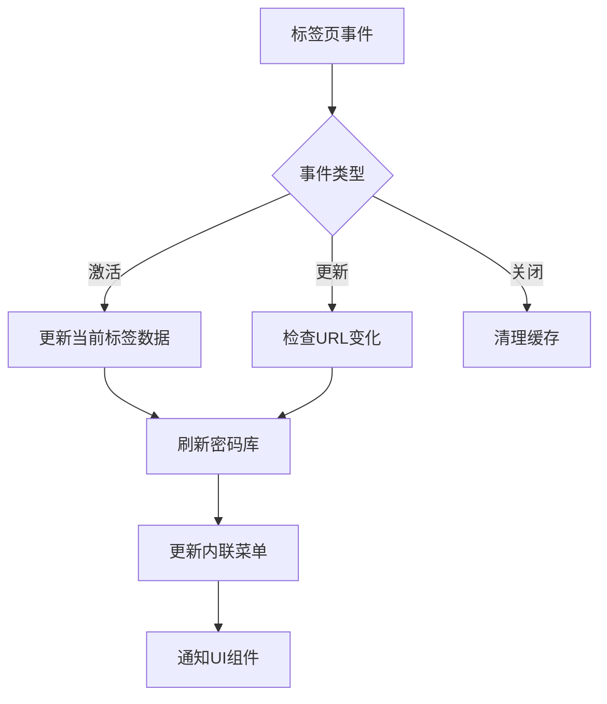
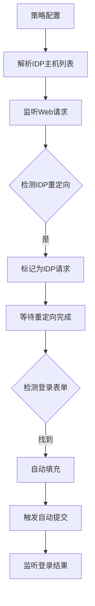

# Autofill Background 组件交互流程详解

## 1. OverlayBackground 详细分析

### 1.1 核心职责与功能

OverlayBackground 是整个内联菜单系统的核心控制器，管理着从数据获取到UI渲染的完整流程。

### 1.2 关键数据结构

```typescript
// 端口管理
private inlineMenuButtonPort: chrome.runtime.Port;           // 按钮端口
private inlineMenuListPort: chrome.runtime.Port;             // 列表端口
private inlineMenuButtonMessageConnectorPort: chrome.runtime.Port;  // 按钮消息连接器
private inlineMenuListMessageConnectorPort: chrome.runtime.Port;    // 列表消息连接器

// 数据缓存
private inlineMenuCiphers: Map<string, CipherView>;          // 密码库缓存
private inlineMenuFido2Credentials: Set<string>;             // Passkey凭据
private cardAndIdentityCiphers: Set<CipherView>;            // 卡片和身份缓存

// 状态管理
private isFieldCurrentlyFocused: boolean = false;            // 字段焦点状态
private isFieldCurrentlyFilling: boolean = false;            // 填充状态
private isInlineMenuButtonVisible: boolean = false;          // 按钮可见性
private isInlineMenuListVisible: boolean = false;            // 列表可见性

// 位置信息
private inlineMenuPosition: InlineMenuPosition = {};         // 菜单位置
private focusedFieldData: FocusedFieldData;                 // 焦点字段数据
private subFrameOffsetsForTab: SubFrameOffsetsForTab = {};  // iframe偏移量
```

### 1.3 消息处理流程

#### 1.3.1 扩展消息处理器映射

```typescript
private readonly extensionMessageHandlers = {
  // 菜单生命周期
  autofillOverlayElementClosed: 处理菜单关闭,
  openAutofillInlineMenu: 打开内联菜单,
  closeAutofillInlineMenu: 关闭内联菜单,

  // 焦点管理
  updateFocusedFieldData: 更新焦点字段数据,
  updateIsFieldCurrentlyFocused: 更新字段焦点状态,
  checkIsFieldCurrentlyFocused: 检查字段焦点,

  // 数据同步
  updateOverlayCiphers: 更新密码库数据,
  collectPageDetailsResponse: 存储页面详情,

  // 位置管理
  triggerAutofillOverlayReposition: 触发重新定位,
  updateSubFrameData: 更新子框架数据,

  // 认证相关
  unlockCompleted: 解锁完成处理,
  fido2AbortRequest: 中止Fido2请求
}
```

#### 1.3.2 端口消息处理流程



### 1.4 复杂功能实现细节

#### 1.4.1 内联菜单定位算法

```typescript
// 定位计算的核心逻辑
async updateInlineMenuPosition(sender: chrome.runtime.MessageSender) {
  // 1. 获取焦点字段的位置信息
  const fieldRect = this.focusedFieldData.focusedFieldRects;

  // 2. 计算iframe偏移量链
  const frameOffsets = await this.calculateFrameOffsets(sender);

  // 3. 合并计算最终位置
  const position = {
    top: fieldRect.top + frameOffsets.top,
    left: fieldRect.left + frameOffsets.left,
    width: fieldRect.width,
    height: fieldRect.height
  };

  // 4. 处理视口边界
  this.adjustForViewportBoundaries(position);

  // 5. 更新菜单位置
  this.inlineMenuPosition = position;
}
```

**关键难点**:

- **多层iframe嵌套**: 需要递归计算每层iframe的偏移量
- **跨域限制**: 某些iframe无法访问，需要特殊处理
- **动态内容**: 页面内容变化时需要实时更新位置

#### 1.4.2 密码库数据更新机制

```typescript
// 使用RxJS实现的高效更新机制
private initOverlayEventObservables() {
  this.updateOverlayCiphers$
    .pipe(
      // 节流：100ms内多次更新只执行首尾两次
      throttleTime(100, null, { leading: true, trailing: true }),
      // 切换映射：取消之前的更新，执行最新的
      switchMap((params) => this.handleOverlayCiphersUpdate(params))
    )
    .subscribe();
}
```

**优化策略**:

- **节流控制**: 避免频繁更新导致的性能问题
- **取消机制**: 新的更新请求会取消未完成的旧请求
- **缓存策略**: 智能缓存避免重复解密操作

## 2. NotificationBackground 详细分析

### 2.1 通知队列管理

```typescript
// 通知队列数据结构
private notificationQueue: NotificationQueueMessageItem[] = [
  {
    type: NotificationQueueMessageType.AddLogin,
    domain: "example.com",
    tab: tabInfo,
    username: "user@example.com",
    password: "encrypted_password",
    expires: Date.now() + NOTIFICATION_BAR_LIFESPAN_MS
  }
];
```

### 2.2 通知处理流程



### 2.3 密码保存决策逻辑

```typescript
// 复杂的保存决策流程
async shouldPromptToSave(formData: FormData): Promise<boolean> {
  // 1. 检查用户设置
  if (!await this.getEnableAddedLoginPrompt()) {
    return false;
  }

  // 2. 检查域名排除列表
  if (await this.isDomainExcluded(formData.domain)) {
    return false;
  }

  // 3. 检查是否已存在相同凭据
  const existingCipher = await this.findExistingCipher(formData);
  if (existingCipher && !this.hasPasswordChanged(existingCipher, formData)) {
    return false;
  }

  // 4. 检查企业策略
  if (await this.isPolicyRestricted(formData.domain)) {
    return false;
  }

  return true;
}
```

## 3. TabsBackground 标签页管理

### 3.1 事件监听机制

```typescript
// 标签页事件处理
private setupTabEventListeners() {
  // 窗口焦点变化
  chrome.windows.onFocusChanged.addListener(async (windowId) => {
    this.focusedWindowId = windowId;
    await this.updateCurrentTabData();
  });

  // 标签页激活
  chrome.tabs.onActivated.addListener(async (activeInfo) => {
    await this.updateCurrentTabData();
    this.messagingService.send("tabChanged");
  });

  // 标签页更新
  chrome.tabs.onUpdated.addListener(async (tabId, changeInfo, tab) => {
    if (tab.active && changeInfo.status === "complete") {
      await this.overlayBackground.updateOverlayCiphers(false);
      await this.notificationBackground.checkNotificationQueue(tab);
    }
  });

  // 标签页关闭
  chrome.tabs.onRemoved.addListener((tabId) => {
    this.overlayBackground.removePageDetails(tabId);
  });
}
```

### 3.2 状态同步策略



## 4. WebRequestBackground HTTP认证

### 4.1 认证拦截流程

```typescript
// HTTP基本认证自动填充
async resolveAuthCredentials(domain: string, callback: Function) {
  // 1. 验证用户认证状态
  const authStatus = await this.authService.getAuthStatus();
  if (authStatus !== AuthenticationStatus.Unlocked) {
    return callback(null);
  }

  // 2. 查找匹配的凭据
  const ciphers = await this.cipherService.getAllDecryptedForUrl(
    domain,
    null,
    UriMatchStrategy.Host
  );

  // 3. 自动填充凭据
  if (ciphers.length === 1) {
    callback({
      authCredentials: {
        username: ciphers[0].login.username,
        password: ciphers[0].login.password
      }
    });
  }
}
```

## 5. AutoSubmitLoginBackground 自动登录

### 5.1 策略执行流程



### 5.2 多步骤登录处理

```typescript
// 处理复杂的多步骤登录流程
class MultiStepLoginHandler {
  private steps: LoginStep[] = [];
  private currentStep: number = 0;

  async processNextStep() {
    const step = this.steps[this.currentStep];

    switch (step.type) {
      case "username":
        await this.fillUsername(step.data);
        break;
      case "password":
        await this.fillPassword(step.data);
        break;
      case "otp":
        await this.handleOTP(step.data);
        break;
      case "submit":
        await this.submitForm();
        break;
    }

    this.currentStep++;
  }
}
```

## 6. OverlayNotificationsBackground 覆盖层通知

### 6.1 表单提交检测机制

```typescript
// 使用WebRequest API检测表单提交
private setupWebRequestListeners() {
  chrome.webRequest.onBeforeRequest.addListener(
    (details) => {
      // 检测POST请求
      if (this.formSubmissionRequestMethods.has(details.method)) {
        this.handleFormSubmission(details);
      }
    },
    { urls: ["<all_urls>"], types: ["main_frame", "sub_frame"] },
    ["requestBody"]
  );
}
```

### 6.2 智能密码变更检测

```typescript
// 检测密码变更场景
async detectPasswordChange(formData: FormData): Promise<boolean> {
  // 检查是否存在新密码字段
  if (formData.newPassword) {
    // 验证旧密码是否正确
    const cipher = await this.findMatchingCipher(formData);
    if (cipher && cipher.login.password === formData.password) {
      return true; // 确认是密码变更
    }
  }
  return false;
}
```

## 7. 性能优化技术详解

### 7.1 RxJS操作符应用

```typescript
// 防抖：减少频繁触发
this.repositionInlineMenu$.pipe(
  debounceTime(1000), // 1秒内多次触发只执行最后一次
);

// 节流：固定频率执行
this.updateOverlayCiphers$.pipe(
  throttleTime(100), // 100ms内最多执行一次
);

// 切换映射：取消旧请求
this.searchCiphers$.pipe(switchMap((query) => this.cipherService.search(query)));

// 合并流：组合多个事件源
merge(this.startInlineMenuDelayedClose$, this.cancelInlineMenuDelayedClose$).pipe(
  switchMap((signal) => this.handleMenuClose(signal)),
);
```

### 7.2 缓存优化策略

```typescript
class CacheManager {
  private cache = new Map();
  private cacheTimestamps = new Map();
  private readonly CACHE_TTL = 5 * 60 * 1000; // 5分钟

  get(key: string) {
    const timestamp = this.cacheTimestamps.get(key);
    if (timestamp && Date.now() - timestamp < this.CACHE_TTL) {
      return this.cache.get(key);
    }
    // 缓存过期
    this.cache.delete(key);
    this.cacheTimestamps.delete(key);
    return null;
  }

  set(key: string, value: any) {
    this.cache.set(key, value);
    this.cacheTimestamps.set(key, Date.now());
  }
}
```

## 8. 安全机制实现

### 8.1 端口验证

```typescript
// 严格的端口连接验证
private validatePortConnection(port: chrome.runtime.Port): boolean {
  // 1. 验证端口名称在白名单中
  if (!this.validPortConnections.has(port.name)) {
    return false;
  }

  // 2. 验证发送者来源
  if (!port.sender?.tab?.id || !port.sender?.frameId !== undefined) {
    return false;
  }

  // 3. 验证URL合法性
  const url = port.sender.tab.url;
  if (!url?.startsWith("http://") && !url?.startsWith("https://")) {
    return false;
  }

  return true;
}
```

### 8.2 跨域安全控制

```typescript
// 跨域消息过滤
private isMessageFromSameOrigin(
  sender: chrome.runtime.MessageSender,
  targetOrigin: string
): boolean {
  const senderOrigin = new URL(sender.url || sender.tab?.url || "").origin;
  return senderOrigin === targetOrigin;
}
```

## 9. 错误处理与恢复

### 9.1 端口断开恢复

```typescript
// 智能的端口重连机制
class PortReconnectionManager {
  private reconnectAttempts = 0;
  private readonly MAX_ATTEMPTS = 3;

  async handleDisconnect(portType: string) {
    if (this.reconnectAttempts >= this.MAX_ATTEMPTS) {
      this.handlePermanentFailure();
      return;
    }

    this.reconnectAttempts++;
    await this.delay(1000 * this.reconnectAttempts); // 指数退避

    try {
      await this.reconnectPort(portType);
      this.reconnectAttempts = 0; // 重置计数
    } catch (error) {
      this.handleDisconnect(portType); // 递归重试
    }
  }
}
```

### 9.2 异常降级策略

```typescript
// 功能降级处理
async fillCredentials(cipher: CipherView) {
  try {
    // 尝试使用内联菜单填充
    await this.fillViaInlineMenu(cipher);
  } catch (error) {
    try {
      // 降级到直接填充
      await this.directFill(cipher);
    } catch (fallbackError) {
      // 最终降级：复制到剪贴板
      await this.copyToClipboard(cipher);
      this.showNotification("已复制到剪贴板");
    }
  }
}
```

## 10. 调试与监控

### 10.1 性能监控点

```typescript
class PerformanceMonitor {
  private metrics = new Map();

  startTimer(operation: string) {
    this.metrics.set(operation, performance.now());
  }

  endTimer(operation: string) {
    const startTime = this.metrics.get(operation);
    if (startTime) {
      const duration = performance.now() - startTime;
      console.log(`[Performance] ${operation}: ${duration.toFixed(2)}ms`);

      // 发送到分析服务
      if (duration > 1000) {
        this.reportSlowOperation(operation, duration);
      }
    }
  }
}
```

### 10.2 状态调试工具

```typescript
// 开发环境状态快照
class StateDebugger {
  captureState() {
    return {
      timestamp: new Date().toISOString(),
      inlineMenu: {
        buttonVisible: this.isInlineMenuButtonVisible,
        listVisible: this.isInlineMenuListVisible,
        position: this.inlineMenuPosition,
        cipherCount: this.inlineMenuCiphers.size,
      },
      ports: {
        button: !!this.inlineMenuButtonPort,
        list: !!this.inlineMenuListPort,
        expired: this.expiredPorts.length,
      },
      cache: {
        pageDetails: Object.keys(this.pageDetailsForTab).length,
        subFrames: Object.keys(this.subFrameOffsetsForTab).length,
      },
    };
  }
}
```

## 总结

Autofill Background 模块通过精心设计的组件架构和消息通信机制，实现了复杂的自动填充功能。每个组件都有明确的职责划分，通过事件驱动和消息传递协同工作。系统采用了多种优化策略确保性能，同时通过严格的安全机制保护用户数据。整体架构既保证了功能的完整性，又维持了良好的可维护性和可扩展性。
