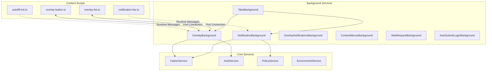
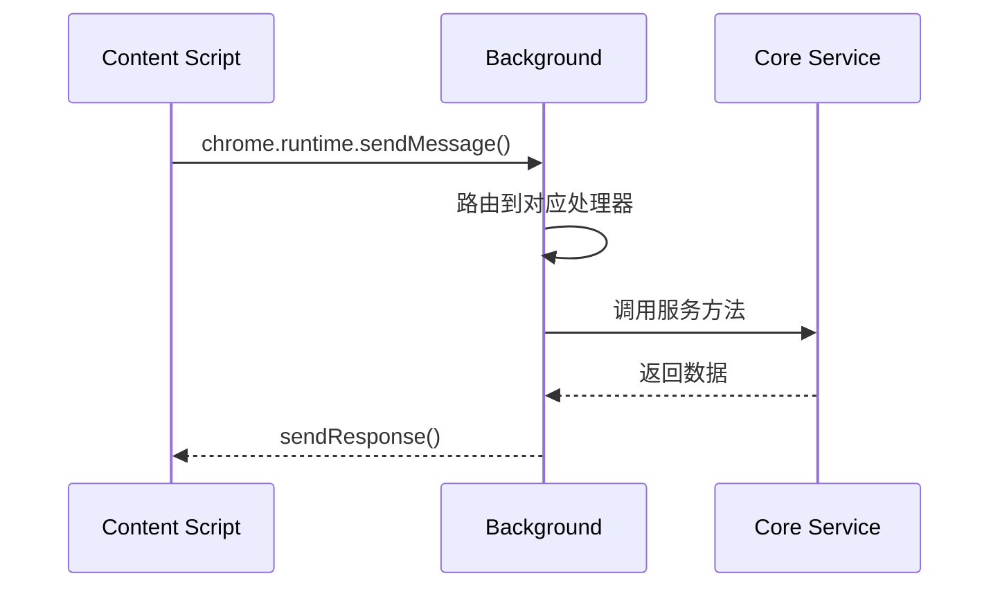
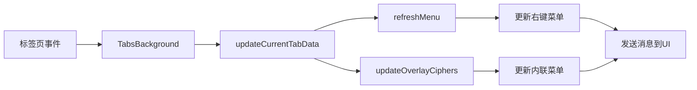
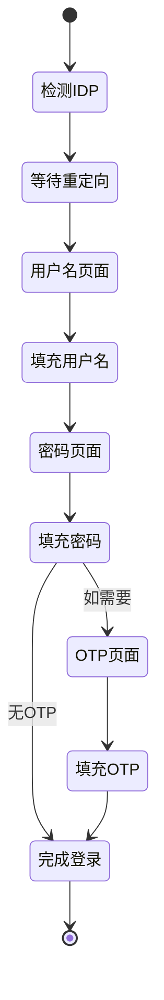

# Autofill Background 消息处理架构图解

## 1. 整体消息流架构



## 2. OverlayBackground 端口通信详解

### 2.1 端口连接建立流程

```
时序图：端口连接建立
────────────────────

Content Script                 OverlayBackground
      │                              │
      ├──chrome.runtime.connect()───►│
      │   name: "button-port"        │
      │                              │
      │◄────port.onConnect──────────┤
      │                              │
      │                              ├─validatePort()
      │                              │
      │                              ├─storePort()
      │                              │
      │◄────postMessage("ready")──────┤
      │                              │
      ├──postMessage("init")─────────►│
      │                              │
      │◄────postMessage("ciphers")────┤
      │                              │
```

### 2.2 四种端口类型及其作用

| 端口名称                                        | 类型       | 作用         | 消息方向 |
| ----------------------------------------------- | ---------- | ------------ | -------- |
| `autofill-inline-menu-button-port`              | 直接端口   | 按钮UI控制   | 双向     |
| `autofill-inline-menu-button-message-connector` | 消息连接器 | 按钮消息中转 | 单向     |
| `autofill-inline-menu-list-port`                | 直接端口   | 列表UI控制   | 双向     |
| `autofill-inline-menu-list-message-connector`   | 消息连接器 | 列表消息中转 | 单向     |

### 2.3 端口消息处理器映射

```typescript
// 按钮端口消息处理器
inlineMenuButtonPortMessageHandlers = {
  triggerDelayedAutofillInlineMenuClosure    // 触发延迟关闭
  autofillInlineMenuButtonClicked            // 按钮点击事件
  autofillInlineMenuBlurred                  // 失去焦点事件
  redirectAutofillInlineMenuFocusOut         // 焦点重定向
  updateAutofillInlineMenuColorScheme        // 更新颜色主题
}

// 列表端口消息处理器
inlineMenuListPortMessageHandlers = {
  checkAutofillInlineMenuButtonFocused       // 检查按钮焦点
  autofillInlineMenuBlurred                  // 失去焦点事件
  unlockVault                                // 解锁密码库
  fillAutofillInlineMenuCipher              // 填充选中项
  addNewVaultItem                           // 添加新项目
  viewSelectedCipher                        // 查看选中项
  redirectAutofillInlineMenuFocusOut        // 焦点重定向
  updateAutofillInlineMenuListHeight        // 更新高度
  refreshGeneratedPassword                  // 刷新生成密码
  fillGeneratedPassword                     // 填充生成密码
  refreshOverlayCiphers                     // 刷新密码库
}
```

## 3. 扩展消息(Runtime Messages)处理

### 3.1 消息分类

```
┌─────────────────────────────────────────────┐
│            扩展消息类型分类                   │
├─────────────────────────────────────────────┤
│ 1. 生命周期管理                              │
│    - autofillOverlayElementClosed           │
│    - openAutofillInlineMenu                 │
│    - closeAutofillInlineMenu                │
│                                              │
│ 2. 数据同步                                  │
│    - updateOverlayCiphers                   │
│    - collectPageDetailsResponse             │
│    - doFullSync                             │
│                                              │
│ 3. 焦点管理                                  │
│    - updateFocusedFieldData                 │
│    - updateIsFieldCurrentlyFocused          │
│    - checkIsFieldCurrentlyFocused           │
│                                              │
│ 4. 位置管理                                  │
│    - triggerAutofillOverlayReposition       │
│    - updateSubFrameData                     │
│    - getAutofillInlineMenuPosition          │
│                                              │
│ 5. 认证相关                                  │
│    - unlockCompleted                        │
│    - fido2AbortRequest                      │
└─────────────────────────────────────────────┘
```

### 3.2 消息处理流程



## 4. 通知系统消息流

### 4.1 NotificationBackground 消息处理

```
通知消息处理流程
───────────────

表单提交 ──► 检测提交 ──► 收集数据 ──► 判断类型
                                        │
                                        ├─► 新密码
                                        ├─► 更新密码
                                        └─► 忽略
                                            │
                                    创建通知队列项
                                            │
                                    显示通知栏
                                            │
                                    等待用户响应
                                            │
                                        ├─► 保存
                                        ├─► 更新
                                        └─► 永不
```

### 4.2 通知队列数据结构

```typescript
interface NotificationQueueMessageItem {
  type: NotificationQueueMessageType;
  domain: string;
  tab: chrome.tabs.Tab;
  username?: string;
  password?: string;
  newPassword?: string;
  expires: Date;
  wasVaultLocked: boolean;
}

enum NotificationQueueMessageType {
  AddLogin = 0,
  ChangePassword = 1,
  UnlockVault = 2,
  AtRiskPassword = 3,
}
```

## 5. WebRequest 拦截机制

### 5.1 HTTP认证拦截流程

```
HTTP认证自动填充
───────────────

浏览器请求 ──► onAuthRequired ──► 查询密码库
                                    │
                                匹配凭据?
                                    │
                            ┌───────┴───────┐
                            是              否
                            │               │
                        自动填充         取消认证
                            │               │
                        继续请求         显示登录框
```

### 5.2 表单提交检测

```javascript
// WebRequest监听配置
chrome.webRequest.onBeforeRequest.addListener(
  handler,
  {
    urls: ["<all_urls>"],
    types: ["main_frame", "sub_frame"],
  },
  ["requestBody"], // 获取请求体以检测表单数据
);
```

## 6. 标签页事件处理

### 6.1 TabsBackground 事件监听

```
标签页事件处理矩阵
─────────────────

事件类型            触发条件              处理动作
─────────────────────────────────────────────────
onFocusChanged     窗口焦点变化          更新当前标签数据
onActivated        标签页激活            刷新密码库，发送tabChanged
onReplaced         标签页替换            检查通知队列
onUpdated          标签页更新            更新覆盖层密码库
onRemoved          标签页关闭            清理页面详情缓存
```

### 6.2 状态同步机制



## 7. 自动提交登录流程

### 7.1 策略驱动的自动登录

```
策略执行流程
──────────

1. 策略配置加载
   └─► 解析IDP主机列表

2. WebRequest监听
   └─► 检测IDP重定向

3. 内容脚本注入
   └─► 监听表单加载

4. 自动填充执行
   └─► 填充凭据

5. 表单自动提交
   └─► 触发登录

6. 结果验证
   └─► 成功/失败处理
```

### 7.2 多步骤登录状态机



## 8. 性能监控点

### 8.1 关键性能指标

| 操作         | 目标时间 | 监控方法              |
| ------------ | -------- | --------------------- |
| 端口连接建立 | <50ms    | performance.mark()    |
| 密码库查询   | <200ms   | console.time()        |
| 内联菜单显示 | <100ms   | requestAnimationFrame |
| 表单填充     | <50ms    | performance.measure() |
| 消息往返     | <30ms    | Date.now()            |

### 8.2 性能优化检查点

```typescript
// 性能监控示例
class PerformanceCheckpoints {
  // 密码库更新性能
  async updateCiphers() {
    performance.mark("cipher-update-start");

    await this.getCipherViews();
    performance.mark("cipher-decrypt-done");

    await this.filterCiphers();
    performance.mark("cipher-filter-done");

    await this.sendToUI();
    performance.mark("cipher-update-end");

    // 测量各阶段耗时
    performance.measure("decrypt", "cipher-update-start", "cipher-decrypt-done");
    performance.measure("filter", "cipher-decrypt-done", "cipher-filter-done");
    performance.measure("total", "cipher-update-start", "cipher-update-end");
  }
}
```

## 9. 错误边界与恢复

### 9.1 错误处理层级

```
错误处理层级结构
───────────────

Level 1: Try-Catch
  └─► 捕获同步错误

Level 2: Promise Rejection
  └─► 处理异步错误

Level 3: Port Disconnect
  └─► 端口断开恢复

Level 4: Global Error Handler
  └─► 兜底错误处理
```

### 9.2 错误恢复策略

```typescript
// 分层错误恢复示例
class ErrorRecovery {
  async handleOperation() {
    try {
      // Level 1: 正常执行
      return await this.primaryOperation();
    } catch (error) {
      try {
        // Level 2: 首选降级
        return await this.fallbackOperation();
      } catch (fallbackError) {
        // Level 3: 最终降级
        return this.defaultResponse();
      }
    }
  }
}
```

## 10. 调试辅助工具

### 10.1 消息追踪

```javascript
// 开发环境消息追踪
if (process.env.NODE_ENV === "development") {
  const originalSendMessage = chrome.runtime.sendMessage;
  chrome.runtime.sendMessage = function (...args) {
    console.group("🔵 Runtime Message");
    console.log("Message:", args[0]);
    console.log("Timestamp:", new Date().toISOString());
    console.trace("Call Stack");
    console.groupEnd();
    return originalSendMessage.apply(this, args);
  };
}
```

### 10.2 状态快照

```typescript
// 状态调试工具
class StateSnapshot {
  capture(): object {
    return {
      ports: {
        button: this.inlineMenuButtonPort?.name,
        list: this.inlineMenuListPort?.name,
        buttonConnector: this.inlineMenuButtonMessageConnectorPort?.name,
        listConnector: this.inlineMenuListMessageConnectorPort?.name,
      },
      visibility: {
        buttonVisible: this.isInlineMenuButtonVisible,
        listVisible: this.isInlineMenuListVisible,
      },
      cache: {
        ciphers: this.inlineMenuCiphers.size,
        cardAndIdentity: this.cardAndIdentityCiphers?.size || 0,
        pageDetails: Object.keys(this.pageDetailsForTab).length,
      },
      state: {
        fieldFocused: this.isFieldCurrentlyFocused,
        fieldFilling: this.isFieldCurrentlyFilling,
      },
    };
  }
}
```

## 总结

Autofill Background 的消息处理架构采用了多层次、多通道的设计，通过端口连接和运行时消息两种机制实现了灵活而高效的通信。系统通过精心设计的消息路由、错误处理和性能优化策略，确保了在复杂的浏览器环境中稳定运行。整个架构既保证了功能的完整性，又维持了良好的可维护性和可调试性。
