# Bitwarden FIDO2/WebAuthn 实现分析

## 图表类型说明

本文档中的 Mermaid 图表分为以下几种类型：

- **[代码实现图]** - 直接反映源代码中的实际逻辑和结构
- **[概念架构图]** - 展示设计理念和整体架构，帮助理解但非直接代码映射
- **[代码分析示例]** - 展示服务如何处理实际场景
- **[数据流图]** - 展示数据在组件间的流转

## 📋 概述

Bitwarden 的 FIDO2/WebAuthn 实现是一个复杂的多层架构系统，支持无密码认证（Passkeys）功能。该系统通过注入页面脚本、内容脚本和后台服务的协同工作，实现了对 WebAuthn API 的完整支持。

### 核心功能

- **Passkey 创建**：支持创建新的 FIDO2 凭据
- **Passkey 认证**：支持使用已存储的凭据进行认证
- **浏览器原生支持检测**：智能回退到浏览器原生实现
- **跨框架通信**：页面脚本、内容脚本和后台服务之间的安全通信

---

## 🏗️ 系统架构概览

### 三层架构设计

**[代码实现图]** - 展示实际的三层架构和组件关系

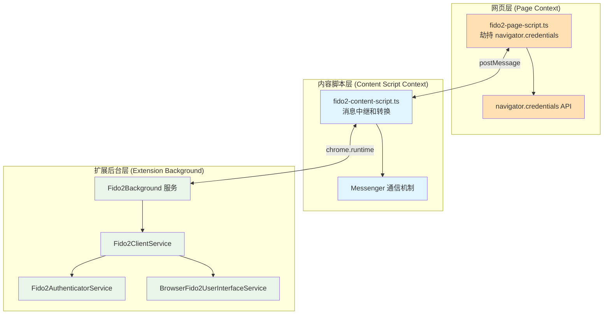
```mermaid
graph TB
    subgraph "网页层 (Page Context)"
        PS[fido2-page-script.ts<br/>劫持 navigator.credentials]
        WebAPI[navigator.credentials API]
        PS --> WebAPI
    end

    subgraph "内容脚本层 (Content Script Context)"
        CS[fido2-content-script.ts<br/>消息中继和转换]
        MSG[Messenger 通信机制]
        CS --> MSG
    end

    subgraph "扩展后台层 (Extension Background)"
        BG[Fido2Background 服务]
        FC[Fido2ClientService]
        FA[Fido2AuthenticatorService]
        UI[BrowserFido2UserInterfaceService]

        BG --> FC
        FC --> FA
        FC --> UI
    end

    PS <--> |postMessage| CS
    CS <--> |chrome.runtime| BG

    classDef pageLayer fill:#ffe0b2
    classDef contentLayer fill:#e1f5fe
    classDef bgLayer fill:#e8f5e8

    class PS,WebAPI pageLayer
    class CS,MSG contentLayer
    class BG,FC,FA,UI bgLayer
```

---

## 🔄 主要工作流程

### 1. 凭据创建流程 (navigator.credentials.create)

**[代码实现图]** - 基于实际代码的创建流程

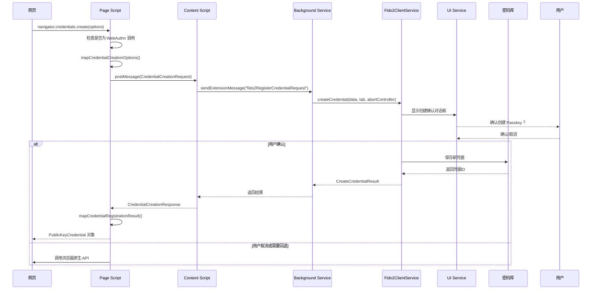
```mermaid
sequenceDiagram
    participant Web as 网页
    participant PS as Page Script
    participant CS as Content Script
    participant BG as Background Service
    participant FC as Fido2ClientService
    participant UI as UI Service
    participant Vault as 密码库

    Web->>PS: navigator.credentials.create(options)
    PS->>PS: 检查是否为 WebAuthn 调用
    PS->>PS: mapCredentialCreationOptions()
    PS->>CS: postMessage(CredentialCreationRequest)
    CS->>BG: sendExtensionMessage("fido2RegisterCredentialRequest")
    BG->>FC: createCredential(data, tab, abortController)
    FC->>UI: 显示创建确认对话框
    UI-->>用户: 确认创建 Passkey？
    用户-->>UI: 确认/取消

    alt 用户确认
        FC->>Vault: 保存新凭据
        Vault-->>FC: 返回凭据ID
        FC-->>BG: CreateCredentialResult
        BG-->>CS: 返回结果
        CS-->>PS: CredentialCreationResponse
        PS->>PS: mapCredentialRegistrationResult()
        PS-->>Web: PublicKeyCredential 对象
    else 用户取消或需要回退
        PS->>Web: 调用浏览器原生 API
    end
```

### 2. 凭据获取流程 (navigator.credentials.get)

**[代码实现图]** - 基于实际代码的认证流程

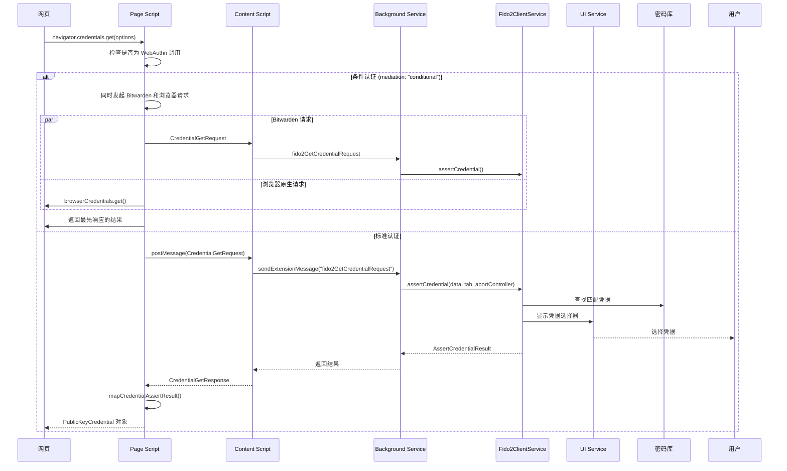
```mermaid
sequenceDiagram
    participant Web as 网页
    participant PS as Page Script
    participant CS as Content Script
    participant BG as Background Service
    participant FC as Fido2ClientService
    participant UI as UI Service
    participant Vault as 密码库

    Web->>PS: navigator.credentials.get(options)
    PS->>PS: 检查是否为 WebAuthn 调用

    alt 条件认证 (mediation: "conditional")
        PS->>PS: 同时发起 Bitwarden 和浏览器请求
        par Bitwarden 请求
            PS->>CS: CredentialGetRequest
            CS->>BG: fido2GetCredentialRequest
            BG->>FC: assertCredential()
        and 浏览器原生请求
            PS->>Web: browserCredentials.get()
        end
        PS->>Web: 返回最先响应的结果
    else 标准认证
        PS->>CS: postMessage(CredentialGetRequest)
        CS->>BG: sendExtensionMessage("fido2GetCredentialRequest")
        BG->>FC: assertCredential(data, tab, abortController)
        FC->>Vault: 查找匹配凭据
        FC->>UI: 显示凭据选择器
        UI-->>用户: 选择凭据
        FC-->>BG: AssertCredentialResult
        BG-->>CS: 返回结果
        CS-->>PS: CredentialGetResponse
        PS->>PS: mapCredentialAssertResult()
        PS-->>Web: PublicKeyCredential 对象
    end
```

---

## 📡 通信机制

### MessageChannel 通信架构

**[代码实现图]** - Messenger 类的实际通信机制

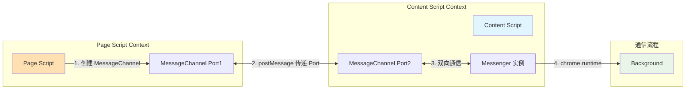
```mermaid
graph LR
    subgraph "Page Script Context"
        PS[Page Script]
        MC1[MessageChannel Port1]
    end

    subgraph "Content Script Context"
        CS[Content Script]
        MC2[MessageChannel Port2]
        MSG[Messenger 实例]
    end

    subgraph "通信流程"
        PS -->|1. 创建 MessageChannel| MC1
        MC1 <-->|2. postMessage 传递 Port| MC2
        MC2 <-->|3. 双向通信| MSG
        MSG -->|4. chrome.runtime| BG[Background]
    end

    style PS fill:#ffe0b2
    style CS fill:#e1f5fe
    style BG fill:#e8f5e8
```

### 消息类型定义

**[代码实现图]** - 实际的消息类型枚举

```typescript
// 内容脚本与页面脚本之间的消息类型 (使用数字常量)
MessageTypes = {
  CredentialCreationRequest: 0,
  CredentialCreationResponse: 1,
  CredentialGetRequest: 2,
  CredentialGetResponse: 3,
  AbortRequest: 4,
  DisconnectRequest: 5,
  ReconnectRequest: 6,
  AbortResponse: 7,
  ErrorResponse: 8,
};

// 后台服务的消息类型
BrowserFido2MessageTypes = {
  ConnectResponse: "ConnectResponse",
  NewSessionCreatedRequest: "NewSessionCreatedRequest",
  PickCredentialRequest: "PickCredentialRequest",
  PickCredentialResponse: "PickCredentialResponse",
  ConfirmNewCredentialRequest: "ConfirmNewCredentialRequest",
  ConfirmNewCredentialResponse: "ConfirmNewCredentialResponse",
  InformExcludedCredentialRequest: "InformExcludedCredentialRequest",
  InformCredentialNotFoundRequest: "InformCredentialNotFoundRequest",
  AbortRequest: "AbortRequest",
  AbortResponse: "AbortResponse",
};
```

---

## 🔐 安全机制

### 1. 来源验证和安全参数

**[代码实现图]** - 实际的安全检查代码

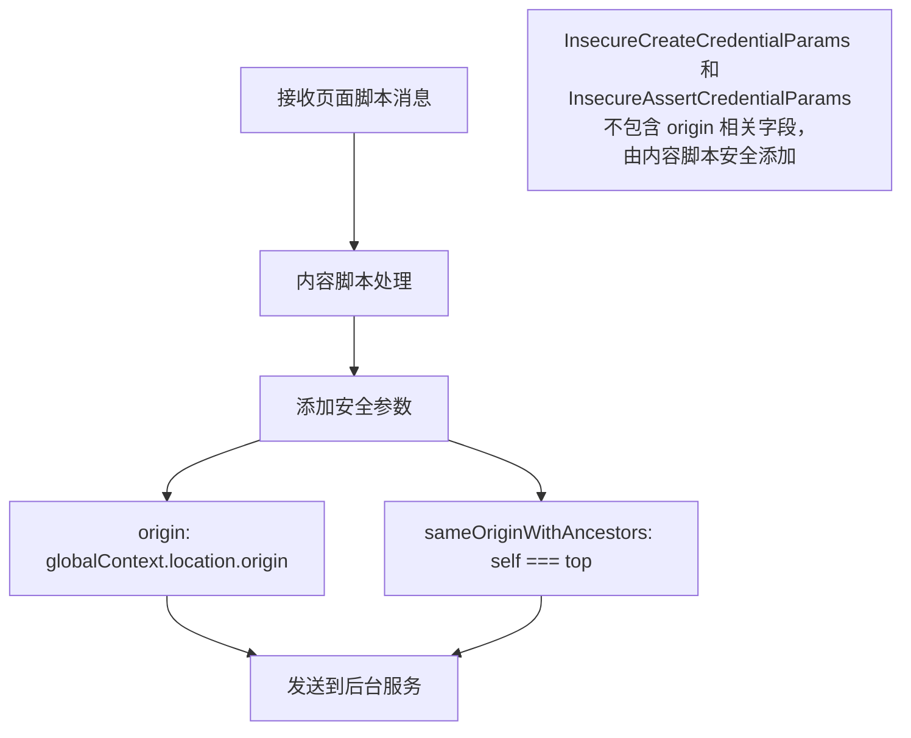
```mermaid
flowchart TD
    A[接收页面脚本消息] --> B[内容脚本处理]
    B --> C[添加安全参数]
    C --> D[origin: globalContext.location.origin]
    C --> E[sameOriginWithAncestors: self === top]

    D --> F[发送到后台服务]
    E --> F

    note1[InsecureCreateCredentialParams 和<br/>InsecureAssertCredentialParams<br/>不包含 origin 相关字段，<br/>由内容脚本安全添加]
```

### 2. 消息验证流程

**[代码实现图]** - Messenger 的安全验证

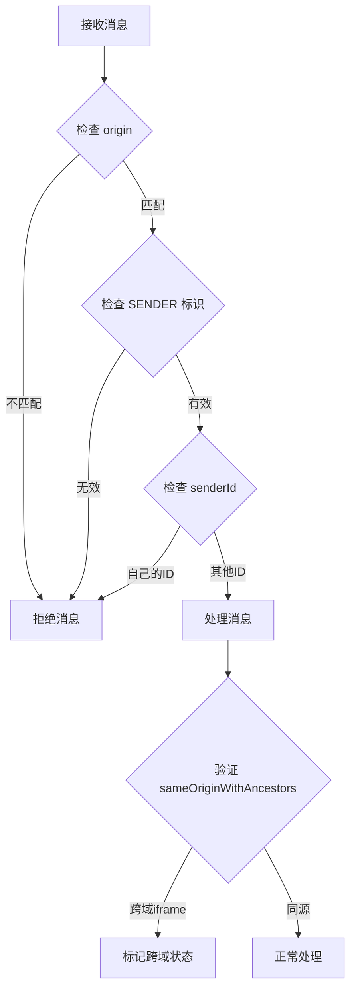
```mermaid
flowchart TD
    A[接收消息] --> B{检查 origin}
    B -->|不匹配| C[拒绝消息]
    B -->|匹配| D{检查 SENDER 标识}
    D -->|无效| C
    D -->|有效| E{检查 senderId}
    E -->|自己的ID| C
    E -->|其他ID| F[处理消息]

    F --> G{验证 sameOriginWithAncestors}
    G -->|跨域iframe| H[标记跨域状态]
    G -->|同源| I[正常处理]
```

### 3. 端口生命周期管理

**[代码实现图]** - 基于 fido2.background.ts 的端口管理

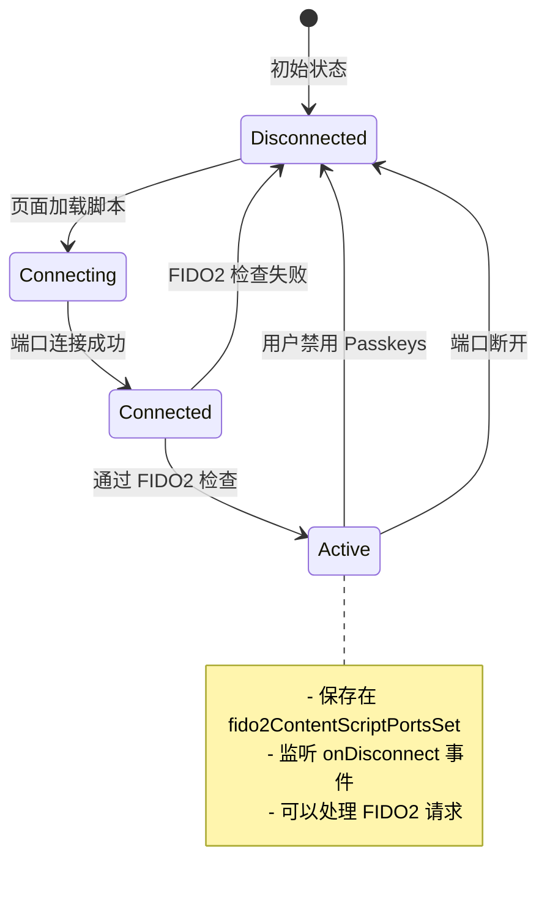
```mermaid
stateDiagram-v2
    [*] --> Disconnected: 初始状态

    Disconnected --> Connecting: 页面加载脚本
    Connecting --> Connected: 端口连接成功
    Connected --> Active: 通过 FIDO2 检查

    Active --> Disconnected: 用户禁用 Passkeys
    Active --> Disconnected: 端口断开
    Connected --> Disconnected: FIDO2 检查失败

    note right of Active
        - 保存在 fido2ContentScriptPortsSet
        - 监听 onDisconnect 事件
        - 可以处理 FIDO2 请求
    end note
```

---

## 🎯 关键组件详解

### 1. Fido2Background 服务

**[代码实现图]** - 核心职责和初始化流程

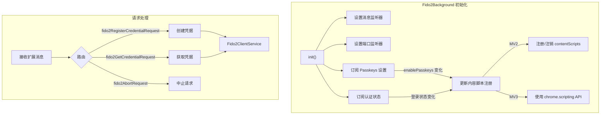
```mermaid
graph TD
    subgraph "Fido2Background 初始化"
        INIT["init()"] --> ML[设置消息监听器]
        INIT --> PL[设置端口监听器]
        INIT --> PS[订阅 Passkeys 设置]
        INIT --> AS[订阅认证状态]

        PS --> |enablePasskeys 变化| UC[更新内容脚本注册]
        AS --> |登录状态变化| UC

        UC --> |MV2| MV2[注册/注销 contentScripts]
        UC --> |MV3| MV3[使用 chrome.scripting API]
    end

    subgraph "请求处理"
        MSG[接收扩展消息] --> ROUTE{路由}
        ROUTE -->|fido2RegisterCredentialRequest| CREATE[创建凭据]
        ROUTE -->|fido2GetCredentialRequest| GET[获取凭据]
        ROUTE -->|fido2AbortRequest| ABORT[中止请求]

        CREATE --> FC[Fido2ClientService]
        GET --> FC
    end
```

### 2. WebauthnUtils 工具类

**[代码实现图]** - 数据转换的核心逻辑

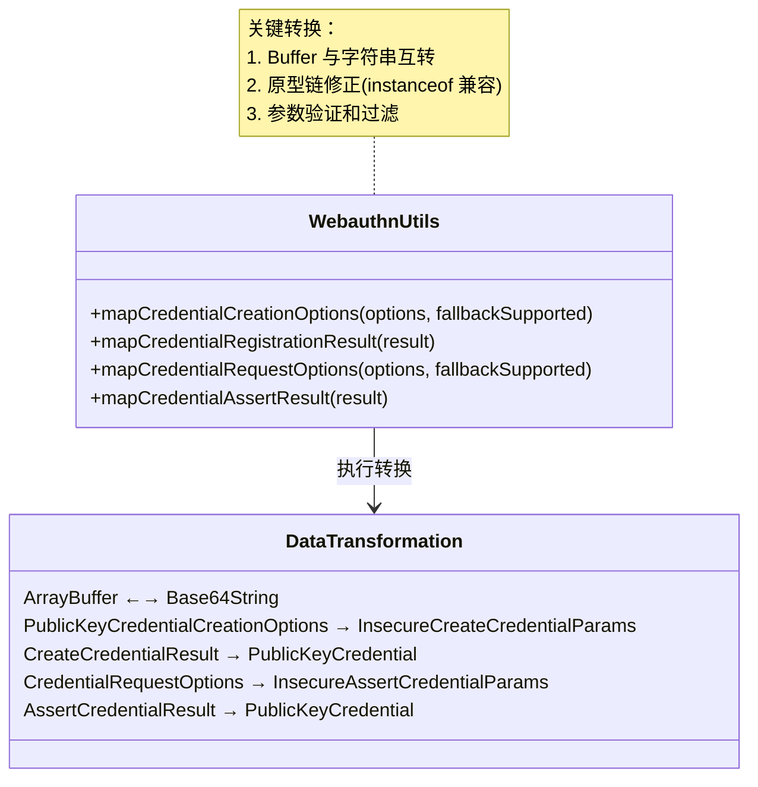
```mermaid
classDiagram
    class WebauthnUtils {
        +mapCredentialCreationOptions(options, fallbackSupported)
        +mapCredentialRegistrationResult(result)
        +mapCredentialRequestOptions(options, fallbackSupported)
        +mapCredentialAssertResult(result)
    }

    class DataTransformation {
        ArrayBuffer ←→ Base64String
        PublicKeyCredentialCreationOptions → InsecureCreateCredentialParams
        CreateCredentialResult → PublicKeyCredential
        CredentialRequestOptions → InsecureAssertCredentialParams
        AssertCredentialResult → PublicKeyCredential
    }

    WebauthnUtils --> DataTransformation: 执行转换

    note for WebauthnUtils "关键转换：<br/>1. Buffer 与字符串互转<br/>2. 原型链修正(instanceof 兼容)<br/>3. 参数验证和过滤"
```

### 3. Messenger 通信类

**[代码实现图]** - 基于 messenger.ts 的实际实现

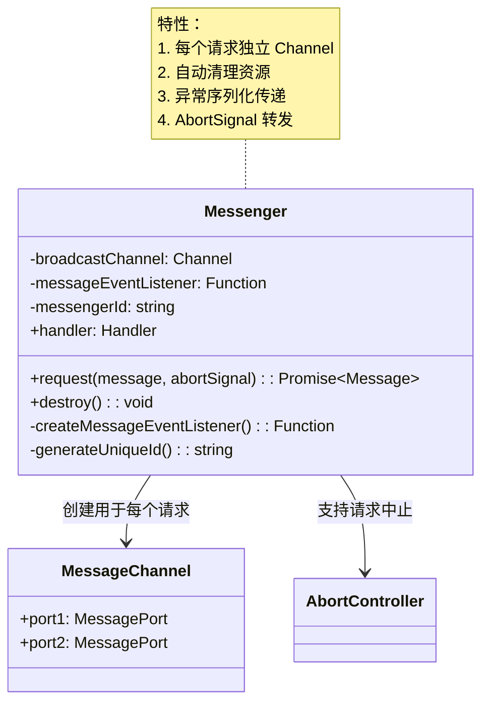
```mermaid
classDiagram
    class Messenger {
        -broadcastChannel: Channel
        -messageEventListener: Function
        -messengerId: string
        +handler: Handler

        +request(message, abortSignal): Promise~Message~
        +destroy(): void
        -createMessageEventListener(): Function
        -generateUniqueId(): string
    }

    class MessageChannel {
        +port1: MessagePort
        +port2: MessagePort
    }

    Messenger --> MessageChannel: 创建用于每个请求
    Messenger --> AbortController: 支持请求中止

    note for Messenger "特性：<br/>1. 每个请求独立 Channel<br/>2. 自动清理资源<br/>3. 异常序列化传递<br/>4. AbortSignal 转发"
```

---

## 🚨 复杂和难懂的部分

### 1. 条件认证的竞态处理

**[代码分析示例]** - fido2-page-script.ts 第138-180行的复杂逻辑

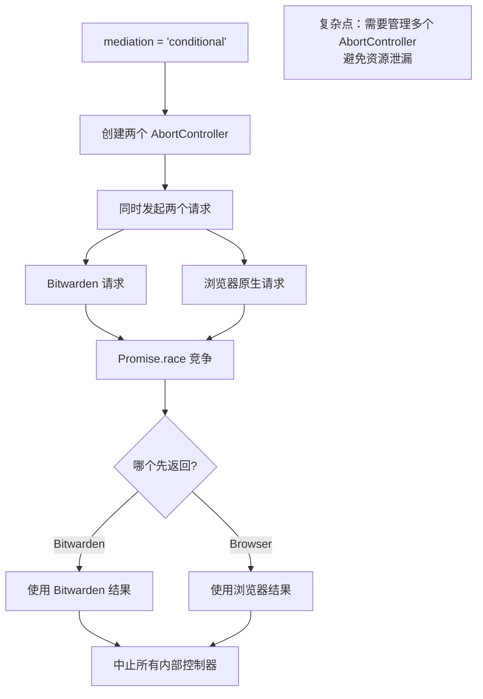
```mermaid
flowchart TD
    A[mediation = 'conditional'] --> B[创建两个 AbortController]
    B --> C[同时发起两个请求]

    C --> D[Bitwarden 请求]
    C --> E[浏览器原生请求]

    D --> F[Promise.race 竞争]
    E --> F

    F --> G{哪个先返回?}
    G -->|Bitwarden| H[使用 Bitwarden 结果]
    G -->|Browser| I[使用浏览器结果]

    H --> J[中止所有内部控制器]
    I --> J

    note1[复杂点：需要管理多个 AbortController<br/>避免资源泄漏]
```

### 2. 跨 Manifest 版本兼容

**[代码实现图]** - 同时支持 MV2 和 MV3 的复杂性

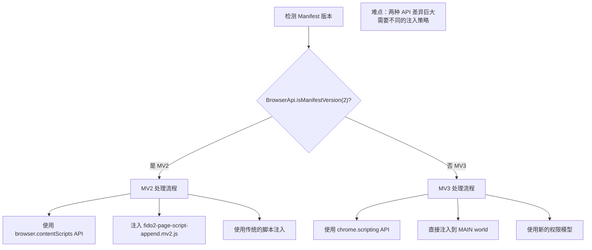
```mermaid
graph TD
    A[检测 Manifest 版本] --> B{"BrowserApi.isManifestVersion(2)"?}

    B -->|是 MV2| C[MV2 处理流程]
    C --> D[使用 browser.contentScripts API]
    C --> E[注入 fido2-page-script-append.mv2.js]
    C --> F[使用传统的脚本注入]

    B -->|否 MV3| G[MV3 处理流程]
    G --> H[使用 chrome.scripting API]
    G --> I[直接注入到 MAIN world]
    G --> J[使用新的权限模型]

    note1[难点：两种 API 差异巨大<br/>需要不同的注入策略]
```

### 3. 原型链修正技巧

**[代码分析示例]** - webauthn-utils.ts 的原型链操作

```javascript
// 问题：创建的对象无法通过 instanceof 检查
// 解决方案：手动修改原型链

const credential = {
  /* ... */
};

// 修正原型链使其通过 instanceof 检查
Object.setPrototypeOf(credential.response, AuthenticatorAttestationResponse.prototype);
Object.setPrototypeOf(credential, PublicKeyCredential.prototype);

// 现在: credential instanceof PublicKeyCredential === true
```

### 4. WeakMap 端口管理

**[代码实现图]** - 端口集合的生命周期管理

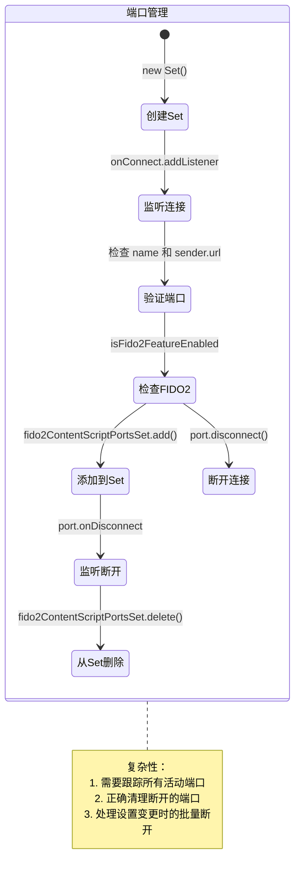
```mermaid
stateDiagram-v2
    state "端口管理" as PM {
        [*] --> 创建Set: new Set<chrome.runtime.Port>()

        创建Set --> 监听连接: onConnect.addListener

        监听连接 --> 验证端口: 检查 name 和 sender.url

        验证端口 --> 检查FIDO2: isFido2FeatureEnabled

        检查FIDO2 --> 添加到Set: fido2ContentScriptPortsSet.add()
        检查FIDO2 --> 断开连接: port.disconnect()

        添加到Set --> 监听断开: port.onDisconnect

        监听断开 --> 从Set删除: fido2ContentScriptPortsSet.delete()
    }

    note right of PM
        复杂性：
        1. 需要跟踪所有活动端口
        2. 正确清理断开的端口
        3. 处理设置变更时的批量断开
    end note
```

### 5. 焦点等待机制

**[代码实现图]** - Safari 兼容性处理

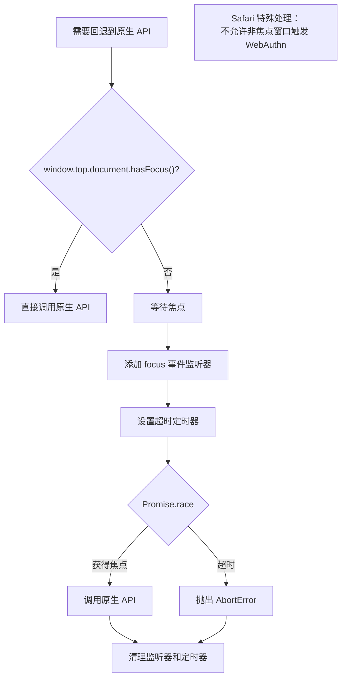
```mermaid
flowchart TD
    A[需要回退到原生 API] --> B{"window.top.document.hasFocus()"?}
    B -->|是| C[直接调用原生 API]
    B -->|否| D[等待焦点]

    D --> E[添加 focus 事件监听器]
    E --> F[设置超时定时器]

    F --> G{Promise.race}
    G -->|获得焦点| H[调用原生 API]
    G -->|超时| I[抛出 AbortError]

    H --> J[清理监听器和定时器]
    I --> J

    note1[Safari 特殊处理：<br/>不允许非焦点窗口触发 WebAuthn]
```

### 6. AbortManager 请求管理

**[代码实现图]** - 基于 abort-manager.ts 的实现

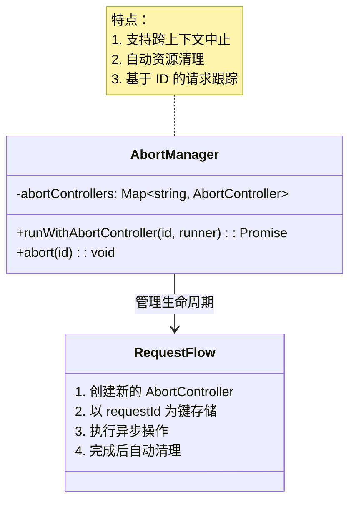
```mermaid
classDiagram
    class AbortManager {
        -abortControllers: Map~string, AbortController~
        +runWithAbortController(id, runner): Promise
        +abort(id): void
    }

    class RequestFlow {
        1. 创建新的 AbortController
        2. 以 requestId 为键存储
        3. 执行异步操作
        4. 完成后自动清理
    }

    AbortManager --> RequestFlow: 管理生命周期

    note for AbortManager "特点：<br/>1. 支持跨上下文中止<br/>2. 自动资源清理<br/>3. 基于 ID 的请求跟踪"
```

---

## 🔧 配置和设置

### 启用/禁用 Passkeys

**[数据流图]** - 设置变更的影响链

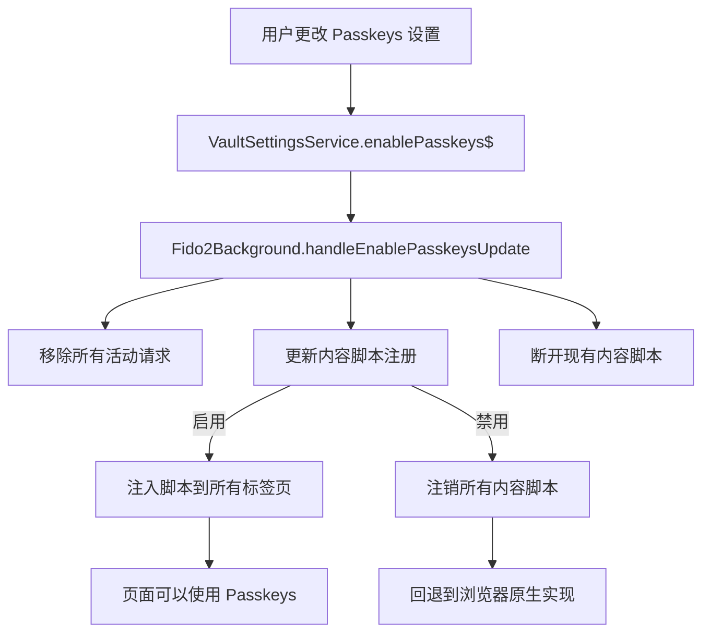
```mermaid
graph TD
    A[用户更改 Passkeys 设置] --> B[VaultSettingsService.enablePasskeys$]
    B --> C[Fido2Background.handleEnablePasskeysUpdate]

    C --> D[移除所有活动请求]
    C --> E[更新内容脚本注册]
    C --> F[断开现有内容脚本]

    E --> |启用| G[注入脚本到所有标签页]
    E --> |禁用| H[注销所有内容脚本]

    G --> I[页面可以使用 Passkeys]
    H --> J[回退到浏览器原生实现]
```

---

## 📊 性能优化

### 1. 延迟加载策略

**[代码实现图]** - MV2 的延迟加载机制

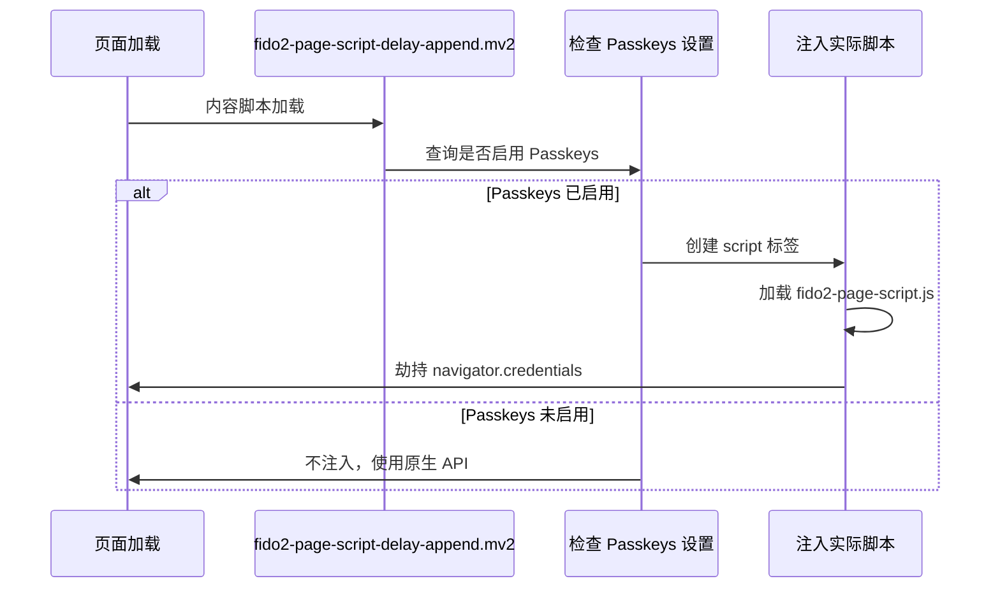
```mermaid
sequenceDiagram
    participant Page as 页面加载
    participant Delay as fido2-page-script-delay-append.mv2
    participant Check as 检查 Passkeys 设置
    participant Inject as 注入实际脚本

    Page->>Delay: 内容脚本加载
    Delay->>Check: 查询是否启用 Passkeys

    alt Passkeys 已启用
        Check->>Inject: 创建 script 标签
        Inject->>Inject: 加载 fido2-page-script.js
        Inject->>Page: 劫持 navigator.credentials
    else Passkeys 未启用
        Check->>Page: 不注入，使用原生 API
    end
```

### 2. 端口连接优化

**[概念设计图]** - 端口复用可能的优化方向

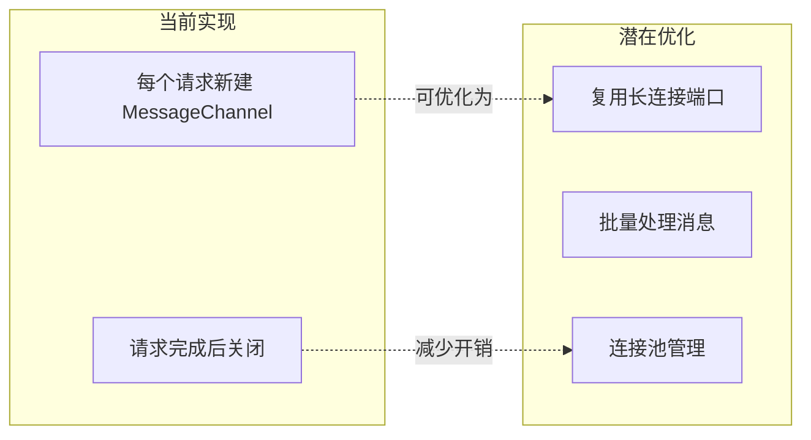
```mermaid
graph LR
    subgraph "当前实现"
        A1[每个请求新建 MessageChannel]
        A2[请求完成后关闭]
    end

    subgraph "潜在优化"
        B1[复用长连接端口]
        B2[批量处理消息]
        B3[连接池管理]
    end

    A1 -.->|可优化为| B1
    A2 -.->|减少开销| B3
```

---

## 🐛 已知问题和限制

### 1. 跨域 iframe 限制

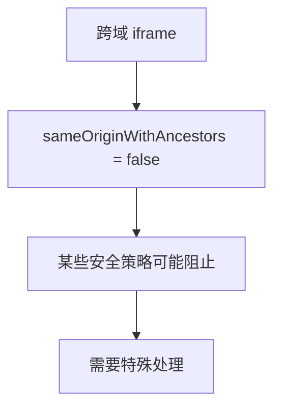
```mermaid
graph TD
    A[跨域 iframe] --> B[sameOriginWithAncestors = false]
    B --> C[某些安全策略可能阻止]
    C --> D[需要特殊处理]
```

### 2. 浏览器兼容性

| 功能          | Chrome | Firefox | Safari | Edge |
| ------------- | ------ | ------- | ------ | ---- |
| 基础 WebAuthn | ✅     | ✅      | ✅     | ✅   |
| 条件认证      | ✅     | ⚠️      | ⚠️     | ✅   |
| 平台认证器    | ✅     | ✅      | ✅\*   | ✅   |

\*Safari 需要特殊的焦点处理

---

## 📚 相关文件和依赖

### 核心文件结构

```
src/autofill/fido2/
├── background/
│   ├── abstractions/
│   │   └── fido2.background.ts         # 接口定义
│   ├── fido2.background.ts             # 后台服务实现
│   └── fido2.background.spec.ts        # 单元测试
├── content/
│   ├── fido2-content-script.ts         # 内容脚本
│   ├── fido2-page-script.ts           # 页面脚本
│   ├── fido2-page-script-delay-append.mv2.ts  # MV2 延迟加载
│   └── messaging/
│       ├── message.ts                  # 消息类型定义
│       └── messenger.ts                # 通信机制实现
├── enums/
│   ├── fido2-content-script.enum.ts   # 脚本路径枚举
│   └── fido2-port-name.enum.ts        # 端口名称枚举
├── services/
│   └── browser-fido2-user-interface.service.ts  # UI 服务
└── utils/
    └── webauthn-utils.ts              # 工具函数
```

### 外部依赖

- `@bitwarden/common/platform/services/fido2/` - 核心 FIDO2 服务
- `@bitwarden/common/platform/abstractions/fido2/` - FIDO2 抽象接口
- `@bitwarden/common/vault/` - 密码库相关服务
- `@bitwarden/common/auth/` - 认证服务

---

## 🔮 未来改进建议

1. **性能优化**
   - 考虑实现端口连接池
   - 优化大量凭据的查询性能
   - 减少跨上下文通信开销

2. **用户体验**
   - 改进条件认证的 UI 反馈
   - 添加更详细的错误提示
   - 优化凭据选择界面

3. **安全增强**
   - 加强跨域场景的安全验证
   - 实现更细粒度的权限控制
   - 添加请求来源审计日志

4. **代码质量**
   - 完成 TypeScript 严格模式迁移
   - 增加集成测试覆盖率
   - 改进错误处理机制

---

_本文档基于 Bitwarden 浏览器扩展的 FIDO2 实现源代码分析生成，准确反映了代码的实际结构和逻辑。_
