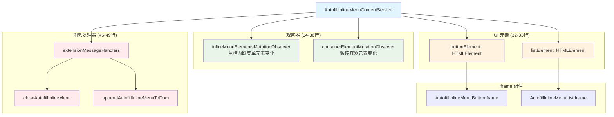
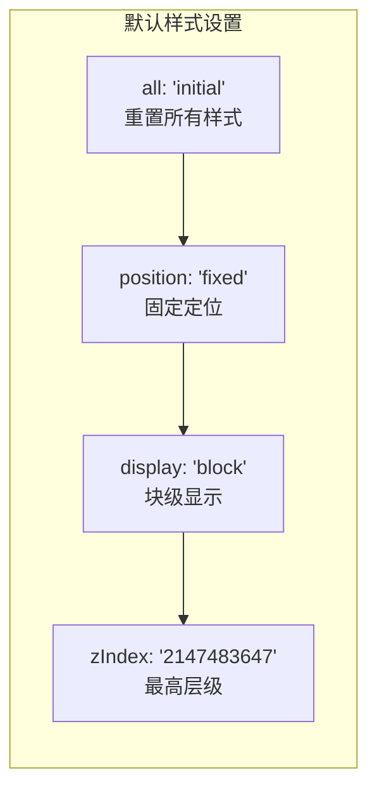
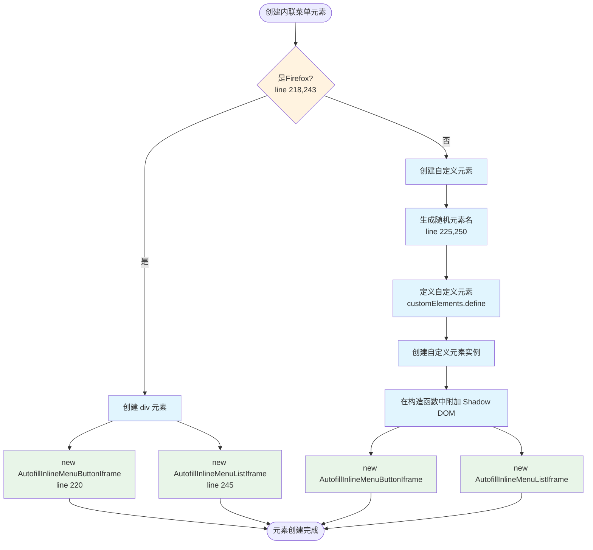
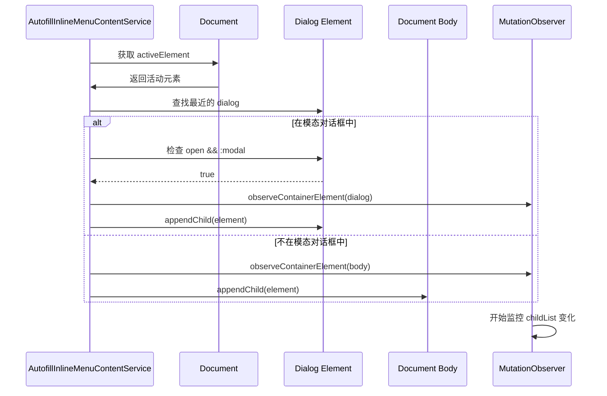
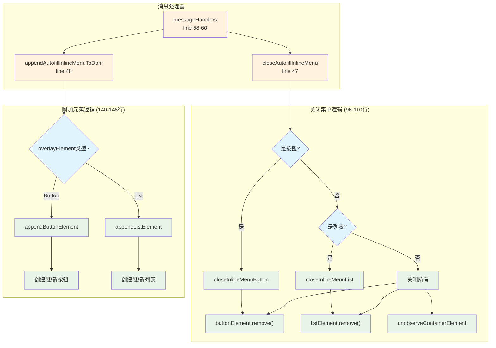
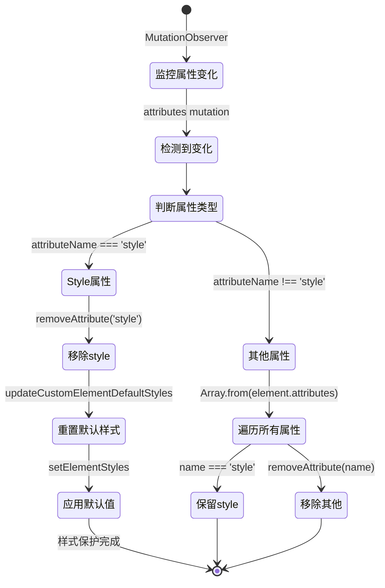
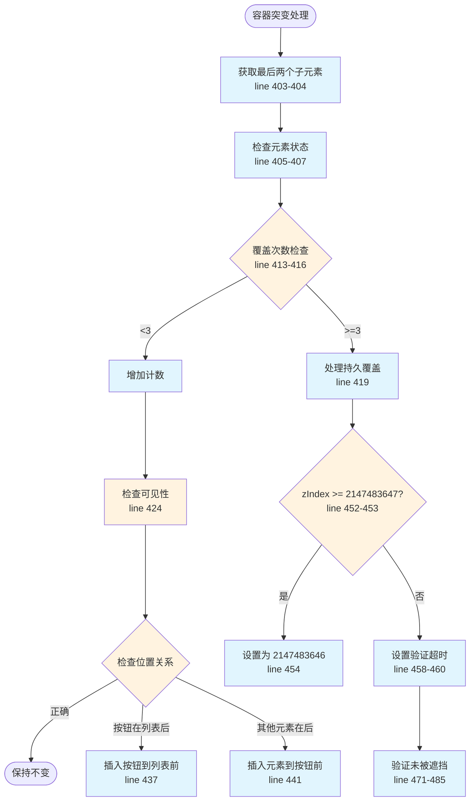
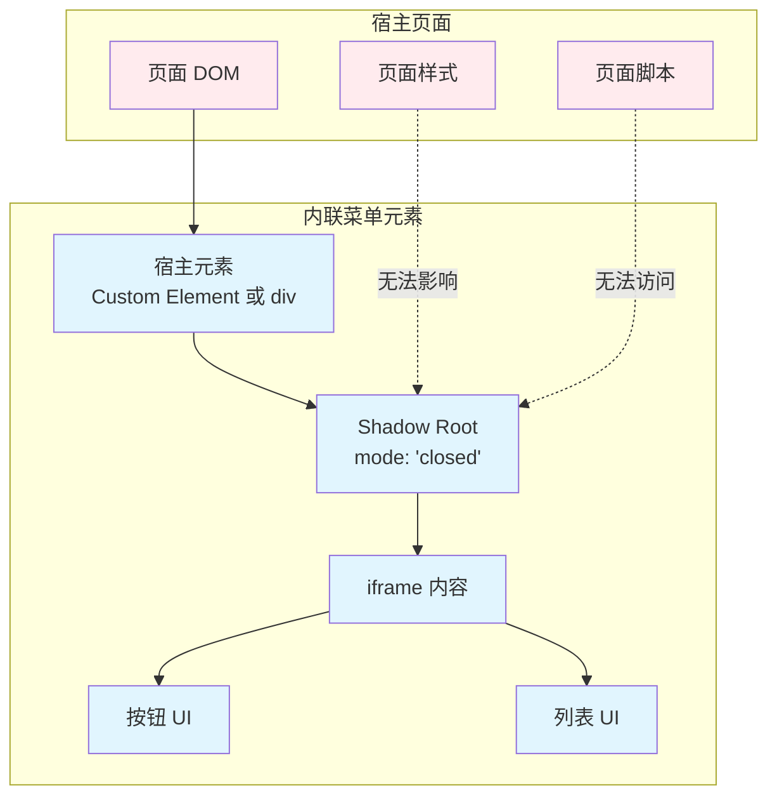
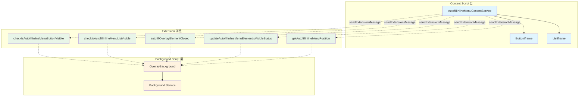

# Bitwarden 自动填充内联菜单内容服务 (AutofillInlineMenuContentService) - 综合分析

## 图表类型说明

本文档中的 Mermaid 图表分为以下几种类型：

- **[代码实现图]** - 直接反映源代码中的实际逻辑和结构
- **[概念架构图]** - 展示设计理念和整体架构，帮助理解但非直接代码映射
- **[数据流图]** - 展示数据在系统中的流动路径

## 📋 概述

`AutofillInlineMenuContentService` 是 Bitwarden 浏览器扩展中负责**管理内联菜单 UI 元素**的核心服务，位于 `src/autofill/overlay/inline-menu/content/autofill-inline-menu-content.service.ts`。它负责在网页中创建、定位、显示和维护内联菜单的按钮和列表组件，确保它们不被网页样式干扰。

**文件规模**：545 行代码
**核心职责**：创建内联菜单元素、DOM 操作管理、样式保护、位置维护、突变观察

---

## 🏗️ 服务架构概览

### 核心组件关系

**[代码实现图]** - 基于类的实际结构和依赖



### 默认样式配置

**[代码实现图]** - 基于 customElementDefaultStyles（40-45行）



---

## 🔄 主要工作流程

### 1. 内联菜单创建流程

**[代码实现图]** - 基于元素创建方法（217-261行）



### 2. 元素附加到 DOM 流程

**[代码实现图]** - 基于 appendInlineMenuElementToDom 方法（201-211行）



### 3. Mutation Observer 处理流程

**[数据流图]** - 展示突变观察器的工作机制

```mermaid
flowchart TD
    subgraph "元素突变观察 (338-359行)"
        EMO[元素突变观察器触发]
        EMO --> CheckIterations1{检查迭代次数<br/>line 339}
        CheckIterations1 -->|>100| StopObserve1[关闭内联菜单]
        CheckIterations1 -->|<=100| ProcessRecords[处理突变记录]

        ProcessRecords --> CheckType{记录类型?}
        CheckType -->|attributes| CheckAttr{属性名?}
        CheckAttr -->|style| RemoveStyle[移除 style 属性<br/>更新默认样式]
        CheckAttr -->|其他| RemoveAttrs[移除所有非 style 属性]
    end

    subgraph "容器突变观察 (384-442行)"
        CMO[容器突变观察器触发]
        CMO --> CheckIterations2{检查迭代次数<br/>line 387}
        CheckIterations2 -->|>100| StopObserve2[关闭内联菜单]
        CheckIterations2 -->|<=100| RequestIdle[requestIdleCallback]

        RequestIdle --> ProcessMutation[processContainerElementMutation]
        ProcessMutation --> CheckLastChild{检查最后子元素}

        CheckLastChild --> CheckOverride{覆盖次数>=3?<br/>line 418}
        CheckOverride -->|是| HandleOverride[处理持久覆盖<br/>line 419]
        CheckOverride -->|否| AdjustPosition[调整元素位置]
    end

    classDef observer fill:#e1f5fe
    classDef check fill:#fff3e0
    classDef action fill:#e8f5e8

    class EMO,CMO observer
    class CheckIterations1,CheckIterations2,CheckType,CheckAttr,CheckLastChild,CheckOverride check
    class StopObserve1,StopObserve2,ProcessRecords,RemoveStyle,RemoveAttrs,RequestIdle,ProcessMutation,HandleOverride,AdjustPosition action
```



---

## 🎯 核心功能模块

### 1. 消息处理系统

**[代码实现图]** - 基于 extensionMessageHandlers（46-49行）



### 2. 样式保护机制

**[代码实现图]** - 基于样式维护逻辑



### 3. 位置维护系统

**[代码实现图]** - 基于容器元素突变处理（402-442行）



---

## 🔧 复杂和难懂的部分

### 1. 迭代次数控制机制

**复杂度原因**：

- 防止无限循环的 MutationObserver
- 需要在 2 秒内重置计数
- 超过 100 次迭代自动关闭菜单

**关键代码分析**（515-535行）：

```typescript
private isTriggeringExcessiveMutationObserverIterations() {
    // 清除现有超时
    if (this.mutationObserverIterationsResetTimeout) {
        clearTimeout(this.mutationObserverIterationsResetTimeout);
    }

    // 增加迭代计数
    this.mutationObserverIterations++;

    // 2秒后重置计数
    this.mutationObserverIterationsResetTimeout = setTimeout(
        () => (this.mutationObserverIterations = 0),
        2000,
    );

    // 超过100次触发保护机制
    if (this.mutationObserverIterations > 100) {
        this.closeInlineMenu();
        return true;
    }
}
```

### 2. 持久性子元素覆盖处理

**复杂度原因**：

- 某些网站脚本强制将元素置于最底部
- 需要 3 次检测确认是持久性覆盖
- 使用 WeakMap 跟踪元素出现次数

**处理流程**（418-422行，451-462行）：

1. 记录元素出现次数
2. 达到 3 次后处理为持久覆盖
3. 降低其 z-index
4. 验证内联菜单未被遮挡

### 3. 自定义元素与 Firefox 兼容性

**复杂度原因**：

- Firefox 使用普通 div 元素
- 其他浏览器使用自定义元素
- 需要生成随机元素名避免冲突

**实现差异**：

- **Firefox**：`document.createElement("div")`
- **其他浏览器**：`customElements.define()` + 随机名称

### 4. 元素位置验证

**复杂度原因**：

- 使用 `elementFromPoint` 检测遮挡
- 计算元素中心点位置
- 异步获取内联菜单位置

**验证逻辑**（471-485行）：

```typescript
private verifyInlineMenuIsNotObscured = async (lastChild: Element) => {
    const inlineMenuPosition = await this.sendExtensionMessage(
        "getAutofillInlineMenuPosition"
    );

    // 检查按钮和列表是否被遮挡
    if (this.elementAtCenterOfInlineMenuPosition(button) === lastChild ||
        this.elementAtCenterOfInlineMenuPosition(list) === lastChild) {
        this.closeInlineMenu();
    }
}
```

---

## 🎨 UI 元素管理

### 1. Shadow DOM 隔离

**[概念架构图]** - 展示 Shadow DOM 的隔离机制



### 2. 模态对话框支持

**特殊处理**（202-207行）：

- 检测活动元素的父级 dialog
- 验证对话框是模态且打开状态
- 将内联菜单附加到对话框而非 body

---

## 🔐 安全考虑

### 1. 样式隔离

- 使用 `all: initial` 重置所有继承样式
- Shadow DOM 提供样式封装
- 持续监控并重置外部样式修改

### 2. z-index 管理

- 使用最大安全整数 `2147483647`
- 检测并降低竞争元素的 z-index
- 防止元素被其他内容遮挡

### 3. 防御性编程

- MutationObserver 迭代限制
- 超时保护机制
- WeakMap 防止内存泄漏

---

## 🔗 组件交互关系

### 服务通信架构

**[概念架构图]** - 展示服务在系统中的位置和通信



---

## 📊 性能优化策略

### 1. 空闲回调使用

- 使用 `requestIdleCallbackPolyfill` 处理容器突变
- 超时设置 500ms 确保及时响应
- 避免阻塞主线程

### 2. WeakMap 缓存

- 使用 WeakMap 存储元素覆盖计数
- 自动垃圾回收，防止内存泄漏
- 无需手动清理引用

### 3. 防抖与节流

- MutationObserver 迭代次数限制
- 2 秒重置窗口
- 500ms 验证延迟

---

## 📈 统计数据

### 方法复杂度分析

| 方法名                                            | 代码行数 | 复杂度要点           |
| ------------------------------------------------- | -------- | -------------------- |
| `handleContainerElementMutationObserverUpdate`    | 13行     | 容器监控入口         |
| `processContainerElementMutation`                 | 41行     | 最复杂的位置调整逻辑 |
| `handleInlineMenuElementMutationObserverUpdate`   | 22行     | 样式保护逻辑         |
| `isTriggeringExcessiveMutationObserverIterations` | 21行     | 迭代控制机制         |
| `verifyInlineMenuIsNotObscured`                   | 15行     | 遮挡检测逻辑         |

### 关键常量配置

| 常量     | 值         | 用途                  |
| -------- | ---------- | --------------------- |
| z-index  | 2147483647 | 最高层级确保可见      |
| 迭代限制 | 100        | MutationObserver 保护 |
| 重置超时 | 2000ms     | 迭代计数重置          |
| 验证延迟 | 500ms      | 遮挡验证延迟          |
| 覆盖阈值 | 3          | 持久覆盖判定          |

### 浏览器兼容性

| 浏览器      | 实现方式        | 特殊处理         |
| ----------- | --------------- | ---------------- |
| Firefox     | div 元素        | 不使用自定义元素 |
| Chrome/Edge | Custom Elements | 随机元素名       |
| Safari      | Custom Elements | 随机元素名       |

---

## 🚀 改进建议

### 1. 类型安全

- 文件头部标注需要更新为类型安全（第1-2行）
- 加强类型定义覆盖

### 2. 性能监控

- 添加 MutationObserver 性能指标
- 记录迭代次数统计
- 优化频繁触发场景

### 3. 错误处理

- 增强元素创建失败处理
- 添加 Shadow DOM 兼容性检查
- 改进消息发送错误处理

### 4. 可维护性

- 抽取魔术数字为常量
- 分离浏览器特定逻辑
- 增加单元测试覆盖

---

## 总结

`AutofillInlineMenuContentService` 是一个复杂但设计精良的服务，通过以下特点确保了可靠的内联菜单体验：

1. **强大的样式隔离**：Shadow DOM + 持续监控确保样式独立性
2. **智能位置管理**：自动调整位置，防止被其他元素遮挡
3. **完善的防御机制**：迭代限制、超时保护、异常处理
4. **良好的浏览器兼容**：特殊处理 Firefox，支持所有主流浏览器
5. **高效的性能优化**：空闲回调、WeakMap、防抖节流

服务通过 545 行精心设计的代码，解决了在复杂网页环境中维护独立 UI 组件的挑战，特别是在处理样式冲突、位置竞争和性能优化方面展现了高度的技术成熟度。
