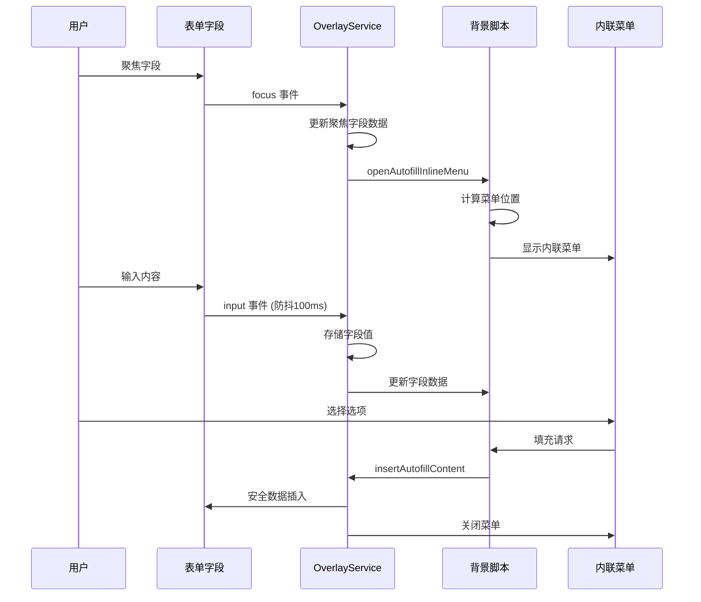
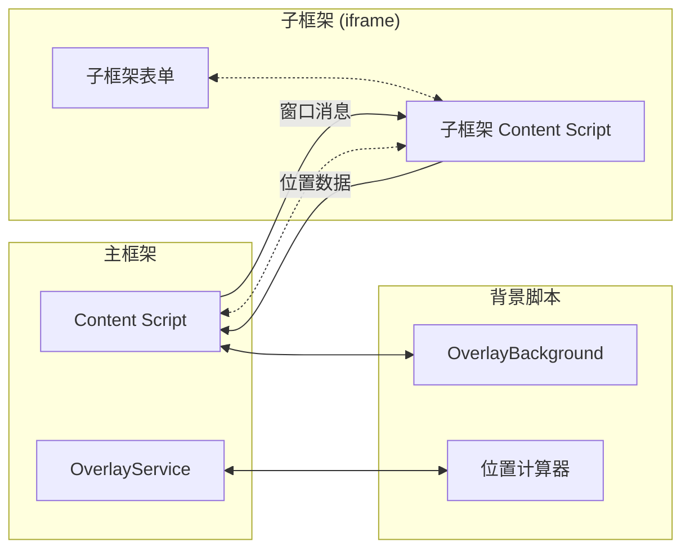
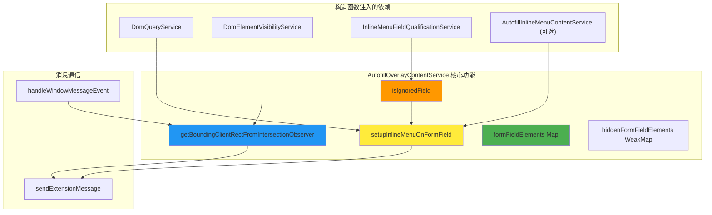
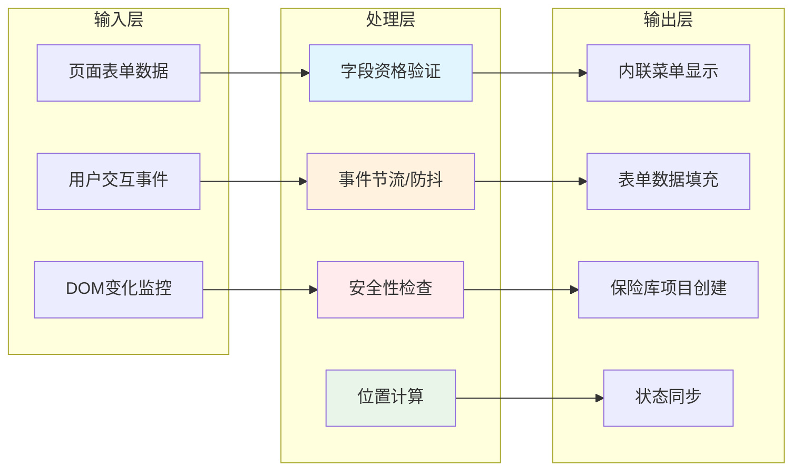
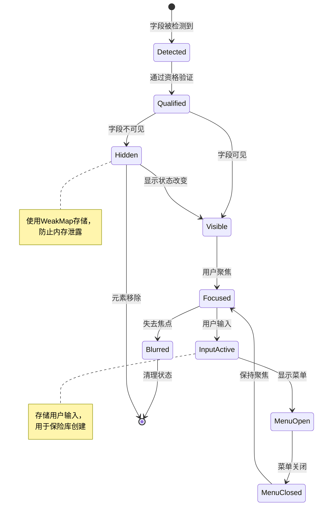
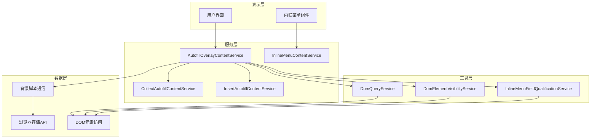
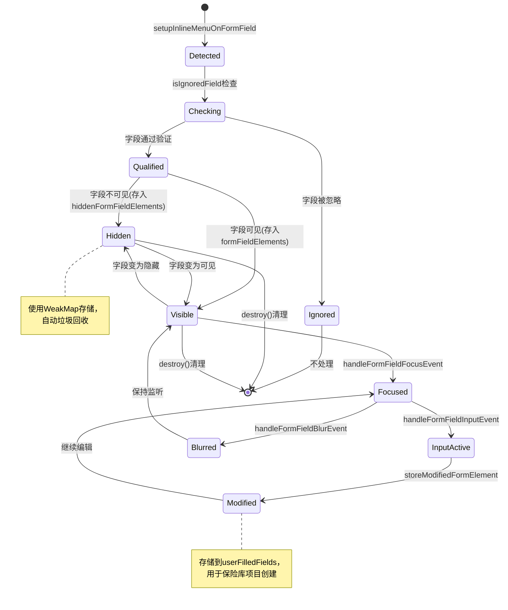

# AutofillOverlayContentService 深度分析

## 图表类型说明

本文档中的 Mermaid 图表分为以下几种类型：

- **[代码实现图]** - 直接反映源代码中的实际逻辑和结构
- **[概念架构图]** - 展示设计理念和整体架构，帮助理解但非直接代码映射
- **[混合图]** - 结合概念设计和部分代码实现
- **[概念示例]** - 用于说明设计模式或理念的示例代码（非实际代码）

## 概览

`AutofillOverlayContentService` 是 Bitwarden 浏览器扩展中的核心服务，负责管理表单字段的内联自动填充菜单功能。该服务充当表单检测、用户交互处理和后台脚本通信之间的协调层，是整个自动填充生态系统的关键组件。

## 主要功能流程

### 1. 服务初始化流程

**[代码实现图]** - 基于实际 `init()` 和 `setupGlobalEventListeners()` 方法

```mermaid
graph TB
    A[bootstrap-autofill-overlay.ts] --> B[创建服务实例]
    B --> C["AutofillOverlayContentService.init()"]

    C --> D[getInlineMenuCardsVisibility()]
    C --> E[getInlineMenuIdentitiesVisibility()]
    C --> F{document.readyState}

    F -->|loading| G[等待 DOMContentLoaded]
    F -->|complete/interactive| H[setupGlobalEventListeners()]
    G --> H

    H --> I[addEventListener: MESSAGE]
    H --> J[addEventListener: VISIBILITYCHANGE]
    H --> K[addEventListener: FOCUSOUT]
    H --> L[setOverlayRepositionEventListeners()]

    L --> M[服务就绪]

    style A fill:#E3F2FD
    style M fill:#E8F5E8
```

**初始化关键步骤:**

1. **依赖注入**: 获取 DomQueryService、DomElementVisibilityService 等依赖服务
2. **事件系统设置**: 初始化事件处理器记忆化系统
3. **全局监听器**: 设置文档级别的事件监听器
4. **数据结构初始化**: 创建表单字段映射和缓存结构

### 2. 表单字段发现与分类流程

**[代码实现图]** - 基于实际 `isIgnoredField()` 方法逻辑

```mermaid
flowchart TD
    A[setupInlineMenuOnFormField] --> B[isIgnoredField 检查]
    B --> C{ignoredFieldTypes.has(type)?}

    C -->|Yes| Ignored[❌ 字段被忽略]
    C -->|No| D{isFieldForLoginForm?}

    D -->|Yes| E[设置 Login 填充类型]
    D -->|No| F{isFieldForCreditCardForm?}

    F -->|Yes| G[设置 Card 填充类型]
    F -->|No| H{isFieldForAccountCreationForm?}

    H -->|Yes| I[设置账户创建填充类型]
    H -->|No| J{isFieldForIdentityForm?}

    J -->|Yes| K[设置 Identity 填充类型]
    J -->|No| Ignored

    E --> L[setupFormFieldElementEventListeners]
    G --> L
    I --> L
    K --> L

    L --> M[字段准备就绪]

    style C fill:#FFF3E0
    style M fill:#E8F5E8
```

**字段忽略逻辑 (src/autofill/services/autofill-overlay-content.service.ts:1048-1096):**

```typescript
// 字段忽略验证决策树
private isIgnoredField(
  autofillFieldData: AutofillField,
  pageDetails: AutofillPageDetails,
): boolean {
  // 1. 检查是否为忽略的字段类型
  if (this.ignoredFieldTypes.has(autofillFieldData.type)) {
    return true;
  }

  // 2. 检查是否为登录表单字段
  if (
    this.inlineMenuFieldQualificationService.isFieldForLoginForm(autofillFieldData, pageDetails)
  ) {
    void this.setQualifiedLoginFillType(autofillFieldData);
    return false;
  }

  // 3. 检查是否为信用卡表单字段
  if (
    this.showInlineMenuCards &&
    this.inlineMenuFieldQualificationService.isFieldForCreditCardForm(
      autofillFieldData,
      pageDetails,
    )
  ) {
    autofillFieldData.inlineMenuFillType = CipherType.Card;
    return false;
  }

  // 4. 检查是否为账户创建表单字段
  if (
    this.inlineMenuFieldQualificationService.isFieldForAccountCreationForm(
      autofillFieldData,
      pageDetails,
    )
  ) {
    this.setQualifiedAccountCreationFillType(autofillFieldData);
    return false;
  }

  // 5. 检查是否为身份信息表单字段
  if (
    this.showInlineMenuIdentities &&
    this.inlineMenuFieldQualificationService.isFieldForIdentityForm(
      autofillFieldData,
      pageDetails,
    )
  ) {
    autofillFieldData.inlineMenuFillType = CipherType.Identity;
    return false;
  }

  return true;
}
```

### 3. 用户交互事件处理流程

**[代码实现图]** - 基于实际事件处理方法



**事件处理器记忆化系统：**

**[代码实现]** - 基于实际的 `eventHandlersMemo` 和 `useEventHandlersMemo` 方法

```typescript
// 防止内存泄露的事件处理器缓存机制
private useEventHandlersMemo = (eventHandler: EventListener, memoIndex: string) => {
  return this.eventHandlersMemo[memoIndex] || (this.eventHandlersMemo[memoIndex] = eventHandler);
};

// 节流重新定位处理器 (250ms)
const repositionHandler = this.useEventHandlersMemo(
  throttle(this.handleOverlayRepositionEvent, 250),
  AUTOFILL_OVERLAY_HANDLE_REPOSITION,
);

// 防抖输入处理器 (100ms)
const inputHandler = this.useEventHandlersMemo(
  debounce(this.handleFormFieldInputEvent, 100),
  AUTOFILL_OVERLAY_HANDLE_FORM_FIELD_INPUT,
);
```

### 4. 跨框架通信架构

**[混合图]** - 概念架构与代码实现结合



**复杂的子框架位置计算 (基于实际代码 src/autofill/services/autofill-overlay-content.service.ts:1360-1538):**

**[代码实现]** - 基于实际的 `calculateSubFramePositioning` 和 `getSubFrameUrlVariations` 方法

```typescript
// 递归iframe偏移计算算法
private async getSubFrameOffsets(): Promise<SubFrameOffsetData> {
  // 生成26种不同的URL格式用于框架识别
  const urlVariations = [
    globalThis.location.href,
    globalThis.location.origin + globalThis.location.pathname,
    globalThis.location.origin,
    // ... 23种其他变体
  ];

  // 递归遍历父框架层级
  let currentWindow = globalThis.parent;
  let depth = 0;
  const maxDepth = 10; // 防止无限递归

  while (currentWindow !== globalThis.top && depth < maxDepth) {
    // 向父框架发送位置请求消息
    currentWindow.postMessage({
      command: AUTOFILL_OVERLAY_ELEMENT_POSITION,
      data: { urls: urlVariations }
    }, "*");

    depth++;
    currentWindow = currentWindow.parent;
  }

  // 等待所有框架响应并计算最终偏移
  return this.calculateSubFrameOffsets();
}
```

## 核心组件交互图

### 依赖关系网络

**[代码实现图]** - 基于构造函数的实际依赖注入



### 数据流架构

**[概念架构图]** - 展示整体数据流动模式



## 复杂难懂部分深度解析

### 1. 事件管理系统的复杂性

**问题**: 该服务需要管理大量不同类型的事件监听器，同时避免内存泄露和重复监听器创建。

**解决方案分析**:

```typescript
// 记忆化事件处理器系统
private eventHandlersMemo: { [key: string]: EventListener } = {};

// 核心记忆化函数
private useEventHandlersMemo = (eventHandler: EventListener, memoIndex: string) => {
  // 如果已存在，返回缓存的处理器；否则创建新的并缓存
  return this.eventHandlersMemo[memoIndex] || (this.eventHandlersMemo[memoIndex] = eventHandler);
};

// 实际使用示例 - 设置表单字段事件监听器
private setupFormFieldElementEventListeners(formFieldElement: ElementWithOpId<FormFieldElement>) {
  this.removeCachedFormFieldEventListeners(formFieldElement);

  // 输入事件 - 使用防抖处理器
  formFieldElement.addEventListener(
    EVENTS.INPUT,
    this.handleFormFieldInputEvent(formFieldElement),
  );

  // 聚焦事件
  formFieldElement.addEventListener(
    EVENTS.FOCUS,
    this.handleFormFieldFocusEvent(formFieldElement),
  );

  if (!elementIsSelectElement(formFieldElement)) {
    formFieldElement.addEventListener(EVENTS.BLUR, this.handleFormFieldBlurEvent);
    formFieldElement.addEventListener(EVENTS.KEYUP, this.handleFormFieldKeyupEvent);
    formFieldElement.addEventListener(
      EVENTS.CLICK,
      this.handleFormFieldClickEvent(formFieldElement),
    );
  }
}
```

**复杂性解读**:

**[概念解释]** - 事件处理器管理的设计理念

- **内存管理**: 通过键值对缓存避免创建重复的事件监听器
- **生命周期管理**: 每个字段使用唯一标识符 (opid) 来区分监听器
- **性能优化**: 节流和防抖机制防止过度触发

### 2. 提交按钮检测算法的复杂性

**问题**: 需要在各种不同的表单实现中可靠地检测提交行为，包括标准表单、无表单按钮、动态生成的按钮等。

**算法分析 (src/autofill/services/autofill-overlay-content.service.ts:518-544):**

```typescript
private async findSubmitButton(element: HTMLElement): Promise<HTMLElement | null> {
  // 第一阶段：查找标准提交元素
  const genericSubmitElement = await this.querySubmitButtonElement(
    element,
    "[type='submit']",
    (node: Node) => nodeIsTypeSubmitElement(node),
  );
  if (genericSubmitElement) {
    return genericSubmitElement;
  }

  // 第二阶段：查找按钮元素
  const submitButtonElement = await this.querySubmitButtonElement(
    element,
    "button, [type='button']",
    (node: Node) => nodeIsButtonElement(node),
  );
  if (submitButtonElement) {
    return submitButtonElement;
  }

  // 第三阶段：查找包含提交关键词的锚元素
  const submitAnchorElement = await this.querySubmitButtonElement(element, "a", (node: Node) =>
    nodeIsAnchorElement(node),
  );
  if (submitAnchorElement) {
    return submitAnchorElement;
  }
}

// 查询提交按钮元素的辅助方法
private async querySubmitButtonElement(
  element: HTMLElement,
  selector: string,
  treeWalkerFilter: CallableFunction,
) {
  const submitButtonElements = this.domQueryService.query<HTMLButtonElement>(
    element,
    selector,
    treeWalkerFilter,
  );
  for (let index = 0; index < submitButtonElements.length; index++) {
    const submitElement = submitButtonElements[index];
    if (
      this.isElementSubmitButton(submitElement) &&
      (await this.domElementVisibilityService.isElementViewable(submitElement))
    ) {
      return submitElement;
    }
  }
}
```

**复杂性挑战**:

1. **多语言支持**: 需要识别不同语言的提交关键词
2. **DOM结构变化**: 处理动态生成的按钮和表单
3. **优先级排序**: 三级查找策略确保找到最合适的提交元素
4. **性能考虑**: 避免过度的DOM查询和遍历

### 3. iframe跨框架通信的复杂性

**问题**: 在嵌套iframe环境中准确计算元素位置和建立通信通道。

**解决方案深度解析 (基于实际代码 src/autofill/services/autofill-overlay-content.service.ts:1398-1442):**

```typescript
// URL变体生成 - 用于iframe识别
private getSubFrameUrlVariations(subFrameUrl: string) {
  try {
    const url = new URL(subFrameUrl, globalThis.location.href);
    const pathAndHash = url.pathname + url.hash;
    const pathAndSearch = url.pathname + url.search;
    const pathSearchAndHash = pathAndSearch + url.hash;
    const pathNameWithoutTrailingSlash = url.pathname.replace(/\/$/, "");
    const pathWithoutTrailingSlashAndHash = pathNameWithoutTrailingSlash + url.hash;
    const pathWithoutTrailingSlashAndSearch = pathNameWithoutTrailingSlash + url.search;
    const pathWithoutTrailingSlashSearchAndHash = pathWithoutTrailingSlashAndSearch + url.hash;

    return new Set([
      url.href,
      url.href.replace(/\/$/, ""),
      url.pathname,
      pathAndHash,
      pathAndSearch,
      pathSearchAndHash,
      pathNameWithoutTrailingSlash,
      pathWithoutTrailingSlashAndHash,
      pathWithoutTrailingSlashAndSearch,
      pathWithoutTrailingSlashSearchAndHash,
      url.hostname + url.pathname,
      url.hostname + pathAndHash,
      url.hostname + pathAndSearch,
      url.hostname + pathSearchAndHash,
      url.hostname + pathNameWithoutTrailingSlash,
      url.hostname + pathWithoutTrailingSlashAndHash,
      url.hostname + pathWithoutTrailingSlashAndSearch,
      url.hostname + pathWithoutTrailingSlashSearchAndHash,
      url.origin + url.pathname,
      url.origin + pathAndHash,
      url.origin + pathAndSearch,
      url.origin + pathSearchAndHash,
      url.origin + pathNameWithoutTrailingSlash,
      url.origin + pathWithoutTrailingSlashAndHash,
      url.origin + pathWithoutTrailingSlashAndSearch,
      url.origin + pathWithoutTrailingSlashSearchAndHash,
    ]);
  } catch (_error) {
    return null;
  }
}

// 跨框架消息处理
private handleWindowMessageEvent = (event: MessageEvent) => {
  if (event.data?.command === "calculateSubFramePositioning") {
    void this.calculateSubFramePositioning(event);
  }
};
```

**技术挑战**:

1. **安全边界**: 确保跨框架通信的安全性
2. **URL匹配**: 处理各种URL格式变体以准确识别框架
3. **递归计算**: 处理多层嵌套iframe的位置计算
4. **异步协调**: 管理多个异步位置计算请求

### 4. 字段状态管理的复杂性

**[代码实现]** - 基于实际的数据结构

**数据结构设计**:

```typescript
// 主要字段映射 - 可见字段
private formFieldElements = new Map<
  ElementWithOpId<FormFieldElement>,
  AutofillField
>();

// 隐藏字段映射 - 使用WeakMap防止内存泄露
private hiddenFormFieldElements = new WeakMap<
  ElementWithOpId<FormFieldElement>,
  AutofillField
>();

// 用户填充字段 - 用于保险库项目创建
private userFilledFields: Record<string, FillableFormFieldElement> = {};

// 聚焦字段数据 - 用于位置计算和菜单显示
private focusedFieldData: FocusedFieldData | null = null;

// 最近聚焦的字段 - 用于状态管理
private mostRecentlyFocusedField: ElementWithOpId<FormFieldElement> | null = null;
```

**状态转换复杂性**:

**[概念图]** - 展示字段状态的转换流程（基于分散在代码中的逻辑）



### 5. 性能优化策略的复杂性

**[代码实现]** - 基于实际使用的工具函数和 API

**事件节流和防抖实现 (实际代码使用了导入的工具函数):**

```typescript
// 使用导入的throttle和debounce工具函数
import { debounce, throttle } from "../utils";

// 位置重新计算使用节流（250ms）
const repositionHandler = this.useEventHandlersMemo(
  throttle(this.handleOverlayRepositionEvent, 250),
  AUTOFILL_OVERLAY_HANDLE_REPOSITION,
);

// 输入处理使用防抖（100ms）
private handleFormFieldInputEvent = (formFieldElement: ElementWithOpId<FormFieldElement>) => {
  return this.useEventHandlersMemo(
    debounce(() => this.triggerFormFieldInput(formFieldElement), 100, true),
    this.getFormFieldHandlerMemoIndex(formFieldElement, EVENTS.INPUT),
  );
};

// 滚动事件的优化处理（50ms节流）
const scrollHandler = this.useEventHandlersMemo(
  throttle(async (event) => {
    if (
      currentScrollY !== globalThis.scrollY ||
      currentScrollX !== globalThis.scrollX ||
      eventTargetContainsFocusedField(event.target)
    ) {
      repositionHandler(event);
    }

    currentScrollY = globalThis.scrollY;
    currentScrollX = globalThis.scrollX;
  }, 50),
  AUTOFILL_OVERLAY_HANDLE_SCROLL,
);
```

**Intersection Observer 优化 (实际代码中的实现):**

```typescript
// 使用现代浏览器API用于精确位置计算
private async getBoundingClientRectFromIntersectionObserver(
  formFieldElement: ElementWithOpId<FormFieldElement>,
): Promise<DOMRectReadOnly | null> {
  if (!("IntersectionObserver" in globalThis) && !("IntersectionObserverEntry" in globalThis)) {
    return null;
  }

  return new Promise((resolve) => {
    const intersectionObserver = new IntersectionObserver(
      (entries) => {
        let fieldBoundingClientRects = entries[0]?.boundingClientRect;
        if (!fieldBoundingClientRects?.width || !fieldBoundingClientRects.height) {
          fieldBoundingClientRects = null;
        }

        intersectionObserver.disconnect();
        resolve(fieldBoundingClientRects);
      },
      {
        root: globalThis.document.body,
        rootMargin: "0px",
        threshold: 0.9999, // Safari doesn't seem to function properly with a threshold of 1
      },
    );
    intersectionObserver.observe(formFieldElement);
  });
}
```

## 架构设计模式分析

### 1. 服务层架构模式

**[概念架构图]** - 展示服务分层设计理念



**设计原则**:

- **单一责任**: 每个服务只负责特定功能领域
- **依赖注入**: 构造函数注入保证可测试性
- **接口隔离**: 通过明确的服务边界降低耦合
- **开放封闭**: 可扩展但对修改封闭的设计

### 2. 事件处理模式

**[概念示例]** - 展示服务的事件处理设计模式（非实际代码）

```typescript
// 概念示例：服务使用事件监听器管理模式
// 实际代码使用 eventHandlersMemo 缓存和 useEventHandlersMemo 方法
private eventHandlersMemo: { [key: string]: EventListener } = {};

private useEventHandlersMemo = (eventHandler: EventListener, memoIndex: string) => {
  return this.eventHandlersMemo[memoIndex] || (this.eventHandlersMemo[memoIndex] = eventHandler);
};

// 实际使用：缓存事件处理器以避免重复创建
const focusHandler = this.handleFormFieldFocusEvent(formFieldElement);
const inputHandler = this.handleFormFieldInputEvent(formFieldElement);
```

### 3. 字段状态管理

**[代码实现图]** - 基于实际的字段状态转换



## 安全性考虑

### 1. 内容安全策略 (CSP) 合规性

```typescript
// 确保所有跨框架通信的安全性
private calculateSubFramePositioning = async (event: MessageEvent) => {
  const subFrameData: SubFrameDataFromWindowMessage = event.data.subFrameData;

  subFrameData.subFrameDepth++;
  if (subFrameData.subFrameDepth >= MAX_SUB_FRAME_DEPTH) {
    // 防止无限递归和潜在的DoS攻击
    void this.sendExtensionMessage("destroyAutofillInlineMenuListeners", { subFrameData });
    return;
  }

  // 验证消息源的合法性
  let subFrameOffsets: SubFrameOffsetData;
  const iframes = globalThis.document.querySelectorAll("iframe");
  for (let i = 0; i < iframes.length; i++) {
    if (iframes[i].contentWindow === event.source) {
      // 仅处理来自已知iframe的消息
      const iframeElement = iframes[i];
      subFrameOffsets = this.calculateSubFrameOffsets(
        iframeElement,
        subFrameData.url,
        subFrameData.frameId,
      );
      // ... 继续处理
      break;
    }
  }
};

// 安全地检查字段是否仍在文档中
private isHiddenField(
  formFieldElement: ElementWithOpId<FormFieldElement>,
  autofillFieldData: AutofillField,
): boolean {
  if (!autofillFieldData.readonly && !autofillFieldData.disabled && autofillFieldData.viewable) {
    this.removeHiddenFieldFallbackListener(formFieldElement);
    return false;
  }

  this.setupHiddenFieldFallbackListener(formFieldElement, autofillFieldData);
  return true;
}
```

### 2. 输入验证和数据处理

```typescript
// 安全地存储用户填充的字段
private storeModifiedFormElement(formFieldElement: ElementWithOpId<FillableFormFieldElement>) {
  if (formFieldElement !== this.mostRecentlyFocusedField) {
    void this.updateMostRecentlyFocusedField(formFieldElement);
  }

  const autofillFieldData = this.formFieldElements.get(formFieldElement);
  if (!autofillFieldData) {
    return;
  }

  // 根据字段类型进行合格性验证
  if (!autofillFieldData.fieldQualifier) {
    switch (autofillFieldData.inlineMenuFillType) {
      case CipherType.Login:
      case InlineMenuFillTypes.CurrentPasswordUpdate:
        this.qualifyUserFilledField(autofillFieldData, this.loginFieldQualifiers);
        break;
      case InlineMenuFillTypes.AccountCreationUsername:
      case InlineMenuFillTypes.PasswordGeneration:
        this.qualifyUserFilledField(autofillFieldData, this.accountCreationFieldQualifiers);
        break;
      case CipherType.Card:
        this.qualifyUserFilledField(autofillFieldData, this.cardFieldQualifiers);
        break;
      case CipherType.Identity:
        this.qualifyUserFilledField(autofillFieldData, this.identityFieldQualifiers);
        break;
    }
  }

  this.storeQualifiedUserFilledField(formFieldElement, autofillFieldData);
}

// 验证消息结构
private async handleGetInlineMenuFormFieldDataMessage({
  ignoreFieldFocus,
}: AutofillExtensionMessage) {
  if (!ignoreFieldFocus && (await this.isFieldCurrentlyFocused())) {
    return;
  }

  return this.getFormFieldData();
}
```

## 性能监控与调试

### 关键性能考虑点

1. **事件处理器记忆化**: 通过 `eventHandlersMemo` 缓存避免重复创建事件监听器
2. **节流和防抖**: 对滚动(50ms)、重定位(250ms)、输入(100ms)等事件进行优化
3. **WeakMap使用**: 对隐藏字段使用WeakMap防止内存泄露
4. **Intersection Observer**: 使用现代API进行高效的位置计算
5. **批量DOM操作**: 通过缓存和批处理减少DOM访问次数

## 未来改进建议

### 1. 代码质量改进

**类型安全加强**:

- 移除 `@ts-strict-ignore` 注释
- 为所有DOM操作添加严格类型定义
- 使用类型守卫替换 `any` 类型

**代码复杂度降低**:

- 将大型方法拆分为更小的、单一职责的函数
- 提取复杂的条件逻辑到独立的决策类中
- 使用策略模式替换复杂的if-else链

### 2. 性能优化机会

**内存管理**:

- 实现更精确的事件监听器清理机制
- 使用对象池模式重用频繁创建的对象
- 优化大型数据结构的访问模式

**异步优化**:

- 使用Web Workers处理复杂的DOM计算
- 实现更精细的请求批处理和缓存
- 采用虚拟化技术处理大量表单字段

### 3. 用户体验增强

**响应性改进**:

- 实现预测性菜单预加载
- 优化动画和过渡效果
- 增强移动设备适配

**可访问性提升**:

- 完善键盘导航支持
- 增强屏幕阅读器兼容性
- 提供高对比度主题支持

## 总结

`AutofillOverlayContentService` 是一个功能丰富但复杂度很高的服务，它成功地在浏览器扩展的受限环境中实现了复杂的用户交互功能。其主要特点包括:

**优势**:

- 全面的事件处理和状态管理
- 强大的跨框架兼容性
- 良好的性能优化机制
- 严格的安全性考虑

**挑战**:

- 高度复杂的代码结构需要深入理解才能维护
- 大量的异步操作和状态管理增加了调试难度
- 与多个外部系统的集成增加了故障点

**建议**:

- 通过重构降低复杂度
- 加强单元测试覆盖率
- 改进文档和代码注释
- 考虑使用状态管理库简化状态逻辑

该服务展现了现代浏览器扩展开发中的高级模式和最佳实践，同时也揭示了在复杂系统中平衡功能性、性能和可维护性的挑战。
