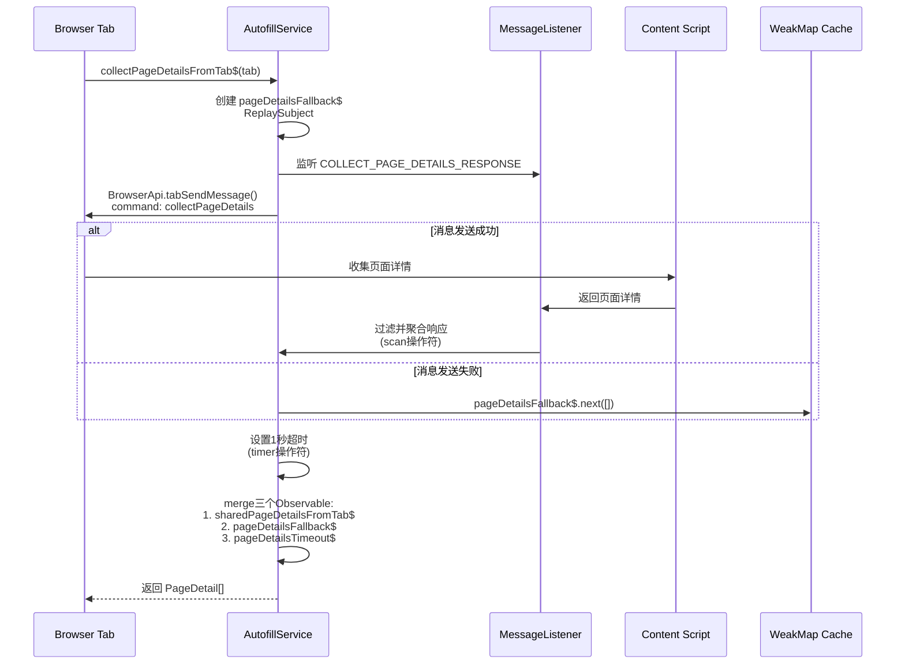
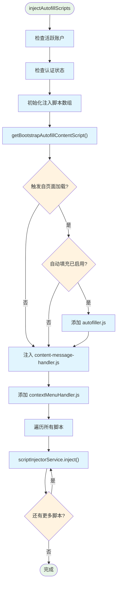
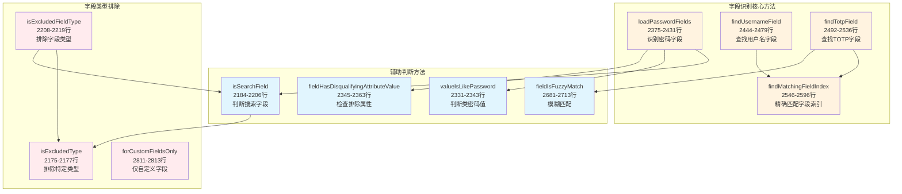
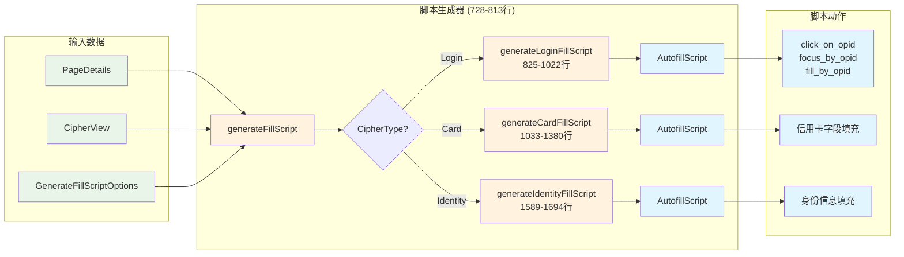
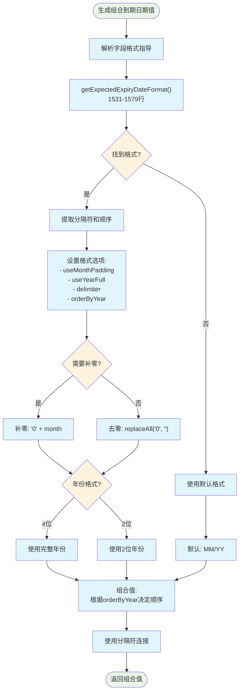
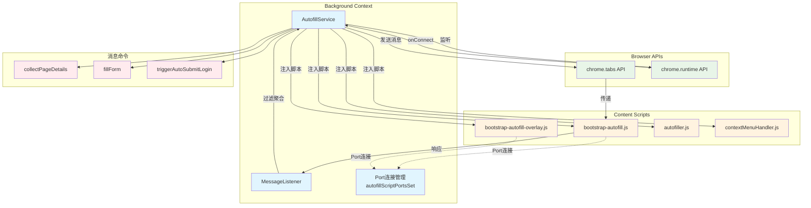

# Bitwarden 自动填充服务 (AutofillService) - 综合分析

## 图表类型说明

本文档中的图表分为以下类型：

- **[代码实现图]** - 直接反映源代码中的实际逻辑和结构
- **[概念架构图]** - 展示设计理念和整体架构，帮助理解但非直接代码映射
- **[数据流图]** - 展示数据在系统中的流动路径

## 📋 概述

`AutofillService` 是 Bitwarden 浏览器扩展的**核心自动填充引擎**，位于 `src/autofill/services/autofill.service.ts`。它负责协调整个自动填充过程，从页面分析到凭据填充的完整生命周期。

**文件规模**：2910 行代码
**核心职责**：页面字段识别、凭据匹配、脚本生成与注入、表单自动填充执行

---

## 🏗️ 服务架构概览

### 核心依赖关系

**[代码实现图]** - 基于构造函数中的实际依赖注入

```mermaid
graph TB
    AS[AutofillService]

    AS --> CS[CipherService<br/>密码库管理]
    AS --> ASS[AutofillSettingsService<br/>自动填充设置]
    AS --> TS[TotpService<br/>TOTP码生成]
    AS --> ECS[EventCollectionService<br/>事件收集]
    AS --> LS[LogService<br/>日志记录]
    AS --> DSS[DomainSettingsService<br/>域名设置]
    AS --> UVS[UserVerificationService<br/>用户验证]
    AS --> BAPS[BillingAccountProfileStateService<br/>账户状态]
    AS --> SIS[ScriptInjectorService<br/>脚本注入]
    AS --> AccS[AccountService<br/>账户管理]
    AS --> AuthS[AuthService<br/>认证服务]
    AS --> CfgS[ConfigService<br/>配置管理]
    AS --> UNSS[UserNotificationSettingsService<br/>通知设置]
    AS --> ML[MessageListener<br/>消息监听]

    classDef service fill:#e1f5fe
    classDef core fill:#fff3e0

    class AS core
    class CS,ASS,TS,ECS,LS,DSS,UVS,BAPS,SIS,AccS,AuthS,CfgS,UNSS,ML service
```



---

## 🔄 主要工作流程

### 1. 页面详情收集流程

**[代码实现图]** - 基于 `collectPageDetailsFromTab$` 方法 (107-173行)



### 2. 自动填充执行流程

**[代码实现图]** - 基于 `doAutoFill` 方法 (412-513行)

```mermaid
flowchart TD
    Start([doAutoFill开始]) --> ValidateInput{验证输入参数}
    ValidateInput -->|无效| ThrowError[抛出异常:<br/>"Nothing to autofill."]
    ValidateInput -->|有效| CheckPremium[检查Premium权限]

    CheckPremium --> ProcessPages[遍历pageDetails]

    ProcessPages --> CheckTab{检查tab匹配}
    CheckTab -->|不匹配| SkipPage[跳过该页面]
    CheckTab -->|匹配| GenerateScript[generateFillScript()]

    GenerateScript --> CheckScript{脚本有效?}
    CheckScript -->|无| SkipPage
    CheckScript -->|有| CheckIframe{检查iframe信任}

    CheckIframe -->|不信任且不允许| LogWarning[记录警告并跳过]
    CheckIframe -->|信任或允许| AddDelay[添加20ms延迟]

    AddDelay --> UpdateLastUsed{需要更新最后使用?}
    UpdateLastUsed -->|是| UpdateCipher[更新密码最后使用时间]
    UpdateLastUsed -->|否| SendMessage

    UpdateCipher --> SendMessage[发送填充消息到tab]

    SendMessage --> CheckTotp{需要TOTP?}
    CheckTotp -->|是| GetTotp[获取TOTP码]
    CheckTotp -->|否| Continue

    GetTotp --> Continue[继续处理]
    SkipPage --> Continue
    LogWarning --> Continue

    Continue --> CheckAutofilled{已自动填充?}
    CheckAutofilled -->|是| CollectEvent[收集事件统计]
    CheckAutofilled -->|否| ThrowError2[抛出异常:<br/>"Did not autofill."]

    CollectEvent --> ReturnTotp[返回TOTP码或null]

    classDef process fill:#e1f5fe
    classDef decision fill:#fff3e0
    classDef error fill:#ffebee
    classDef success fill:#e8f5e8

    class Start,ReturnTotp success
    class ThrowError,ThrowError2,LogWarning error
    class ValidateInput,CheckTab,CheckScript,CheckIframe,UpdateLastUsed,CheckTotp,CheckAutofilled decision
    class CheckPremium,ProcessPages,GenerateScript,AddDelay,UpdateCipher,SendMessage,GetTotp,CollectEvent,Continue,SkipPage process
```

### 3. 脚本注入流程

**[代码实现图]** - 基于 `injectAutofillScripts` 方法 (228-269行)



---

## 🧩 核心功能模块

### 1. 字段识别与匹配

**[代码实现图]** - 基于实际的字段匹配方法



### 2. 填充脚本生成器

**[数据流图]** - 展示三种密码类型的脚本生成流程



### 3. 复杂字段处理逻辑

#### 信用卡组合到期日期处理

**[代码实现图]** - 基于 `generateCombinedExpiryValue` 方法 (1447-1524行)



---

## 🔗 组件交互关系

### 服务间通信模式

**[代码实现图]** - 基于实际的消息传递和端口连接



---

## 🔍 复杂和难懂的部分

### 1. Observable流处理 (collectPageDetailsFromTab$)

**复杂度原因**：

- 使用了多个RxJS操作符组合（filter, scan, share, takeUntil, merge）
- 处理多种异常情况（超时、错误、浏览器协议URL）
- 需要协调多个异步数据源

**关键代码片段**（107-173行）：

```typescript
// 三个数据源的合并
return merge(sharedPageDetailsFromTab$, pageDetailsFallback$, pageDetailsTimeout$);
```

### 2. 字段属性匹配逻辑

**复杂度原因**：

- 支持多种匹配模式（精确、前缀、正则、CSV）
- 需要处理多语言字段名称
- 复杂的优先级判断逻辑

**核心方法**：

- `fieldPropertyIsMatch` (2636-2668行)
- `fieldPropertyIsPrefixMatch` (2609-2622行)
- `findMatchingFieldIndex` (2546-2596行)

### 3. 密码重新验证弹窗防抖

**复杂度原因**：

- 需要防止重复打开弹窗
- 处理异步的用户验证流程
- 协调多个标签页的验证状态

**实现方法**：

- `isDebouncingPasswordRepromptPopout` (2818-2831行)
- 使用 timeout 和标志位组合控制

### 4. iframe信任判断

**复杂度原因**：

- 需要判断iframe是否属于同一域名
- 考虑URI匹配策略
- 安全性和用户体验的平衡

**核心方法**：

- `inUntrustedIframe` (1389-1411行)

---

## 📊 性能优化策略

### 1. WeakMap缓存机制

- 端口连接使用Set存储：`autofillScriptPortsSet`
- 避免内存泄漏，自动清理断开的连接

### 2. 脚本注入优化

- 条件注入：根据设置选择不同的bootstrap脚本
- 批量注入：减少与浏览器API的交互次数
- 延迟加载：仅在需要时注入autofiller.js

### 3. 操作延迟

- 填充操作间添加20ms延迟：`delay_between_operations = 20`
- 防止过快操作导致的页面响应问题

---

## 🔐 安全考虑

### 1. 密码重新验证

- CipherRepromptType.Password 检查
- 主密码和密钥哈希验证
- 防抖机制防止暴力尝试

### 2. iframe安全

- 检测不可信iframe
- 允许用户选择是否在不可信iframe中填充
- 记录安全警告日志

### 3. Premium功能控制

- TOTP功能需要Premium权限
- 组织TOTP使用权限检查

---

## 📈 统计与监控

### 事件收集点

- **Cipher_ClientAutofilled**：成功自动填充时记录（501-504行）
- 包含密码ID用于使用统计
- 更新最后使用时间和索引

---

## 🎯 关键配置与设置

### 自动填充相关设置

| 设置项                    | 用途               | 获取方法                       |
| ------------------------- | ------------------ | ------------------------------ |
| `inlineMenuVisibility`    | 内联菜单可见性     | `getInlineMenuVisibility()`    |
| `autoCopyTotp`            | 自动复制TOTP       | `getShouldAutoCopyTotp()`      |
| `autofillOnPageLoad`      | 页面加载时自动填充 | `getAutofillOnPageLoad()`      |
| `defaultUriMatchStrategy` | 默认URI匹配策略    | `getDefaultUriMatchStrategy()` |

### 脚本类型选择逻辑

根据设置组合选择不同的bootstrap脚本（278-308行）：

- `bootstrap-autofill.js`：基础版本
- `bootstrap-autofill-overlay-notifications.js`：仅通知栏
- `bootstrap-autofill-overlay-menu.js`：仅内联菜单
- `bootstrap-autofill-overlay.js`：完整功能

---

## 🚀 未来改进建议

### 1. 类型安全

- 文件头部标注需要更新为类型安全（第1-2行注释）
- 减少 any 类型使用

### 2. 代码组织

- 2910行的单文件过大，建议拆分
- 可以将字段匹配、脚本生成、填充执行分离为独立模块

### 3. 性能优化

- 考虑使用 Web Workers 处理复杂的字段匹配
- 实现更智能的脚本缓存机制

### 4. 错误处理

- 增加更详细的错误类型
- 提供更好的用户反馈机制

---

## 总结

`AutofillService` 是一个功能强大但复杂的服务，它通过精心设计的字段识别、脚本生成和安全机制，为用户提供了可靠的自动填充体验。服务的核心优势在于：

1. **全面的字段识别**：支持多语言、多格式的字段匹配
2. **灵活的脚本生成**：针对不同类型的密码项生成定制化填充脚本
3. **强大的安全保护**：多层安全验证确保用户数据安全
4. **良好的性能优化**：通过缓存、延迟加载等策略提升响应速度

同时，服务也存在一些可以改进的地方，特别是在代码组织和类型安全方面。随着功能的不断增加，考虑模块化重构将有助于提高代码的可维护性。
