# AutofillService 架构详解

## 概述

AutofillService 是 Bitwarden 浏览器扩展的核心功能服务，负责自动识别网页表单、填充用户凭据、管理内联菜单（Inline Menu）、处理密码生成等功能。这是一个高度复杂的系统，需要协调多个组件来实现流畅的自动填充体验。

## AutofillService 在整体架构中的位置

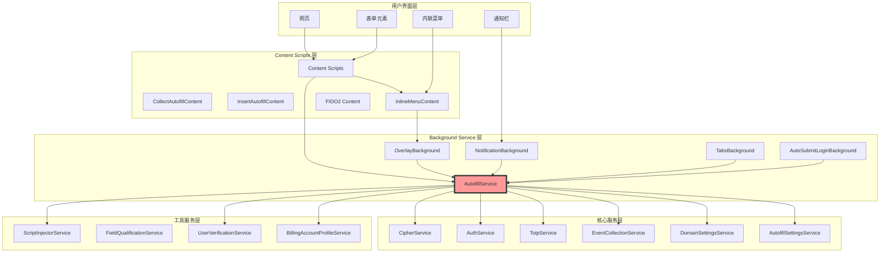
```mermaid
graph TB
    subgraph "用户界面层"
        WEB[网页]
        FORMS[表单元素]
        INLINE[内联菜单]
        NOTIF[通知栏]
    end

    subgraph "Content Scripts 层"
        CS[Content Scripts]
        COLLECT[CollectAutofillContent]
        INSERT[InsertAutofillContent]
        IMC[InlineMenuContent]
        FIDO2[FIDO2 Content]
    end

    subgraph "Background Service 层"
        AS[AutofillService]
        OB[OverlayBackground]
        NB[NotificationBackground]
        TB[TabsBackground]
        ASB[AutoSubmitLoginBackground]
    end

    subgraph "核心服务层"
        CIPHER[CipherService]
        AUTH[AuthService]
        TOTP[TotpService]
        EVENT[EventCollectionService]
        DOMAIN[DomainSettingsService]
        SETTINGS[AutofillSettingsService]
    end

    subgraph "工具服务层"
        SCRIPT[ScriptInjectorService]
        QUALIFY[FieldQualificationService]
        USER_VER[UserVerificationService]
        BILLING[BillingAccountProfileService]
    end

    WEB --> CS
    FORMS --> CS
    CS --> AS
    CS --> IMC
    IMC --> OB

    AS --> CIPHER
    AS --> AUTH
    AS --> TOTP
    AS --> EVENT
    AS --> DOMAIN
    AS --> SETTINGS
    AS --> SCRIPT
    AS --> USER_VER
    AS --> BILLING

    OB --> AS
    NB --> AS
    TB --> AS
    ASB --> AS

    INLINE --> IMC
    NOTIF --> NB

    style AS fill:#ff9999,stroke:#333,stroke-width:4px
```

## AutofillService 的初始化和配置

### 1. 服务初始化

```typescript
// src/background/main.background.ts:1042-1057
this.autofillService = new AutofillService(
  this.cipherService, // 密码库服务
  this.autofillSettingsService, // 自动填充设置
  this.totpService, // TOTP 服务
  this.eventCollectionService, // 事件收集
  this.logService, // 日志服务
  this.domainSettingsService, // 域名设置
  this.userVerificationService, // 用户验证
  this.billingAccountProfileStateService, // 账户状态
  this.scriptInjectorService, // 脚本注入
  this.accountService, // 账户服务
  this.authService, // 认证服务
  this.configService, // 配置服务
  this.userNotificationSettingsService, // 通知设置
  messageListener, // 消息监听器
);
```

### 2. 启动时的脚本加载

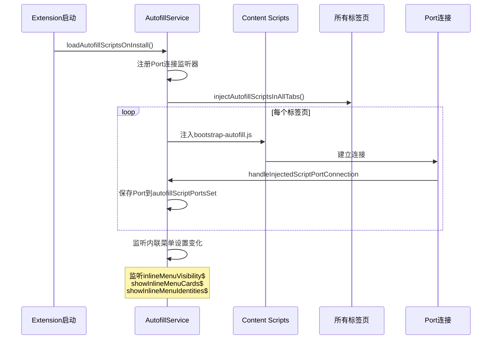
```mermaid
sequenceDiagram
    participant EXT as Extension启动
    participant AS as AutofillService
    participant CS as Content Scripts
    participant TAB as 所有标签页
    participant PORT as Port连接

    EXT->>AS: loadAutofillScriptsOnInstall()
    AS->>AS: 注册Port连接监听器
    AS->>TAB: injectAutofillScriptsInAllTabs()

    loop 每个标签页
        AS->>CS: 注入bootstrap-autofill.js
        CS->>PORT: 建立连接
        PORT->>AS: handleInjectedScriptPortConnection
        AS->>AS: 保存Port到autofillScriptPortsSet
    end

    AS->>AS: 监听内联菜单设置变化
    Note over AS: 监听inlineMenuVisibility$<br/>showInlineMenuCards$<br/>showInlineMenuIdentities$
```

## 核心功能流程

### 1. 页面详情收集流程

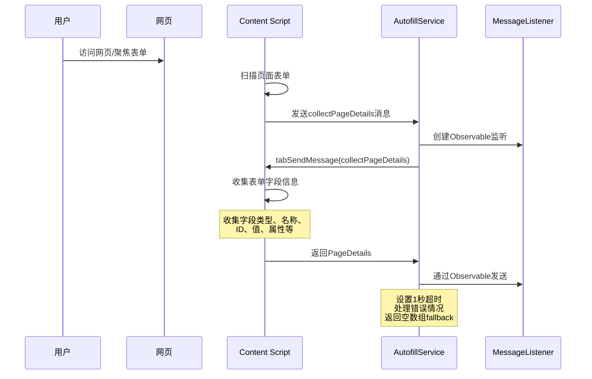
```mermaid
sequenceDiagram
    participant USER as 用户
    participant PAGE as 网页
    participant CS as Content Script
    participant AS as AutofillService
    participant ML as MessageListener

    USER->>PAGE: 访问网页/聚焦表单
    CS->>CS: 扫描页面表单
    CS->>AS: 发送collectPageDetails消息

    AS->>ML: 创建Observable监听
    AS->>CS: tabSendMessage(collectPageDetails)

    CS->>CS: 收集表单字段信息
    Note over CS: 收集字段类型、名称、<br/>ID、值、属性等

    CS->>AS: 返回PageDetails
    AS->>ML: 通过Observable发送

    Note over AS: 设置1秒超时<br/>处理错误情况<br/>返回空数组fallback
```

### 2. 自动填充执行流程

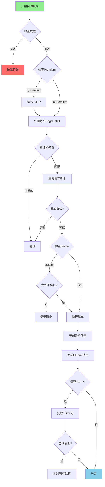
```mermaid
flowchart TB
    START[开始自动填充] --> CHECK_DATA{检查数据}

    CHECK_DATA -->|无效| ERROR[抛出错误]
    CHECK_DATA -->|有效| CHECK_PREMIUM{检查Premium}

    CHECK_PREMIUM -->|无Premium| CLEAR_TOTP[清除TOTP]
    CHECK_PREMIUM -->|有Premium| PROCESS

    CLEAR_TOTP --> PROCESS[处理每个PageDetail]

    PROCESS --> CHECK_TAB{验证标签页}
    CHECK_TAB -->|不匹配| SKIP[跳过]
    CHECK_TAB -->|匹配| GEN_SCRIPT[生成填充脚本]

    GEN_SCRIPT --> CHECK_SCRIPT{脚本有效?}
    CHECK_SCRIPT -->|无效| SKIP
    CHECK_SCRIPT -->|有效| CHECK_IFRAME{检查iframe}

    CHECK_IFRAME -->|不信任| CHECK_ALLOW{允许不信任?}
    CHECK_ALLOW -->|否| LOG_BLOCK[记录阻止]
    CHECK_ALLOW -->|是| FILL
    CHECK_IFRAME -->|信任| FILL[执行填充]

    FILL --> UPDATE_LAST[更新最后使用]
    UPDATE_LAST --> SEND_MSG[发送fillForm消息]

    SEND_MSG --> CHECK_TOTP{需要TOTP?}
    CHECK_TOTP -->|是| GET_TOTP[获取TOTP码]
    CHECK_TOTP -->|否| END

    GET_TOTP --> COPY_CLIP{自动复制?}
    COPY_CLIP -->|是| COPY[复制到剪贴板]
    COPY_CLIP -->|否| END[结束]

    style START fill:#90EE90
    style ERROR fill:#FF6B6B
    style END fill:#87CEEB
```

### 3. 填充脚本生成逻辑

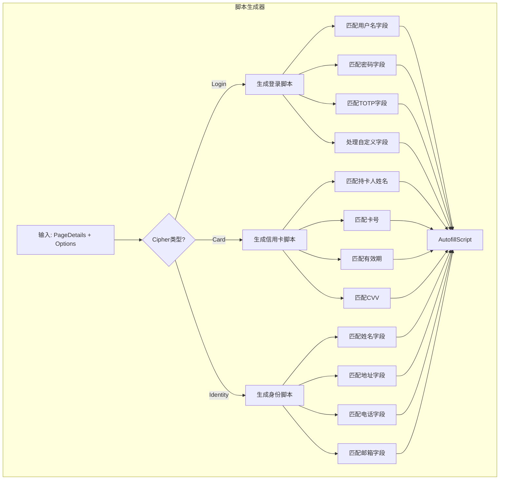
```mermaid
graph TB
    subgraph "脚本生成器"
        INPUT[输入: PageDetails + Options]

        TYPE{Cipher类型?}

        LOGIN[生成登录脚本]
        CARD[生成信用卡脚本]
        IDENTITY[生成身份脚本]

        INPUT --> TYPE
        TYPE -->|Login| LOGIN
        TYPE -->|Card| CARD
        TYPE -->|Identity| IDENTITY

        LOGIN --> L1[匹配用户名字段]
        LOGIN --> L2[匹配密码字段]
        LOGIN --> L3[匹配TOTP字段]
        LOGIN --> L4[处理自定义字段]

        CARD --> C1[匹配持卡人姓名]
        CARD --> C2[匹配卡号]
        CARD --> C3[匹配有效期]
        CARD --> C4[匹配CVV]

        IDENTITY --> I1[匹配姓名字段]
        IDENTITY --> I2[匹配地址字段]
        IDENTITY --> I3[匹配电话字段]
        IDENTITY --> I4[匹配邮箱字段]

        L1 --> SCRIPT[AutofillScript]
        L2 --> SCRIPT
        L3 --> SCRIPT
        L4 --> SCRIPT
        C1 --> SCRIPT
        C2 --> SCRIPT
        C3 --> SCRIPT
        C4 --> SCRIPT
        I1 --> SCRIPT
        I2 --> SCRIPT
        I3 --> SCRIPT
        I4 --> SCRIPT
    end
```

### 4. 内联菜单(Inline Menu)系统

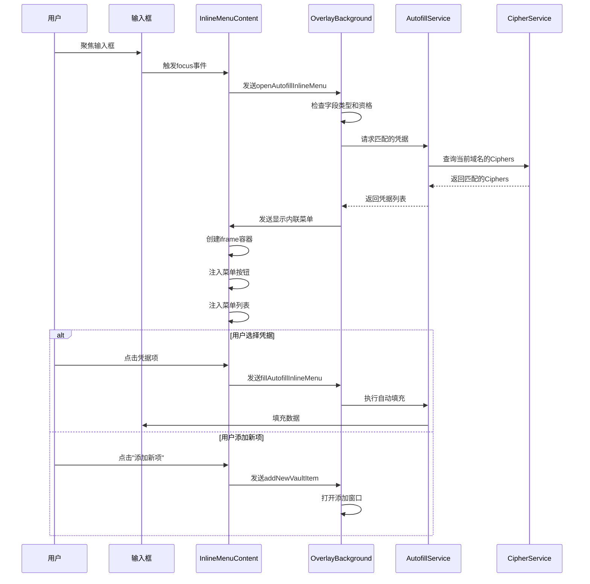
```mermaid
sequenceDiagram
    participant USER as 用户
    participant FIELD as 输入框
    participant IMC as InlineMenuContent
    participant OB as OverlayBackground
    participant AS as AutofillService
    participant CS as CipherService

    USER->>FIELD: 聚焦输入框
    FIELD->>IMC: 触发focus事件
    IMC->>OB: 发送openAutofillInlineMenu

    OB->>OB: 检查字段类型和资格
    OB->>AS: 请求匹配的凭据
    AS->>CS: 查询当前域名的Ciphers
    CS-->>AS: 返回匹配的Ciphers
    AS-->>OB: 返回凭据列表

    OB->>IMC: 发送显示内联菜单
    IMC->>IMC: 创建iframe容器
    IMC->>IMC: 注入菜单按钮
    IMC->>IMC: 注入菜单列表

    alt 用户选择凭据
        USER->>IMC: 点击凭据项
        IMC->>OB: 发送fillAutofillInlineMenu
        OB->>AS: 执行自动填充
        AS->>FIELD: 填充数据
    else 用户添加新项
        USER->>IMC: 点击"添加新项"
        IMC->>OB: 发送addNewVaultItem
        OB->>OB: 打开添加窗口
    end
```

## 复杂功能详解

### 1. 字段匹配算法

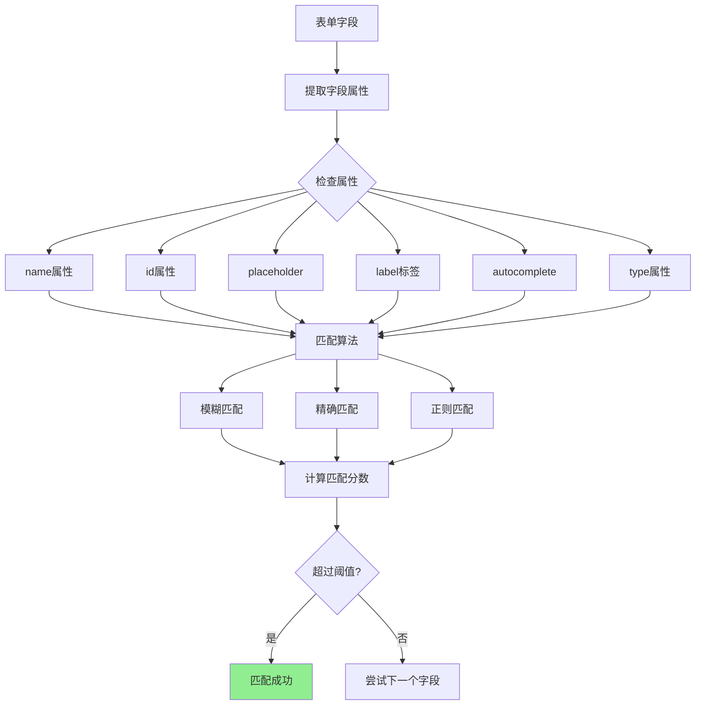
```mermaid
flowchart TB
    FIELD[表单字段] --> EXTRACT[提取字段属性]

    EXTRACT --> ATTRS{检查属性}

    ATTRS --> NAME[name属性]
    ATTRS --> ID[id属性]
    ATTRS --> PLACEHOLDER[placeholder]
    ATTRS --> LABEL[label标签]
    ATTRS --> AUTOCOMPLETE[autocomplete]
    ATTRS --> TYPE[type属性]

    NAME --> MATCH[匹配算法]
    ID --> MATCH
    PLACEHOLDER --> MATCH
    LABEL --> MATCH
    AUTOCOMPLETE --> MATCH
    TYPE --> MATCH

    MATCH --> FUZZY[模糊匹配]
    MATCH --> EXACT[精确匹配]
    MATCH --> REGEX[正则匹配]

    FUZZY --> SCORE[计算匹配分数]
    EXACT --> SCORE
    REGEX --> SCORE

    SCORE --> THRESHOLD{超过阈值?}

    THRESHOLD -->|是| MATCHED[匹配成功]
    THRESHOLD -->|否| NEXT[尝试下一个字段]

    style MATCHED fill:#90EE90
```

### 2. 密码重新提示(Reprompt)机制

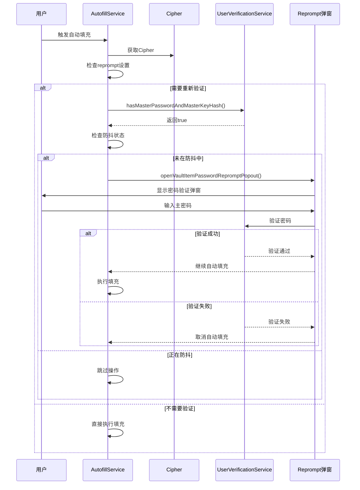
```mermaid
sequenceDiagram
    participant USER as 用户
    participant AS as AutofillService
    participant CIPHER as Cipher
    participant UV as UserVerificationService
    participant POPUP as Reprompt弹窗

    USER->>AS: 触发自动填充
    AS->>CIPHER: 获取Cipher

    AS->>AS: 检查reprompt设置

    alt 需要重新验证
        AS->>UV: hasMasterPasswordAndMasterKeyHash()
        UV-->>AS: 返回true

        AS->>AS: 检查防抖状态
        alt 未在防抖中
            AS->>POPUP: openVaultItemPasswordRepromptPopout()
            POPUP->>USER: 显示密码验证弹窗

            USER->>POPUP: 输入主密码
            POPUP->>UV: 验证密码

            alt 验证成功
                UV-->>POPUP: 验证通过
                POPUP-->>AS: 继续自动填充
                AS->>AS: 执行填充
            else 验证失败
                UV-->>POPUP: 验证失败
                POPUP-->>AS: 取消自动填充
            end
        else 正在防抖
            AS->>AS: 跳过操作
        end
    else 不需要验证
        AS->>AS: 直接执行填充
    end
```

### 3. 自动提交(Auto-Submit)功能

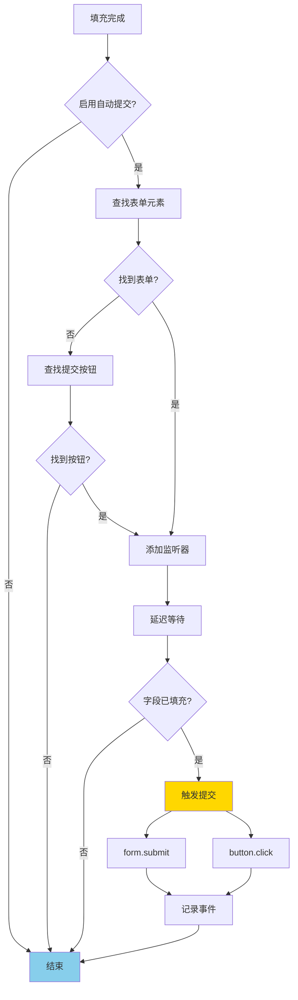
```mermaid
flowchart TB
    FILL[填充完成] --> CHECK_ENABLE{启用自动提交?}

    CHECK_ENABLE -->|否| END[结束]
    CHECK_ENABLE -->|是| FIND_FORM[查找表单元素]

    FIND_FORM --> FORM_FOUND{找到表单?}

    FORM_FOUND -->|否| FIND_BUTTON[查找提交按钮]
    FORM_FOUND -->|是| ADD_LISTENER[添加监听器]

    FIND_BUTTON --> BTN_FOUND{找到按钮?}
    BTN_FOUND -->|否| END
    BTN_FOUND -->|是| ADD_LISTENER

    ADD_LISTENER --> DELAY[延迟等待]
    DELAY --> CHECK_FILLED{字段已填充?}

    CHECK_FILLED -->|否| END
    CHECK_FILLED -->|是| TRIGGER[触发提交]

    TRIGGER --> SUBMIT_FORM["form.submit"]
    TRIGGER --> CLICK_BTN["button.click"]

    SUBMIT_FORM --> LOG[记录事件]
    CLICK_BTN --> LOG
    LOG --> END

    style END fill:#87CEEB
    style TRIGGER fill:#FFD700
```

### 4. 多框架(iframe)支持

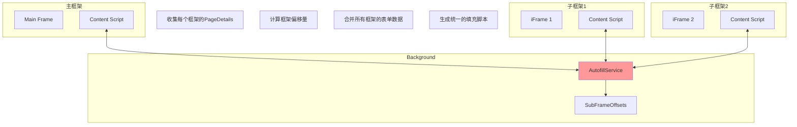
```mermaid
graph TB
    subgraph "主框架"
        MAIN[Main Frame]
        MAIN_CS[Content Script]
    end

    subgraph "子框架1"
        IFRAME1[iFrame 1]
        IFRAME1_CS[Content Script]
    end

    subgraph "子框架2"
        IFRAME2[iFrame 2]
        IFRAME2_CS[Content Script]
    end

    subgraph "Background"
        AS[AutofillService]
        OFFSET[SubFrameOffsets]
    end

    MAIN_CS <--> AS
    IFRAME1_CS <--> AS
    IFRAME2_CS <--> AS

    AS --> OFFSET

    Note1[收集每个框架的PageDetails]
    Note2[计算框架偏移量]
    Note3[合并所有框架的表单数据]
    Note4[生成统一的填充脚本]

    style AS fill:#ff9999
```

## 与其他服务的交互

### 1. CipherService 交互

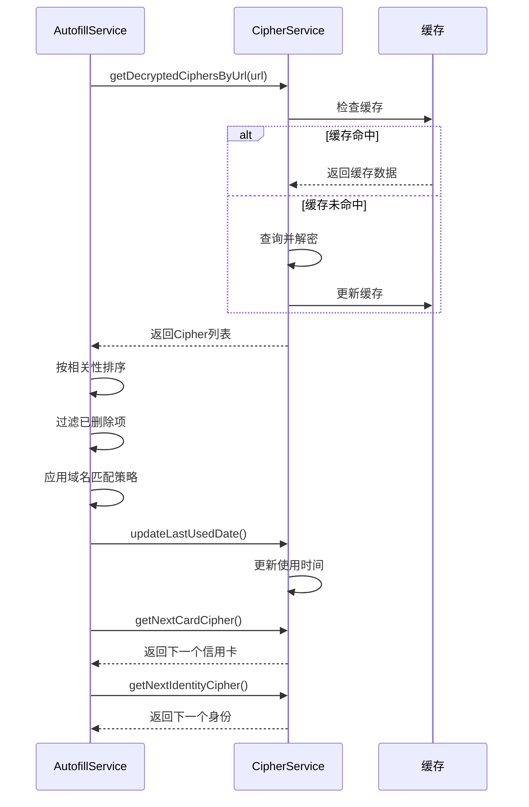
```mermaid
sequenceDiagram
    participant AS as AutofillService
    participant CS as CipherService
    participant CACHE as 缓存

    AS->>CS: getDecryptedCiphersByUrl(url)
    CS->>CACHE: 检查缓存

    alt 缓存命中
        CACHE-->>CS: 返回缓存数据
    else 缓存未命中
        CS->>CS: 查询并解密
        CS->>CACHE: 更新缓存
    end

    CS-->>AS: 返回Cipher列表

    AS->>AS: 按相关性排序
    AS->>AS: 过滤已删除项
    AS->>AS: 应用域名匹配策略

    AS->>CS: updateLastUsedDate()
    CS->>CS: 更新使用时间

    AS->>CS: getNextCardCipher()
    CS-->>AS: 返回下一个信用卡

    AS->>CS: getNextIdentityCipher()
    CS-->>AS: 返回下一个身份
```

### 2. OverlayBackground 协作

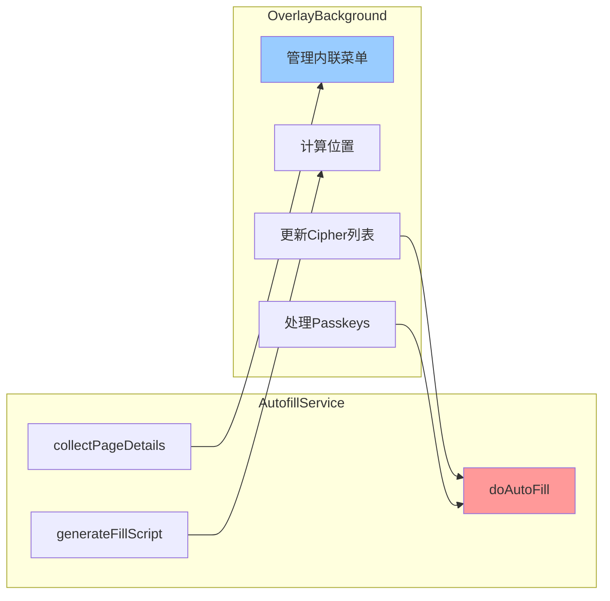
```mermaid
graph LR
    subgraph "AutofillService"
        AS_FILL[doAutoFill]
        AS_COLLECT[collectPageDetails]
        AS_SCRIPT[generateFillScript]
    end

    subgraph "OverlayBackground"
        OB_MENU[管理内联菜单]
        OB_POS[计算位置]
        OB_CIPHER[更新Cipher列表]
        OB_FIDO2[处理Passkeys]
    end

    AS_COLLECT --> OB_MENU
    OB_CIPHER --> AS_FILL
    AS_SCRIPT --> OB_POS
    OB_FIDO2 --> AS_FILL

    style AS_FILL fill:#ff9999
    style OB_MENU fill:#99ccff
```

### 3. NotificationBackground 集成

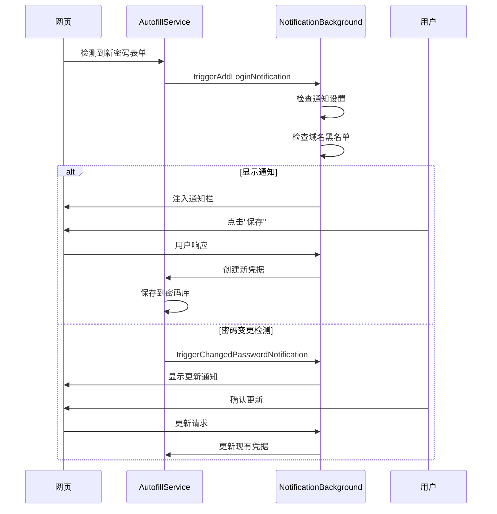
```mermaid
sequenceDiagram
    participant PAGE as 网页
    participant AS as AutofillService
    participant NB as NotificationBackground
    participant USER as 用户

    PAGE->>AS: 检测到新密码表单
    AS->>NB: triggerAddLoginNotification

    NB->>NB: 检查通知设置
    NB->>NB: 检查域名黑名单

    alt 显示通知
        NB->>PAGE: 注入通知栏
        USER->>PAGE: 点击"保存"
        PAGE->>NB: 用户响应
        NB->>AS: 创建新凭据
        AS->>AS: 保存到密码库
    else 密码变更检测
        AS->>NB: triggerChangedPasswordNotification
        NB->>PAGE: 显示更新通知
        USER->>PAGE: 确认更新
        PAGE->>NB: 更新请求
        NB->>AS: 更新现有凭据
    end
```

## 性能优化策略

### 1. 页面详情收集优化

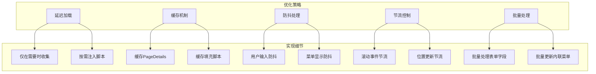
```mermaid
graph TB
    subgraph "优化策略"
        LAZY[延迟加载]
        CACHE[缓存机制]
        DEBOUNCE[防抖处理]
        THROTTLE[节流控制]
        BATCH[批量处理]
    end

    subgraph "实现细节"
        LAZY --> L1[仅在需要时收集]
        LAZY --> L2[按需注入脚本]

        CACHE --> C1[缓存PageDetails]
        CACHE --> C2[缓存填充脚本]

        DEBOUNCE --> D1[用户输入防抖]
        DEBOUNCE --> D2[菜单显示防抖]

        THROTTLE --> T1[滚动事件节流]
        THROTTLE --> T2[位置更新节流]

        BATCH --> B1[批量处理表单字段]
        BATCH --> B2[批量更新内联菜单]
    end
```

### 2. 内存管理

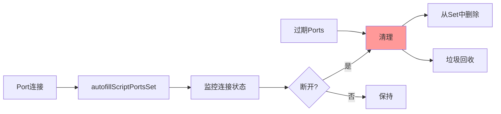
```mermaid
flowchart LR
    PORT[Port连接] --> SET[autofillScriptPortsSet]

    SET --> MONITOR[监控连接状态]

    MONITOR --> DISCONNECT{断开?}

    DISCONNECT -->|是| CLEANUP[清理]
    DISCONNECT -->|否| KEEP[保持]

    CLEANUP --> DELETE[从Set中删除]
    CLEANUP --> GC[垃圾回收]

    EXPIRED[过期Ports] --> CLEANUP

    style CLEANUP fill:#ff9999
```

## 复杂和难懂的部分

### 1. 字段资格认证系统

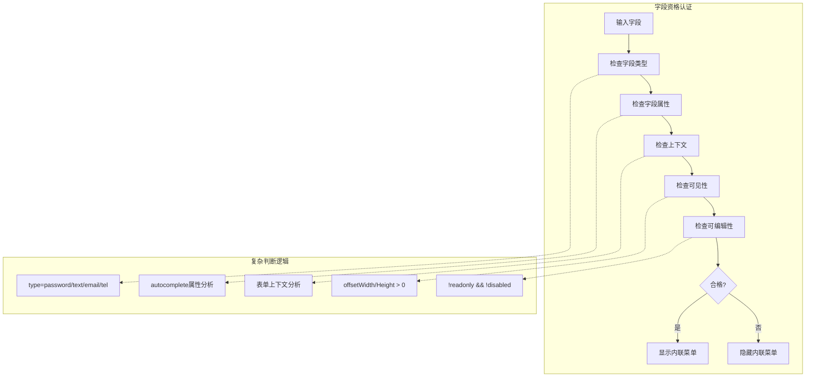
```mermaid
graph TB
    subgraph "字段资格认证"
        FIELD[输入字段]

        CHECK1[检查字段类型]
        CHECK2[检查字段属性]
        CHECK3[检查上下文]
        CHECK4[检查可见性]
        CHECK5[检查可编辑性]

        FIELD --> CHECK1
        CHECK1 --> CHECK2
        CHECK2 --> CHECK3
        CHECK3 --> CHECK4
        CHECK4 --> CHECK5

        CHECK5 --> QUALIFY{合格?}

        QUALIFY -->|是| SHOW_MENU[显示内联菜单]
        QUALIFY -->|否| HIDE_MENU[隐藏内联菜单]
    end

    subgraph "复杂判断逻辑"
        TYPE[type=password/text/email/tel]
        ATTR[autocomplete属性分析]
        CONTEXT[表单上下文分析]
        VISIBLE[offsetWidth/Height > 0]
        EDITABLE[!readonly && !disabled]
    end

    CHECK1 -.-> TYPE
    CHECK2 -.-> ATTR
    CHECK3 -.-> CONTEXT
    CHECK4 -.-> VISIBLE
    CHECK5 -.-> EDITABLE
```

### 2. 跨框架通信机制

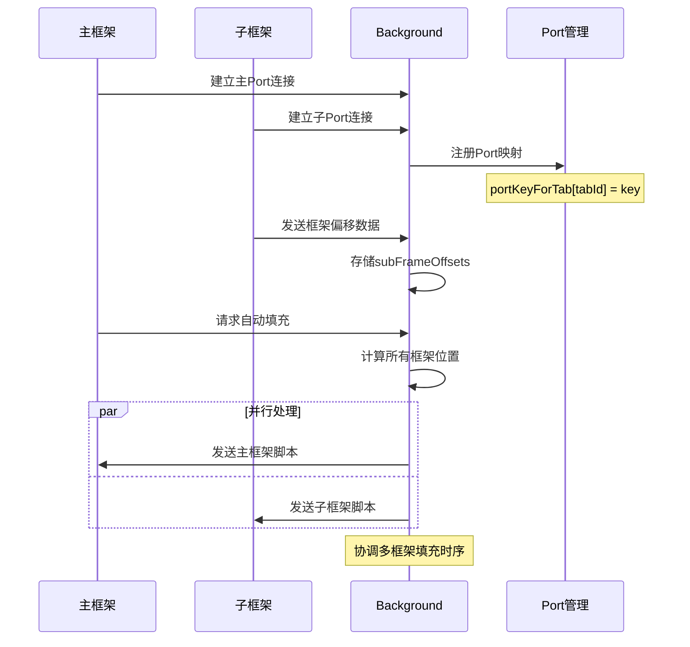
```mermaid
sequenceDiagram
    participant MF as 主框架
    participant SF as 子框架
    participant BG as Background
    participant PORT as Port管理

    MF->>BG: 建立主Port连接
    SF->>BG: 建立子Port连接

    BG->>PORT: 注册Port映射
    Note over PORT: portKeyForTab[tabId] = key

    SF->>BG: 发送框架偏移数据
    BG->>BG: 存储subFrameOffsets

    MF->>BG: 请求自动填充
    BG->>BG: 计算所有框架位置

    par 并行处理
        BG->>MF: 发送主框架脚本
    and
        BG->>SF: 发送子框架脚本
    end

    Note over BG: 协调多框架填充时序
```

### 3. 动态内容处理

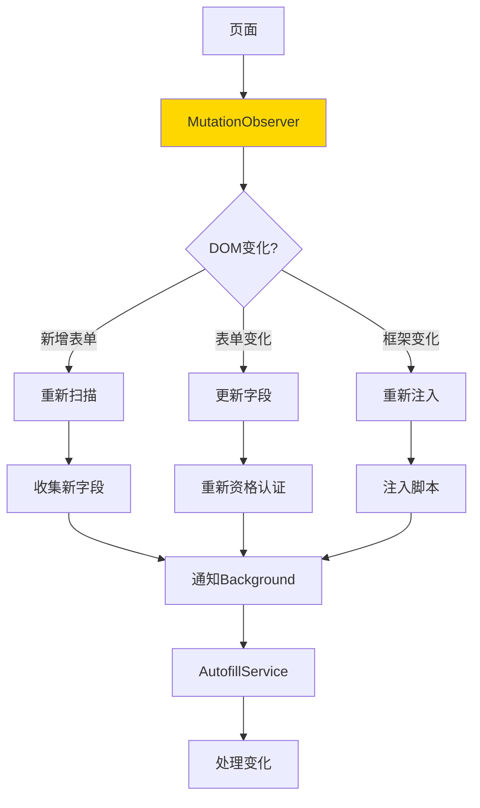
```mermaid
flowchart TB
    PAGE[页面] --> OBSERVER[MutationObserver]

    OBSERVER --> CHANGE{DOM变化?}

    CHANGE -->|新增表单| SCAN[重新扫描]
    CHANGE -->|表单变化| UPDATE[更新字段]
    CHANGE -->|框架变化| REINJECT[重新注入]

    SCAN --> COLLECT[收集新字段]
    UPDATE --> REQUALIFY[重新资格认证]
    REINJECT --> SCRIPTS[注入脚本]

    COLLECT --> NOTIFY[通知Background]
    REQUALIFY --> NOTIFY
    SCRIPTS --> NOTIFY

    NOTIFY --> AS[AutofillService]

    AS --> PROCESS[处理变化]

    style OBSERVER fill:#FFD700
```

## 安全考虑

### 1. 不受信任的iframe处理

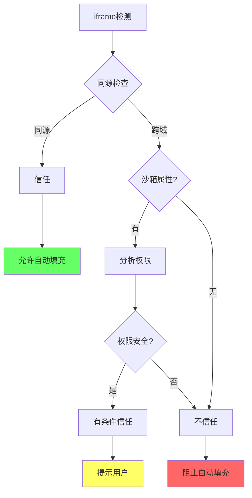
```mermaid
graph TB
    IFRAME[iframe检测] --> ORIGIN{同源检查}

    ORIGIN -->|同源| TRUSTED[信任]
    ORIGIN -->|跨域| SANDBOX{沙箱属性?}

    SANDBOX -->|有| ANALYZE[分析权限]
    SANDBOX -->|无| UNTRUSTED[不信任]

    ANALYZE --> PERMS{权限安全?}

    PERMS -->|是| CONDITIONAL[有条件信任]
    PERMS -->|否| UNTRUSTED

    TRUSTED --> ALLOW[允许自动填充]
    CONDITIONAL --> PROMPT[提示用户]
    UNTRUSTED --> BLOCK[阻止自动填充]

    style BLOCK fill:#ff6666
    style ALLOW fill:#66ff66
    style PROMPT fill:#ffff66
```

### 2. 敏感数据处理

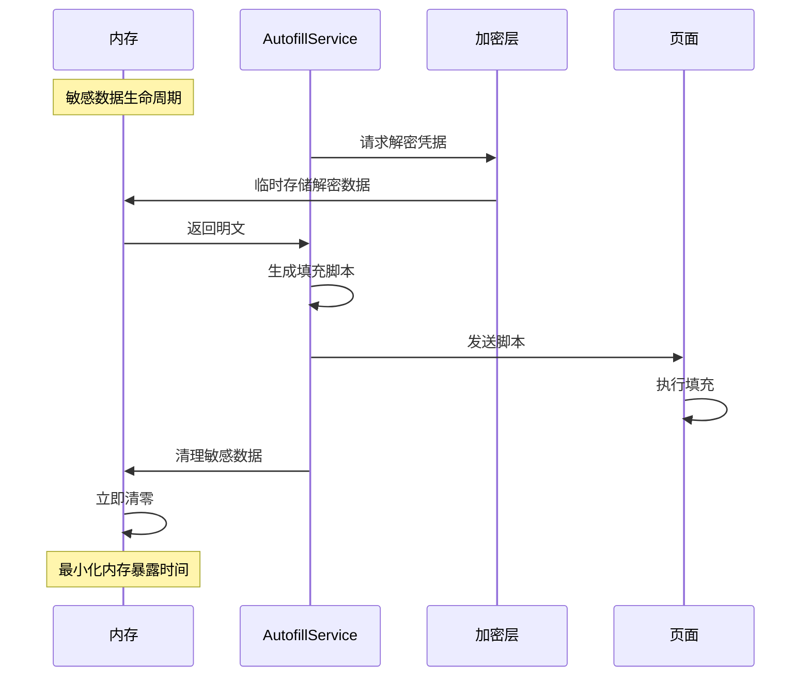
```mermaid
sequenceDiagram
    participant MEM as 内存
    participant AS as AutofillService
    participant ENC as 加密层
    participant PAGE as 页面

    Note over MEM: 敏感数据生命周期

    AS->>ENC: 请求解密凭据
    ENC->>MEM: 临时存储解密数据
    MEM->>AS: 返回明文

    AS->>AS: 生成填充脚本
    AS->>PAGE: 发送脚本

    PAGE->>PAGE: 执行填充

    AS->>MEM: 清理敏感数据
    MEM->>MEM: 立即清零

    Note over MEM: 最小化内存暴露时间
```

## 调试和故障排查

### 1. 常见问题诊断流程

```mermaid
flowchart TB
    ISSUE[自动填充问题]

    ISSUE --> TYPE{问题类型?}

    TYPE -->|不触发| CHECK_INJECT[检查脚本注入]
    TYPE -->|填充错误| CHECK_MATCH[检查字段匹配]
    TYPE -->|部分填充| CHECK_FIELD[检查字段资格]
    TYPE -->|性能问题| CHECK_PERF[检查性能]

    CHECK_INJECT --> I1[验证Content Script]
    CHECK_INJECT --> I2[检查Port连接]
    CHECK_INJECT --> I3[查看控制台错误]

    CHECK_MATCH --> M1[检查字段属性]
    CHECK_MATCH --> M2[验证匹配算法]
    CHECK_MATCH --> M3[测试正则表达式]

    CHECK_FIELD --> F1[检查可见性]
    CHECK_FIELD --> F2[验证可编辑性]
    CHECK_FIELD --> F3[分析DOM结构]

    CHECK_PERF --> P1[监控内存使用]
    CHECK_PERF --> P2[分析脚本执行时间]
    CHECK_PERF --> P3[检查缓存效率]
```

### 2. 日志和监控点

```typescript
// 关键日志点
- 脚本注入: "Injecting autofill scripts"
- 页面收集: "Collecting page details"
- 字段匹配: "Matching fields"
- 填充执行: "Executing fill script"
- 错误处理: "Autofill error"
- 性能指标: "Autofill performance"
```

## 动态脚本注入 vs 静态配置

### 为什么使用 `injectAutofillScriptsInAllTabs` 而不是在 manifest.json 中静态配置？

这是一个架构设计的关键决策，Bitwarden 选择动态注入而非静态配置有深层次的原因。

#### 1. 条件性加载的需求

```mermaid
flowchart TB
    START[页面加载] --> CHECK_USER{用户已登录?}

    CHECK_USER -->|否| BASIC[仅加载基础脚本]
    CHECK_USER -->|是| CHECK_UNLOCK{账户已解锁?}

    CHECK_UNLOCK -->|否| BASIC
    CHECK_UNLOCK -->|是| CHECK_SETTINGS[检查用户设置]

    CHECK_SETTINGS --> INLINE{内联菜单启用?}
    CHECK_SETTINGS --> NOTIF{通知栏启用?}
    CHECK_SETTINGS --> AUTO{自动填充启用?}

    INLINE -->|是| LOAD_MENU[加载内联菜单脚本]
    NOTIF -->|是| LOAD_NOTIF[加载通知脚本]
    AUTO -->|是| LOAD_AUTO[加载自动填充脚本]

    LOAD_MENU --> SELECT[选择合适的脚本组合]
    LOAD_NOTIF --> SELECT
    LOAD_AUTO --> SELECT

    SELECT --> INJECT[动态注入]

    style SELECT fill:#ff9999
```

#### 2. 四种不同的启动脚本

根据功能组合，系统会选择不同的 bootstrap 脚本：

```javascript
// 根据用户设置和状态选择
-bootstrap -
  autofill.js - // 基础版本（无内联菜单、无通知）
  bootstrap -
  autofill -
  overlay -
  notifications.js - // 仅通知栏
  bootstrap -
  autofill -
  overlay -
  menu.js - // 仅内联菜单
  bootstrap -
  autofill -
  overlay.js; // 完整版本（内联菜单 + 通知）
```

#### 3. 动态重载能力

当用户更改设置时，可以无需刷新页面即可更新功能：

```mermaid
sequenceDiagram
    participant USER as 用户
    participant SETTINGS as 设置服务
    participant AS as AutofillService
    participant PORTS as Port连接
    participant TABS as 所有标签页

    USER->>SETTINGS: 更改内联菜单设置
    SETTINGS->>AS: 触发设置变化事件

    AS->>AS: handleInlineMenuVisibilitySettingsChange()
    AS->>AS: reloadAutofillScripts()

    AS->>PORTS: 断开所有现有连接
    loop 每个Port
        PORTS->>PORTS: port.disconnect()
        PORTS->>AS: 从Set中删除
    end

    AS->>TABS: injectAutofillScriptsInAllTabs()
    TABS->>TABS: 注入新的脚本组合

    Note over AS,TABS: 无需刷新页面即可更新功能
```

#### 4. Manifest 静态配置的局限性

如果在 manifest.json 中静态配置所有脚本，会面临以下问题：

| 问题             | 影响                            | 动态注入如何解决                  |
| ---------------- | ------------------------------- | --------------------------------- |
| **无法条件加载** | 所有脚本都会在每个页面加载      | 根据用户状态和设置选择性加载      |
| **性能浪费**     | 未登录用户也会加载所有功能      | 仅在需要时加载相应功能            |
| **内存占用**     | 不需要的功能也会占用内存        | 按需加载，减少内存使用            |
| **无法动态切换** | 用户更改设置需要刷新页面        | 实时响应设置变化                  |
| **版本控制困难** | 不同功能组合需要不同的 manifest | 统一的 manifest，灵活的运行时控制 |

#### 5. 性能和安全优势

```mermaid
graph TB
    subgraph "静态配置的问题"
        S1[所有页面加载相同脚本]
        S2[无法根据用户状态调整]
        S3[设置更改需要刷新]
        S4[性能和内存浪费]
        S5[无法跳过特殊页面]
    end

    subgraph "动态注入的优势"
        D1[按需加载脚本]
        D2[根据用户状态优化]
        D3[实时响应设置变化]
        D4[更好的性能控制]
        D5[灵活的错误处理]
        D6[支持功能标志]
        D7[可跳过扩展自身页面]
    end

    S1 -.->|解决| D1
    S2 -.->|解决| D2
    S3 -.->|解决| D3
    S4 -.->|解决| D4
    S5 -.->|解决| D7

    style D1 fill:#90EE90
    style D2 fill:#90EE90
    style D3 fill:#90EE90
    style D4 fill:#90EE90
    style D7 fill:#90EE90
```

#### 6. 实际代码实现

```typescript
// 动态选择要注入的脚本
private async getBootstrapAutofillContentScript(
  activeAccount: AccountInfo
): Promise<string> {
  // 检查内联菜单设置
  const inlineMenuVisibility = await this.getInlineMenuVisibility();

  // 检查通知设置
  const enableChangedPasswordPrompt = await firstValueFrom(
    this.userNotificationSettingsService.enableChangedPasswordPrompt$
  );
  const enableAddedLoginPrompt = await firstValueFrom(
    this.userNotificationSettingsService.enableAddedLoginPrompt$
  );

  // 根据功能组合选择合适的脚本
  if (!inlineMenuVisibility && !isNotificationBarEnabled) {
    return "bootstrap-autofill.js";  // 最小化版本
  }
  if (!inlineMenuVisibility && isNotificationBarEnabled) {
    return "bootstrap-autofill-overlay-notifications.js";
  }
  if (inlineMenuVisibility && !isNotificationBarEnabled) {
    return "bootstrap-autofill-overlay-menu.js";
  }
  return "bootstrap-autofill-overlay.js";  // 完整版本
}
```

#### 7. 核心设计理念

**动态注入体现了现代浏览器扩展开发的最佳实践：**

- **按需加载（Lazy Loading）**: 仅在需要时加载功能
- **条件执行（Conditional Execution）**: 根据用户状态和设置执行
- **动态优化（Dynamic Optimization）**: 实时调整以获得最佳性能
- **用户体验优先（UX First）**: 减少不必要的资源消耗
- **灵活可扩展（Flexibility）**: 易于添加新功能和实验性特性

这种架构设计使得 Bitwarden 能够在提供强大功能的同时，保持良好的性能和用户体验。

## 总结

AutofillService 是一个高度复杂的系统，具有以下特点：

### 核心特性

1. **多层架构**: Content Scripts、Background Service、UI 组件协同工作
2. **智能匹配**: 复杂的字段识别和匹配算法
3. **安全机制**: 密码重提示、不受信任内容处理
4. **性能优化**: 缓存、防抖、延迟加载等策略
5. **用户体验**: 内联菜单、自动提交、通知系统
6. **动态注入**: 智能的脚本加载策略，按需提供功能

### 技术挑战

1. **跨框架通信**: 处理多个iframe的协调
2. **动态内容**: 应对SPA和动态加载的表单
3. **兼容性**: 支持各种网站和表单结构
4. **性能平衡**: 在功能完整性和性能之间取得平衡
5. **安全性**: 保护用户数据不被恶意脚本获取
6. **条件加载**: 根据用户状态和设置动态调整功能

### 最佳实践

1. 使用 Observable 模式处理异步消息
2. 实现完善的错误处理和降级策略
3. 采用防抖和节流优化性能
4. 严格的安全检查和验证
5. 详细的日志记录便于调试
6. 动态脚本注入而非静态配置，实现灵活的功能控制
