# Bitwarden 自动填充服务 (AutofillService) - 综合分析

## 图表类型说明

本文档中的图表分为以下类型：

- **[代码实现图]** - 直接反映源代码中的实际逻辑和结构
- **[概念架构图]** - 展示设计理念和整体架构，帮助理解但非直接代码映射
- **[数据流图]** - 展示数据在系统中的流动路径

## 📋 概述

`AutofillService` 是 Bitwarden 浏览器扩展的**核心自动填充引擎**，位于 `src/autofill/services/autofill.service.ts`。它负责协调整个自动填充过程，从页面分析到凭据填充的完整生命周期。

**文件规模**：2910 行代码
**核心职责**：页面字段识别、凭据匹配、脚本生成与注入、表单自动填充执行

---

## 🏗️ 服务架构概览

### 核心依赖关系

**[代码实现图]** - 基于构造函数中的实际依赖注入

```mermaid
graph TB
    AS[AutofillService]

    AS --> CS[CipherService<br/>密码库管理]
    AS --> ASS[AutofillSettingsService<br/>自动填充设置]
    AS --> TS[TotpService<br/>TOTP码生成]
    AS --> ECS[EventCollectionService<br/>事件收集]
    AS --> LS[LogService<br/>日志记录]
    AS --> DSS[DomainSettingsService<br/>域名设置]
    AS --> UVS[UserVerificationService<br/>用户验证]
    AS --> BAPS[BillingAccountProfileStateService<br/>账户状态]
    AS --> SIS[ScriptInjectorService<br/>脚本注入]
    AS --> AccS[AccountService<br/>账户管理]
    AS --> AuthS[AuthService<br/>认证服务]
    AS --> CfgS[ConfigService<br/>配置管理]
    AS --> UNSS[UserNotificationSettingsService<br/>通知设置]
    AS --> ML[MessageListener<br/>消息监听]

    classDef service fill:#e1f5fe
    classDef core fill:#fff3e0

    class AS core
    class CS,ASS,TS,ECS,LS,DSS,UVS,BAPS,SIS,AccS,AuthS,CfgS,UNSS,ML service
```

---

## 🔄 主要工作流程

### 1. 页面详情收集流程

**[代码实现图]** - 基于 `collectPageDetailsFromTab$` 方法 (107-173行)

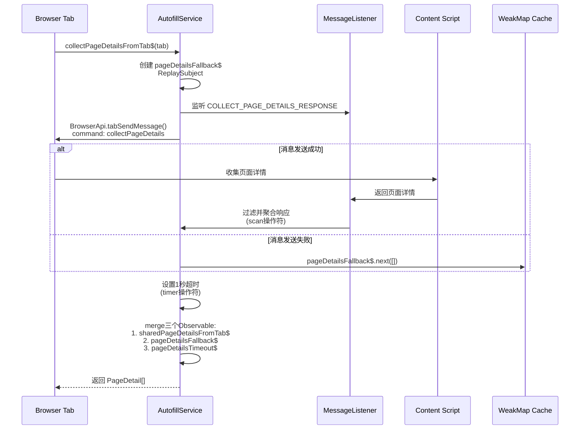

### 2. 自动填充执行流程

**[代码实现图]** - 基于 `doAutoFill` 方法 (412-513行)

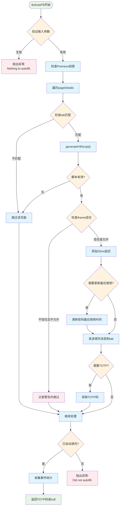

### 3. 脚本注入流程

**[代码实现图]** - 基于 `injectAutofillScripts` 方法 (228-269行)

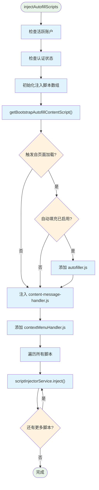

---

## 🧩 核心功能模块

### 1. 字段识别与匹配

**[代码实现图]** - 基于实际的字段匹配方法

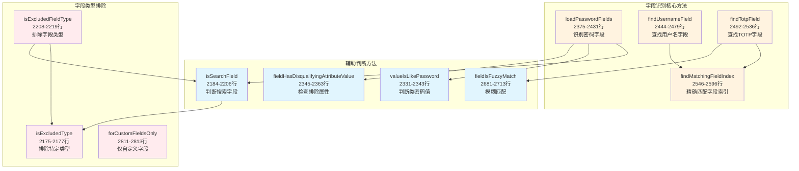

### 2. 填充脚本生成器

**[数据流图]** - 展示三种密码类型的脚本生成流程

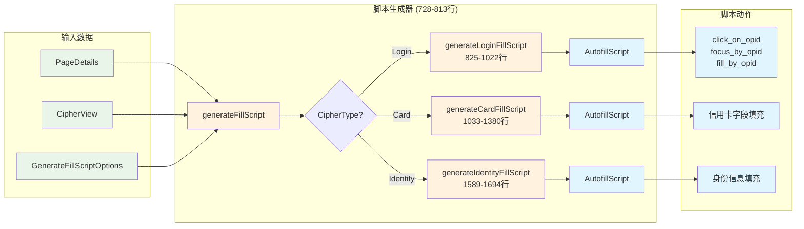

### 3. 复杂字段处理逻辑

#### 信用卡组合到期日期处理

**[代码实现图]** - 基于 `generateCombinedExpiryValue` 方法 (1447-1524行)

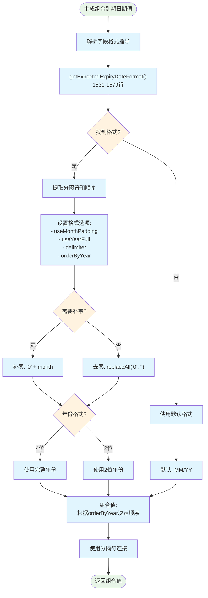

---

## 🔗 组件交互关系

### 服务间通信模式

**[代码实现图]** - 基于实际的消息传递和端口连接

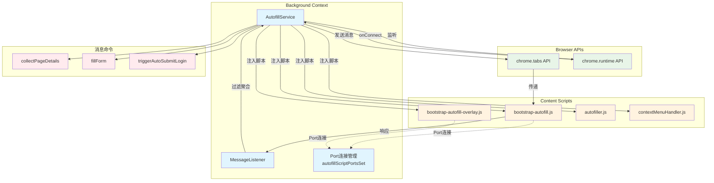

---

## 🔍 复杂和难懂的部分

### 1. Observable流处理 (collectPageDetailsFromTab$)

**复杂度原因**：

- 使用了多个RxJS操作符组合（filter, scan, share, takeUntil, merge）
- 处理多种异常情况（超时、错误、浏览器协议URL）
- 需要协调多个异步数据源

**关键代码片段**（107-173行）：

```typescript
// 三个数据源的合并
return merge(sharedPageDetailsFromTab$, pageDetailsFallback$, pageDetailsTimeout$);
```

### 2. 字段属性匹配逻辑

**复杂度原因**：

- 支持多种匹配模式（精确、前缀、正则、CSV）
- 需要处理多语言字段名称
- 复杂的优先级判断逻辑

**核心方法**：

- `fieldPropertyIsMatch` (2636-2668行)
- `fieldPropertyIsPrefixMatch` (2609-2622行)
- `findMatchingFieldIndex` (2546-2596行)

### 3. 密码重新验证弹窗防抖

**复杂度原因**：

- 需要防止重复打开弹窗
- 处理异步的用户验证流程
- 协调多个标签页的验证状态

**实现方法**：

- `isDebouncingPasswordRepromptPopout` (2818-2831行)
- 使用 timeout 和标志位组合控制

### 4. iframe信任判断

**复杂度原因**：

- 需要判断iframe是否属于同一域名
- 考虑URI匹配策略
- 安全性和用户体验的平衡

**核心方法**：

- `inUntrustedIframe` (1389-1411行)

---

## 📊 性能优化策略

### 1. WeakMap缓存机制

- 端口连接使用Set存储：`autofillScriptPortsSet`
- 避免内存泄漏，自动清理断开的连接

### 2. 脚本注入优化

- 条件注入：根据设置选择不同的bootstrap脚本
- 批量注入：减少与浏览器API的交互次数
- 延迟加载：仅在需要时注入autofiller.js

### 3. 操作延迟

- 填充操作间添加20ms延迟：`delay_between_operations = 20`
- 防止过快操作导致的页面响应问题

---

## 🔐 安全考虑

### 1. 密码重新验证

- CipherRepromptType.Password 检查
- 主密码和密钥哈希验证
- 防抖机制防止暴力尝试

### 2. iframe安全

- 检测不可信iframe
- 允许用户选择是否在不可信iframe中填充
- 记录安全警告日志

### 3. Premium功能控制

- TOTP功能需要Premium权限
- 组织TOTP使用权限检查

---

## 📈 统计与监控

### 事件收集点

- **Cipher_ClientAutofilled**：成功自动填充时记录（501-504行）
- 包含密码ID用于使用统计
- 更新最后使用时间和索引

---

## 🎯 关键配置与设置

### 自动填充相关设置

| 设置项                    | 用途               | 获取方法                       |
| ------------------------- | ------------------ | ------------------------------ |
| `inlineMenuVisibility`    | 内联菜单可见性     | `getInlineMenuVisibility()`    |
| `autoCopyTotp`            | 自动复制TOTP       | `getShouldAutoCopyTotp()`      |
| `autofillOnPageLoad`      | 页面加载时自动填充 | `getAutofillOnPageLoad()`      |
| `defaultUriMatchStrategy` | 默认URI匹配策略    | `getDefaultUriMatchStrategy()` |

### 脚本类型选择逻辑

根据设置组合选择不同的bootstrap脚本（278-308行）：

- `bootstrap-autofill.js`：基础版本
- `bootstrap-autofill-overlay-notifications.js`：仅通知栏
- `bootstrap-autofill-overlay-menu.js`：仅内联菜单
- `bootstrap-autofill-overlay.js`：完整功能

---

## 🚀 未来改进建议

### 1. 类型安全

- 文件头部标注需要更新为类型安全（第1-2行注释）
- 减少 any 类型使用

### 2. 代码组织

- 2910行的单文件过大，建议拆分
- 可以将字段匹配、脚本生成、填充执行分离为独立模块

### 3. 性能优化

- 考虑使用 Web Workers 处理复杂的字段匹配
- 实现更智能的脚本缓存机制

### 4. 错误处理

- 增加更详细的错误类型
- 提供更好的用户反馈机制

---

## 总结

`AutofillService` 是一个功能强大但复杂的服务，它通过精心设计的字段识别、脚本生成和安全机制，为用户提供了可靠的自动填充体验。服务的核心优势在于：

1. **全面的字段识别**：支持多语言、多格式的字段匹配
2. **灵活的脚本生成**：针对不同类型的密码项生成定制化填充脚本
3. **强大的安全保护**：多层安全验证确保用户数据安全
4. **良好的性能优化**：通过缓存、延迟加载等策略提升响应速度

同时，服务也存在一些可以改进的地方，特别是在代码组织和类型安全方面。随着功能的不断增加，考虑模块化重构将有助于提高代码的可维护性。

## loadAutofillScriptsOnInstall 详细流程图


## doAutoFIll 详细流程图


## 7. fillScript 数据结构详解

### 7.1 AutofillScript 类定义

`fillScript` 是 `AutofillScript` 类的实例，包含了所有自动填充所需的信息和指令。

```typescript
class AutofillScript {
  script: FillScript[] = []; // 核心：填充动作序列
  properties: AutofillScriptProperties = {}; // 执行属性配置
  metadata: any = {}; // 元数据（当前未使用）
  autosubmit: string[]; // 自动提交的表单ID列表
  savedUrls: string[]; // 保存的URL列表
  untrustedIframe: boolean; // 是否在不受信任的iframe中
  itemType: string; // 项目类型（当前未使用）
}
```

### 7.2 核心数据结构

#### 7.2.1 FillScript（填充动作）

```typescript
type FillScript = [action: FillScriptActions, opid: string, value?: string];

type FillScriptActions =
  | "click_on_opid" // 点击字段
  | "focus_by_opid" // 聚焦字段
  | "fill_by_opid"; // 填充字段值
```

每个填充动作是一个数组，包含：

- **action**: 动作类型
- **opid**: 目标字段的唯一标识符
- **value**: 要填充的值（仅用于 fill_by_opid）

#### 7.2.2 AutofillScriptProperties（执行属性）

```typescript
type AutofillScriptProperties = {
  delay_between_operations?: number; // 操作间延迟（毫秒）
};
```

### 7.3 真实数据示例

#### 7.3.1 登录表单填充脚本

```javascript
// 一个典型的登录表单填充脚本
const loginFillScript = {
  script: [
    // 用户名字段
    ["click_on_opid", "username_field_12345"],
    ["focus_by_opid", "username_field_12345"],
    ["fill_by_opid", "username_field_12345", "john.doe@example.com"],

    // 密码字段
    ["click_on_opid", "password_field_67890"],
    ["focus_by_opid", "password_field_67890"],
    ["fill_by_opid", "password_field_67890", "SecurePassword123!"],

    // TOTP字段（如果存在）
    ["click_on_opid", "totp_field_24680"],
    ["focus_by_opid", "totp_field_24680"],
    ["fill_by_opid", "totp_field_24680", "123456"],

    // 最后聚焦到密码字段（用户可以直接按回车提交）
    ["focus_by_opid", "password_field_67890"],
  ],

  properties: {
    delay_between_operations: 20, // 每个操作之间延迟20毫秒
  },

  savedUrls: ["https://example.com/login", "https://example.com/*"],

  untrustedIframe: false, // 在主页面中，不是iframe

  autosubmit: ["form_login_form"], // 自动提交表单ID
};
```

#### 7.3.2 信用卡表单填充脚本

```javascript
const cardFillScript = {
  script: [
    // 持卡人姓名
    ["click_on_opid", "cardholder_name_11111"],
    ["focus_by_opid", "cardholder_name_11111"],
    ["fill_by_opid", "cardholder_name_11111", "John Doe"],

    // 卡号
    ["click_on_opid", "card_number_22222"],
    ["focus_by_opid", "card_number_22222"],
    ["fill_by_opid", "card_number_22222", "4111111111111111"],

    // 有效期月份
    ["click_on_opid", "exp_month_33333"],
    ["focus_by_opid", "exp_month_33333"],
    ["fill_by_opid", "exp_month_33333", "12"],

    // 有效期年份
    ["click_on_opid", "exp_year_44444"],
    ["focus_by_opid", "exp_year_44444"],
    ["fill_by_opid", "exp_year_44444", "2025"],

    // CVV
    ["click_on_opid", "cvv_55555"],
    ["focus_by_opid", "cvv_55555"],
    ["fill_by_opid", "cvv_55555", "123"],
  ],

  properties: {
    delay_between_operations: 20,
  },

  savedUrls: ["https://shop.example.com/checkout"],
  untrustedIframe: false,
  autosubmit: [], // 通常不自动提交支付表单
};
```

#### 7.3.3 多步骤TOTP填充（分离的验证码输入框）

```javascript
// 6个独立的输入框，每个填充一位数字
const totpSeparateFillScript = {
  script: [
    ["click_on_opid", "totp_digit_1"],
    ["focus_by_opid", "totp_digit_1"],
    ["fill_by_opid", "totp_digit_1", "1"],

    ["click_on_opid", "totp_digit_2"],
    ["focus_by_opid", "totp_digit_2"],
    ["fill_by_opid", "totp_digit_2", "2"],

    ["click_on_opid", "totp_digit_3"],
    ["focus_by_opid", "totp_digit_3"],
    ["fill_by_opid", "totp_digit_3", "3"],

    ["click_on_opid", "totp_digit_4"],
    ["focus_by_opid", "totp_digit_4"],
    ["fill_by_opid", "totp_digit_4", "4"],

    ["click_on_opid", "totp_digit_5"],
    ["focus_by_opid", "totp_digit_5"],
    ["fill_by_opid", "totp_digit_5", "5"],

    ["click_on_opid", "totp_digit_6"],
    ["focus_by_opid", "totp_digit_6"],
    ["fill_by_opid", "totp_digit_6", "6"],
  ],

  properties: {
    delay_between_operations: 20,
  },

  savedUrls: ["https://example.com/verify"],
  untrustedIframe: false,
  autosubmit: [],
};
```

### 7.4 特殊情况处理

#### 7.4.1 不受信任的iframe

```javascript
const untrustedIframeFillScript = {
  script: [], // 可能为空，因为安全原因不填充
  properties: {},
  savedUrls: ["https://legitimate-site.com"],
  untrustedIframe: true, // 标记为不受信任
  autosubmit: [],
};
```

#### 7.4.2 自定义字段（span元素）

```javascript
// span元素只需要填充，不需要click和focus
const customFieldFillScript = {
  script: [
    // 普通输入字段
    ["click_on_opid", "input_field_111"],
    ["focus_by_opid", "input_field_111"],
    ["fill_by_opid", "input_field_111", "value1"],

    // span自定义字段（只有fill动作）
    ["fill_by_opid", "span_field_222", "custom_value"],
  ],
  properties: {
    delay_between_operations: 20,
  },
  savedUrls: [],
  untrustedIframe: false,
  autosubmit: [],
};
```

### 7.5 执行流程

1. **脚本生成**：`generateFillScript` 方法根据页面结构和密文数据生成脚本
2. **脚本传递**：通过消息传递机制发送到内容脚本
3. **脚本执行**：内容脚本按顺序执行每个动作：
   - `click_on_opid`：模拟点击，激活字段
   - `focus_by_opid`：设置焦点，准备输入
   - `fill_by_opid`：填充实际值
4. **延迟控制**：每个动作之间按 `delay_between_operations` 延迟
5. **自动提交**：如果配置了 `autosubmit`，在填充完成后自动提交表单

### 7.6 安全考虑

- **URL验证**：`savedUrls` 用于验证当前页面是否匹配保存的登录项
- **iframe检测**：`untrustedIframe` 防止在恶意iframe中泄露凭据
- **字段验证**：每个 `opid` 都经过验证，确保字段存在且可填充
- **值截断**：如果值超过字段的 `maxLength`，会自动截断

### 7.7 性能优化

- **批量生成**：所有动作一次性生成，减少计算开销
- **最小化动作**：span元素跳过不必要的click和focus
- **智能焦点**：最后聚焦到密码字段，方便用户提交
- **并行处理**：TOTP字段可以并行生成验证码

这个数据结构设计充分考虑了：

- **可扩展性**：易于添加新的动作类型
- **安全性**：包含多层安全验证机制
- **性能**：优化了动作序列和执行效率
- **兼容性**：支持各种页面结构和表单类型

---

## 📍 关键问题分析：表单填充范围策略

### 问题：Bitwarden 是否限制在单个表单内填充？

通过对代码的深入分析，得出以下结论：

### 🎯 填充策略分析

**Bitwarden 采用智能关联策略，不严格限制在单个表单内**：

#### 1. **代码证据** (431-498行)

```typescript
// 处理所有 pageDetails（可能包含多个frame）
await Promise.all(
  options.pageDetails.map(async (pd) => {
    const fillScript = await this.generateFillScript(pd.details, {
      // 生成填充脚本 - 涵盖整个页面的字段
    });
  }),
);
```

#### 2. **字段查找逻辑** (2444-2479行)

- `findUsernameField` 方法遍历 `pageDetails.fields`（页面所有字段）
- 不限制在特定的 `<form>` 标签内
- 优先查找**逻辑相关**的字段组合

#### 3. **跨表单处理机制** (332-352行)

```typescript
// 特殊处理：表单外的密码字段
const passwordFieldsWithoutForm = passwordFields.filter((pf) => pf.form === undefined);

// 智能关联：将表单外字段关联到表单内
if (passwordFields.length === 3 && formCount == 1 && passwordFieldsWithoutForm.length > 0) {
  passwordFieldsWithoutForm.forEach((pf) => {
    pf.form = soloFormKey; // 关联到唯一的表单
  });
}
```

### 🔍 填充范围特点

1. **优先逻辑关联**：
   - 用户名 + 密码组合（无论是否在同一表单）
   - 信用卡字段组合（卡号、持卡人、过期日期、CVV）
   - 身份信息字段组合

2. **智能字段识别**：
   - 通过字段属性（name、id、placeholder）识别
   - 支持无 `<form>` 标签的字段
   - 处理复杂的页面结构

3. **安全边界**：
   - 同一页面/frame内的字段
   - 验证 tab.id 和 tab.url 匹配
   - 检查 iframe 信任度

### 📊 实际行为总结

| 场景             | 填充行为          | 代码依据                         |
| ---------------- | ----------------- | -------------------------------- |
| 标准表单内字段   | ✅ 全部填充       | `getFormsWithPasswordFields`     |
| 跨表单的相关字段 | ✅ 智能关联填充   | `passwordFieldsWithoutForm` 逻辑 |
| 无表单标签的字段 | ✅ 按类型关联填充 | `findUsernameField` 全页面搜索   |
| 不同页面的字段   | ❌ 不填充         | tab.id/url 验证                  |
| 不可信iframe     | ⚠️ 可配置         | `allowUntrustedIframe` 选项      |

### 🎯 结论

**Bitwarden 的自动填充采用"智能关联策略"**：

- **不限制在单个表单内**
- **基于字段类型和逻辑关系**进行智能匹配
- **一次填充可能涉及多个表单或无表单的字段**
- **优先保证功能完整性，同时兼顾安全性**

这种设计更符合现代网页的实际情况，因为很多网站的登录字段可能分散在页面的不同位置，甚至不使用传统的 `<form>` 标签。

---

## 🔄 多层iframe嵌套表单处理机制

### 问题：多层iframe嵌套页面中表单分布的处理策略

**详细分析**: 参见 [iframe嵌套表单分析文档](../../iframe-nested-form-analysis.md)

### 🎯 核心处理流程

#### 1. **iframe发现与枚举**

```typescript
// 获取所有iframe的frameId
const frames = await BrowserApi.getAllFrameDetails(tab.id);
frames.forEach((frame) => this.injectAutofillScripts(tab, frame.frameId, false));
```

#### 2. **分层脚本注入**

- **独立注入**: 每个iframe都独立注入autofill脚本
- **隔离执行**: 每个iframe的脚本在独立的context中运行
- **完整覆盖**: 确保所有层级的iframe都有自动填充能力

#### 3. **跨iframe安全验证**

```typescript
// 每个iframe独立进行安全检查
private async inUntrustedIframe(pageUrl: string, options): Promise<boolean> {
  if (pageUrl === options.tabUrl) return false; // 主页面安全

  // 验证iframe URL是否匹配保存的登录项
  const matchesUri = options.cipher.login.matchesUri(pageUrl, ...);
  return !matchesUri; // 不匹配则标记为不可信
}
```

#### 4. **精确消息路由**

```typescript
// 向特定iframe发送填充指令
void BrowserApi.tabSendMessage(
  tab,
  {
    command: "fillForm",
    fillScript: fillScript,
  },
  { frameId: pd.frameId },
); // 精确指定目标iframe
```

### 🔍 多层嵌套场景处理

| 场景         | 处理方式               | 特点                 |
| ------------ | ---------------------- | -------------------- |
| 简单二层嵌套 | 主页面+iframe1独立处理 | 安全验证iframe URL   |
| 复杂多层嵌套 | 所有iframe并行注入脚本 | 跨iframe字段智能关联 |
| 混合表单分布 | 多个PageDetail并发处理 | 精确的frameId路由    |

### 🔒 安全与性能特点

**安全考虑**:

- ✅ iframe钓鱼防护 - 逐iframe URL验证
- ✅ 同源策略遵守 - 独立DOM访问
- ✅ 用户控制 - `allowUntrustedIframe` 配置

**性能优化**:

- ✅ 并行处理所有iframe
- ✅ 智能缓存端口连接
- ✅ 条件执行避免空iframe处理

### 🎯 iframe处理结论

**Bitwarden 对多层iframe嵌套的处理非常精细**：

1. **全覆盖**: 使用 `getAllFrameDetails` 发现所有层级iframe
2. **独立处理**: 每个iframe独立注入、收集、验证
3. **精确路由**: frameId确保消息发送到正确iframe
4. **智能关联**: 跨iframe识别相关字段组合
5. **安全优先**: 每个iframe独立安全验证
6. **性能优化**: 并行处理，避免阻塞

**支持场景**:

- ✅ 任意层级iframe嵌套
- ✅ 跨iframe字段智能关联
- ✅ 主页面+iframe混合表单
- ✅ 复杂的企业级应用架构

---

---

## 🔘 扩展式页面提交按钮收集机制分析

### 问题：扩展如何一步步收集页面所有的提交相关按钮

通过对 `src/autofill` 目录的深度分析，揭示了 Bitwarden 扩展采用**分层职责分离**的按钮收集架构。

### 🏗️ 按钮收集架构设计

**[代码实现图]** - 基于实际的分层服务架构

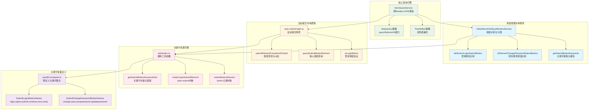

### 🔄 按钮收集完整流程

**[数据流图]** - 展示从页面扫描到按钮分类的完整过程

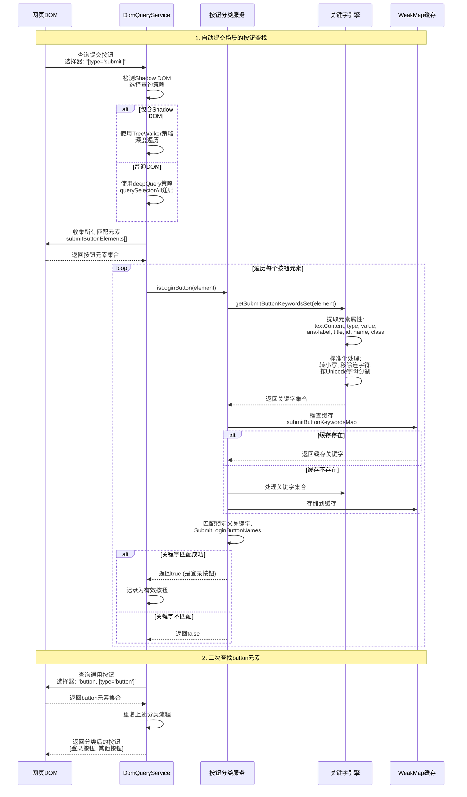

### 🔍 核心技术实现细节

#### 1. **关键字提取引擎** (`utils/index.ts:419-451`)

```typescript
export function getSubmitButtonKeywordsSet(element: HTMLElement): Set<string> {
  const keywords = [
    element.textContent, // 按钮显示文本
    element.getAttribute("type"), // type 属性
    element.getAttribute("value"), // value 属性
    element.getAttribute("aria-label"), // ARIA 标签
    element.getAttribute("aria-labelledby"), // ARIA 关联标签
    element.getAttribute("aria-describedby"), // ARIA 描述
    element.getAttribute("title"), // 标题属性
    element.getAttribute("id"), // 元素 ID
    element.getAttribute("name"), // name 属性
    element.getAttribute("class"), // CSS 类名
  ];

  const keywordsSet = new Set<string>();
  for (let i = 0; i < keywords.length; i++) {
    if (typeof keywords[i] === "string") {
      // 🔥 核心标准化处理
      keywords[i]
        .toLowerCase() // 转换为小写
        .replace(/[-\s]/g, "") // 移除连字符和空格
        .split(/[^\p{L}]+/gu) // 按Unicode字母字符分割
        .forEach((keyword) => {
          if (keyword) {
            keywordsSet.add(keyword); // 添加到集合
          }
        });
    }
  }

  return keywordsSet;
}
```

#### 2. **智能查询策略** (`dom-query.service.ts:49-78`)

```typescript
query<T>(
  root: Document | ShadowRoot | Element,
  queryString: string,
  treeWalkerFilter: CallableFunction
): T[] {
  // 🔥 自适应查询策略选择
  if (this.pageContainsShadowDomElements()) {
    // Shadow DOM环境 -> TreeWalker策略
    return this.queryAllTreeWalkerNodes<T>(
      root,
      treeWalkerFilter,
      this.ignoredTreeWalkerNodes
    );
  }

  try {
    // 普通DOM环境 -> deepQuery策略
    return this.deepQueryElements<T>(root, queryString);
  } catch {
    // 失败回退 -> TreeWalker策略
    return this.queryAllTreeWalkerNodes<T>(root, treeWalkerFilter);
  }
}
```

#### 3. **分级按钮查找** (`auto-submit-login.ts:192-217`)

```typescript
function submitElementFoundAndClicked(element: HTMLElement): boolean {
  // 🔥 第一优先级：查找 type="submit" 元素
  const genericSubmitElement = querySubmitButtonElement(element, "[type='submit']", (node: Node) =>
    nodeIsTypeSubmitElement(node),
  );
  if (genericSubmitElement) {
    clickSubmitElement(genericSubmitElement);
    return true;
  }

  // 🔥 第二优先级：查找 button 或 type="button" 元素
  const buttonElement = querySubmitButtonElement(element, "button, [type='button']", (node: Node) =>
    nodeIsButtonElement(node),
  );
  if (buttonElement) {
    clickSubmitElement(buttonElement);
    return true;
  }

  return false;
}
```

#### 4. **缓存机制** (`inline-menu-field-qualification.service.ts`)

```typescript
private submitButtonKeywordsMap: SubmitButtonKeywordsMap = new WeakMap();

private getSubmitButtonKeywords(element: HTMLElement): string {
  // 🔥 WeakMap缓存机制避免重复分析
  if (!this.submitButtonKeywordsMap.has(element)) {
    const keywordsSet = getSubmitButtonKeywordsSet(element);
    this.submitButtonKeywordsMap.set(element, Array.from(keywordsSet).join(","));
  }
  return this.submitButtonKeywordsMap.get(element);
}
```

### 🎯 按钮分类标准

#### 登录按钮关键字 (`autofill-constants.ts:882-889`)

```typescript
export const SubmitLoginButtonNames: string[] = [
  "login",
  "signin",
  "submit",
  "continue",
  "next",
  "verify",
];
```

#### 密码更改按钮关键字 (`autofill-constants.ts:891-898`)

```typescript
export const SubmitChangePasswordButtonNames: string[] = [
  "change",
  "save",
  "savepassword",
  "updatepassword",
  "changepassword",
  "resetpassword",
];
```

### 🔧 技术特点与优势

#### 1. **跨Shadow DOM支持**

- 自动检测页面是否包含Shadow DOM
- 两种查询策略自适应切换
- 递归遍历所有Shadow Root

#### 2. **多语言支持**

- Unicode字母字符处理 (`/[^\p{L}]+/gu`)
- 支持国际化按钮文本识别
- 标准化处理消除语言差异

#### 3. **性能优化机制**

- **WeakMap缓存**：避免重复关键字分析
- **分级查询**：优先查找明确的submit元素
- **策略选择**：根据DOM结构选择最优查询方式

#### 4. **安全性考虑**

- 严格的元素类型验证
- 属性值安全检查
- iframe环境独立处理

### 🚀 实际执行示例

#### 场景：复杂登录页面的按钮收集

```html
<!-- 实际页面结构 -->
<div class="login-container">
  <form id="loginForm">
    <input type="text" name="username" />
    <input type="password" name="password" />
    <button type="submit" class="btn-primary">Sign In</button>
  </form>

  <div class="social-login">
    <button id="googleLogin" class="btn-google">Continue with Google</button>
    <button class="forgot-pwd" onclick="resetPassword()">Reset Password</button>
  </div>

  <!-- Shadow DOM组件 -->
  <custom-auth-widget>
    #shadow-root
    <button type="button" class="verify-btn">Verify Account</button>
  </custom-auth-widget>
</div>
```

**收集结果**：

1. **主要登录按钮**：`button[type="submit"]` (文本："Sign In")
2. **辅助登录按钮**：`#googleLogin` (文本："Continue with Google")
3. **密码重置按钮**：`.forgot-pwd` (文本："Reset Password")
4. **验证按钮**：Shadow DOM中的 `.verify-btn` (文本："Verify Account")

**关键字匹配**：

- "Sign In" → 匹配 "signin" → **登录按钮**
- "Continue with Google" → 匹配 "continue" → **登录按钮**
- "Reset Password" → 匹配 "resetpassword" → **密码更改按钮**
- "Verify Account" → 匹配 "verify" → **登录按钮**

### 🎯 收集机制总结

**Bitwarden 的按钮收集机制特点**：

1. **全面覆盖**：
   - ✅ 支持标准HTML按钮 (`<button>`, `<input type="submit">`)
   - ✅ 支持Shadow DOM中的按钮
   - ✅ 支持无form标签的独立按钮
   - ✅ 支持复杂的现代Web应用结构

2. **智能识别**：
   - ✅ 多维度关键字提取（文本、属性、ARIA标签）
   - ✅ 标准化处理消除格式差异
   - ✅ 多语言国际化支持
   - ✅ 上下文感知的分类逻辑

3. **高性能**：
   - ✅ 自适应查询策略
   - ✅ WeakMap缓存机制
   - ✅ 分级查找优化
   - ✅ 避免重复计算

4. **职责分离**：
   - ✅ 字段收集与按钮收集独立
   - ✅ 通用服务与专用场景分离
   - ✅ 查询引擎与分类逻辑解耦
   - ✅ 缓存与计算分离

这种设计既保证了功能的完整性和准确性，又通过精心设计的缓存和优化策略维持了良好的性能表现，特别适合处理复杂的现代Web应用中的各种按钮收集场景。

---

这个综合分析涵盖了AutofillService的所有主要功能点，帮助理解其复杂的自动填充逻辑。
