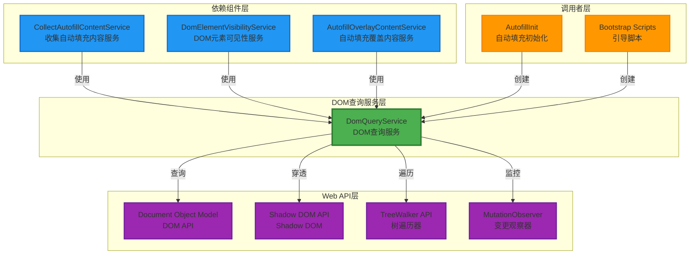
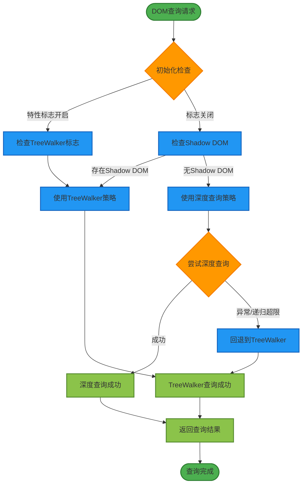
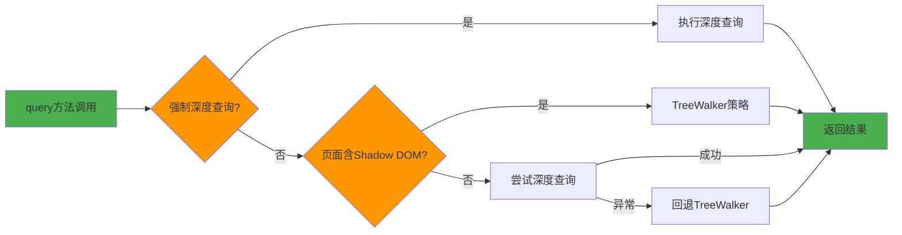
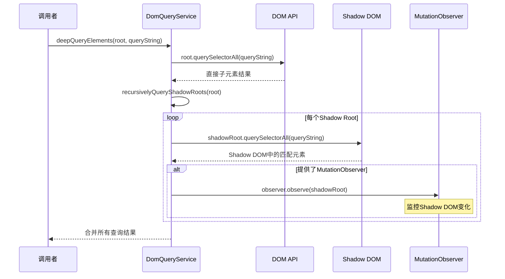
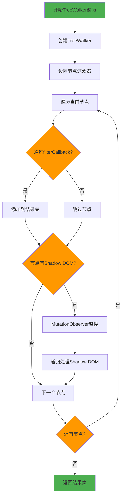
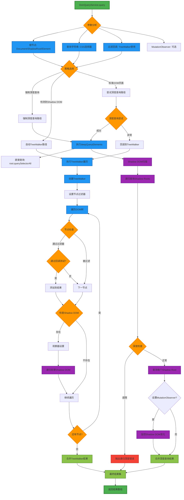
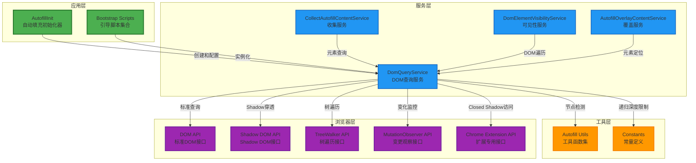
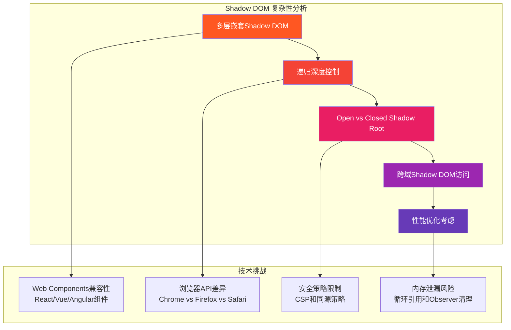
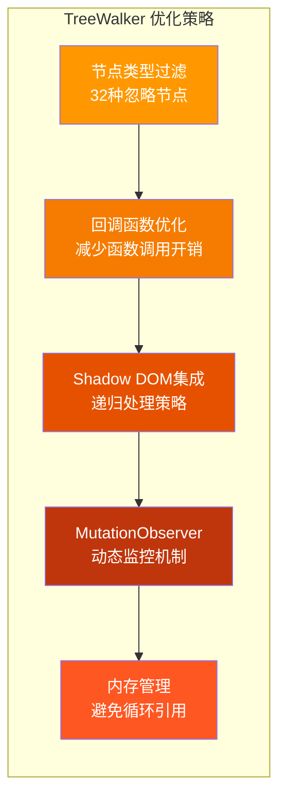
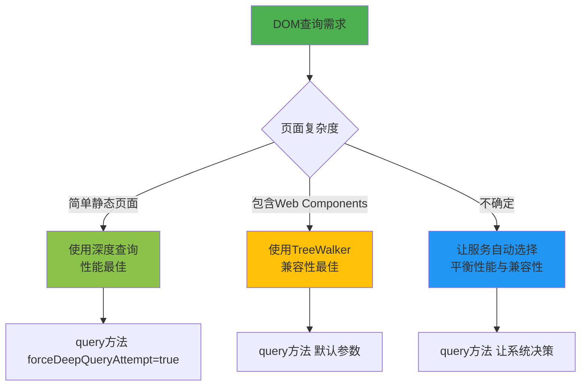

# DomQueryService 深度分析文档

## 📋 服务概述

`DomQueryService` 是 Bitwarden 浏览器扩展中负责**DOM 查询和遍历**的核心基础服务，专门处理现代 Web 应用中复杂的 DOM 结构，特别是包含 **Shadow DOM** 的页面。该服务提供了两种查询策略：深度查询和 TreeWalker 遍历，以确保在各种复杂的 DOM 环境中都能可靠地找到目标元素。

### 🎯 核心职责

- 🔍 **智能 DOM 查询**：根据页面特征自动选择最优查询策略
- 🌓 **Shadow DOM 支持**：深度穿透 Shadow DOM 边界进行元素查找
- 🌳 **TreeWalker 遍历**：高效遍历复杂 DOM 树结构
- 🔄 **动态监控**：通过 MutationObserver 监控 DOM 变化
- 🚫 **智能过滤**：跳过不相关的节点类型以提升性能

---

## 🏗️ 架构设计

### 📦 服务关系图



### 🔄 查询策略决策流程



---

## 🔧 核心方法详解

### 1. 🎯 主查询入口 - `query<T>()`

```typescript
query<T>(
  root: Document | ShadowRoot | Element,
  queryString: string,
  treeWalkerFilter: CallableFunction,
  mutationObserver?: MutationObserver,
  forceDeepQueryAttempt?: boolean,
  ignoredTreeWalkerNodesOverride?: Set<string>
): T[]
```

**🔍 智能策略选择：**



### 2. 🌊 深度查询策略 - `deepQueryElements<T>()`

```typescript
private deepQueryElements<T>(
  root: Document | ShadowRoot | Element,
  queryString: string,
  mutationObserver?: MutationObserver
): T[]
```

**🔍 深度查询执行流程：**



**🌓 Shadow DOM 递归查询：**

```typescript
// 核心递归算法
private recursivelyQueryShadowRoots(
  root: Document | ShadowRoot | Element,
  depth: number = 0
): ShadowRoot[] {
  if (depth >= MAX_DEEP_QUERY_RECURSION_DEPTH) {
    throw new Error("Max recursion depth reached"); // 防止无限递归
  }

  let shadowRoots = this.queryShadowRoots(root);
  for (let shadowRoot of shadowRoots) {
    // 递归查询嵌套的 Shadow DOM
    shadowRoots = shadowRoots.concat(
      this.recursivelyQueryShadowRoots(shadowRoot, depth + 1)
    );
  }
  return shadowRoots;
}
```

### 3. 🌳 TreeWalker 遍历策略 - `queryAllTreeWalkerNodes<T>()`

```typescript
private queryAllTreeWalkerNodes<T>(
  rootNode: Node,
  filterCallback: CallableFunction,
  ignoredTreeWalkerNodes: Set<string>,
  mutationObserver?: MutationObserver
): T[]
```

**🚶‍♂️ TreeWalker 遍历过程：**



**🚫 智能节点过滤：**

```typescript
private ignoredTreeWalkerNodes = new Set([
  "svg", "script", "noscript", "head", "style", "link", "meta",
  "title", "base", "img", "picture", "video", "audio", "object",
  "source", "track", "param", "map", "area"
]);

// TreeWalker 过滤器实现
const treeWalker = document.createTreeWalker(
  rootNode,
  NodeFilter.SHOW_ELEMENT,
  (node) => ignoredTreeWalkerNodes.has(node.nodeName?.toLowerCase())
    ? NodeFilter.FILTER_REJECT  // 拒绝不需要的节点
    : NodeFilter.FILTER_ACCEPT  // 接受有用的节点
);
```

### 4. 🔍 Shadow DOM 检测 - `getShadowRoot()`

```typescript
private getShadowRoot(node: Node): ShadowRoot | null {
  if (!nodeIsElement(node)) {
    return null;
  }

  // 1. 标准 shadowRoot 属性
  if (node.shadowRoot) {
    return node.shadowRoot;
  }

  // 2. Chrome 扩展 API (可访问 closed shadow root)
  if ((chrome as any).dom?.openOrClosedShadowRoot) {
    try {
      return (chrome as any).dom.openOrClosedShadowRoot(node);
    } catch (error) {
      return null;
    }
  }

  // 3. 回退到私有属性访问
  return (node as any).openOrClosedShadowRoot;
}
```

---

## 🎨 可视化架构深入分析

### 📊 完整查询流程图



### 🏢 服务集成架构



---

## 🎯 复杂性分析

### 🔴 高复杂度部分

#### 1. **Shadow DOM 递归查询系统** - 最复杂的部分



**🧩 复杂性来源：**

```typescript
// 复杂的 Shadow DOM 访问层级
private getShadowRoot(node: Node): ShadowRoot | null {
  // 层级1：标准开放Shadow Root
  if (node.shadowRoot) {
    return node.shadowRoot;
  }

  // 层级2：Chrome扩展专用API (可访问closed shadow root)
  if ((chrome as any).dom?.openOrClosedShadowRoot) {
    try {
      return (chrome as any).dom.openOrClosedShadowRoot(node);
    } catch (error) {
      // 跨域或安全策略阻止访问
      return null;
    }
  }

  // 层级3：私有属性访问 (不稳定，可能被移除)
  return (node as any).openOrClosedShadowRoot;
}
```

**🔄 递归控制的复杂逻辑：**

```typescript
private recursivelyQueryShadowRoots(
  root: Document | ShadowRoot | Element,
  depth: number = 0
): ShadowRoot[] {
  // 复杂度1：递归深度限制防止栈溢出
  if (depth >= MAX_DEEP_QUERY_RECURSION_DEPTH) {
    throw new Error("Max recursion depth reached");
  }

  // 复杂度2：页面状态检查
  if (!this.pageContainsShadowDom) {
    return []; // 提前退出优化
  }

  let shadowRoots = this.queryShadowRoots(root);

  // 复杂度3：循环中的递归调用
  for (let index = 0; index < shadowRoots.length; index++) {
    const shadowRoot = shadowRoots[index];
    // 每个Shadow Root可能包含更多嵌套的Shadow DOM
    shadowRoots = shadowRoots.concat(
      this.recursivelyQueryShadowRoots(shadowRoot, depth + 1)
    );
  }

  return shadowRoots;
}
```

#### 2. **TreeWalker 性能优化系统** - 中高复杂度



**🚫 智能过滤系统：**

```typescript
// 32种被忽略的节点类型 - 性能优化关键
private ignoredTreeWalkerNodes = new Set([
  "svg", "script", "noscript", "head", "style", "link", "meta",
  "title", "base", "img", "picture", "video", "audio", "object",
  "source", "track", "param", "map", "area"
  // ... 总共32种节点类型
]);

// TreeWalker创建时的复杂过滤逻辑
const treeWalker = document?.createTreeWalker(
  rootNode,
  NodeFilter.SHOW_ELEMENT,
  (node) => {
    // 性能关键：快速字符串查找而非复杂判断
    return ignoredTreeWalkerNodes.has(node.nodeName?.toLowerCase())
      ? NodeFilter.FILTER_REJECT
      : NodeFilter.FILTER_ACCEPT;
  }
);
```

#### 3. **双策略决策系统** - 中等复杂度

```typescript
query<T>(root, queryString, treeWalkerFilter, mutationObserver?, forceDeepQueryAttempt?): T[] {
  // 复杂决策逻辑：多个条件影响策略选择
  if (!forceDeepQueryAttempt && this.pageContainsShadowDomElements()) {
    // 策略1：TreeWalker (安全但较慢)
    return this.queryAllTreeWalkerNodes<T>(root, treeWalkerFilter, ignoredTreeWalkerNodes, mutationObserver);
  }

  try {
    // 策略2：深度查询 (快速但可能失败)
    return this.deepQueryElements<T>(root, queryString, mutationObserver);
  } catch {
    // 策略3：异常回退到TreeWalker
    return this.queryAllTreeWalkerNodes<T>(root, treeWalkerFilter, ignoredTreeWalkerNodes, mutationObserver);
  }
}
```

### 🟡 中等复杂度部分

#### 1. **特性标志管理**

- 异步初始化逻辑
- 扩展消息通信
- 文档就绪状态检查

#### 2. **MutationObserver 集成**

- Shadow DOM 变化监控
- 内存泄漏防护
- 观察器生命周期管理

### 🟢 低复杂度部分

#### 1. **基础查询方法**

- `queryElements()` - 简单的 DOM 查询封装
- `checkPageContainsShadowDom()` - 页面特征检测

---

## 🔧 技术实现细节

### 🎭 Shadow DOM 访问技术

```typescript
// Chrome 扩展的特殊能力：访问 closed shadow root
interface ChromeExtensionDOM {
  dom?: {
    openOrClosedShadowRoot(element: Element): ShadowRoot | null;
  };
}

// 多层回退机制确保最大兼容性
class ShadowRootAccessStrategy {
  private strategies = [
    // 策略1：标准开放访问
    (node: Element) => node.shadowRoot,

    // 策略2：扩展增强访问
    (node: Element) => (chrome as ChromeExtensionDOM).dom?.openOrClosedShadowRoot?.(node),

    // 策略3：私有属性访问 (非标准)
    (node: Element) => (node as any).openOrClosedShadowRoot,
  ];
}
```

### 🌳 TreeWalker 高级用法

```typescript
// 创建高性能 TreeWalker 的完整配置
private createOptimizedTreeWalker(
  rootNode: Node,
  ignoredNodes: Set<string>
): TreeWalker {
  return document.createTreeWalker(
    rootNode,
    NodeFilter.SHOW_ELEMENT,  // 只遍历元素节点
    {
      acceptNode: (node: Node) => {
        // 高性能节点过滤器
        const nodeName = node.nodeName?.toLowerCase();
        if (!nodeName) return NodeFilter.FILTER_REJECT;

        // 使用Set进行O(1)查找
        return ignoredNodes.has(nodeName)
          ? NodeFilter.FILTER_REJECT
          : NodeFilter.FILTER_ACCEPT;
      }
    }
  );
}
```

### 📊 性能监控与优化

```typescript
// 性能监控装饰器
class PerformanceMonitor {
  private static measureQuery<T>(target: DomQueryService, methodName: string, args: any[]): T[] {
    const startTime = performance.now();
    const result = target[methodName].apply(target, args);
    const endTime = performance.now();

    // 记录性能数据
    console.debug(`${methodName} took ${endTime - startTime} milliseconds`);
    return result;
  }
}
```

---

## 🎯 使用场景和最佳实践

### ✅ 典型使用场景

#### 1. **表单字段查找**

```typescript
// 在复杂的Web Components中查找表单字段
const formFields = domQueryService.query<HTMLInputElement>(
  document,
  'input[type="text"], input[type="password"], input[type="email"]',
  (element: Element) => element.tagName === "INPUT",
  mutationObserver,
);
```

#### 2. **Shadow DOM 穿透**

```typescript
// 查找被Shadow DOM包裹的元素
const shadowElements = domQueryService.query<Element>(
  customElement,
  ".hidden-in-shadow",
  (element: Element) => element.classList.contains("target-class"),
  observer,
  true, // 强制使用深度查询
);
```

#### 3. **动态内容监控**

```typescript
// 监控单页应用的动态内容变化
const observer = new MutationObserver(() => {
  // 重新查询更新后的DOM
});

const dynamicElements = domQueryService.query<Element>(
  spa_container,
  "[data-autofill]",
  (el: Element) => el.hasAttribute("data-autofill"),
  observer,
);
```

### ❌ 限制和注意事项

#### 1. **递归深度限制**

```typescript
// 最大递归深度保护机制
if (depth >= MAX_DEEP_QUERY_RECURSION_DEPTH) {
  throw new Error("Max recursion depth reached");
}
```

#### 2. **跨域 Shadow DOM 访问限制**

```typescript
// 某些跨域情况下无法访问 closed shadow root
try {
  return (chrome as any).dom.openOrClosedShadowRoot(node);
} catch (error) {
  // 安全策略阻止访问
  return null;
}
```

#### 3. **性能考虑**

```typescript
// 大型DOM树的性能优化建议
const optimizedIgnoreSet = new Set([
  ...standardIgnoredNodes,
  ...customIgnoredNodes, // 根据应用特点自定义
]);
```

---

## 🚀 最佳实践建议

### 🎯 查询策略选择



### 💡 性能优化建议

#### 1. **合理使用 MutationObserver**

```typescript
// 最佳实践：限制观察范围
const observer = new MutationObserver((mutations) => {
  // 只处理相关变化
  mutations.filter((mutation) => mutation.type === "childList").forEach(handleRelevantMutation);
});

// 精确的观察配置
observer.observe(targetNode, {
  childList: true, // 监控子节点变化
  subtree: false, // 不监控深层子树 (性能优化)
  attributes: false, // 不监控属性变化 (减少噪音)
});
```

#### 2. **自定义忽略节点集合**

```typescript
// 根据应用特点优化忽略节点
const customIgnoredNodes = new Set([
  ...DomQueryService.defaultIgnoredNodes,
  "bitwarden-component", // 自定义组件
  "third-party-widget", // 第三方组件
  "analytics-tracker", // 分析追踪器
]);
```

#### 3. **批量查询优化**

```typescript
// 批量查询而非多次单独查询
const allTargets = domQueryService.query<Element>(
  document,
  "input, select, textarea, [data-autofill]", // 一次查询多种类型
  (element: Element) => isAutofillTarget(element),
  observer,
);

// 然后在内存中分类处理
const inputs = allTargets.filter((el) => el.tagName === "INPUT");
const selects = allTargets.filter((el) => el.tagName === "SELECT");
```

---

## 📊 总结评估

### 🎯 服务优势

- ✅ **智能策略切换**：根据页面特征自动选择最优查询方案
- ✅ **Shadow DOM 专家**：业界领先的 Shadow DOM 穿透能力
- ✅ **性能优化**：多层优化确保在复杂页面上的高效执行
- ✅ **容错能力强**：多重回退机制确保查询稳定性
- ✅ **扩展性好**：支持自定义过滤器和忽略节点集

### ⚠️ 复杂性挑战

- 🔴 **Shadow DOM 复杂性**：多层嵌套和跨域访问限制增加了实现难度
- 🟡 **浏览器兼容性**：需要处理不同浏览器的 API 差异
- 🟡 **性能权衡**：在功能完整性和执行效率间需要平衡

### 🚀 技术创新点

1. **🔄 双策略架构**：深度查询 + TreeWalker 的智能组合
2. **🌓 Shadow DOM 专业支持**：三层访问机制确保最大兼容性
3. **🎯 智能节点过滤**：基于节点类型的高效过滤系统
4. **📊 动态监控集成**：MutationObserver 无缝集成

### 💡 改进建议

1. **📈 性能监控**：添加查询性能指标收集和分析
2. **🤖 自适应优化**：基于页面特征动态调整查询策略
3. **🔧 配置化**：允许开发者自定义更多查询行为
4. **📊 统计分析**：收集查询成功率和性能数据用于持续优化

`DomQueryService` 是一个技术含量极高的基础服务，它解决了现代 Web 应用中最复杂的 DOM 查询挑战。其精巧的双策略架构和对 Shadow DOM 的深度支持，为 Bitwarden 在各种复杂网站上的稳定运行提供了坚实的技术基础。虽然实现复杂，但这种复杂性换来了卓越的兼容性和可靠性。
