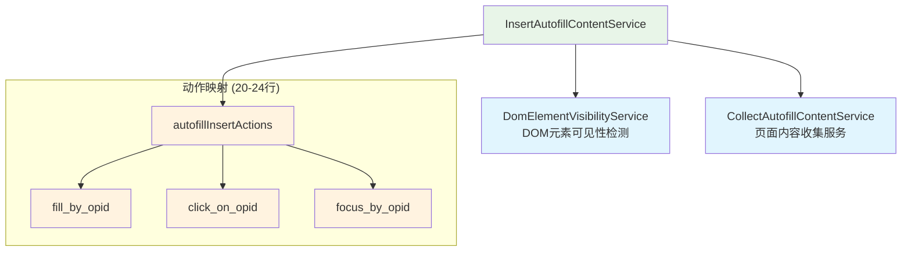
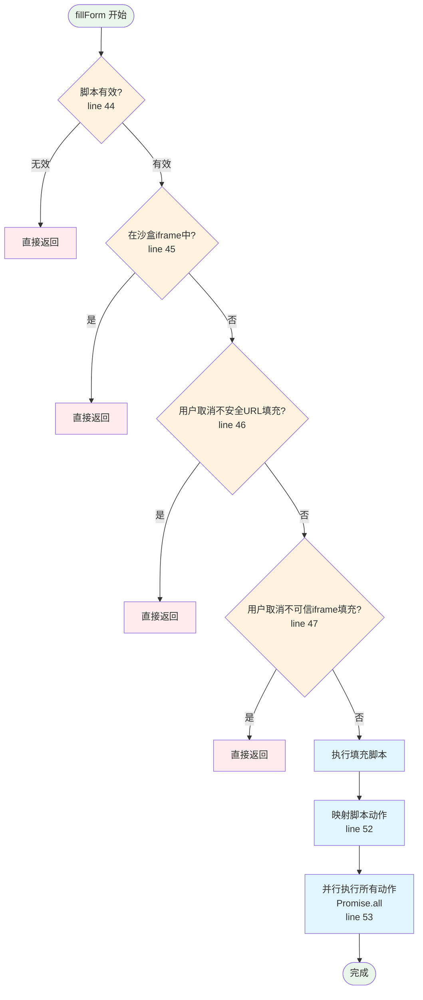
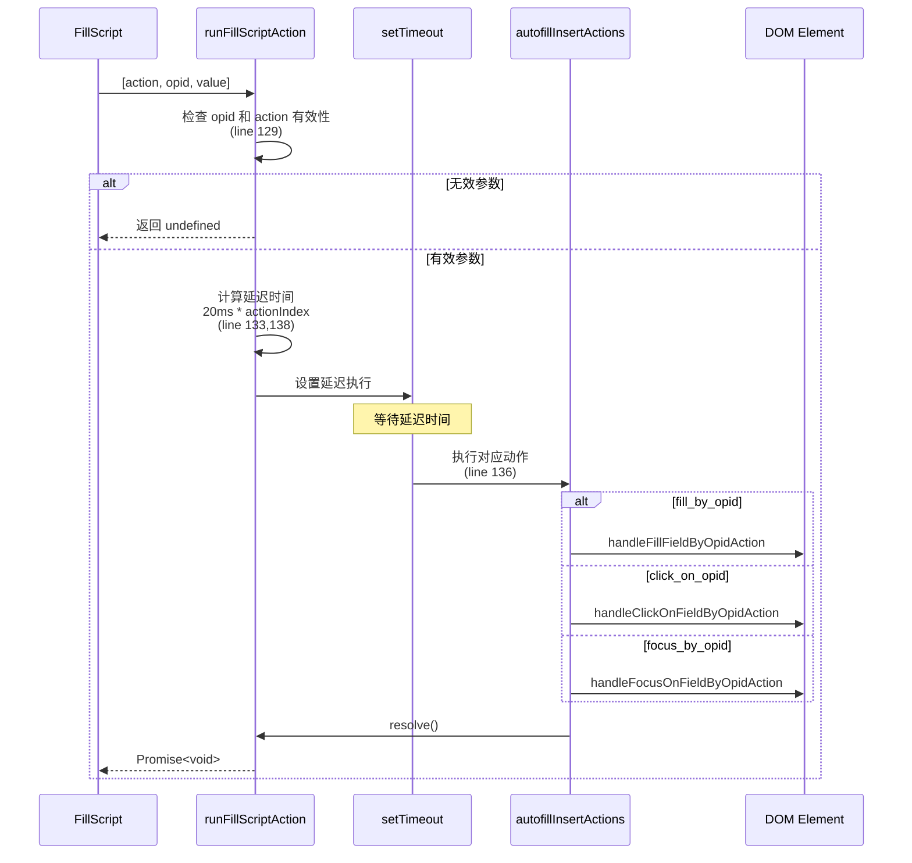
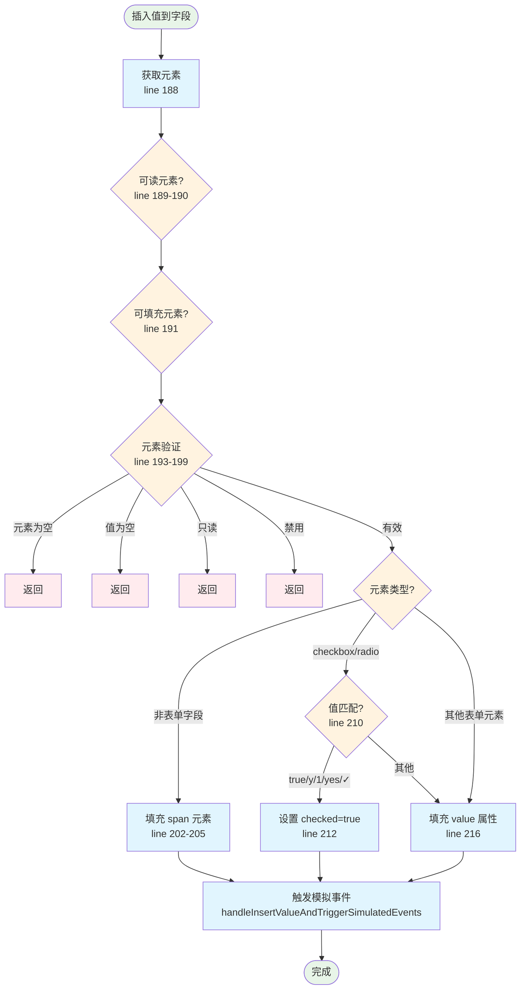
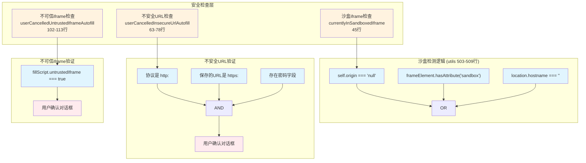
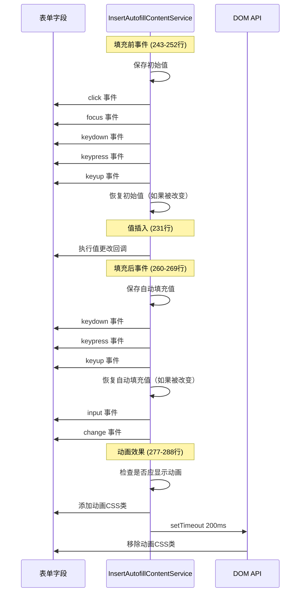
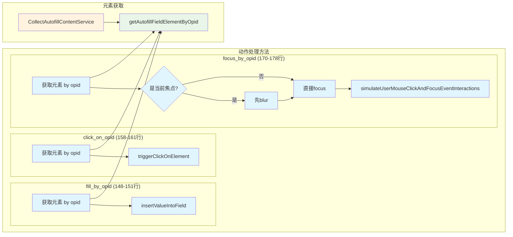
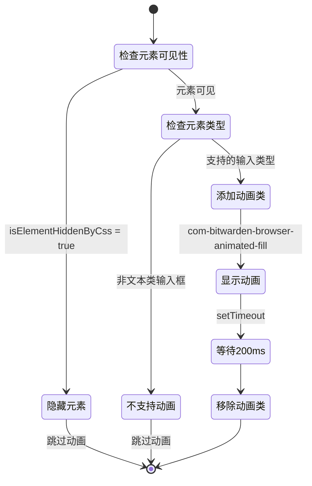
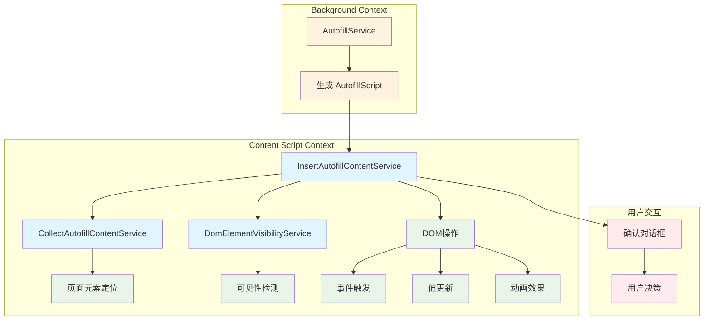

# Bitwarden 自动填充内容插入服务 (InsertAutofillContentService) - 综合分析

## 图表类型说明

本文档中的 Mermaid 图表分为以下几种类型：

- **[代码实现图]** - 直接反映源代码中的实际逻辑和结构
- **[概念架构图]** - 展示设计理念和整体架构，帮助理解但非直接代码映射
- **[数据流图]** - 展示数据在系统中的流动路径

## 📋 概述

`InsertAutofillContentService` 是 Bitwarden 浏览器扩展中负责**执行自动填充操作**的核心服务，位于 `src/autofill/services/insert-autofill-content.service.ts`。它负责将自动填充脚本中的指令转换为实际的 DOM 操作，包括填充表单字段、触发事件和处理用户交互。

**文件规模**：368 行代码
**核心职责**：执行填充脚本、模拟用户交互、安全验证、动画效果

---

## 🏗️ 服务架构概览

### 依赖关系图

**[代码实现图]** - 基于构造函数中的实际依赖注入（30-33行）



---

## 🔄 主要工作流程

### 1. 填充表单主流程

**[代码实现图]** - 基于 `fillForm` 方法实现（42-54行）



### 2. 脚本动作执行流程

**[代码实现图]** - 基于 `runFillScriptAction` 方法（125-140行）



### 3. 字段值插入流程

**[代码实现图]** - 基于 `insertValueIntoField` 方法（188-217行）



---

## 🎯 核心功能模块

### 1. 安全验证机制

**[代码实现图]** - 基于实际的安全检查方法



### 2. 事件模拟系统

**[数据流图]** - 展示事件触发顺序和类型



### 3. 动作处理器详解

**[代码实现图]** - 基于三种动作处理方法的实现



---

## 🔧 复杂和难懂的部分

### 1. 事件模拟的精确控制

**复杂度原因**：

- 需要精确控制事件触发顺序
- 必须保持原始值不被意外修改
- 模拟真实用户交互行为

**关键代码分析**（243-252行）：

```typescript
private triggerPreInsertEventsOnElement(element: FormFieldElement): void {
    const initialElementValue = "value" in element ? element.value : "";

    // 模拟用户交互
    this.simulateUserMouseClickAndFocusEventInteractions(element);
    this.simulateUserKeyboardEventInteractions(element);

    // 保护原始值不被事件处理器改变
    if ("value" in element && initialElementValue !== element.value) {
        element.value = initialElementValue;
    }
}
```

### 2. 动作执行的延迟机制

**复杂度原因**：

- 每个动作按索引递增延迟
- 使用 Promise 链确保顺序
- 避免过快操作导致页面问题

**延迟计算公式**（138行）：

```
延迟时间 = 20ms × actionIndex
```

例如：

- 第1个动作：0ms 延迟
- 第2个动作：20ms 延迟
- 第3个动作：40ms 延迟

### 3. 特殊元素类型处理

**复杂度原因**：

- 不同元素类型需要不同处理方式
- checkbox/radio 的特殊值判断
- span 元素使用 innerText 而非 value

**支持的 checkbox/radio 值**（210行）：

- `true`
- `y`
- `1`
- `yes`
- `✓`

### 4. 动画效果的条件判断

**复杂度原因**：

- 需要检查元素是否被CSS隐藏
- 只对特定类型的输入框显示动画
- 动画时机的精确控制

**支持动画的输入类型**（280行）：

- `email`
- `text`
- `password`
- `number`
- `tel`
- `url`

---

## 🎨 用户体验优化

### 1. 填充动画

**[代码实现图]** - 基于 `triggerFillAnimationOnElement` 方法（277-288行）



### 2. 安全提示对话框

**用户交互流程**：

1. **不安全HTTP页面警告**（73-75行）：
   - 显示警告消息
   - 说明当前页面使用HTTP
   - 询问是否继续填充

2. **不可信iframe警告**（107-110行）：
   - 提示在iframe中填充
   - 显示当前域名
   - 让用户确认操作

---

## 🔐 安全考虑

### 1. 沙盒环境检测

- 检查 `self.origin === "null"`
- 检查 `frameElement` 的 sandbox 属性
- 验证 `location.hostname` 是否为空

### 2. HTTPS/HTTP 混合内容保护

- 检测保存的URL是否为HTTPS
- 当前页面是否为HTTP
- 存在密码字段时额外警告

### 3. iframe 安全

- 标记不可信的iframe
- 用户确认机制
- 沙盒iframe自动拒绝

---

## 🔗 组件交互关系

### 服务依赖关系图

**[概念架构图]** - 展示服务在系统中的位置



---

## 📊 性能优化策略

### 1. 并行执行

- 使用 `Promise.all` 并行执行所有填充动作
- 每个动作独立计时，不相互阻塞

### 2. 延迟策略

- 渐进式延迟避免页面阻塞
- 20ms 基础延迟确保稳定性

### 3. 条件检查优化

- 提前返回减少不必要的处理
- 链式验证避免重复检查

---

## 📈 统计数据

### 方法复杂度分析

| 方法名                             | 代码行数 | 复杂度要点               |
| ---------------------------------- | -------- | ------------------------ |
| `fillForm`                         | 13行     | 4个安全检查，1个并行执行 |
| `insertValueIntoField`             | 30行     | 3种元素类型处理          |
| `triggerPreInsertEventsOnElement`  | 10行     | 5个事件触发              |
| `triggerPostInsertEventsOnElement` | 10行     | 5个事件触发              |
| `runFillScriptAction`              | 16行     | 延迟计算与Promise包装    |

### 支持的动作类型

1. **fill_by_opid** - 填充字段值
2. **click_on_opid** - 点击元素
3. **focus_by_opid** - 聚焦元素

### 事件触发序列

1. **预填充**：click → focus → keydown → keypress → keyup
2. **后填充**：keydown → keypress → keyup → input → change

---

## 🚀 改进建议

### 1. 类型安全性

- 文件头部标注需要更新为类型安全（第1-2行）
- 减少 any 类型的使用

### 2. 错误处理

- 增加元素查找失败的错误处理
- 提供更详细的错误日志

### 3. 配置化

- 延迟时间可配置化
- 动画时长可配置化

### 4. 测试覆盖

- 增加事件模拟的单元测试
- 添加不同元素类型的测试用例

---

## 总结

`InsertAutofillContentService` 是一个精心设计的服务，通过以下特点确保了可靠的自动填充体验：

1. **完善的安全机制**：多层安全检查保护用户数据
2. **精确的事件模拟**：模拟真实用户交互，兼容各种网站
3. **优雅的用户体验**：动画效果和延迟策略提升体验
4. **灵活的元素处理**：支持多种表单元素类型

服务虽然代码量不大（368行），但每个功能都经过精心设计，特别是在事件模拟和安全验证方面展现了高度的专业性。通过模块化的设计和清晰的职责分离，该服务为 Bitwarden 的自动填充功能提供了稳定可靠的执行层。
