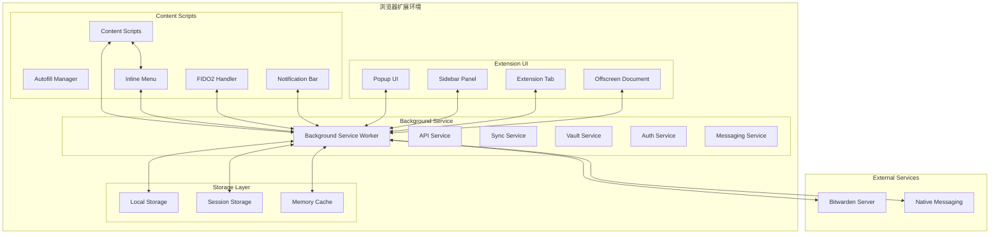
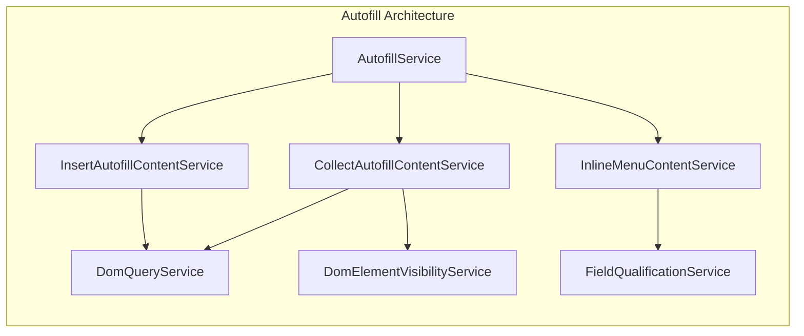
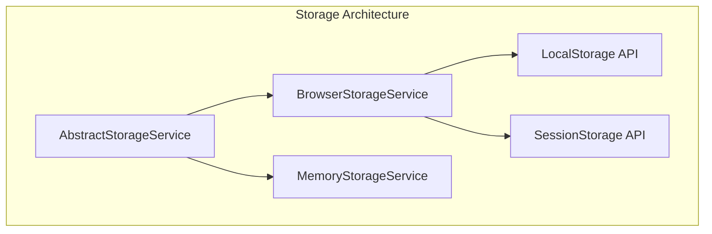
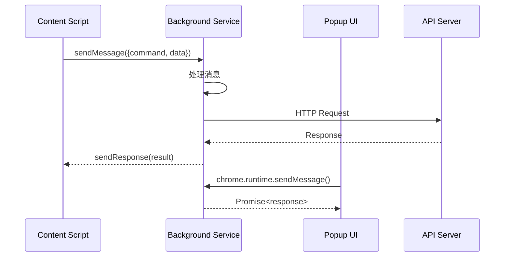
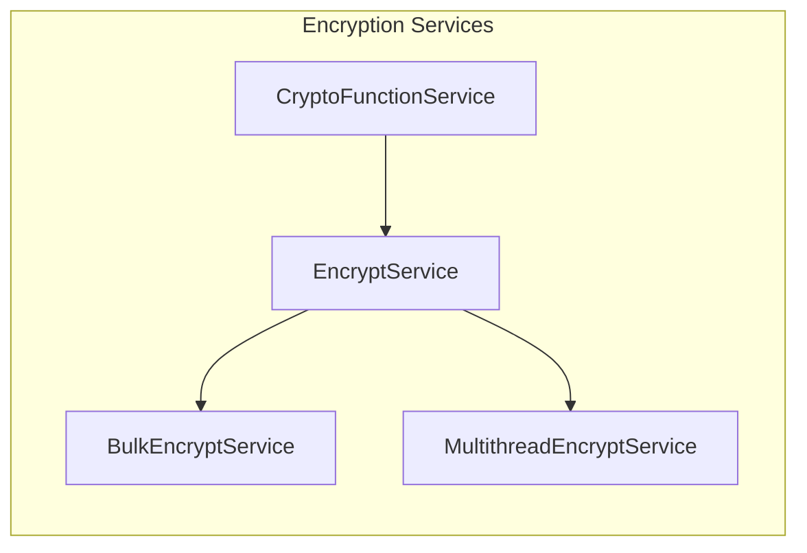
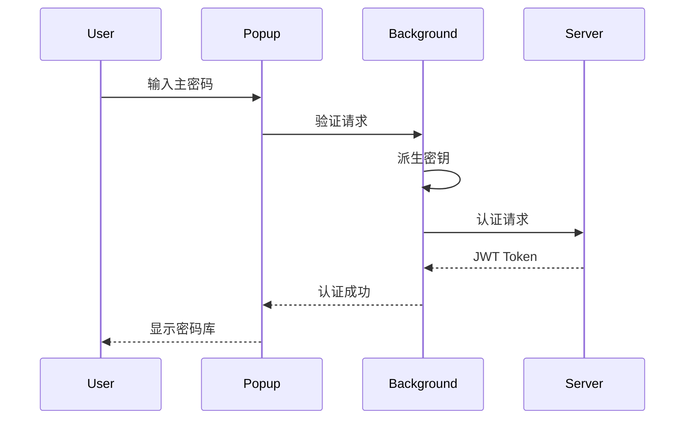
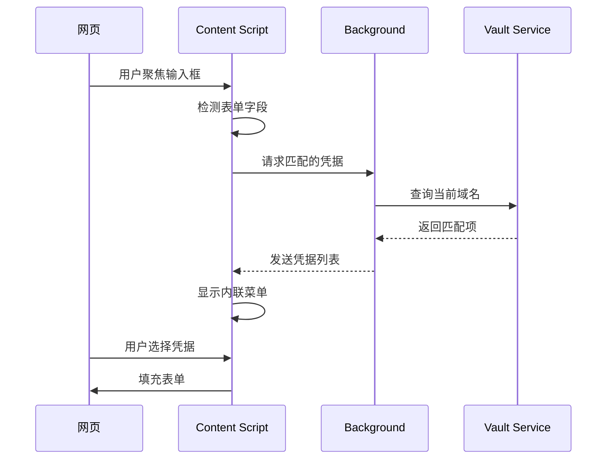
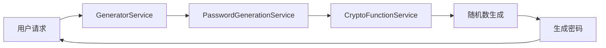
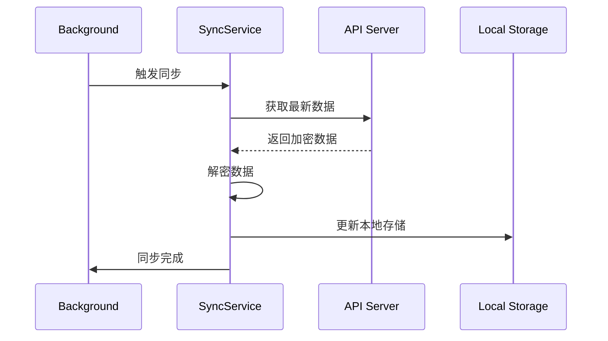

# Bitwarden 浏览器扩展架构文档

## 项目概述

Bitwarden 是一个开源的密码管理浏览器扩展，支持多个浏览器平台（Chrome、Firefox、Edge、Opera、Safari），提供密码存储、自动填充、密码生成等功能。

## 整体架构图



## 核心模块结构

### 1. 目录结构

```
src/
├── _locales/           # 国际化资源文件（61个语言）
├── admin-console/      # 管理控制台相关功能
├── auth/              # 认证相关组件
│   ├── popup/         # 认证相关的弹窗界面
│   └── services/      # 认证服务
├── autofill/          # 自动填充核心功能
│   ├── background/    # 后台自动填充服务
│   ├── content/       # 内容脚本
│   ├── overlay/       # 浮层UI组件
│   │   ├── inline-menu/  # 内联菜单
│   │   └── notifications/ # 通知组件
│   ├── fido2/         # FIDO2/WebAuthn支持
│   └── services/      # 自动填充服务
├── background/        # 后台脚本
│   ├── main.background.ts     # 主后台服务
│   ├── commands.background.ts  # 命令处理
│   ├── idle.background.ts     # 空闲检测
│   ├── runtime.background.ts  # 运行时消息处理
│   └── nativeMessaging.background.ts # 原生消息通信
├── billing/           # 计费相关功能
├── browser/           # 浏览器特定功能封装
├── images/            # 扩展图标和图片资源
├── key-management/    # 密钥管理
├── models/            # 数据模型
├── platform/          # 平台相关功能
│   ├── background.ts  # 后台脚本入口
│   ├── popup/         # 弹窗组件
│   ├── services/      # 平台服务
│   └── offscreen-document/ # 离屏文档（MV3）
├── popup/             # 弹窗主界面
│   ├── app.module.ts  # Angular主模块
│   ├── app.component.ts # 主组件
│   └── services/      # 弹窗服务
├── safari/            # Safari特定代码
├── tools/             # 工具功能
│   └── popup/         # 工具相关UI
│       ├── generator/ # 密码生成器
│       ├── send-v2/   # Send功能
│       └── settings/  # 设置页面
└── types/             # TypeScript类型定义
```

### 2. Manifest 配置

项目支持 Manifest V2 和 V3 两个版本：

#### Manifest V2 (`manifest.json`)
- 使用持久化后台页面
- 支持 `webRequest` API
- 使用 `browser_action`

#### Manifest V3 (`manifest.v3.json`)
- 使用 Service Worker
- 支持 `scripting` API
- 使用 `action` API
- 包含 `offscreen` 权限

### 3. 核心功能模块

#### 3.1 Background Service (后台服务)

**主入口**: `src/platform/background.ts` → `src/background/main.background.ts`

主要职责：
- 管理扩展生命周期
- 处理跨组件通信
- 管理用户会话和认证状态
- 同步数据
- 处理浏览器命令和快捷键

关键服务：
```typescript
// main.background.ts 中初始化的核心服务
- ApiService          // API通信
- TokenService        // Token管理
- AuthService         // 认证服务
- CryptoService       // 加密服务
- VaultService        // 密码库服务
- SyncService         // 同步服务
- AutofillService     // 自动填充服务
- MessagingService    // 消息传递
- StateService        // 状态管理
```

#### 3.2 Content Scripts (内容脚本)

**入口文件**:
- `content/content-message-handler.js` - 消息处理
- `content/trigger-autofill-script-injection.js` - 自动填充注入

主要功能：
- 页面表单检测和分析
- 自动填充触发
- 内联菜单显示
- FIDO2/WebAuthn 支持
- 页面与扩展通信

#### 3.3 Autofill System (自动填充系统)



关键服务：
- `AutofillService` - 自动填充主服务
- `CollectAutofillContentService` - 收集页面表单信息
- `InsertAutofillContentService` - 插入自动填充数据
- `InlineMenuContentService` - 内联菜单管理
- `DomQueryService` - DOM查询服务
- `DomElementVisibilityService` - 元素可见性检测

#### 3.4 Inline Menu (内联菜单)

内联菜单是自动填充的核心UI组件：

```
overlay/inline-menu/
├── abstractions/     # 接口定义
├── content/         # 内容服务
├── iframe-content/  # iframe内容
│   ├── autofill-inline-menu-button-iframe.ts
│   └── autofill-inline-menu-list-iframe.ts
└── pages/          # 菜单页面
    ├── menu-button.html/ts  # 菜单按钮
    └── menu-list.html/ts    # 菜单列表
```

特点：
- 使用独立的 iframe 隔离样式
- 固定定位在输入框附近
- 支持键盘导航
- 响应式显示/隐藏

#### 3.5 Popup UI (弹窗界面)

**技术栈**: Angular + TypeScript

**主模块**: `src/popup/app.module.ts`

核心组件：
```typescript
- AppComponent          // 主应用组件
- TabsV2Component       // 标签导航
- CurrentAccountComponent // 当前账户
- PopupHeaderComponent  // 弹窗头部
- PopupPageComponent    // 页面容器
- CredentialGeneratorComponent // 密码生成器
```

路由结构：
- `/tabs/vault` - 密码库
- `/tabs/generator` - 生成器
- `/tabs/send` - Send功能
- `/tabs/settings` - 设置
- `/autofill` - 自动填充设置
- `/account-security` - 账户安全

#### 3.6 Storage Layer (存储层)



存储策略：
- **LocalStorage**: 持久化数据（加密的密码库、设置）
- **SessionStorage**: 会话数据（临时解密的数据）
- **MemoryStorage**: 运行时缓存（性能优化）

#### 3.7 Platform Services (平台服务)

平台相关服务封装：
```
platform/services/
├── browser-api.service.ts      # 浏览器API封装
├── browser-crypto.service.ts   # 浏览器加密API
├── browser-messaging.service.ts # 消息传递
├── browser-platform-utils.service.ts # 平台工具
└── browser-state.service.ts    # 状态管理
```

### 4. 通信机制

#### 4.1 消息传递架构



#### 4.2 消息类型

主要消息命令（`AutofillMessageCommand`）：
- `collectPageDetails` - 收集页面详情
- `fillForm` - 填充表单
- `openAutofillInlineMenu` - 打开内联菜单
- `closeAutofillInlineMenu` - 关闭内联菜单
- `addNewVaultItem` - 添加新项目
- `updateAutofillInlineMenuPosition` - 更新菜单位置

### 5. 安全机制

#### 5.1 加密架构



#### 5.2 认证流程



#### 5.3 安全特性

- **零知识架构**: 服务器不存储明文密码
- **端到端加密**: 所有数据在客户端加密
- **主密码派生**: 使用 PBKDF2 派生加密密钥
- **内存安全**: 定时清理敏感数据
- **CSP策略**: 严格的内容安全策略

### 6. 浏览器兼容性

#### 6.1 跨浏览器支持

```javascript
// webpack.config.js 配置
const browser = process.env.BROWSER ?? "chrome";
// 支持: chrome, firefox, edge, opera, safari
```

#### 6.2 特定浏览器处理

- **Chrome/Edge**: 完整支持 MV3
- **Firefox**: 特殊的 sidebar_action，使用 `gecko` 特定设置
- **Safari**: 需要原生消息支持，包含 Swift 代码
- **Opera**: 支持 sidebar_action

### 7. 构建系统

#### 7.1 构建配置

```json
// package.json 脚本
{
  "build:chrome": "MANIFEST_VERSION=3 webpack",
  "build:firefox": "webpack",  // 默认 MV2
  "build:safari": "webpack",
  "build:edge": "MANIFEST_VERSION=3 webpack",
  "build:opera": "MANIFEST_VERSION=3 webpack"
}
```

#### 7.2 Webpack 配置

关键入口点：
```javascript
entry: {
  "popup/polyfills": "./src/popup/polyfills.ts",
  "popup/main": "./src/popup/main.ts",
  "background": "./src/platform/background.ts",
  "content/content-message-handler": "./src/autofill/content/content-message-handler.ts",
  "content/trigger-autofill-script-injection": "./src/autofill/content/trigger-autofill-script-injection.ts",
  "notification/bar": "./src/autofill/notification/bar.ts",
  // ... 更多入口
}
```

### 8. 关键功能流程

#### 8.1 自动填充流程



#### 8.2 密码生成流程



#### 8.3 同步流程



### 9. 性能优化

#### 9.1 优化策略

1. **懒加载**: 按需加载模块和组件
2. **缓存策略**: 多层缓存机制
3. **批量操作**: 减少 API 调用
4. **Web Workers**: 多线程加密（MV3）
5. **虚拟滚动**: 大列表性能优化

#### 9.2 内存管理

```typescript
// 定时清理机制
- VaultTimeoutService  // 超时锁定
- MemoryStorageService // 内存清理
- IdleBackground       // 空闲检测
```

### 10. 开发工具和调试

#### 10.1 开发命令

```bash
# 开发构建
npm run build:watch:chrome

# 生产构建
npm run dist:chrome

# 测试
npm run test
```

#### 10.2 调试技巧

1. **Background调试**: chrome://extensions → 背景页面
2. **Content Script调试**: F12 开发者工具
3. **Popup调试**: 右键检查弹窗
4. **消息追踪**: 使用 `chrome.runtime.onMessage` 监听

## 总结

Bitwarden 浏览器扩展采用了模块化、分层的架构设计，通过 Angular 框架构建 UI，使用 Service Worker（MV3）或持久化后台页面（MV2）处理核心逻辑。整个系统注重安全性、性能和跨浏览器兼容性，通过清晰的消息传递机制实现各组件间的通信，并提供了完善的自动填充、密码管理等功能。

## 架构特点

1. **模块化设计**: 功能模块清晰分离，便于维护和扩展
2. **安全优先**: 端到端加密，零知识架构
3. **跨平台兼容**: 支持主流浏览器，适配不同 Manifest 版本
4. **性能优化**: 多层缓存、懒加载、Web Workers
5. **用户体验**: 内联菜单、快捷键、自动填充等便捷功能