# CollectAutofillContentService 架构详解

## 概述

CollectAutofillContentService 是 Bitwarden 浏览器扩展中负责收集网页表单数据的核心服务。它通过深度扫描 DOM（包括 Shadow DOM）来识别、分析和缓存所有可自动填充的表单字段，是整个自动填充系统的数据基础。

## 在整体架构中的位置

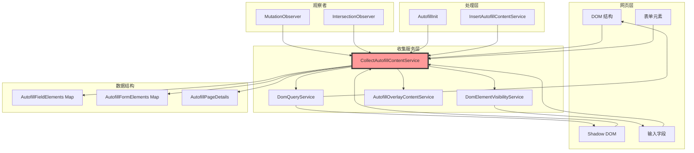
```mermaid
graph TB
    subgraph "网页层"
        DOM[DOM 结构]
        SHADOW[Shadow DOM]
        FORMS[表单元素]
        FIELDS[输入字段]
    end

    subgraph "收集服务层"
        CACS[CollectAutofillContentService]
        DQS[DomQueryService]
        DEVS[DomElementVisibilityService]
        AOCS[AutofillOverlayContentService]
    end

    subgraph "处理层"
        AI[AutofillInit]
        IAS[InsertAutofillContentService]
    end

    subgraph "数据结构"
        AFE[AutofillFieldElements Map]
        AFORME[AutofillFormElements Map]
        APD[AutofillPageDetails]
    end

    subgraph "观察者"
        MO[MutationObserver]
        IO[IntersectionObserver]
    end

    DOM --> CACS
    SHADOW --> CACS
    FORMS --> CACS
    FIELDS --> CACS

    CACS --> DQS
    CACS --> DEVS
    CACS --> AOCS

    DQS --> DOM
    DQS --> SHADOW

    DEVS --> FIELDS

    CACS --> AFE
    CACS --> AFORME
    CACS --> APD

    MO --> CACS
    IO --> CACS

    AI --> CACS
    IAS --> CACS

    style CACS fill:#ff9999,stroke:#333,stroke-width:4px
```

### 事件监听与处理函数详解（focus/input/click/blur/keyup）与 getPageDetails 调用链

本文进一步细化了“覆盖层监听”的事件模型，明确每个事件触发后的具体动作与对应实现位置。

- **监听注册入口**：对每个“合格字段”统一在 `setupFormFieldElementEventListeners` 中注册监听。其中 `select` 只注册 `input`、`focus`。

```352:381:src/autofill/services/autofill-overlay-content.service.ts
private setupFormFieldElementEventListeners(formFieldElement: ElementWithOpId<FormFieldElement>) {
  this.removeCachedFormFieldEventListeners(formFieldElement);

  formFieldElement.addEventListener(
    EVENTS.INPUT,
    this.handleFormFieldInputEvent(formFieldElement),
  );
  formFieldElement.addEventListener(
    EVENTS.FOCUS,
    this.handleFormFieldFocusEvent(formFieldElement),
  );

  if (elementIsSelectElement(formFieldElement)) {
    return;
  }

  formFieldElement.addEventListener(EVENTS.BLUR, this.handleFormFieldBlurEvent);
  formFieldElement.addEventListener(EVENTS.KEYUP, this.handleFormFieldKeyupEvent);
  formFieldElement.addEventListener(
    EVENTS.CLICK,
    this.handleFormFieldClickEvent(formFieldElement),
  );
}
```

- **focus**：若当前处于“正在填充”则忽略；必要时触发后台重新收集页面详情；`select` 会强制关闭内联菜单；否则更新“字段聚焦状态”和“最近聚焦字段定位数据”，并打开内联菜单。

```882:922:src/autofill/services/autofill-overlay-content.service.ts
private handleFormFieldFocusEvent = (formFieldElement: ElementWithOpId<FormFieldElement>) => {
  return this.useEventHandlersMemo(
    () => this.triggerFormFieldFocusedAction(formFieldElement),
    this.getFormFieldHandlerMemoIndex(formFieldElement, EVENTS.FOCUS),
  );
};

private async triggerFormFieldFocusedAction(formFieldElement: ElementWithOpId<FormFieldElement>) {
  if (await this.isFieldCurrentlyFilling()) {
    return;
  }

  if (this.pageDetailsUpdateRequired) {
    await this.sendExtensionMessage("bgCollectPageDetails", {
      sender: "autofillOverlayContentService",
    });
    this.pageDetailsUpdateRequired = false;
  }

  if (elementIsSelectElement(formFieldElement)) {
    await this.sendExtensionMessage("closeAutofillInlineMenu", {
      forceCloseInlineMenu: true,
    });
    return;
  }

  await this.updateIsFieldCurrentlyFocused(true);
  await this.updateMostRecentlyFocusedField(formFieldElement);
  await this.sendExtensionMessage("openAutofillInlineMenu");
}
```

- **input**：仅对“可填写”字段生效。首先保存用户输入并根据上下文给字段打上“资格标记”（用户名/密码/新密码等）；`select` 不控制菜单；其他字段输入时关闭“列表”避免干扰；若值被清空则重新打开菜单。

```732:769:src/autofill/services/autofill-overlay-content.service.ts
private handleFormFieldInputEvent = (formFieldElement: ElementWithOpId<FormFieldElement>) => {
  return this.useEventHandlersMemo(
    debounce(() => this.triggerFormFieldInput(formFieldElement), 100, true),
    this.getFormFieldHandlerMemoIndex(formFieldElement, EVENTS.INPUT),
  );
};

private async triggerFormFieldInput(formFieldElement: ElementWithOpId<FormFieldElement>) {
  if (!elementIsFillableFormField(formFieldElement)) {
    return;
  }

  this.storeModifiedFormElement(formFieldElement);
  if (elementIsSelectElement(formFieldElement)) {
    return;
  }

  await this.sendExtensionMessage("closeAutofillInlineMenu", {
    overlayElement: AutofillOverlayElement.List,
    forceCloseInlineMenu: true,
  });

  if (!formFieldElement?.value) {
    await this.sendExtensionMessage("openAutofillInlineMenu");
  }
}
```

- **click**：若内联菜单按钮或列表已可见则忽略；否则复用“聚焦动作”。

```856:879:src/autofill/services/autofill-overlay-content.service.ts
private handleFormFieldClickEvent = (formFieldElement: ElementWithOpId<FormFieldElement>) => {
  return this.useEventHandlersMemo(
    () => this.triggerFormFieldClickedAction(formFieldElement),
    this.getFormFieldHandlerMemoIndex(formFieldElement, EVENTS.CLICK),
  );
};

private async triggerFormFieldClickedAction(formFieldElement: ElementWithOpId<FormFieldElement>) {
  if ((await this.isInlineMenuButtonVisible()) || (await this.isInlineMenuListVisible())) {
    return;
  }

  await this.triggerFormFieldFocusedAction(formFieldElement);
}
```

- **blur**：标记“字段未聚焦”，并请求检查“内联菜单是否仍在聚焦”。

```672:680:src/autofill/services/autofill-overlay-content.service.ts
private handleFormFieldBlurEvent = () => {
  void this.updateIsFieldCurrentlyFocused(false);
  void this.sendExtensionMessage("checkAutofillInlineMenuFocused");
};
```

- **keyup**：
  - Escape：强制关闭内联菜单
  - Enter：若不是“正在自动填充”，重定位覆盖层
  - ArrowDown：阻止默认并把焦点移动到菜单列表；若列表未开，则先打开再聚焦

```682:710:src/autofill/services/autofill-overlay-content.service.ts
private handleFormFieldKeyupEvent = async (event: globalThis.KeyboardEvent) => {
  const eventCode = event.code;
  if (eventCode === "Escape") {
    void this.sendExtensionMessage("closeAutofillInlineMenu", {
      forceCloseInlineMenu: true,
    });
    return;
  }

  if (eventCode === "Enter" && !(await this.isFieldCurrentlyFilling())) {
    void this.handleOverlayRepositionEvent();
    return;
  }

  if (eventCode === "ArrowDown") {
    event.preventDefault();
    event.stopPropagation();

    void this.focusInlineMenuList();
  }
};
```

```712:730:src/autofill/services/autofill-overlay-content.service.ts
private async focusInlineMenuList() {
  if (this.mostRecentlyFocusedField && !(await this.isInlineMenuListVisible())) {
    this.clearFocusInlineMenuListTimeout();
    await this.updateMostRecentlyFocusedField(this.mostRecentlyFocusedField);
    await this.sendExtensionMessage("openAutofillInlineMenu", { isOpeningFullInlineMenu: true });
    this.focusInlineMenuListTimeout = globalThis.setTimeout(
      () => this.sendExtensionMessage("focusAutofillInlineMenuList"),
      125,
    );
    return;
  }

  void this.sendExtensionMessage("focusAutofillInlineMenuList");
}
```

#### getPageDetails 逐行详解与调用链（结合场景）

下面将 `getPageDetails` 的源码片段用“行内注释”的方式标注解释，确保能与说明逐行对应。

```ts
async getPageDetails(): Promise<AutofillPageDetails> {
  // 首次进入：若还未初始化，设置 MutationObserver（监听 attributes/childList/subtree）
  if (!this.mutationObserver) {
    this.setupMutationObserver();
  }

  // 首次进入：若还未初始化，设置 IntersectionObserver（用于不可见字段的延迟挂载）
  if (!this.intersectionObserver) {
    this.setupIntersectionObserver();
  }

  // 快速返回：近期无 DOM 变动，且之前已判定“没有字段”，直接返回空详情，避免重复扫描
  if (!this.domRecentlyMutated && this.noFieldsFound) {
    return this.getFormattedPageDetails({}, []);
  }

  // 快速返回：近期无 DOM 变动，且已有字段缓存
  if (!this.domRecentlyMutated && this.autofillFieldElements.size) {
    // 仅刷新缓存字段的可见性（必要时为刚变可见的字段补挂覆盖层监听）
    this.updateCachedAutofillFieldVisibility();

    // 使用缓存构造并返回 PageDetails（包含 forms/fields）
    return this.getFormattedPageDetails(
      this.getFormattedAutofillFormsData(),
      this.getFormattedAutofillFieldsData(),
    );
  }

  // 全量扫描：查询所有表单与字段（含 Shadow DOM；字段还包括 span[data-bwautofill]）
  const { formElements, formFieldElements } = this.queryAutofillFormAndFieldElements();

  // 构建表单数据：为每个表单分配 opid，抽取 action/name/id/class/method 等
  const autofillFormsData: Record<string, AutofillForm> =
    this.buildAutofillFormsData(formElements);

  // 构建字段数据：限量（默认最多 100）、按优先级选择；逐个异步构建并过滤无效项
  const autofillFieldsData: AutofillField[] = (
    await this.buildAutofillFieldsData(formFieldElements as FormFieldElement[])
  ).filter((field) => !!field);

  // 排序字段 Map：按 elementNumber 稳定排序，保证渲染与菜单行为一致性
  this.sortAutofillFieldElementsMap();

  // 若本次未发现任何字段，下次可快速返回空结果
  if (!autofillFieldsData.length) {
    this.noFieldsFound = true;
  }

  // 本轮扫描完成，重置“近期变动”标记
  this.domRecentlyMutated = false;

  // 生成页面详情（标题、URL、表单/字段数据、时间戳）
  const pageDetails = this.getFormattedPageDetails(autofillFormsData, autofillFieldsData);

  // 为每个字段挂载覆盖层监听（聚焦、输入、点击、提交等），驱动内联菜单
  this.setupOverlayListeners(pageDetails);

  // 返回页面详情供上层（如 AutofillInit）消费
  return pageDetails;
}
```

主要后续方法职责：
- `setupMutationObserver`：在 `document.documentElement` 上监听 attributes/childList/subtree，进入 `handleMutationObserverMutation`（队列 + 空闲回调 + 防抖），在变动末端调用 `updateAutofillElementsAfterMutation` 以空闲回调再次触发 `getPageDetails` 增量重建。
- `setupIntersectionObserver` 与 `handleFormElementIntersection`：对不可见字段在进入视口时设为可见并挂载覆盖层监听。
- `queryAutofillFormAndFieldElements`：统一收集 `form` + 字段（`input/textarea/select`，以及 `span[data-bwautofill]`）。
- `buildAutofillFormsData`/`getFormattedAutofillFormsData`：构建并映射表单数据（`opid -> form`）。
- `getAutofillFieldElements`：按数量与优先级（避开 checkbox/radio 优先）筛选字段列表。
- `buildAutofillFieldItem`：构建单个字段数据（基础属性、可见性、标签、值、select 选项、aria 等）。若 `span[data-bwautofill]`，仅返回基础数据（非 Fillable）。
- `getFormattedAutofillFieldsData`：从 Map 导出数组。
- `setupOverlayListeners`/`setupOverlayOnField`：逐字段委托给 Overlay 服务挂监听。

场景式时序（初次进入页面）

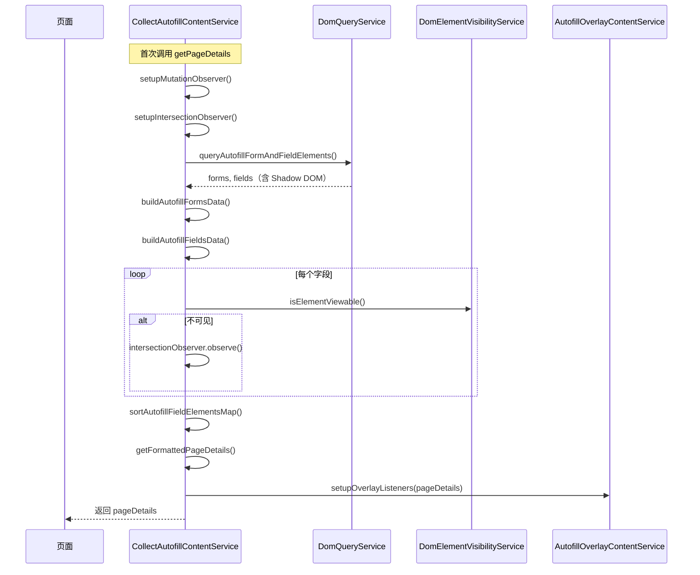
```mermaid
sequenceDiagram
  participant PAGE as 页面
  participant CACS as CollectAutofillContentService
  participant DQS as DomQueryService
  participant DEVS as DomElementVisibilityService
  participant AOCS as AutofillOverlayContentService

  Note over CACS: 首次调用 getPageDetails
  CACS->>CACS: setupMutationObserver()
  CACS->>CACS: setupIntersectionObserver()
  CACS->>DQS: queryAutofillFormAndFieldElements()
  DQS-->>CACS: forms, fields（含 Shadow DOM）
  CACS->>CACS: buildAutofillFormsData()
  CACS->>CACS: buildAutofillFieldsData()
  loop 每个字段
    CACS->>DEVS: isElementViewable()
    alt 不可见
      CACS->>CACS: intersectionObserver.observe()
    end
  end
  CACS->>CACS: sortAutofillFieldElementsMap()
  CACS->>CACS: getFormattedPageDetails()
  CACS->>AOCS: setupOverlayListeners(pageDetails)
  CACS-->>PAGE: 返回 pageDetails
```

场景式时序（DOM 动态变化）

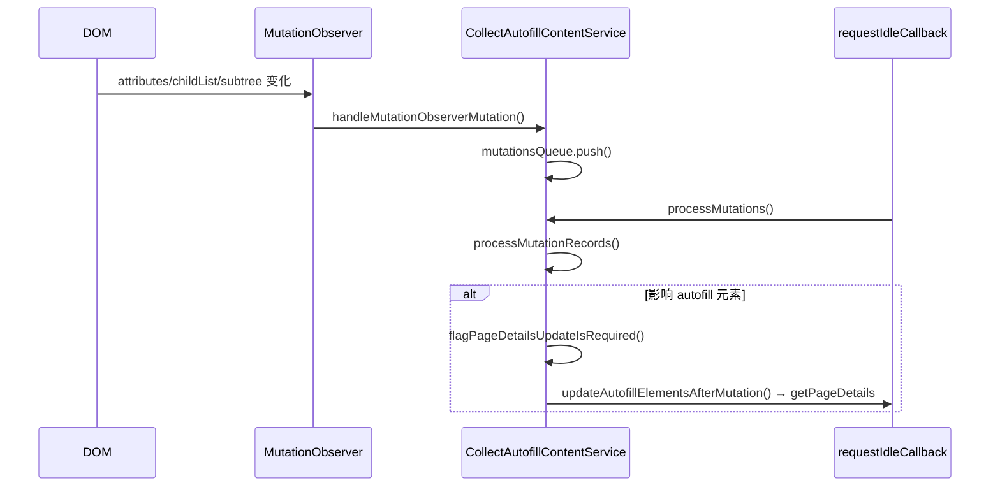
```mermaid
sequenceDiagram
  participant DOM as DOM
  participant MO as MutationObserver
  participant CACS as CollectAutofillContentService
  participant IDLE as requestIdleCallback

  DOM->>MO: attributes/childList/subtree 变化
  MO->>CACS: handleMutationObserverMutation()
  CACS->>CACS: mutationsQueue.push()
  IDLE->>CACS: processMutations()
  CACS->>CACS: processMutationRecords()
  alt 影响 autofill 元素
    CACS->>CACS: flagPageDetailsUpdateIsRequired()
    CACS->>IDLE: updateAutofillElementsAfterMutation() → getPageDetails
  end
```

### 可填充字段判定：为什么使用 `elementIsFillableFormField`

- 定义：可填充（Fillable）被定义为“不是 `span`”。扫描阶段会把 `span[data-bwautofill]` 也纳入字段集合，但它是“伪字段”，不可直接写值。

```197:201:src/autofill/utils/index.ts
export function elementIsFillableFormField(
  formFieldElement: FormFieldElement,
): formFieldElement is FillableFormFieldElement {
  return !elementIsSpanElement(formFieldElement);
}
```

- 主要作用：
  - 输入相关逻辑只对“可填写控件”（`input/textarea/select`）执行，避免对 `span` 这类“伪字段”误操作。
  - 定位/菜单等需要字段尺寸/可视信息的地方会先判断是否 Fillable 与是否 `select`。
  - 读取字段值时，Fillable 取 `value`，非 Fillable（如 `span`）取文本。
  - 自动“插入/填充”严格限制在 Fillable 上。

相关使用示例：

```751:759:src/autofill/services/autofill-overlay-content.service.ts
if (!elementIsFillableFormField(formFieldElement)) {
  return;
}
this.storeModifiedFormElement(formFieldElement);
if (elementIsSelectElement(formFieldElement)) {
  return;
}
```

```942:947:src/autofill/services/autofill-overlay-content.service.ts
if (
  !formFieldElement ||
  !elementIsFillableFormField(formFieldElement) ||
  elementIsSelectElement(formFieldElement)
) {
  return;
}
```

```784:791:src/autofill/services/collect-autofill-content.service.ts
if (!elementIsFillableFormField(element)) {
  const spanTextContent = element.textContent || element.innerText;
  return spanTextContent || "";
}
const elementValue = element.value || "";
```

```202:202:src/autofill/services/insert-autofill-content.service.ts
if (!elementIsFillableFormField(element)) { /* 跳过非可填写元素 */ }
```

### `data-bwautofill` 的来源与生命周期

- 谁设置：扩展不会为页面元素设置 `data-bwautofill`。该属性来自页面本身或第三方脚本，作为“希望参与自动填充识别”的显式标记。
- 扩展如何使用：
  - 扫描时将 `span[data-bwautofill]` 一并纳入字段集合；
  - 但在行为上按“非 Fillable”处理，不参与写值，仅用于上下文（文本获取、布局定位、菜单触发条件等）。

关键代码：

```73:73:src/autofill/services/collect-autofill-content.service.ts
this.formFieldQueryString = `${inputQuery}, textarea:not([data-bwignore]), select:not([data-bwignore]), span[data-bwautofill]`;
```

```906:919:src/autofill/services/collect-autofill-content.service.ts
const nodeIsSpanElementWithAutofillAttribute =
  nodeTagName === "span" && node.hasAttribute("data-bwautofill");
if (nodeIsSpanElementWithAutofillAttribute) {
  return true;
}
...
return this.nonInputFormFieldTags.has(nodeTagName) && !nodeHasBwIgnoreAttribute;
```

- DOM 变化：MutationObserver 监控 DOM 增删与属性变化，`span[data-bwautofill]` 的新增/移除会被自动纳入/移出缓存。

```927:935:src/autofill/services/collect-autofill-content.service.ts
this.mutationObserver = new MutationObserver(this.handleMutationObserverMutation);
this.mutationObserver.observe(document.documentElement, {
  attributes: true,
  childList: true,
  subtree: true,
});
```

- 填充与高亮：填充服务仅对 Fillable 元素执行写值与动画高亮。尽管样式中包含
  `span[data-bwautofill].com-bitwarden-browser-animated-fill` 的选择器，但 `span` 不作为填充目标，不会被添加该类。

综上：`data-bwautofill` 是一种页面侧的“参与扫描”的显式信号；扩展在识别与上下文层面消费它，但通过 `elementIsFillableFormField` 严格区分“可填写控件”与“伪字段”，确保输入、填充与菜单交互的正确性与安全性。


## 核心数据流

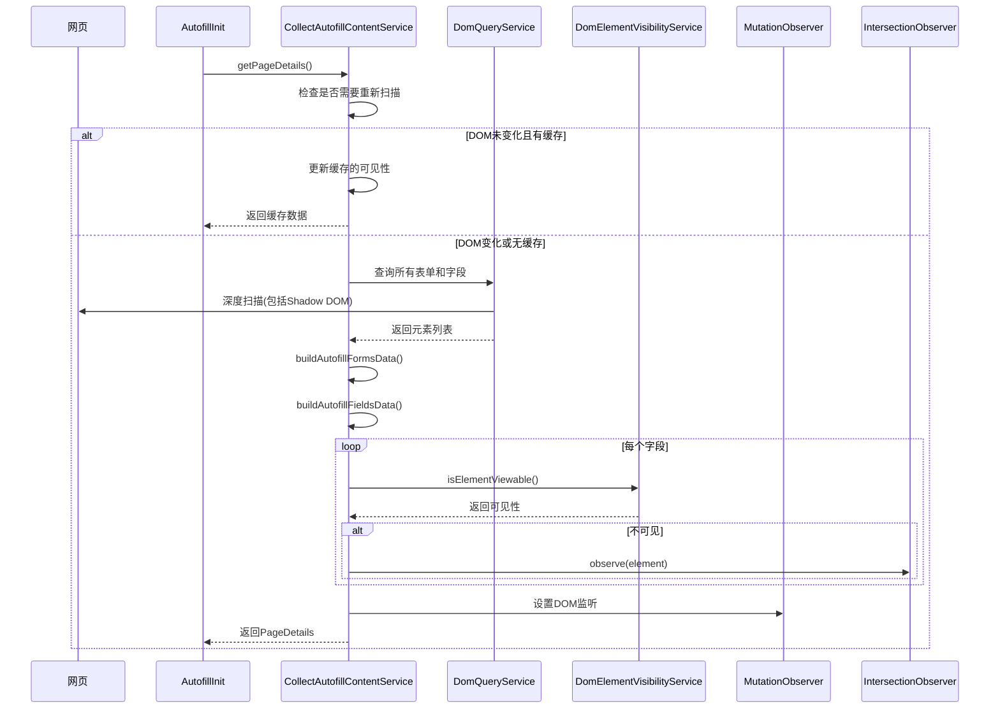
```mermaid
sequenceDiagram
    participant PAGE as 网页
    participant AI as AutofillInit
    participant CACS as CollectAutofillContentService
    participant DQS as DomQueryService
    participant DEVS as DomElementVisibilityService
    participant MO as MutationObserver
    participant IO as IntersectionObserver

    AI->>CACS: getPageDetails()

    CACS->>CACS: 检查是否需要重新扫描

    alt DOM未变化且有缓存
        CACS->>CACS: 更新缓存的可见性
        CACS-->>AI: 返回缓存数据
    else DOM变化或无缓存
        CACS->>DQS: 查询所有表单和字段
        DQS->>PAGE: 深度扫描(包括Shadow DOM)
        DQS-->>CACS: 返回元素列表

        CACS->>CACS: buildAutofillFormsData()
        CACS->>CACS: buildAutofillFieldsData()

        loop 每个字段
            CACS->>DEVS: isElementViewable()
            DEVS-->>CACS: 返回可见性

            alt 不可见
                CACS->>IO: observe(element)
            end
        end

        CACS->>MO: 设置DOM监听
        CACS-->>AI: 返回PageDetails
    end
```

## 核心组件和职责

### 1. 主服务类

```typescript
export class CollectAutofillContentService {
  // 核心数据存储
  private _autofillFormElements: AutofillFormElements = new Map();
  private autofillFieldElements: AutofillFieldElements = new Map();

  // 状态管理
  private noFieldsFound = false;
  private domRecentlyMutated = true;
  private currentLocationHref = "";

  // 观察者
  private intersectionObserver: IntersectionObserver;
  private mutationObserver: MutationObserver;

  // 性能优化
  private mutationsQueue: MutationRecord[][] = [];
  private updateAfterMutationIdleCallback: NodeJS.Timeout | number;

  // 查询配置
  private readonly formFieldQueryString;
  private readonly nonInputFormFieldTags = new Set(["textarea", "select"]);
  private readonly ignoredInputTypes = new Set([
    "hidden", "submit", "reset", "button", "image", "file"
  ]);
}
```

### 2. 数据收集流程

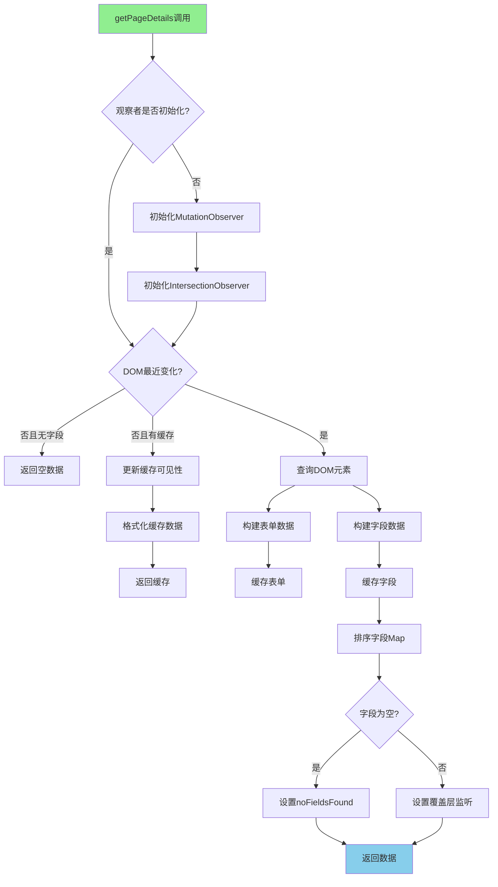
```mermaid
flowchart TB
    START[getPageDetails调用] --> CHECK_OBSERVER{观察者是否初始化?}

    CHECK_OBSERVER -->|否| INIT_MO[初始化MutationObserver]
    CHECK_OBSERVER -->|是| CHECK_MUTATION
    INIT_MO --> INIT_IO[初始化IntersectionObserver]
    INIT_IO --> CHECK_MUTATION

    CHECK_MUTATION{DOM最近变化?}
    CHECK_MUTATION -->|否且无字段| RETURN_EMPTY[返回空数据]
    CHECK_MUTATION -->|否且有缓存| UPDATE_CACHE[更新缓存可见性]
    CHECK_MUTATION -->|是| QUERY_DOM[查询DOM元素]

    UPDATE_CACHE --> FORMAT_CACHE[格式化缓存数据]
    FORMAT_CACHE --> RETURN_CACHE[返回缓存]

    QUERY_DOM --> BUILD_FORMS[构建表单数据]
    QUERY_DOM --> BUILD_FIELDS[构建字段数据]

    BUILD_FORMS --> CACHE_FORMS[缓存表单]
    BUILD_FIELDS --> CACHE_FIELDS[缓存字段]

    CACHE_FIELDS --> SORT[排序字段Map]
    SORT --> CHECK_EMPTY{字段为空?}

    CHECK_EMPTY -->|是| SET_FLAG[设置noFieldsFound]
    CHECK_EMPTY -->|否| SETUP_OVERLAY[设置覆盖层监听]

    SET_FLAG --> RETURN_DATA[返回数据]
    SETUP_OVERLAY --> RETURN_DATA

    style START fill:#90EE90
    style RETURN_DATA fill:#87CEEB
```

### 3. 字段识别和分析

#### 3.1 字段查询策略

```typescript
// 构建查询选择器
constructor() {
  let inputQuery = "input:not([data-bwignore])";
  for (const type of this.ignoredInputTypes) {
    inputQuery += `:not([type="${type}"])`;
  }
  this.formFieldQueryString =
    `${inputQuery}, textarea:not([data-bwignore]),
     select:not([data-bwignore]), span[data-bwautofill]`;
}
```

#### 3.2 字段数据收集

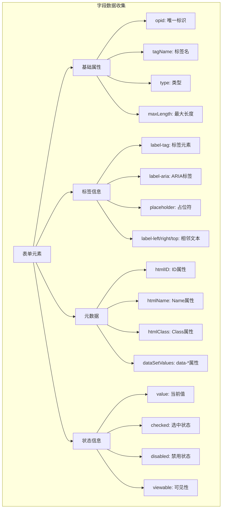
```mermaid
graph TB
    subgraph "字段数据收集"
        ELEMENT[表单元素]

        BASE[基础属性]
        LABEL[标签信息]
        META[元数据]
        STATE[状态信息]

        ELEMENT --> BASE
        ELEMENT --> LABEL
        ELEMENT --> META
        ELEMENT --> STATE

        BASE --> B1[opid: 唯一标识]
        BASE --> B2[tagName: 标签名]
        BASE --> B3[type: 类型]
        BASE --> B4[maxLength: 最大长度]

        LABEL --> L1[label-tag: 标签元素]
        LABEL --> L2[label-aria: ARIA标签]
        LABEL --> L3[placeholder: 占位符]
        LABEL --> L4[label-left/right/top: 相邻文本]

        META --> M1[htmlID: ID属性]
        META --> M2[htmlName: Name属性]
        META --> M3[htmlClass: Class属性]
        META --> M4[dataSetValues: data-*属性]

        STATE --> S1[value: 当前值]
        STATE --> S2[checked: 选中状态]
        STATE --> S3[disabled: 禁用状态]
        STATE --> S4[viewable: 可见性]
    end
```

### 4. 标签匹配算法

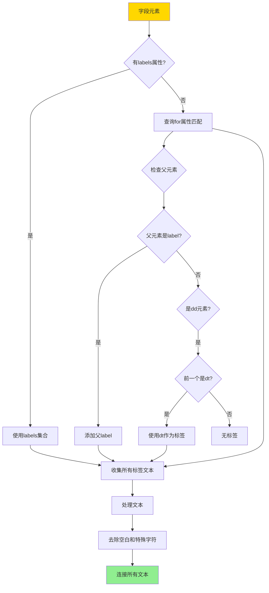
```mermaid
flowchart TB
    FIELD[字段元素] --> CHECK_LABELS{有labels属性?}

    CHECK_LABELS -->|是| USE_LABELS[使用labels集合]
    CHECK_LABELS -->|否| QUERY_FOR[查询for属性匹配]

    QUERY_FOR --> CHECK_PARENT{检查父元素}
    CHECK_PARENT --> IS_LABEL{父元素是label?}

    IS_LABEL -->|是| ADD_PARENT[添加父label]
    IS_LABEL -->|否| CHECK_DD{是dd元素?}

    CHECK_DD -->|是| CHECK_DT{前一个是dt?}
    CHECK_DT -->|是| USE_DT[使用dt作为标签]
    CHECK_DT -->|否| NO_LABEL[无标签]

    USE_LABELS --> COLLECT[收集所有标签文本]
    ADD_PARENT --> COLLECT
    USE_DT --> COLLECT
    QUERY_FOR --> COLLECT

    COLLECT --> PROCESS[处理文本]
    PROCESS --> TRIM[去除空白和特殊字符]
    TRIM --> JOIN[连接所有文本]

    style FIELD fill:#FFD700
    style JOIN fill:#90EE90
```

### 5. DOM 变化监听机制

#### 5.1 MutationObserver 处理

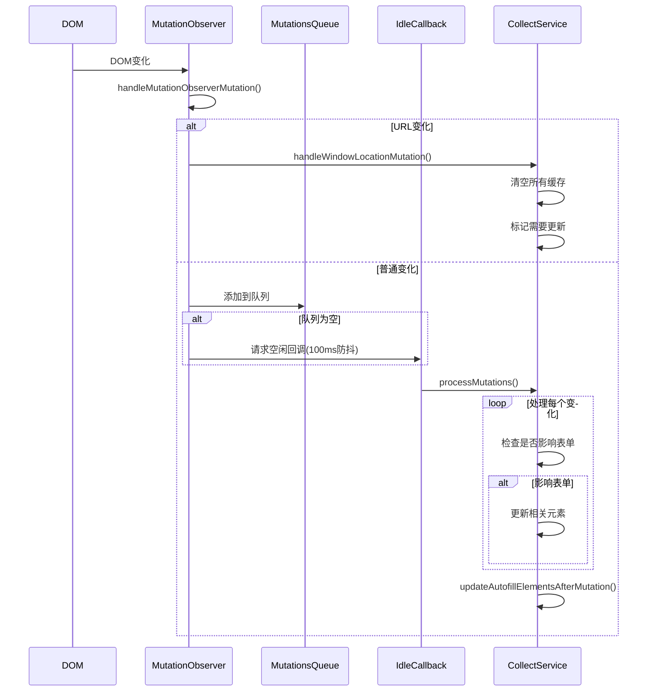
```mermaid
sequenceDiagram
    participant DOM as DOM
    participant MO as MutationObserver
    participant QUEUE as MutationsQueue
    participant IDLE as IdleCallback
    participant CACS as CollectService

    DOM->>MO: DOM变化
    MO->>MO: handleMutationObserverMutation()

    alt URL变化
        MO->>CACS: handleWindowLocationMutation()
        CACS->>CACS: 清空所有缓存
        CACS->>CACS: 标记需要更新
    else 普通变化
        MO->>QUEUE: 添加到队列

        alt 队列为空
            MO->>IDLE: 请求空闲回调(100ms防抖)
        end

        IDLE->>CACS: processMutations()

        loop 处理每个变化
            CACS->>CACS: 检查是否影响表单
            alt 影响表单
                CACS->>CACS: 更新相关元素
            end
        end

        CACS->>CACS: updateAutofillElementsAfterMutation()
    end
```

#### 5.2 变化类型处理

```typescript
private processMutationRecord(mutation: MutationRecord) {
  const { type, target, attributeName } = mutation;

  switch (type) {
    case "childList":
      // 处理节点添加/删除
      this.processChildListMutation(mutation);
      break;

    case "attributes":
      // 处理属性变化
      if (this.isAutofillElementAttribute(attributeName)) {
        this.processAttributeMutation(target, attributeName);
      }
      break;
  }
}
```

### 6. 可见性检测系统

#### 6.1 IntersectionObserver 策略

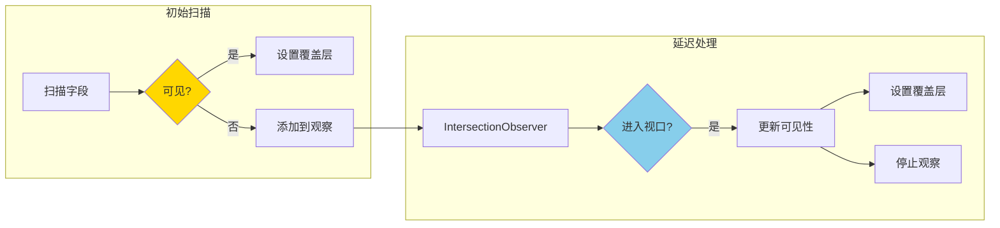
```mermaid
flowchart LR
    subgraph "初始扫描"
        SCAN[扫描字段] --> CHECK_VIEW{可见?}
        CHECK_VIEW -->|是| SETUP[设置覆盖层]
        CHECK_VIEW -->|否| OBSERVE[添加到观察]
    end

    subgraph "延迟处理"
        OBSERVE --> IO[IntersectionObserver]
        IO --> INTERSECT{进入视口?}
        INTERSECT -->|是| UPDATE[更新可见性]
        UPDATE --> SETUP2[设置覆盖层]
        UPDATE --> UNOBSERVE[停止观察]
    end

    style CHECK_VIEW fill:#FFD700
    style INTERSECT fill:#87CEEB
```

#### 6.2 可见性更新

```typescript
private handleFormElementIntersection = async (entries: IntersectionObserverEntry[]) => {
  for (const entry of entries) {
    const formFieldElement = entry.target as ElementWithOpId<FormFieldElement>;
    const cachedField = this.autofillFieldElements.get(formFieldElement);

    if (!cachedField) {
      this.intersectionObserver.unobserve(entry.target);
      continue;
    }

    const isViewable = await this.domElementVisibilityService.isElementViewable(formFieldElement);
    if (isViewable) {
      cachedField.viewable = true;
      this.setupOverlayOnField(formFieldElement, cachedField);
      this.intersectionObserver.unobserve(entry.target);
    }
  }
};
```

#### 6.3 初始化跳过集合 `elementInitializingIntersectionObserver`

用于配合 IntersectionObserver，在“首次将不可见字段加入观察列表”时跳过首次回调，避免误触发可见性处理。严格依据源码如下：

- 当字段首次构建且当前不可见时：加入集合并开始观察。

```360:379:src/autofill/services/collect-autofill-content.service.ts
const autofillFieldBase = { ... , viewable: await this.domElementVisibilityService.isElementViewable(element), ... };

if (!autofillFieldBase.viewable) {
  this.elementInitializingIntersectionObserver.add(element);
  this.intersectionObserver?.observe(element);
}
```

- 在 IntersectionObserver 回调中：若命中该集合，删除并跳过本次处理（首次回调忽略）。

```1342:1349:src/autofill/services/collect-autofill-content.service.ts
private handleFormElementIntersection = async (entries: IntersectionObserverEntry[]) => {
  for (let entryIndex = 0; entryIndex < entries.length; entryIndex++) {
    const entry = entries[entryIndex];
    const formFieldElement = entry.target as ElementWithOpId<FormFieldElement>;
    if (this.elementInitializingIntersectionObserver.has(formFieldElement)) {
      this.elementInitializingIntersectionObserver.delete(formFieldElement);
      continue;
    }
    // ...
```

- 对于后续回调（已不在集合）：才进行真正的可见性判断与覆盖层挂载。

```1351:1366:src/autofill/services/collect-autofill-content.service.ts
const cachedAutofillFieldElement = this.autofillFieldElements.get(formFieldElement);
if (!cachedAutofillFieldElement) {
  this.intersectionObserver.unobserve(entry.target);
  continue;
}

const isViewable = await this.domElementVisibilityService.isElementViewable(formFieldElement);
if (!isViewable) {
  continue;
}

cachedAutofillFieldElement.viewable = true;
this.setupOverlayOnField(formFieldElement, cachedAutofillFieldElement);
this.intersectionObserver?.unobserve(entry.target);
```

使用场景举例：
- 页面初次加载时，折叠面板内的输入框被扫描到但不可见。该元素会被加入 `elementInitializingIntersectionObserver` 并被 `observe`；随即触发的首次回调会被忽略。待用户展开面板或滚动后，元素再次触发回调，此时才检查为可见并挂载覆盖层监听。


## 复杂和难懂的部分

### 1. Shadow DOM 支持

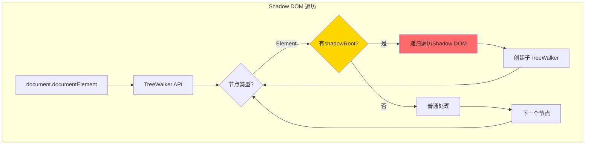
```mermaid
graph TB
    subgraph "Shadow DOM 遍历"
        ROOT[document.documentElement]
        WALKER[TreeWalker API]

        ROOT --> WALKER
        WALKER --> CHECK{节点类型?}

        CHECK -->|Element| SHADOW_CHECK{有shadowRoot?}
        SHADOW_CHECK -->|是| TRAVERSE_SHADOW[递归遍历Shadow DOM]
        SHADOW_CHECK -->|否| NORMAL[普通处理]

        TRAVERSE_SHADOW --> SUB_WALKER[创建子TreeWalker]
        SUB_WALKER --> CHECK

        NORMAL --> NEXT[下一个节点]
        NEXT --> CHECK
    end

    style SHADOW_CHECK fill:#FFD700
    style TRAVERSE_SHADOW fill:#FF6B6B
```

### 2. 字段优先级系统

```typescript
private getAutofillFieldElements(
  fieldsLimit?: number,
  previouslyFoundFormFieldElements?: FormFieldElement[]
): FormFieldElement[] {
  // 优先级分类
  const priorityFormFields: FormFieldElement[] = [];
  const unimportantFormFields: FormFieldElement[] = [];
  const unimportantFieldTypesSet = new Set(["checkbox", "radio"]);

  for (const element of formFieldElements) {
    if (priorityFormFields.length >= fieldsLimit) {
      return priorityFormFields;
    }

    const fieldType = this.getPropertyOrAttribute(element, "type")?.toLowerCase();

    // 复选框和单选框优先级较低
    if (unimportantFieldTypesSet.has(fieldType)) {
      unimportantFormFields.push(element);
      continue;
    }

    priorityFormFields.push(element);
  }

  // 补充低优先级字段
  const numberUnimportantFieldsToInclude = fieldsLimit - priorityFormFields.length;
  for (let index = 0; index < numberUnimportantFieldsToInclude; index++) {
    priorityFormFields.push(unimportantFormFields[index]);
  }

  return priorityFormFields;
}
```

### 3. 标签文本提取复杂性

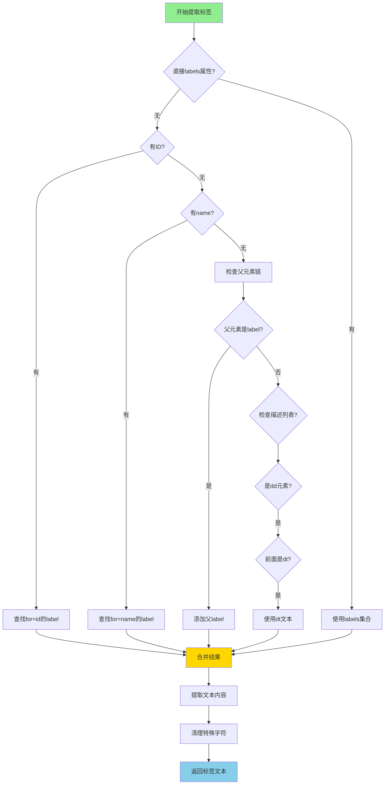
```mermaid
flowchart TB
    START[开始提取标签] --> DIRECT{直接labels属性?}

    DIRECT -->|有| USE_DIRECT[使用labels集合]
    DIRECT -->|无| QUERY_ID{有ID?}

    QUERY_ID -->|有| FIND_FOR_ID[查找for=id的label]
    QUERY_ID -->|无| QUERY_NAME{有name?}

    QUERY_NAME -->|有| FIND_FOR_NAME[查找for=name的label]
    QUERY_NAME -->|无| CHECK_PARENT[检查父元素链]

    FIND_FOR_ID --> MERGE[合并结果]
    FIND_FOR_NAME --> MERGE
    CHECK_PARENT --> PARENT_LABEL{父元素是label?}

    PARENT_LABEL -->|是| ADD_PARENT[添加父label]
    PARENT_LABEL -->|否| CHECK_DESC{检查描述列表?}

    CHECK_DESC --> IS_DD{是dd元素?}
    IS_DD -->|是| PREV_DT{前面是dt?}
    PREV_DT -->|是| USE_DT[使用dt文本]

    ADD_PARENT --> MERGE
    USE_DT --> MERGE
    USE_DIRECT --> MERGE

    MERGE --> EXTRACT_TEXT[提取文本内容]
    EXTRACT_TEXT --> CLEAN[清理特殊字符]
    CLEAN --> RESULT[返回标签文本]

    style START fill:#90EE90
    style RESULT fill:#87CEEB
    style MERGE fill:#FFD700
```

### 4. 值截断和安全处理

```typescript
private getElementValue(element: FormFieldElement): string {
  // 特殊元素处理
  if (elementIsSelectElement(element)) {
    return this.getSelectElementOptions(element as HTMLSelectElement);
  }

  let elementValue = element.value || "";

  // 隐藏字段的值截断（安全考虑）
  if (this.getAttributeLowerCase(element, "type") === "hidden") {
    const inputValueMaxLength = 30;
    const exceedsMaxLength = elementValue.length > inputValueMaxLength;

    return exceedsMaxLength
      ? `${elementValue.substring(0, inputValueMaxLength)}...SNIPPED`
      : elementValue;
  }

  return elementValue;
}
```

### 5. 属性更新的复杂映射

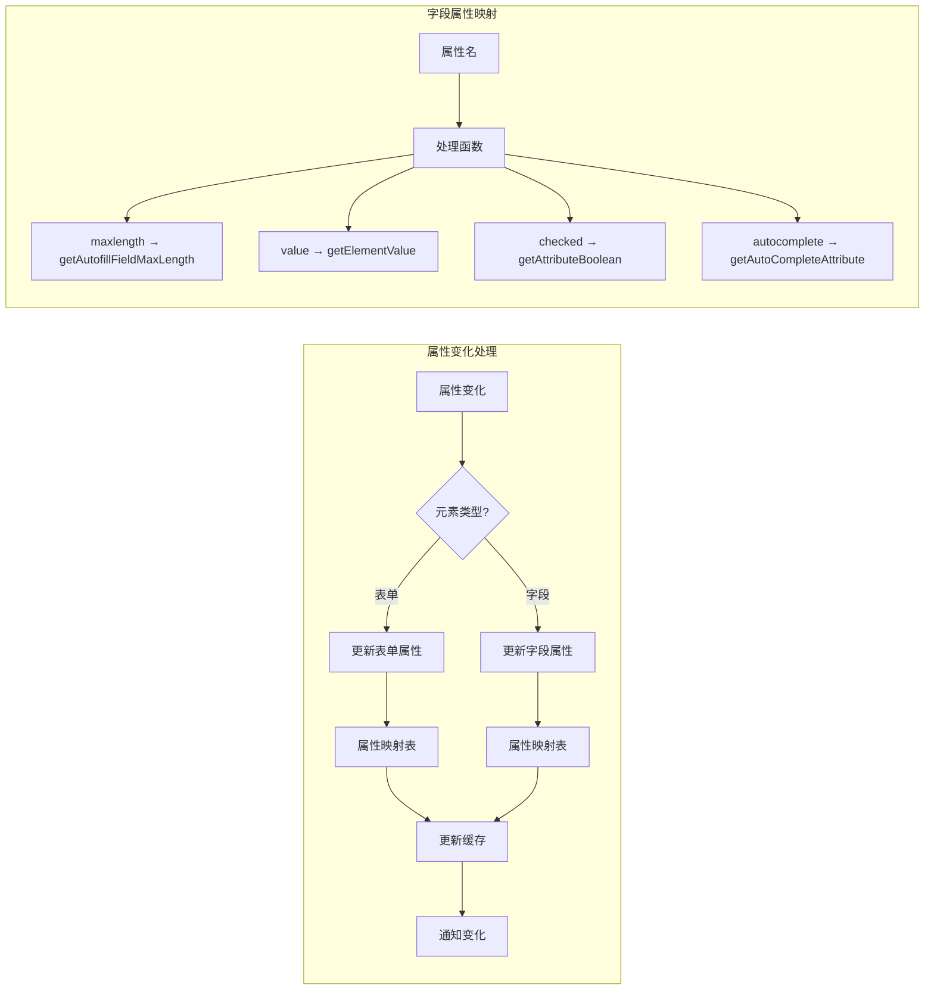
```mermaid
graph LR
    subgraph "属性变化处理"
        MUTATION[属性变化] --> TYPE{元素类型?}

        TYPE -->|表单| FORM_UPDATE[更新表单属性]
        TYPE -->|字段| FIELD_UPDATE[更新字段属性]

        FORM_UPDATE --> FORM_MAP[属性映射表]
        FIELD_UPDATE --> FIELD_MAP[属性映射表]

        FORM_MAP --> UPDATE_CACHE[更新缓存]
        FIELD_MAP --> UPDATE_CACHE

        UPDATE_CACHE --> NOTIFY[通知变化]
    end

    subgraph "字段属性映射"
        ATTRS[属性名] --> HANDLERS[处理函数]

        HANDLERS --> H1[maxlength → getAutofillFieldMaxLength]
        HANDLERS --> H2[value → getElementValue]
        HANDLERS --> H3[checked → getAttributeBoolean]
        HANDLERS --> H4[autocomplete → getAutoCompleteAttribute]
    end
```

## 性能优化策略

### 1. 缓存机制

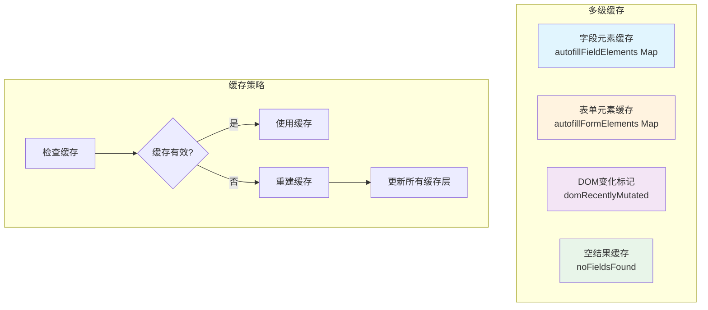
```mermaid
graph TB
    subgraph "多级缓存"
        L1[字段元素缓存<br/>autofillFieldElements Map]
        L2[表单元素缓存<br/>autofillFormElements Map]
        L3[DOM变化标记<br/>domRecentlyMutated]
        L4[空结果缓存<br/>noFieldsFound]
    end

    subgraph "缓存策略"
        CHECK[检查缓存] --> VALID{缓存有效?}
        VALID -->|是| USE[使用缓存]
        VALID -->|否| REBUILD[重建缓存]

        REBUILD --> UPDATE[更新所有缓存层]
    end

    style L1 fill:#e1f5fe
    style L2 fill:#fff3e0
    style L3 fill:#f3e5f5
    style L4 fill:#e8f5e9
```

### 2. 防抖和节流

```typescript
// MutationObserver 防抖处理
if (!this.mutationsQueue.length) {
  requestIdleCallbackPolyfill(
    debounce(this.processMutations, 100),  // 100ms 防抖
    { timeout: 500 }  // 最大500ms延迟
  );
}

// 更新延迟处理
private updateAutofillElementsAfterMutation() {
  cancelIdleCallbackPolyfill(this.updateAfterMutationIdleCallback);

  this.updateAfterMutationIdleCallback = requestIdleCallbackPolyfill(
    () => {
      this.domRecentlyMutated = false;
      this.updateCachedAutofillFieldVisibility();
    },
    { timeout: this.updateAfterMutationTimeout }  // 1000ms
  );
}
```

### 3. 限制扫描深度

```typescript
// 限制返回字段数量
const autofillFieldElements = this.getAutofillFieldElements(100, formFieldElements);

// 优先处理重要字段
if (priorityFormFields.length >= fieldsLimit) {
  return priorityFormFields;  // 提前返回
}
```

## 与其他服务的交互

### 1. DomQueryService 集成

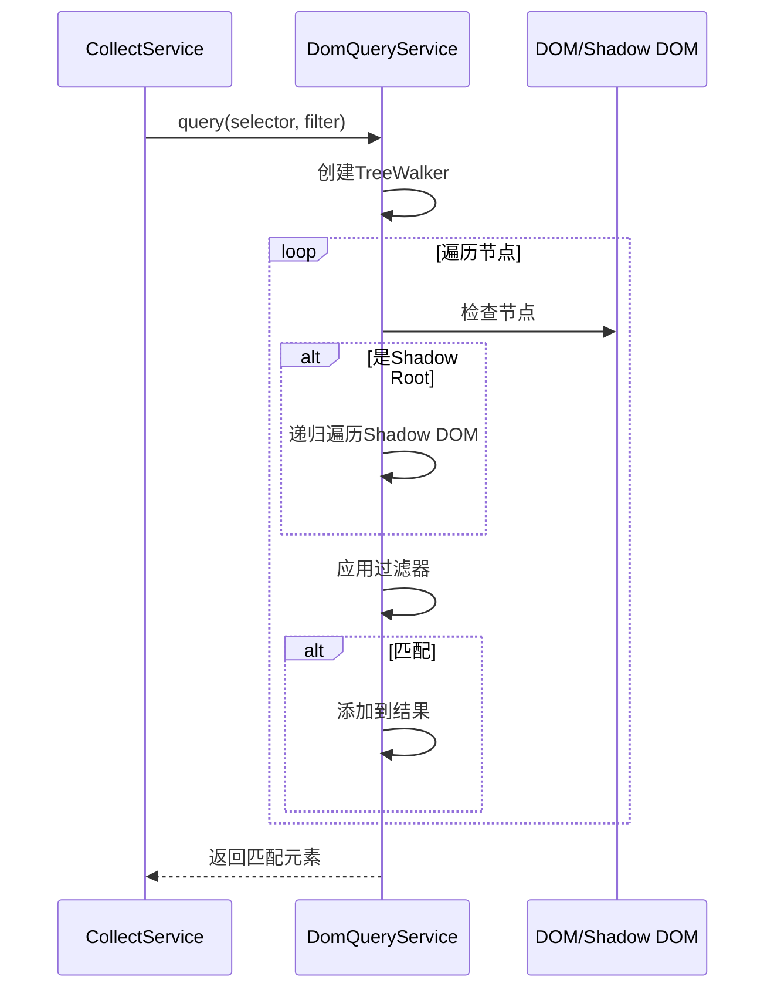
```mermaid
sequenceDiagram
    participant CACS as CollectService
    participant DQS as DomQueryService
    participant DOM as DOM/Shadow DOM

    CACS->>DQS: query(selector, filter)
    DQS->>DQS: 创建TreeWalker

    loop 遍历节点
        DQS->>DOM: 检查节点
        alt 是Shadow Root
            DQS->>DQS: 递归遍历Shadow DOM
        end

        DQS->>DQS: 应用过滤器
        alt 匹配
            DQS->>DQS: 添加到结果
        end
    end

    DQS-->>CACS: 返回匹配元素
```

### 2. DomElementVisibilityService 协作

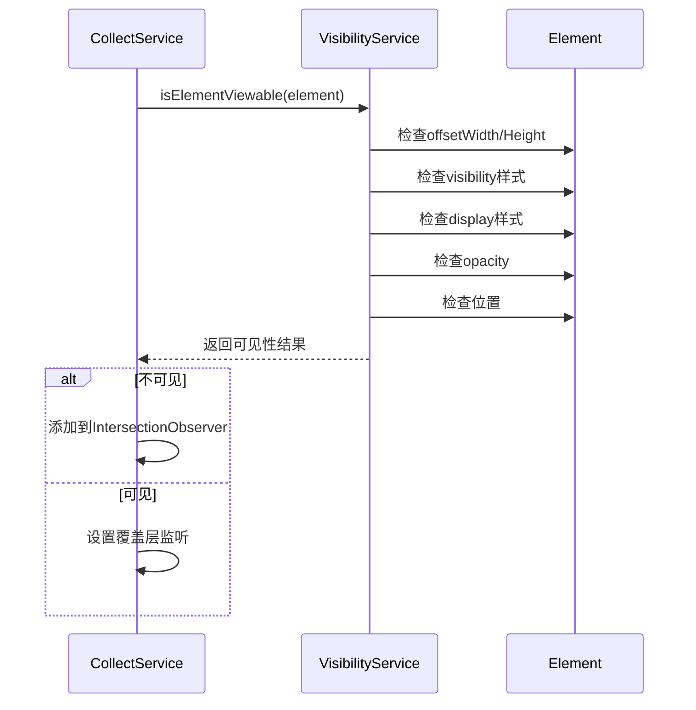
```mermaid
sequenceDiagram
    participant CACS as CollectService
    participant DEVS as VisibilityService
    participant ELEM as Element

    CACS->>DEVS: isElementViewable(element)

    DEVS->>ELEM: 检查offsetWidth/Height
    DEVS->>ELEM: 检查visibility样式
    DEVS->>ELEM: 检查display样式
    DEVS->>ELEM: 检查opacity
    DEVS->>ELEM: 检查位置

    DEVS-->>CACS: 返回可见性结果

    alt 不可见
        CACS->>CACS: 添加到IntersectionObserver
    else 可见
        CACS->>CACS: 设置覆盖层监听
    end
```

### 3. AutofillOverlayContentService 通信

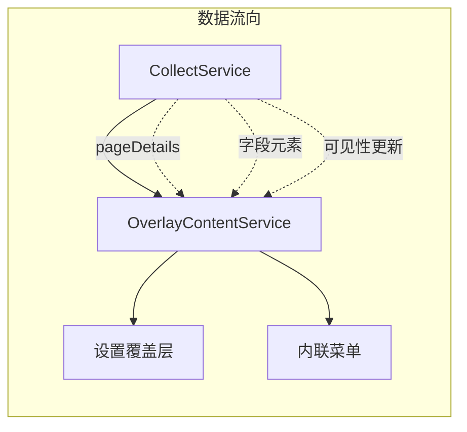
```mermaid
graph LR
    subgraph "数据流向"
        CACS[CollectService] --> AOCS[OverlayContentService]

        AOCS --> OVERLAY[设置覆盖层]
        AOCS --> MENU[内联菜单]

        CACS -.->|pageDetails| AOCS
        CACS -.->|字段元素| AOCS
        CACS -.->|可见性更新| AOCS
    end
```

## 错误处理和边界情况

### 1. 异常元素处理

```typescript
// 跳过提交按钮内的字段
if (element.closest("button[type='submit']")) {
  return null;
}

// 处理特殊的span元素
if (elementIsSpanElement(element)) {
  // 只返回基础数据，不收集标签信息
  return autofillFieldBase;
}

// 隐藏字段不收集标签
if (elementType === "hidden") {
  // 跳过标签收集
}
```

### 2. 内存泄漏防护

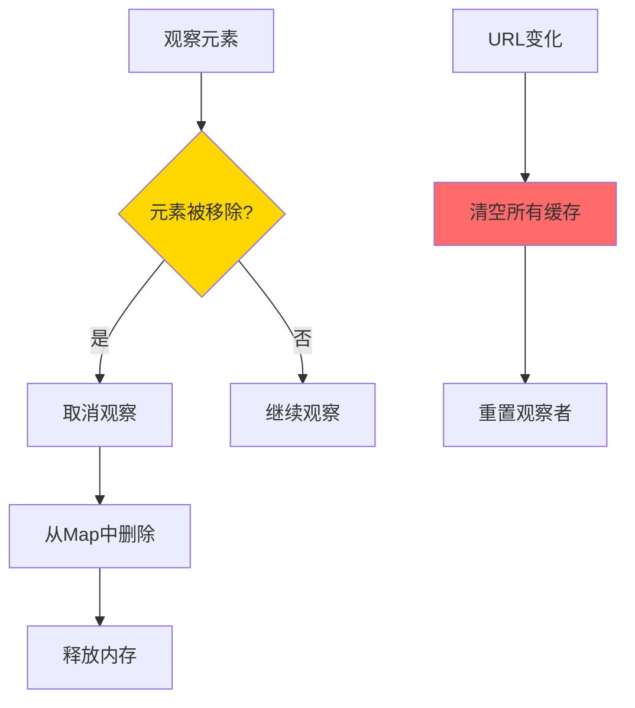
```mermaid
flowchart TB
    OBSERVE[观察元素] --> REMOVE{元素被移除?}

    REMOVE -->|是| UNOBSERVE[取消观察]
    REMOVE -->|否| CONTINUE[继续观察]

    UNOBSERVE --> CLEAN_MAP[从Map中删除]
    CLEAN_MAP --> FREE[释放内存]

    URL_CHANGE[URL变化] --> CLEAR_ALL[清空所有缓存]
    CLEAR_ALL --> RESET[重置观察者]

    style REMOVE fill:#FFD700
    style CLEAR_ALL fill:#FF6B6B
```

## 调试和监控

### 1. 关键日志点

```typescript
// 字段重复警告
if (fieldElementsWithOpid.length > 1) {
  console.warn(`More than one element found with opid ${opid}`);
}

// Shadow DOM 检测
if (!this.domQueryService.pageContainsShadowDomElements()) {
  this.checkPageContainsShadowDom();
}

// 性能监控点
requestIdleCallbackPolyfill(
  debounce(this.processMutations, 100),
  { timeout: 500 }  // 记录超时情况
);
```

### 2. 数据验证

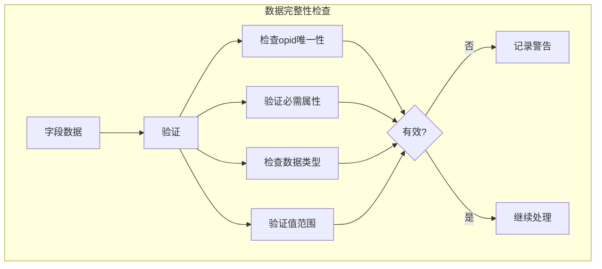
```mermaid
graph TB
    subgraph "数据完整性检查"
        FIELD[字段数据] --> VALIDATE[验证]

        VALIDATE --> V1[检查opid唯一性]
        VALIDATE --> V2[验证必需属性]
        VALIDATE --> V3[检查数据类型]
        VALIDATE --> V4[验证值范围]

        V1 --> RESULT{有效?}
        V2 --> RESULT
        V3 --> RESULT
        V4 --> RESULT

        RESULT -->|否| LOG[记录警告]
        RESULT -->|是| PROCESS[继续处理]
    end
```

## 总结

CollectAutofillContentService 是一个高度复杂的服务，具有以下特点：

### 核心特性
1. **深度DOM扫描**：支持Shadow DOM，递归遍历所有可能的表单元素
2. **智能缓存**：多级缓存机制，避免重复扫描
3. **实时监听**：MutationObserver和IntersectionObserver双重监听
4. **性能优化**：防抖、节流、空闲回调等多种优化策略
5. **全面的数据收集**：收集字段的所有相关属性和上下文信息

### 技术挑战
1. **Shadow DOM处理**：需要特殊的遍历策略
2. **动态内容**：实时响应DOM变化
3. **性能平衡**：在完整性和性能之间取得平衡
4. **标签匹配**：复杂的标签查找和提取逻辑
5. **可见性检测**：准确判断元素是否可见

### 最佳实践
1. 使用Map缓存元素引用，快速查找
2. 延迟处理非关键更新
3. 优先处理重要字段类型
4. 实施防抖和节流策略
5. 清理不再需要的观察者

这个服务是整个自动填充系统的数据基础，其准确性和性能直接影响用户体验。


### 覆盖层监听的作用流程

为什么要设置覆盖层监听？

  设置覆盖层监听的主要目的是为了实现内联菜单（Inline Menu）功能。当字段不为空（即页面上存在可填充的表单字段）时，系统需要：
  1. 监听用户交互：检测用户何时聚焦、点击或输入表单字段
  2. 显示内联菜单：在合适的时机展示自动填充选项
  3. 收集用户输入：跟踪用户在字段中输入的内容，以便创建新的凭据
  4. 管理菜单位置：根据字段位置动态调整内联菜单的显示位置

  具体的设置覆盖层代码


  1. **入口点 - CollectAutofillContentService**

  文件：src/autofill/services/collect-autofill-content.service.ts
```typescript
     1 │ // 第122-123行：在收集完页面详情后设置覆盖层监听
     2 │ private async getPageDetails(): Promise<AutofillPageDetails> {
     3 │   // ... 收集字段数据 ...
     4 │
     5 │   const pageDetails = this.getFormattedPageDetails(autofillFormsData, autofillFieldsData);
     6 │   this.setupOverlayListeners(pageDetails);  // 设置覆盖层监听
     7 │
     8 │   return pageDetails;
     9 │ }
    10 │
    11 │ // 第1374-1380行：遍历所有字段设置监听
    12 │ private setupOverlayListeners(pageDetails: AutofillPageDetails) {
    13 │   if (this.autofillOverlayContentService) {
    14 │     this.autofillFieldElements.forEach((autofillField, formFieldElement) => {
    15 │       this.setupOverlayOnField(formFieldElement, autofillField, pageDetails);
    16 │     });
    17 │   }
    18 │ }
    19 │
    20 │ // 第1389-1407行：对单个字段设置监听
    21 │ private setupOverlayOnField(
    22 │   formFieldElement: ElementWithOpId<FormFieldElement>,
    23 │   autofillField: AutofillField,
    24 │   pageDetails?: AutofillPageDetails,
    25 │ ) {
    26 │   if (this.autofillOverlayContentService) {
    27 │     // 调用AutofillOverlayContentService的setupOverlayListeners方法
    28 │     void this.autofillOverlayContentService.setupOverlayListeners(
    29 │       formFieldElement,
    30 │       autofillField,
    31 │       autofillPageDetails,
    32 │     );
    33 │   }
    34 │ }
```

  2. **核心实现 - AutofillOverlayContentService**

  文件：src/autofill/services/autofill-overlay-content.service.ts
```typescript
     1 │ // 第196-214行：设置覆盖层监听的主方法
     2 │ async setupOverlayListeners(
     3 │   formFieldElement: ElementWithOpId<FormFieldElement>,
     4 │   autofillFieldData: AutofillField,
     5 │   pageDetails: AutofillPageDetails,
     6 │ ) {
     7 │   // 检查是否应该忽略该字段
     8 │   if (
     9 │     currentlyInSandboxedIframe() ||  // 在沙箱iframe中
    10 │     this.formFieldElements.has(formFieldElement) ||  // 已经设置过
    11 │     this.isIgnoredField(autofillFieldData, pageDetails)  // 被忽略的字段类型
    12 │   ) {
    13 │     return;
    14 │   }
    15 │
    16 │   if (this.isHiddenField(formFieldElement, autofillFieldData)) {
    17 │     return;  // 隐藏字段不设置
    18 │   }
    19 │
    20 │   // 对合格的字段设置监听
    21 │   await this.setupOverlayListenersOnQualifiedField(formFieldElement, autofillFieldData);
    22 │ }
    23 │
    24 │ // 第1252-1271行：对合格字段设置具体的监听器
    25 │ private async setupOverlayListenersOnQualifiedField(
    26 │   formFieldElement: ElementWithOpId<FormFieldElement>,
    27 │   autofillFieldData: AutofillField,
    28 │ ) {
    29 │   // 1. 缓存字段元素和数据
    30 │   this.formFieldElements.set(formFieldElement, autofillFieldData);
    31 │
    32 │   // 2. 如果字段有值，存储为已修改的元素
    33 │   if (elementIsFillableFormField(formFieldElement) && !!formFieldElement.value) {
    34 │     this.storeModifiedFormElement(formFieldElement);
    35 │   }
    36 │
    37 │   // 3. 设置事件监听器
    38 │   this.setupFormFieldElementEventListeners(formFieldElement);
    39 │
    40 │   // 4. 设置表单提交监听器
    41 │   await this.setupFormSubmissionEventListeners(formFieldElement, autofillFieldData);
    42 │
    43 │   // 5. 如果字段已经聚焦，立即触发聚焦动作
    44 │   if (
    45 │     globalThis.document.hasFocus() &&
    46 │     this.getRootNodeActiveElement(formFieldElement) === formFieldElement
    47 │   ) {
    48 │     await this.triggerFormFieldFocusedAction(formFieldElement);
    49 │   }
    50 │ }
```

  3. **事件监听器设置**

```typescript
     1 │ // 第359-381行：设置各种事件监听器
     2 │ private setupFormFieldElementEventListeners(formFieldElement: ElementWithOpId<FormFieldElement>) {
     3 │   // 清除之前的缓存监听器
     4 │   this.removeCachedFormFieldEventListeners(formFieldElement);
     5 │
     6 │   // INPUT事件 - 用户输入时
     7 │   formFieldElement.addEventListener(
     8 │     EVENTS.INPUT,
     9 │     this.handleFormFieldInputEvent(formFieldElement),  // 防抖100ms
    10 │   );
    11 │
    12 │   // FOCUS事件 - 字段获得焦点时
    13 │   formFieldElement.addEventListener(
    14 │     EVENTS.FOCUS,
    15 │     this.handleFormFieldFocusEvent(formFieldElement),  // 显示内联菜单
    16 │   );
    17 │
    18 │   // 非select元素还需要监听其他事件
    19 │   if (!elementIsSelectElement(formFieldElement)) {
    20 │     formFieldElement.addEventListener(EVENTS.BLUR, this.handleFormFieldBlurEvent);
    21 │     formFieldElement.addEventListener(EVENTS.KEYUP, this.handleFormFieldKeyupEvent);
    22 │     formFieldElement.addEventListener(
    23 │       EVENTS.CLICK,
    24 │       this.handleFormFieldClickEvent(formFieldElement),  // 点击时显示菜单
    25 │     );
    26 │   }
    27 │ }
```

  4. **聚焦时触发的核心动作**

```typescript
     1 │ // 第900-922行：字段聚焦时的处理
     2 │ private async triggerFormFieldFocusedAction(formFieldElement: ElementWithOpId<FormFieldElement>) {
     3 │   // 检查是否正在填充
     4 │   if (await this.isFieldCurrentlyFilling()) {
     5 │     return;
     6 │   }
     7 │
     8 │   // 如果需要更新页面详情
     9 │   if (this.pageDetailsUpdateRequired) {
    10 │     await this.sendExtensionMessage("bgCollectPageDetails", {
    11 │       sender: "autofillOverlayContentService",
    12 │     });
    13 │     this.pageDetailsUpdateRequired = false;
    14 │   }
    15 │
    16 │   // select元素关闭内联菜单
    17 │   if (elementIsSelectElement(formFieldElement)) {
    18 │     await this.sendExtensionMessage("closeAutofillInlineMenu", {
    19 │       forceCloseInlineMenu: true,
    20 │     });
    21 │     return;
    22 │   }
    23 │
    24 │   // 更新聚焦状态
    25 │   await this.updateIsFieldCurrentlyFocused(true);
    26 │
    27 │   // 更新最近聚焦的字段数据（包括位置信息）
    28 │   await this.updateMostRecentlyFocusedField(formFieldElement);
    29 │
    30 │   // 发送消息打开内联菜单
    31 │   await this.sendExtensionMessage("openAutofillInlineMenu");
    32 │ }
```


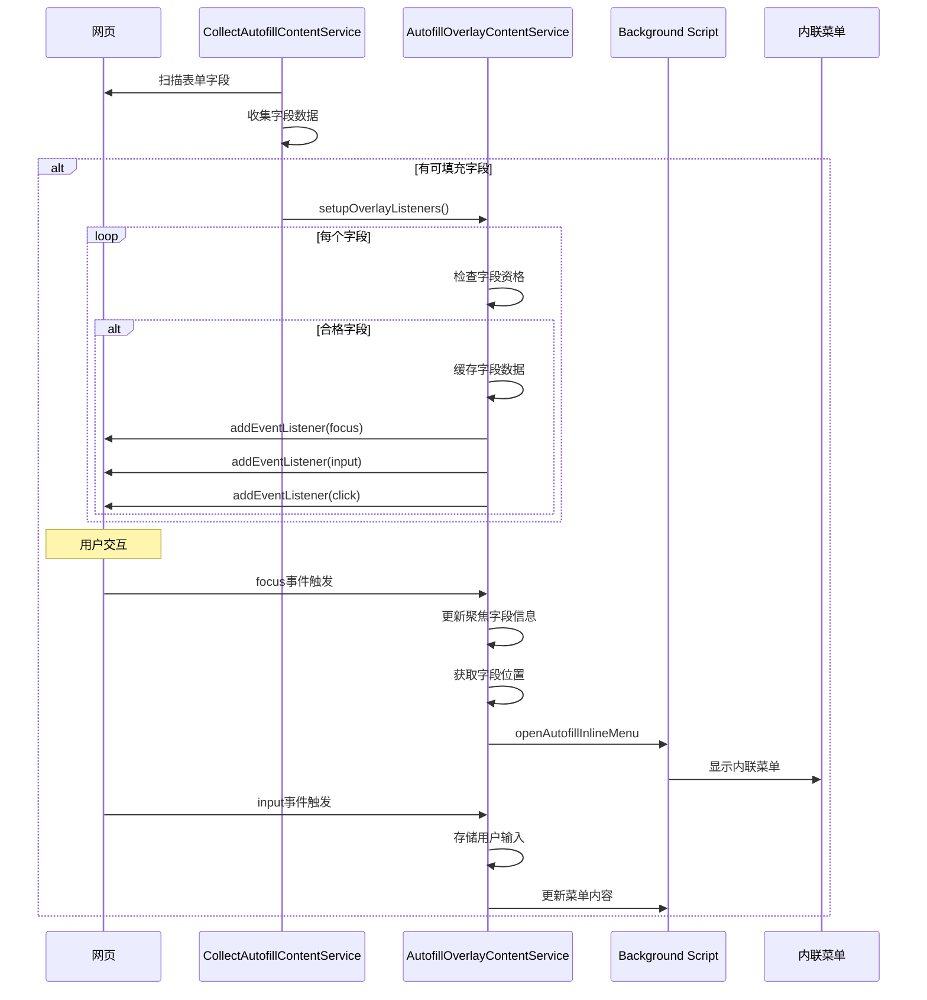
```mermaid
 sequenceDiagram
     participant PAGE as 网页
     participant CACS as CollectAutofillContentService
     participant AOCS as AutofillOverlayContentService
     participant BG as Background Script
     participant MENU as 内联菜单

     CACS->>PAGE: 扫描表单字段
     CACS->>CACS: 收集字段数据

     alt 有可填充字段
         CACS->>AOCS: setupOverlayListeners()

         loop 每个字段
             AOCS->>AOCS: 检查字段资格
             alt 合格字段
                 AOCS->>AOCS: 缓存字段数据
                 AOCS->>PAGE: addEventListener(focus)
                 AOCS->>PAGE: addEventListener(input)
                 AOCS->>PAGE: addEventListener(click)
             end
         end

         Note over PAGE: 用户交互

         PAGE->>AOCS: focus事件触发
         AOCS->>AOCS: 更新聚焦字段信息
         AOCS->>AOCS: 获取字段位置
         AOCS->>BG: openAutofillInlineMenu
         BG->>MENU: 显示内联菜单

         PAGE->>AOCS: input事件触发
         AOCS->>AOCS: 存储用户输入
         AOCS->>BG: 更新菜单内容
     end
```
