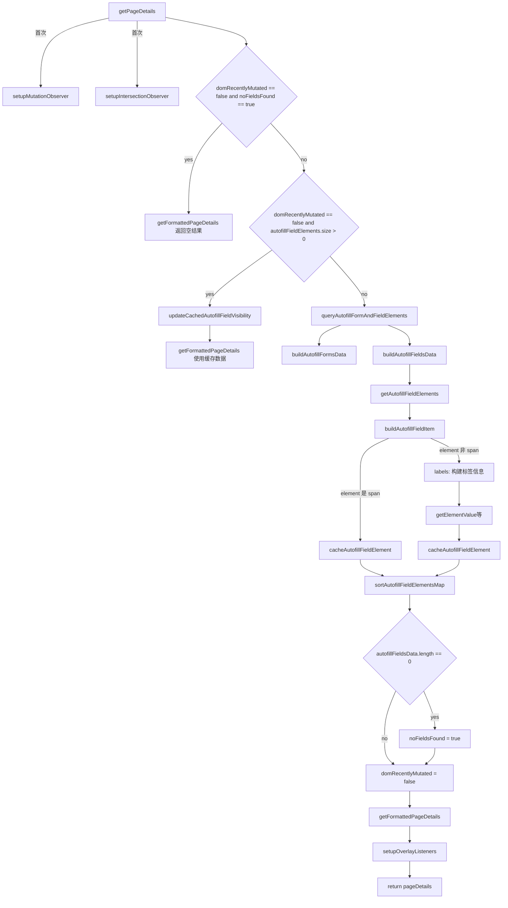
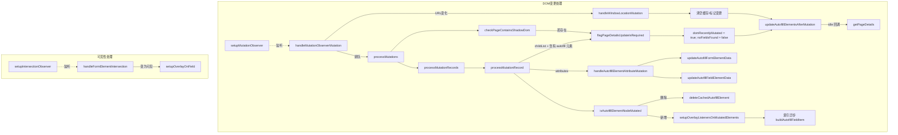

## CollectAutofillContentService 方法调用流（以 getPageDetails 为入口）

本文基于 `src/autofill/services/collect-autofill-content.service.ts`，从 `getPageDetails` 作为入口，梳理类内所有方法之间的调用关系，并说明其在 DOM 变更与可见性观察场景下的反应式调用链。文末提供 `pageDetails` 返回数据结构的详细注释说明，便于对齐上下游接口。

### 角色与核心状态

- **核心类**: `CollectAutofillContentService`
- **外部依赖**:
  - `DomQueryService`: 提供跨常规 DOM 与 Shadow DOM 的安全遍历与定位
  - `DomElementVisibilityService`: 判断元素在视口中的可见性
  - `AutofillOverlayContentService`(可选): 负责在输入框上挂载内联菜单/浮层的交互
- **关键状态**:
  - `mutationObserver` + `mutationsQueue`: 监听 DOM 变更后延迟批处理，触发重新收集
  - `intersectionObserver`: 监听不可见元素进入视口后再补挂浮层
  - `domRecentlyMutated`: 最近是否发生影响收集结果的 DOM 变更
  - `noFieldsFound`: 上次收集是否未发现可用字段
  - `_autofillFormElements` / `autofillFieldElements`: 表单与字段的缓存映射

### 主流程（以 getPageDetails 为入口）



- **缓存命中路径**: 若 DOM 未变更且已有缓存字段，则只更新可见性并用缓存数据格式化返回。
- **新收集路径**: 否则重新遍历页面，构建表单/字段数据，排序、打标并返回，同时为字段安装浮层监听。

### 反应式流程（DOM 变更与可见性）



- **URL 变化**: 清理缓存、关闭内联菜单、置位 `pageDetailsUpdateRequired`，并在 idle 时重新收集。
- **普通 DOM 变更**: 发现涉及 autofill 的新增/删除或属性变更时，置位标记并触发延迟刷新；新增节点会尝试以 -1 索引预构建字段元数据，待下次收集校正顺序。
- **可见性**: 对初始不可见的字段，进入视口后会更新 `viewable` 并补挂浮层监听。

### 重要辅助方法分组

- **表单/字段遍历**: `queryAutofillFormAndFieldElements`、`isNodeFormFieldElement`
- **字段信息构建**: `buildAutofillFieldItem`、`getElementValue`、`getAutoCompleteAttribute`、`getSelectElementOptions`、`getAutofillFieldMaxLength`
- **上下文标签提取**: `createAutofillFieldLabelTag`、`queryElementLabels`、`createAutofillFieldTopLabel`、`createAutofillFieldRightLabel`、`createAutofillFieldLeftLabel`
- **可见性与浮层**: `updateCachedAutofillFieldVisibility`、`setupOverlayListeners`、`setupOverlayOnField`、`handleFormElementIntersection`
- **变更处理**: `setupMutationObserver`、`handleMutationObserverMutation`、`processMutations`、`processMutationRecord`、`handleAutofillElementAttributeMutation`、`updateAutofillElementsAfterMutation`

### pageDetails 数据结构（带注释）

```ts
// AutofillPageDetails
{
  title: string,            // 收集时的 document.title
  url: string,              // (document.defaultView || globalThis).location.href
  documentUrl: string,      // document.location.href
  collectedTimestamp: number, // 收集时间戳（ms）

  // 所有表单，key 为表单 opid（形如 "__form__{index}"）
  forms: {
    [formOpid: string]: {
      opid: string,         // 表单唯一标识（运行期生成）
      htmlAction: string,   // 表单 action 的绝对 URL（相对路径会被转换）
      htmlName: string | null,
      htmlClass: string | null,
      htmlID: string | null,
      htmlMethod: string | null,
    }
  },

  // 所有可收集字段的数组
  fields: Array<{
    // 通用基础字段
    opid: string,             // 字段唯一标识，形如 "__{index}"；若由变更预发现，index 可能为 -1，后续收集会更正
    elementNumber: number,    // 在本次收集中的顺序编号（用于排序）
    maxLength: number | null, // input/textarea 的 maxLength（<=999），否则为 null
    viewable: boolean,        // 是否在当前视口中可见（IntersectionObserver 会更新）
    htmlID: string | null,
    htmlName: string | null,
    htmlClass: string | null,
    tabindex: string | null,
    title: string | null,
    tagName: string,          // 小写标签名，如 'input'/'select'/'span'
    dataSetValues: string,    // 将元素 dataset 展平为 "key: value, " 拼接字符串

    // 当元素是 span[data-bwautofill]：仅有上述基础字段
    // 当元素是可填写字段（非 hidden）时，附加以下标签/上下文信息：
    "label-tag"?: string,          // 来自 <label for=...> / 元素.labels / 祖先 <label>
    "label-data"?: string | null,  // data-label 属性
    "label-aria"?: string | null,  // aria-label 属性
    "label-top"?: string | null,   // 表格布局中来自上一行同列单元格文本
    "label-right"?: string,        // 右侧同级/后续兄弟节点文本（遇分节标签停止）
    "label-left"?: string,         // 左侧同级/前序兄弟节点文本（递归向上，遇分节标签停止）
    placeholder?: string | null,    // placeholder 属性

    // 其他输入属性
    rel?: string | null,
    type?: string | null,           // 小写类型，如 'text'/'password'/'hidden' 等
    value?: string,                 // 详细取值逻辑：
                                   // - checkbox => '✓' (选中) | '' (未选中)
                                   // - hidden => 超过254字符截断并追加'...SNIPPED'
                                   // - span => textContent || innerText
                                   // - 其他 => 直接取 value 属性
    checked?: boolean,              // 仅对 checkbox 有意义
    autoCompleteType?: string | null, // 优先级：x-autocompletetype > autocompletetype > autocomplete
    disabled?: boolean,
    readonly?: boolean,
    selectInfo?: { options: (string | null)[][] } | null, // 仅 select；每项为 [标准化文本, value]
                                                         // 注意：选项文本会转小写并移除所有空格和标点符号
    form?: string | null,            // 归属表单的 opid（若存在）

    // ARIA/自定义属性（注意：ARIA 属性在不存在时默认为 true）
    "aria-hidden"?: boolean,         // 默认 true（属性不存在时）
    "aria-disabled"?: boolean,       // 默认 true（属性不存在时）
    "aria-haspopup"?: boolean,       // 默认 true（属性不存在时）
    "data-stripe"?: string | null,
  }>
}
```

- **forms key/字段含义**: `htmlAction` 永远是绝对 URL（相对路径会被转换）；其余取自同名属性/特性。
- **fields 特性**: 对 checkbox、hidden、select 等类型已做特化处理；标签文本提取会清洗不可打印字符并折叠空白。
- **排序保证**: `autofillFieldElements` 会按 `elementNumber` 排序以稳定渲染顺序与交互体验。

### 重要补充细节

#### 字段过滤规则

- **跳过的元素**: 位于 `button[type='submit']` 内的元素会被完全跳过
- **被忽略的 input 类型**: `hidden`, `submit`, `reset`, `button`, `image`, `file`

#### 动态元素处理

- **临时索引**: DOM变更时新发现的元素 `opid` 可能为 `"__-1"`，表示索引待下次完整收集时重新分配
- **缓存更新策略**: 已缓存的元素在重新收集时只更新 `opid` 和 `elementNumber`，其他数据保持不变以提升性能

#### Shadow DOM 支持

- **标签查找**: 会使用 `element.getRootNode()` 而不是 `document`，以支持 Shadow DOM 中的元素标签关联

#### 交叉观察器机制

- **防重复处理**: 通过 `elementInitializingIntersectionObserver` 集合防止重复处理同一元素
- **可见性监控**: 初始不可见的字段会被 IntersectionObserver 监控，变为可见时自动设置覆盖层

#### 文本处理规则

- **清理标准**: 去除不可打印字符（ASCII 32-126之外），多个空白字符替换为单个空格，修剪首尾空白
- **select 选项**: 选项文本会转换为小写并移除所有空格、标点符号和特殊字符

## DOM 到 pageDetails 的五阶段筛选流程

从原始 DOM 元素到最终 `pageDetails` 数据的获取，经历了严格的五阶段过滤筛选过程：

### 第1阶段：CSS选择器预筛选（构造函数）

**目标**：通过CSS选择器大范围匹配候选元素

**formFieldQueryString 构建规则**：

```typescript
// 基础input查询（排除data-bwignore标记的元素）
input:not([data-bwignore])
// 排除被忽略的input类型
:not([type="hidden"]):not([type="submit"]):not([type="reset"]):not([type="button"]):not([type="image"]):not([type="file"])
// 添加其他表单字段类型
, textarea:not([data-bwignore])
, select:not([data-bwignore])
, span[data-bwautofill]
```

**被忽略的input类型**：`hidden`, `submit`, `reset`, `button`, `image`, `file`

### 第2阶段：DOM查询和遍历（queryAutofillFormAndFieldElements）

**目标**：使用domQueryService进行实际DOM遍历，支持Shadow DOM

**查询策略**：

1. **第一轮查询**：使用回调函数在遍历过程中就进行分类存储
   - 查询条件：`form, ${formFieldQueryString}`
   - 发现form元素 → 存入 `formElements` 数组
   - 发现字段元素 → 调用 `isNodeFormFieldElement` 验证后存入 `formFieldElements`

2. **第二轮查询**：如果第一轮没有结果，对所有查询到的元素再次遍历分类

### 第3阶段：严格节点验证（isNodeFormFieldElement）

**目标**：对每个候选节点进行精确的类型和属性检查

**验证规则**：

```typescript
// 1. 必须是Element节点
if (!nodeIsElement(node)) return false;

// 2. span元素：必须有data-bwautofill属性
if (tagName === "span" && node.hasAttribute("data-bwautofill")) return true;

// 3. input元素：不能是被忽略类型 + 不能有data-bwignore属性
if (tagName === "input" && !ignoredInputTypes.has(type) && !hasDataBwIgnore) return true;

// 4. textarea/select：不能有data-bwignore属性
if (["textarea", "select"].includes(tagName) && !hasDataBwIgnore) return true;
```

### 第4阶段：优先级数量筛选（getAutofillFieldElements）

**目标**：限制字段数量并按重要性排序（默认限制100个）

**优先级规则**：

- **优先字段**：除 `checkbox` 和 `radio` 之外的所有类型
- **次要字段**：`checkbox` 和 `radio` 类型

**筛选策略**：

1. 如果总数未超限制，直接返回所有字段
2. 如果超出限制：
   - 优先填满优先字段直到达到限制
   - 剩余位置分配给次要字段
   - 确保重要的输入字段（如text、password等）不被丢弃

### 第5阶段：个体构建验证（buildAutofillFieldItem）

**目标**：为每个字段构建详细数据并进行最终验证

**最终过滤条件**：

- **跳过条件**：位于 `button[type='submit']` 内的元素 → 返回 `null`
- **缓存复用**：已存在的元素只更新 `opid` 和 `elementNumber`
- **差异化处理**：
  - `span[data-bwautofill]`：只构建基础字段数据
  - 其他字段：构建完整数据（包括标签、属性、选项等）

### 表单筛选流程（相对简单）

**目标**：收集页面中的所有表单元素

**筛选规则**：

- 任何 `<form>` 元素都会被收集
- 通过 `nodeIsFormElement` 或 `elementIsFormElement` 验证
- 没有额外的过滤条件或优先级排序

### 筛选结果统计

经过五阶段筛选后的最终结果：

- **forms**：页面中所有 `<form>` 元素（无数量限制）
- **fields**：最多100个按优先级排序的有效表单字段
- **排除元素**：被忽略的input类型、带忽略标记的元素、提交按钮内的元素
- **排序规则**：按DOM中的出现顺序（elementNumber）排序

## 字段 form 属性的设置机制

字段对象中的 `form` 属性用于关联其所属的表单，设置过程基于HTML原生的表单关联机制。

### 核心设置逻辑

在 `buildAutofillFieldItem` 方法中：

```typescript
// 1. 获取HTML原生form关联
const fieldFormElement = (element as ElementWithOpId<FillableFormFieldElement>).form;

// 2. 设置form属性值
form: fieldFormElement ? this.getPropertyOrAttribute(fieldFormElement, "opid") : null;
```

### 详细设置步骤

#### 步骤1：获取原生form关联

- 使用HTML原生的 `element.form` 属性
- 浏览器自动处理以下关联方式：
  - 字段位于 `<form>` 内部
  - 字段通过 `form="formId"` 属性关联外部表单
  - 支持复杂的嵌套和跨DOM关联

#### 步骤2：获取表单opid

- 如果存在关联表单，获取其 `opid` 属性
- 表单的 `opid` 在 `buildAutofillFormsData` 中分配：`__form__{index}`

#### 步骤3：设置form字段值

- **有关联表单**：设置为表单的opid（如 `"__form__0"`）
- **无关联表单**：设置为 `null`

### 关联场景示例

#### 场景1：字段在表单内部

```html
<form>
  <!-- opid: "__form__0" -->
  <input type="text" name="username" />
  <!-- form: "__form__0" -->
  <input type="password" name="password" />
  <!-- form: "__form__0" -->
</form>
```

#### 场景2：字段通过form属性关联

```html
<form id="loginForm"></form>
<!-- opid: "__form__0" -->
<input type="text" name="username" form="loginForm" />
<!-- form: "__form__0" -->
```

#### 场景3：独立字段

```html
<input type="text" name="search" />
<!-- form: null -->
```

#### 场景4：span元素

```html
<span data-bwautofill>Custom Field</span>
<!-- form: null -->
```

### 设计特性

- **原生关联机制**：完全依赖HTML标准的form关联，无需额外解析
- **引用完整性**：确保form字段值与pageDetails.forms对象的key一致
- **null值语义**：独立字段（搜索框、span元素等）的form为null
- **跨DOM支持**：支持通过form属性跨越DOM结构的表单关联
