# CollectAutofillContentService 方法调用流程图

## 概述

本文档分析了 `CollectAutofillContentService` 类中所有方法的关系和调用流程，以 `getPageDetails` 作为主要入口点。

## 主要入口点

`getPageDetails()` 是该服务的主要入口点，负责构建页面中所有表单和字段的数据。

## 方法调用流程图 (中英文对照)

```mermaid
flowchart TD
    %% 主入口点
    A["getPageDetails<br/>获取页面详情<br/>(主入口)"] --> B{"检查DOM状态<br/>DOM已变化或无字段?"}

    %% 缓存路径
    B -->|已缓存且无变化| C["updateCachedAutofillFieldVisibility<br/>更新缓存字段可见性"]
    B -->|已缓存且无变化| D["getFormattedPageDetails<br/>格式化页面详情"]

    %% 重新收集路径
    B -->|需要重新收集| E["queryAutofillFormAndFieldElements<br/>查询自动填充表单和字段元素"]

    %% 初始化设置
    A --> F["setupMutationObserver<br/>设置DOM变化观察器"]
    A --> G["setupIntersectionObserver<br/>设置交叉观察器"]

    %% 数据构建流程
    E --> H["buildAutofillFormsData<br/>构建自动填充表单数据"]
    E --> I["buildAutofillFieldsData<br/>构建自动填充字段数据"]

    %% 表单数据处理
    H --> J["getFormActionAttribute<br/>获取表单action属性"]
    H --> K["getFormattedAutofillFormsData<br/>格式化自动填充表单数据"]

    %% 字段数据处理
    I --> L["getAutofillFieldElements<br/>获取自动填充字段元素"]
    I --> M["buildAutofillFieldItem<br/>构建自动填充字段项"]

    %% 字段识别
    L --> N["isNodeFormFieldElement<br/>检查节点是否为表单字段元素"]

    %% 字段项构建的各个组件
    M --> O["cacheAutofillFieldElement<br/>缓存自动填充字段元素"]
    M --> P["getAutofillFieldMaxLength<br/>获取自动填充字段最大长度"]
    M --> Q["createAutofillFieldLabelTag<br/>创建自动填充字段标签"]
    M --> R["createAutofillFieldTopLabel<br/>创建字段顶部标签"]
    M --> S["createAutofillFieldLeftLabel<br/>创建字段左侧标签"]
    M --> T["createAutofillFieldRightLabel<br/>创建字段右侧标签"]
    M --> U["getElementValue<br/>获取元素值"]
    M --> V["getAutoCompleteAttribute<br/>获取自动完成属性"]
    M --> W["getSelectElementOptions<br/>获取选择框选项"]
    M --> X["getDataSetValues<br/>获取数据集值"]

    %% 标签处理流程
    Q --> Y["queryElementLabels<br/>查询元素标签"]
    Q --> Z["createLabelElementsTag<br/>创建标签元素文本"]

    %% 文本获取流程
    S --> AA["recursivelyGetTextFromPreviousSiblings<br/>递归获取前置兄弟节点文本"]
    T --> BB["getTextContentFromElement<br/>获取元素文本内容"]
    R --> CC["createAutofillFieldTopLabel<br/>创建字段顶部标签"]

    %% 文本处理工具
    AA --> DD["isNewSectionElement<br/>检查是否为新区域元素"]
    BB --> EE["trimAndRemoveNonPrintableText<br/>清理和修剪文本"]

    %% 最终处理
    A --> FF["sortAutofillFieldElementsMap<br/>排序自动填充字段元素映射"]
    A --> GG["setupOverlayListeners<br/>设置覆盖层监听器"]

    %% 覆盖层设置
    GG --> HH["setupOverlayOnField<br/>在字段上设置覆盖层"]
    C --> II["setupOverlayOnField<br/>在字段上设置覆盖层"]

    %% DOM变化监测流程
    F --> JJ["handleMutationObserverMutation<br/>处理DOM变化观察"]
    JJ --> KK{"检查变化类型<br/>URL变化?"}
    KK -->|是| LL["handleWindowLocationMutation<br/>处理窗口URL变化<br/>清除自动填充元素并更新"]
    KK -->|否| MM["processMutations<br/>处理DOM变化"]

    %% URL变化处理
    LL --> NN["updateAutofillElementsAfterMutation<br/>变化后更新自动填充元素"]

    %% 变化记录处理
    MM --> OO["processMutationRecords<br/>处理变化记录"]
    OO --> PP["processMutationRecord<br/>处理单个变化记录"]
    PP --> QQ["isAutofillElementNodeMutated<br/>检查自动填充元素节点是否变化"]
    PP --> RR["handleAutofillElementAttributeMutation<br/>处理自动填充元素属性变化"]

    %% 元素变化处理
    QQ --> SS["deleteCachedAutofillElement<br/>删除缓存的自动填充元素"]
    QQ --> TT["setupOverlayListenersOnMutatedElements<br/>在变化元素上设置覆盖层监听器"]

    %% 属性变化处理
    RR --> UU["updateAutofillFormElementData<br/>更新自动填充表单元素数据"]
    RR --> VV["updateAutofillFieldElementData<br/>更新自动填充字段元素数据"]

    %% 属性更新
    UU --> WW["updateAutofillDataAttribute<br/>更新自动填充数据属性"]
    VV --> WW

    %% 循环更新
    NN --> A

    %% 交叉观察器流程
    G --> XX["handleFormElementIntersection<br/>处理表单元素交叉事件"]
    XX --> YY["setupOverlayOnField<br/>在字段上设置覆盖层"]

    %% 查询工具方法
    ZZ["getAutofillFieldElementByOpid<br/>根据opid获取自动填充字段元素"] --> AAA["getAutofillFieldElements<br/>获取自动填充字段元素"]

    %% 销毁流程
    BBB["destroy<br/>销毁服务"] --> CCC["cancelIdleCallbackPolyfill<br/>取消空闲回调"]
    BBB --> DDD["mutationObserver.disconnect<br/>断开变化观察器"]
    BBB --> EEE["intersectionObserver.disconnect<br/>断开交叉观察器"]

    %% 密码字段检查
    FFF["isPasswordFieldWithinDocument<br/>检查文档中是否有密码字段"] --> GGG["domQueryService.query<br/>DOM查询服务"]

    %% Shadow DOM 处理
    HHH["checkPageContainsShadowDom<br/>检查页面是否包含Shadow DOM"] --> III["flagPageDetailsUpdateIsRequired<br/>标记需要更新页面详情"]

    %% 样式定义
    classDef entryPoint fill:#e1f5fe,stroke:#01579b,stroke-width:3px
    classDef coreLogic fill:#f3e5f5,stroke:#4a148c,stroke-width:2px
    classDef observer fill:#fff3e0,stroke:#e65100,stroke-width:2px
    classDef utility fill:#e8f5e8,stroke:#1b5e20,stroke-width:2px
    classDef cache fill:#fce4ec,stroke:#880e4f,stroke-width:2px
    classDef textProcess fill:#f1f8e9,stroke:#33691e,stroke-width:2px
    classDef overlay fill:#e3f2fd,stroke:#0d47a1,stroke-width:2px

    %% 应用样式
    class A entryPoint
    class E,H,I,M,L coreLogic
    class F,G,JJ,XX,MM,OO,PP observer
    class N,P,Q,R,S,T,U,V,W,X,J,Y,Z,ZZ,AAA,FFF,GGG,HHH,III utility
    class O,C,K,FF cache
    class AA,BB,CC,DD,EE textProcess
    class GG,HH,II,TT,YY overlay
```

## 方法分类与功能说明

### 1. 核心入口方法

- **`getPageDetails()`**: 主要入口点，协调整个数据收集流程
- **`getAutofillFieldElementByOpid(opid)`**: 根据opid查找表单字段元素

### 2. DOM查询与数据构建

- **`queryAutofillFormAndFieldElements()`**: 查询所有表单和字段元素
- **`buildAutofillFormsData(formElements)`**: 构建表单数据
- **`buildAutofillFieldsData(formFieldElements)`**: 构建字段数据
- **`buildAutofillFieldItem(element, index)`**: 构建单个字段项

### 3. 字段识别与过滤

- **`getAutofillFieldElements(fieldsLimit, previouslyFoundFormFieldElements)`**: 获取可自动填充的字段元素
- **`isNodeFormFieldElement(node)`**: 检查节点是否为表单字段元素

### 4. 标签生成方法

- **`createAutofillFieldLabelTag(element)`**: 创建字段标签
- **`createAutofillFieldTopLabel(element)`**: 创建顶部标签
- **`createAutofillFieldLeftLabel(element)`**: 创建左侧标签
- **`createAutofillFieldRightLabel(element)`**: 创建右侧标签
- **`queryElementLabels(element)`**: 查询元素关联的标签
- **`createLabelElementsTag(labelElementsSet)`**: 创建标签元素文本

### 5. 元素属性获取

- **`getElementValue(element)`**: 获取元素值
- **`getAutoCompleteAttribute(element)`**: 获取自动完成属性
- **`getAutofillFieldMaxLength(element)`**: 获取字段最大长度
- **`getSelectElementOptions(element)`**: 获取选择框选项
- **`getDataSetValues(element)`**: 获取data-\*属性值
- **`getFormActionAttribute(element)`**: 获取表单action属性
- **`getAttributeLowerCase(element, attributeName)`**: 获取小写属性值

### 6. 文本处理方法

- **`getTextContentFromElement(element)`**: 获取元素文本内容
- **`trimAndRemoveNonPrintableText(textContent)`**: 清理和修剪文本
- **`recursivelyGetTextFromPreviousSiblings(element)`**: 递归获取前置兄弟节点文本
- **`isNewSectionElement(currentElement)`**: 检查是否为新区域元素

### 7. 数据格式化与缓存

- **`getFormattedPageDetails(autofillFormsData, autofillFieldsData)`**: 格式化页面详情
- **`getFormattedAutofillFormsData()`**: 格式化表单数据
- **`getFormattedAutofillFieldsData()`**: 格式化字段数据
- **`cacheAutofillFieldElement(index, element, autofillFieldData)`**: 缓存字段元素
- **`sortAutofillFieldElementsMap()`**: 排序字段元素映射
- **`updateCachedAutofillFieldVisibility()`**: 更新缓存字段可见性

### 8. 变化监测（Mutation Observer）

- **`setupMutationObserver()`**: 设置DOM变化观察器
- **`handleMutationObserverMutation(mutations)`**: 处理DOM变化
- **`processMutations()`**: 处理变化队列
- **`processMutationRecords(mutations)`**: 处理变化记录
- **`processMutationRecord(mutation)`**: 处理单个变化记录
- **`handleWindowLocationMutation()`**: 处理位置变化
- **`isAutofillElementNodeMutated(nodes, isRemovingNodes)`**: 检查自动填充元素是否变化
- **`deleteCachedAutofillElement(element)`**: 删除缓存的自动填充元素
- **`updateAutofillElementsAfterMutation()`**: 变化后更新自动填充元素

### 9. 属性更新

- **`handleAutofillElementAttributeMutation(mutation)`**: 处理元素属性变化
- **`updateAutofillFormElementData(attributeName, element, dataTarget)`**: 更新表单元素数据
- **`updateAutofillFieldElementData(attributeName, element, dataTarget)`**: 更新字段元素数据
- **`updateAutofillDataAttribute(params)`**: 更新自动填充数据属性

### 10. 可见性监测（Intersection Observer）

- **`setupIntersectionObserver()`**: 设置交叉观察器
- **`handleFormElementIntersection(entries)`**: 处理表单元素交叉事件

### 11. 覆盖层相关

- **`setupOverlayListeners(pageDetails)`**: 设置覆盖层监听器
- **`setupOverlayOnField(formFieldElement, autofillField, pageDetails)`**: 在字段上设置覆盖层
- **`setupOverlayListenersOnMutatedElements(mutatedElements)`**: 在变化元素上设置覆盖层监听器

### 12. Shadow DOM 处理

- **`checkPageContainsShadowDom()`**: 检查页面是否包含Shadow DOM
- **`flagPageDetailsUpdateIsRequired()`**: 标记需要更新页面详情

### 13. 工具方法

- **`isPasswordFieldWithinDocument()`**: 检查文档中是否有密码字段
- **`destroy()`**: 销毁服务，清理资源

## 关键数据流

### 主要数据收集流程

1. **入口**: `getPageDetails()`
2. **DOM查询**: `queryAutofillFormAndFieldElements()`
3. **数据构建**: `buildAutofillFormsData()` + `buildAutofillFieldsData()`
4. **格式化输出**: `getFormattedPageDetails()`

### 变化监测流程

1. **设置监测**: `setupMutationObserver()`
2. **变化处理**: `handleMutationObserverMutation()`
3. **队列处理**: `processMutations()` → `processMutationRecords()` → `processMutationRecord()`
4. **更新触发**: `updateAutofillElementsAfterMutation()` → `getPageDetails()`

### 可见性监测流程

1. **设置监测**: `setupIntersectionObserver()`
2. **交叉处理**: `handleFormElementIntersection()`
3. **覆盖层设置**: `setupOverlayOnField()`

## 性能优化策略

1. **缓存机制**: 使用 `autofillFieldElements` 和 `_autofillFormElements` 缓存已处理的元素
2. **惰性更新**: 只在DOM变化时重新收集数据
3. **异步处理**: 使用 `requestIdleCallbackPolyfill` 进行非阻塞处理
4. **防抖机制**: 对变化处理进行防抖，避免频繁更新
5. **优先级排序**: 优先处理重要的表单字段类型

## 依赖关系

该服务依赖以下外部服务：

- **DomElementVisibilityService**: 元素可见性检测
- **DomQueryService**: DOM查询服务
- **AutofillOverlayContentService**: 自动填充覆盖层服务（可选）

所有方法协同工作，形成一个完整的自动填充内容收集系统，能够高效地识别、分析和缓存页面中的表单元素信息。
