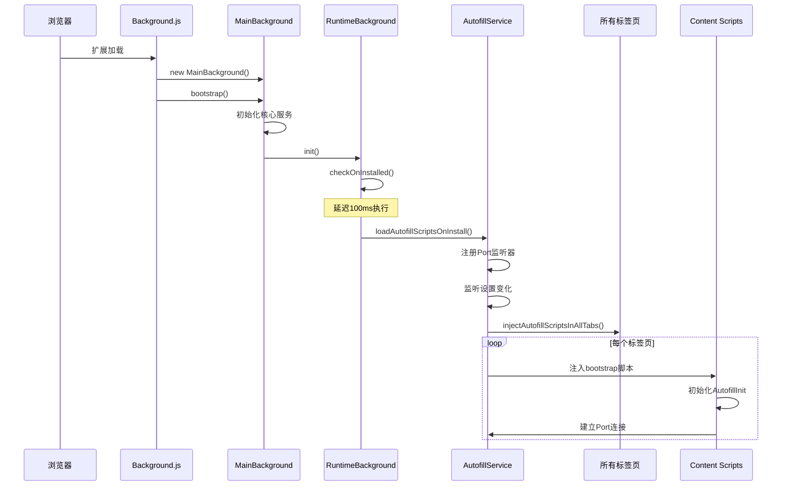
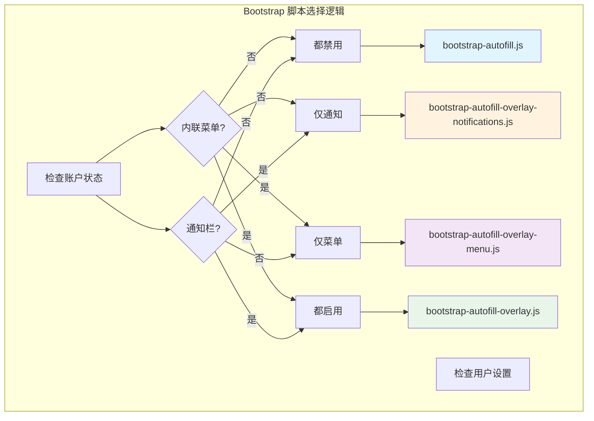
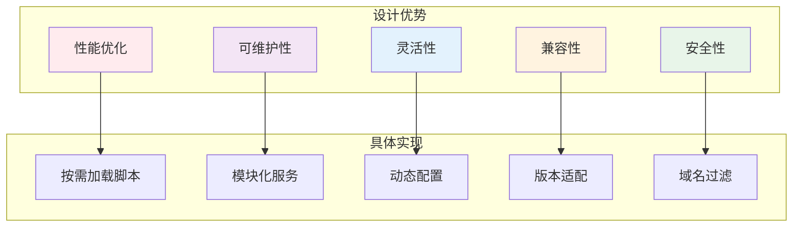
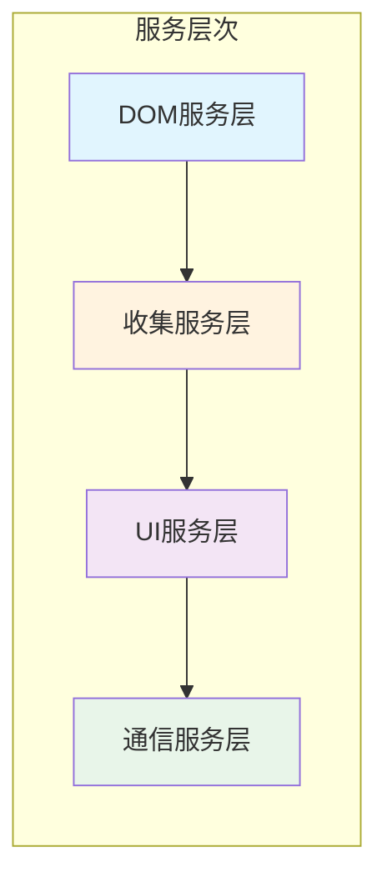
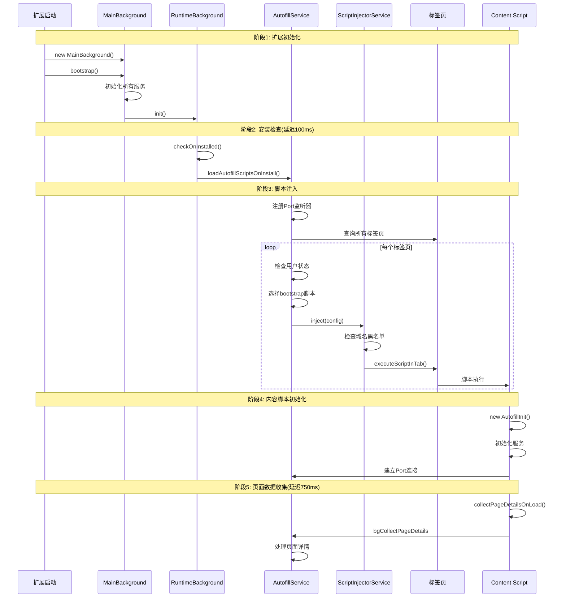
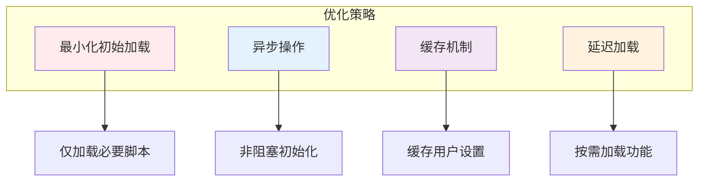

# 浏览器扩展启动时脚本加载架构详解

## 概述

Bitwarden 浏览器扩展的启动脚本加载是一个精心设计的多层级系统，涉及从扩展初始化到内容脚本注入的完整流程。这个架构设计解决了性能、兼容性、用户体验等多方面的挑战。

## 启动流程整体架构



## 核心文件及其职责

### 1. 启动入口文件

#### **`src/platform/background.ts`**
```typescript
// 扩展的主入口点
import { ConsoleLogService } from "@bitwarden/common/platform/services/console-log.service";
import MainBackground from "../background/main.background";

const logService = new ConsoleLogService(false);
const bitwardenMain = ((self as any).bitwardenMain = new MainBackground());
bitwardenMain.bootstrap().catch((error) => logService.error(error));
```
**职责**: 
- 创建 MainBackground 实例
- 调用 bootstrap() 启动整个扩展
- 处理启动错误

#### **`src/background/main.background.ts`**
```typescript
async bootstrap() {
  // 初始化SDK
  await this.sdkLoadService.loadAndInit();
  
  // 运行数据迁移
  await this.stateService.init({ runMigrations: true });
  
  // 初始化国际化
  await (this.i18nService as I18nService).init();
  
  // 初始化运行时背景服务
  await this.runtimeBackground.init();
  
  // 初始化其他后台服务
  await this.notificationBackground.init();
  this.overlayNotificationsBackground.init();
  this.commandsBackground.init();
  // ...
}
```
**职责**:
- 协调所有服务的初始化顺序
- 管理服务依赖关系
- 确保关键服务优先初始化

### 2. 运行时管理

#### **`src/background/runtime.background.ts`**
```typescript
export default class RuntimeBackground {
  private onInstalledReason: string = null;
  
  constructor(...) {
    // 必须在构造函数中注册，确保捕获安装事件
    chrome.runtime.onInstalled.addListener((details: any) => {
      this.onInstalledReason = details.reason;
    });
  }
  
  async init() {
    await this.checkOnInstalled();
    // 设置消息监听器...
  }
  
  private async checkOnInstalled() {
    setTimeout(async () => {
      // 触发自动填充脚本加载
      void this.autofillService.loadAutofillScriptsOnInstall();
      
      if (this.onInstalledReason === "install") {
        // 首次安装处理
        await this.autofillSettingsService.setInlineMenuVisibility(
          AutofillOverlayVisibility.OnFieldFocus
        );
      }
    }, 100);
  }
}
```
**职责**:
- 检测扩展安装/更新事件
- 延迟执行初始化以避免竞态条件
- 处理首次安装的特殊逻辑

### 3. 自动填充服务层

#### **`src/autofill/services/autofill.service.ts`**
```typescript
export default class AutofillService {
  async loadAutofillScriptsOnInstall() {
    // 注册Port连接监听器
    BrowserApi.addListener(chrome.runtime.onConnect, this.handleInjectedScriptPortConnection);
    
    // 注入脚本到所有标签页
    void this.injectAutofillScriptsInAllTabs();
    
    // 监听设置变化，动态重载脚本
    this.autofillSettingsService.inlineMenuVisibility$
      .pipe(startWith(undefined), pairwise())
      .subscribe(([prev, curr]) => 
        this.handleInlineMenuVisibilitySettingsChange(prev, curr)
      );
  }
  
  private async injectAutofillScriptsInAllTabs() {
    const tabs = await BrowserApi.tabsQuery({});
    for (const tab of tabs) {
      if (tab?.id && tab.url?.startsWith("http")) {
        const frames = await BrowserApi.getAllFrameDetails(tab.id);
        if (frames) {
          frames.forEach((frame) => 
            this.injectAutofillScripts(tab, frame.frameId, false)
          );
        }
      }
    }
  }
  
  async injectAutofillScripts(
    tab: chrome.tabs.Tab,
    frameId = 0,
    triggeringOnPageLoad = true
  ) {
    // 检查用户状态
    const activeAccount = await firstValueFrom(this.accountService.activeAccount$);
    const authStatus = await firstValueFrom(this.authService.activeAccountStatus$);
    const accountIsUnlocked = authStatus === AuthenticationStatus.Unlocked;
    
    // 根据状态选择要注入的脚本
    const injectedScripts = [
      await this.getBootstrapAutofillContentScript(activeAccount)
    ];
    
    if (activeAccount && accountIsUnlocked) {
      const autoFillOnPageLoadIsEnabled = await this.getAutofillOnPageLoad();
      if (triggeringOnPageLoad && autoFillOnPageLoadIsEnabled) {
        injectedScripts.push("autofiller.js");
      }
    }
    
    injectedScripts.push("contextMenuHandler.js");
    
    // 执行注入
    for (const script of injectedScripts) {
      await this.scriptInjectorService.inject({
        tabId: tab.id,
        injectDetails: {
          file: `content/${script}`,
          runAt: "document_start",
          frame: frameId,
        },
      });
    }
  }
}
```
**职责**:
- 管理脚本注入的完整流程
- 根据用户状态决定注入哪些脚本
- 处理多框架注入
- 响应设置变化动态更新

### 4. Bootstrap 脚本家族

这是一个精心设计的脚本分层系统，根据功能需求选择性加载：



#### **`src/autofill/content/bootstrap-autofill.js`** (基础版)
```typescript
(function (windowContext) {
  if (!windowContext.bitwardenAutofillInit) {
    // 最小化初始化 - 仅基础服务
    const domQueryService = new DomQueryService();
    const domElementVisibilityService = new DomElementVisibilityService();
    
    windowContext.bitwardenAutofillInit = new AutofillInit(
      domQueryService,
      domElementVisibilityService
    );
    
    setupAutofillInitDisconnectAction(windowContext);
    windowContext.bitwardenAutofillInit.init();
  }
})(window);
```
**使用场景**: 用户禁用了内联菜单和通知栏，仅需基础自动填充功能

#### **`src/autofill/content/bootstrap-autofill-overlay.js`** (完整版)
```typescript
(function (windowContext) {
  if (!windowContext.bitwardenAutofillInit) {
    let inlineMenuContentService;
    let overlayNotificationsContentService;
    
    // 仅在顶层框架创建UI服务
    if (globalThis.self === globalThis.top) {
      inlineMenuContentService = new AutofillInlineMenuContentService();
      overlayNotificationsContentService = new OverlayNotificationsContentService();
    }
    
    // 创建所有服务
    const domQueryService = new DomQueryService();
    const domElementVisibilityService = new DomElementVisibilityService(
      inlineMenuContentService
    );
    const inlineMenuFieldQualificationService = new InlineMenuFieldQualificationService();
    const autofillOverlayContentService = new AutofillOverlayContentService(
      domQueryService,
      domElementVisibilityService,
      inlineMenuFieldQualificationService,
      inlineMenuContentService
    );
    
    windowContext.bitwardenAutofillInit = new AutofillInit(
      domQueryService,
      domElementVisibilityService,
      autofillOverlayContentService,
      inlineMenuContentService,
      overlayNotificationsContentService
    );
    
    setupAutofillInitDisconnectAction(windowContext);
    windowContext.bitwardenAutofillInit.init();
  }
})(window);
```
**使用场景**: 用户启用了所有功能，需要完整的自动填充体验

### 5. 内容脚本核心

#### **`src/autofill/content/autofill-init.ts`**
```typescript
class AutofillInit {
  constructor(
    domQueryService: DomQueryService,
    domElementVisibilityService: DomElementVisibilityService,
    private autofillOverlayContentService?: AutofillOverlayContentService,
    private autofillInlineMenuContentService?: AutofillInlineMenuContentService,
    private overlayNotificationsContentService?: OverlayNotificationsContentService,
  ) {
    // 初始化收集和插入服务
    this.collectAutofillContentService = new CollectAutofillContentService(
      domElementVisibilityService,
      domQueryService,
      this.autofillOverlayContentService,
    );
    this.insertAutofillContentService = new InsertAutofillContentService(
      domElementVisibilityService,
      this.collectAutofillContentService,
    );
  }
  
  init() {
    // 设置扩展消息监听器
    this.setupExtensionMessageListeners();
    
    // 初始化覆盖层服务（如果存在）
    this.autofillOverlayContentService?.init();
    
    // 页面加载时收集详情
    this.collectPageDetailsOnLoad();
  }
  
  private collectPageDetailsOnLoad() {
    const sendCollectDetailsMessage = () => {
      this.clearCollectPageDetailsOnLoadTimeout();
      this.collectPageDetailsOnLoadTimeout = setTimeout(
        () => this.sendExtensionMessage("bgCollectPageDetails", { 
          sender: "autofillInit" 
        }),
        750  // 延迟750ms，等待页面稳定
      );
    };
    
    if (globalThis.document.readyState === "complete") {
      sendCollectDetailsMessage();
    }
    
    globalThis.addEventListener(EVENTS.LOAD, sendCollectDetailsMessage);
  }
}
```
**职责**:
- 协调所有内容脚本服务
- 管理页面与扩展的通信
- 收集和处理页面表单数据

### 6. 辅助脚本

#### **`src/autofill/content/trigger-autofill-script-injection.ts`**
```typescript
(function () {
  // 触发脚本注入的简单脚本
  chrome.runtime.sendMessage({ 
    command: "triggerAutofillScriptInjection" 
  });
})();
```
**职责**: 在 manifest.json 中静态配置，用于触发动态脚本注入

#### **`src/autofill/content/content-message-handler.ts`**
```typescript
// 处理页面与扩展之间的消息
window.addEventListener("message", handleWindowMessageEvent, false);
chrome.runtime.onMessage.addListener(handleExtensionMessage);

setupExtensionDisconnectAction(() => {
  window.removeEventListener("message", handleWindowMessageEvent);
  chrome.runtime.onMessage.removeListener(handleExtensionMessage);
});
```
**职责**: 处理来自网页的消息（如 SSO 认证结果）

#### **`src/autofill/content/autofiller.ts`**
```typescript
function loadAutofiller() {
  let pageHref: string = null;
  let filledThisHref = false;
  let delayFillTimeout: number;
  let doFillInterval: number | NodeJS.Timeout;
  
  function triggerUserFillOnLoad() {
    clearDoFillInterval();
    doFillInterval = setInterval(() => doFillIfNeeded(), 500);
  }
  
  function doFillIfNeeded(force = false) {
    if (force || pageHref !== window.location.href) {
      if (!force) {
        // 某些网站渲染较慢，延迟重试
        filledThisHref = false;
        clearDelayFillTimeout();
        delayFillTimeout = window.setTimeout(() => {
          if (!filledThisHref) {
            doFillIfNeeded(true);
          }
        }, 1500);
      }
      
      pageHref = window.location.href;
      // 发送收集页面详情的消息
      chrome.runtime.sendMessage({
        command: "bgCollectPageDetails",
        sender: "autofiller"
      });
    }
  }
}
```
**职责**: 实现页面加载时的自动填充功能

### 7. 脚本注入服务

#### **`src/platform/services/browser-script-injector.service.ts`**
```typescript
export class BrowserScriptInjectorService extends ScriptInjectorService {
  async inject(config: ScriptInjectionConfig): Promise<void> {
    const { tabId, injectDetails, mv3Details } = config;
    const file = this.getScriptFile(config);
    
    // 检查URL是否在黑名单中
    const tab = tabId && (await BrowserApi.getTab(tabId));
    const blockedDomains = await firstValueFrom(
      this.domainSettingsService.blockedInteractionsUris$
    );
    
    if (blockedDomains && tab?.url) {
      const injectionAllowed = !isUrlInList(tab?.url, blockedDomains);
      if (!injectionAllowed) {
        this.logService.warning(
          `${injectDetails.file} was not injected - blocked domain`
        );
        return;
      }
    }
    
    // 构建注入详情
    const injectionDetails = this.buildInjectionDetails(injectDetails, file);
    
    // Manifest V3 vs V2 处理
    if (BrowserApi.isManifestVersion(3)) {
      try {
        await BrowserApi.executeScriptInTab(tabId, injectionDetails, {
          world: mv3Details?.world ?? "ISOLATED"
        });
      } catch (error) {
        // 处理 Chrome MV3 bug
        if (error.message !== "Cannot access contents of the page...") {
          throw error;
        }
      }
      return;
    }
    
    // Manifest V2
    await BrowserApi.executeScriptInTab(tabId, injectionDetails);
  }
}
```
**职责**:
- 处理实际的脚本注入
- 适配 Manifest V2 和 V3 差异
- 实施域名黑名单过滤

## 为什么设计成这样？

### 1. 分层架构的优势



### 2. 延迟初始化策略

```typescript
// RuntimeBackground.checkOnInstalled()
setTimeout(async () => {
  void this.autofillService.loadAutofillScriptsOnInstall();
  // ...
}, 100);  // 延迟100ms

// AutofillInit.collectPageDetailsOnLoad()
setTimeout(() => {
  this.sendExtensionMessage("bgCollectPageDetails", {...})
}, 750);  // 延迟750ms
```

**原因**:
- **避免竞态条件**: 确保所有服务都已初始化
- **页面稳定性**: 等待DOM加载完成
- **性能优化**: 避免阻塞主线程

### 3. Bootstrap 脚本的模块化设计

| Bootstrap 脚本 | 内联菜单 | 通知栏 | 文件大小 | 使用场景 |
|---------------|---------|--------|---------|----------|
| `bootstrap-autofill.js` | ❌ | ❌ | 最小 | 基础用户 |
| `bootstrap-autofill-overlay-notifications.js` | ❌ | ✅ | 中等 | 仅需通知 |
| `bootstrap-autofill-overlay-menu.js` | ✅ | ❌ | 中等 | 仅需菜单 |
| `bootstrap-autofill-overlay.js` | ✅ | ✅ | 最大 | 完整功能 |

**优势**:
- **按需加载**: 只加载用户需要的功能
- **减少内存**: 未启用的功能不占用内存
- **快速启动**: 最小化初始加载时间

### 4. 服务依赖注入



每个服务都有明确的职责：
- **DomQueryService**: DOM查询和操作
- **DomElementVisibilityService**: 元素可见性检测
- **CollectAutofillContentService**: 表单数据收集
- **InsertAutofillContentService**: 数据填充
- **AutofillOverlayContentService**: 覆盖层管理
- **InlineMenuContentService**: 内联菜单管理

### 5. 多框架支持

```typescript
// 仅在顶层框架创建UI服务
if (globalThis.self === globalThis.top) {
  inlineMenuContentService = new AutofillInlineMenuContentService();
  overlayNotificationsContentService = new OverlayNotificationsContentService();
}
```

**设计考虑**:
- UI元素只在主框架创建，避免重复
- 子框架仍能收集表单数据
- 减少资源消耗

### 6. 错误恢复机制

```typescript
// autofiller.ts 中的重试机制
delayFillTimeout = window.setTimeout(() => {
  if (!filledThisHref) {
    doFillIfNeeded(true);  // 1.5秒后重试
  }
}, 1500);

// 定期检查
doFillInterval = setInterval(() => doFillIfNeeded(), 500);
```

**目的**:
- 处理慢加载的网站
- 应对动态内容变化
- 提高填充成功率

## 启动流程时序



## 性能考虑

### 1. 启动时间优化



### 2. 内存管理

- **选择性加载**: 根据用户设置只加载需要的模块
- **框架优化**: UI服务只在主框架创建
- **及时清理**: Port断开时清理资源

### 3. 错误处理

- **静默失败**: 对非关键错误静默处理
- **重试机制**: 自动重试失败的操作
- **降级策略**: 功能不可用时的降级方案

## 总结

Bitwarden 的启动脚本加载架构是一个精心设计的系统，通过：

1. **分层架构**: 清晰的职责分离和模块化设计
2. **动态加载**: 根据用户状态和设置智能加载脚本
3. **性能优化**: 延迟初始化、按需加载、缓存机制
4. **兼容性**: 支持 Manifest V2/V3，适配不同浏览器
5. **用户体验**: 快速启动、无感知更新、智能重试

这种设计确保了扩展能够在提供强大功能的同时，保持良好的性能和用户体验。每个文件都有明确的职责，整个系统具有良好的可维护性和可扩展性。