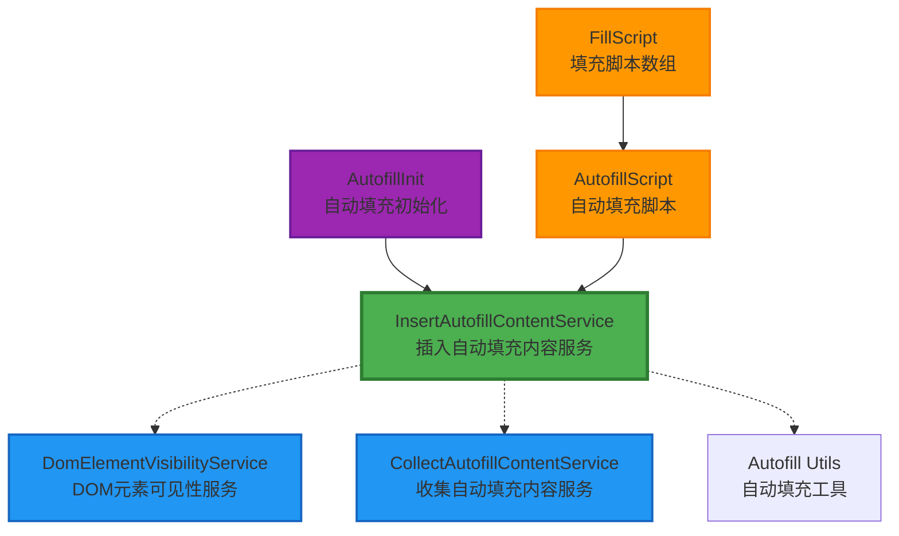
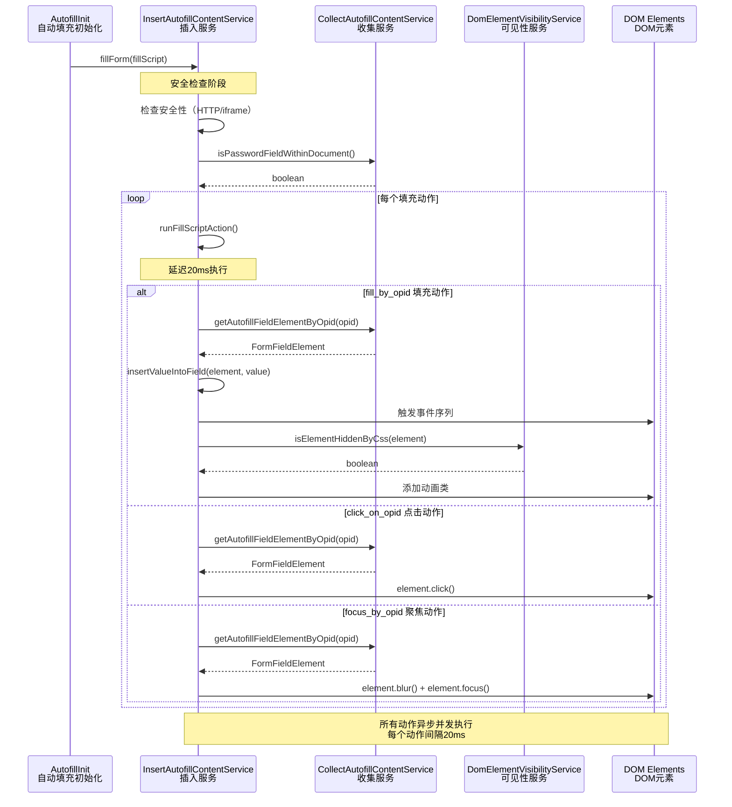
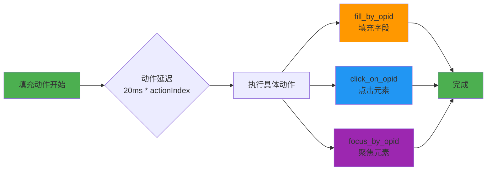
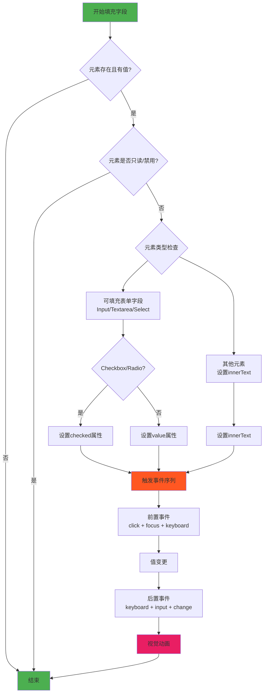
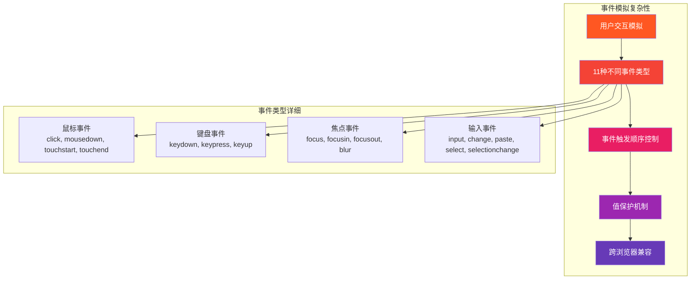
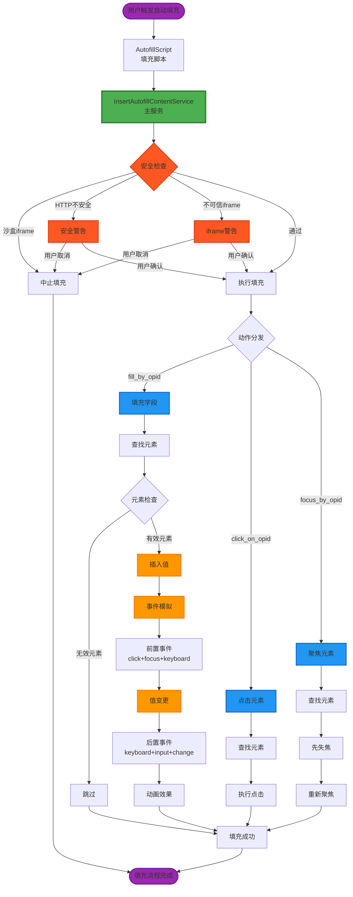
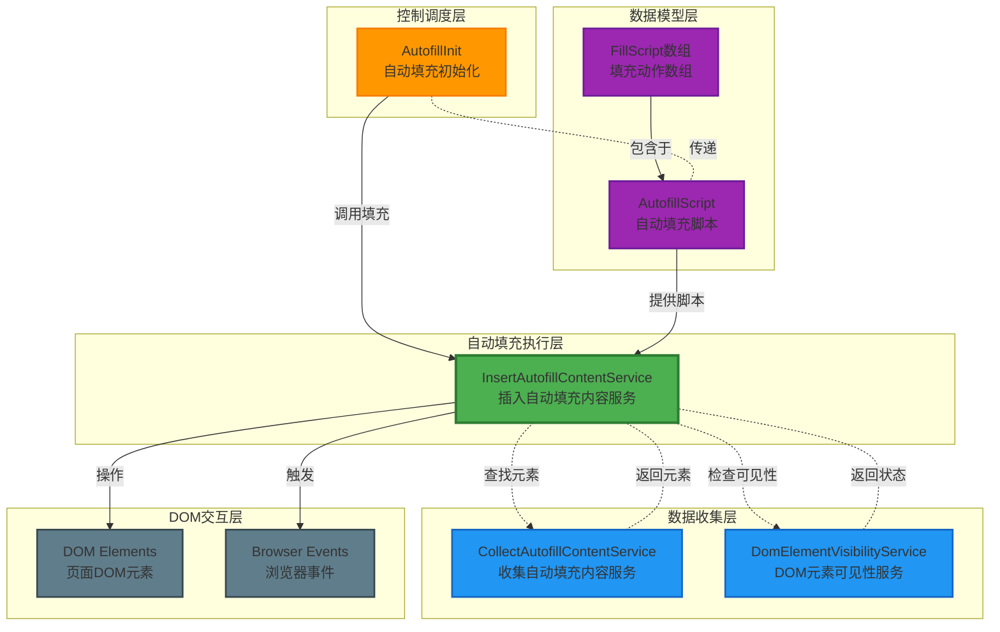

# InsertAutofillContentService 深度分析文档

## 📋 服务概述

`InsertAutofillContentService` 是 Bitwarden 浏览器扩展中负责**表单自动填充执行**的核心服务，位于自动填充架构的最后执行阶段。该服务接收经过处理的填充脚本（AutofillScript），并将用户的凭据安全地插入到网页表单字段中。

### 🎯 核心职责
- 🔐 **安全填充执行**：将用户凭据安全地插入到表单字段
- 🛡️ **安全性验证**：检查不安全的 HTTP 连接和不可信的 iframe
- 🎭 **事件模拟**：模拟真实用户交互以确保网站兼容性
- ✨ **视觉反馈**：提供填充动画效果增强用户体验
- 🎮 **多种填充动作**：支持填充、点击、聚焦等多种操作

---

## 🏗️ 架构设计

### 📦 依赖关系图



### 🔄 服务交互流程



---

## 🔧 核心方法详解

### 1. 🎯 主入口方法 - `fillForm()`

```typescript
async fillForm(fillScript: AutofillScript) {
  // 安全检查层级
  if (!fillScript.script?.length ||              // 脚本为空
      currentlyInSandboxedIframe() ||            // 沙盒化iframe
      this.userCancelledInsecureUrlAutofill() || // 不安全URL
      this.userCancelledUntrustedIframeAutofill()) { // 不可信iframe
    return;
  }

  // 并发执行所有填充动作
  const fillActionPromises = fillScript.script.map(this.runFillScriptAction);
  await Promise.all(fillActionPromises);
}
```

**🔍 安全检查机制：**
- ✅ **脚本完整性**：验证脚本存在且不为空
- 🏖️ **沙盒检测**：防止在沙盒化iframe中执行
- 🔒 **HTTP安全警告**：HTTP站点填充密码时弹出警告
- 🚫 **不可信iframe警告**：在不可信iframe中填充时警告用户

### 2. 🎬 动作执行器 - `runFillScriptAction()`



**⏱️ 时序控制：**
```typescript
private runFillScriptAction = ([action, opid, value]: FillScript, actionIndex: number) => {
  const delayActionsInMilliseconds = 20;
  return new Promise((resolve) =>
    setTimeout(() => {
      this.autofillInsertActions[action]({ opid, value });
      resolve();
    }, delayActionsInMilliseconds * actionIndex),
  );
};
```

### 3. 💾 字段填充核心 - `insertValueIntoField()`



**🎭 复杂的事件模拟序列：**

```typescript
// 前置事件模拟（模拟用户点击和聚焦）
private triggerPreInsertEventsOnElement(element: FormFieldElement): void {
  const initialElementValue = "value" in element ? element.value : "";
  
  this.simulateUserMouseClickAndFocusEventInteractions(element);  // click + focus
  this.simulateUserKeyboardEventInteractions(element);           // keydown + keypress + keyup
  
  // 保护原始值不被事件意外修改
  if ("value" in element && initialElementValue !== element.value) {
    element.value = initialElementValue;
  }
}

// 后置事件模拟（模拟用户输入完成）
private triggerPostInsertEventsOnElement(element: FormFieldElement): void {
  const autofilledValue = "value" in element ? element.value : "";
  this.simulateUserKeyboardEventInteractions(element);           // 再次触发键盘事件
  
  // 确保填充值不被事件覆盖
  if ("value" in element && autofilledValue !== element.value) {
    element.value = autofilledValue;
  }
  
  this.simulateInputElementChangedEvent(element);                // input + change
}
```

---

## 🛡️ 安全机制深度分析

### 1. 🔒 HTTP不安全连接检测

```typescript
private userCancelledInsecureUrlAutofill(savedUrls?: string[]): boolean {
  const conditions = [
    !savedUrls?.some(url => url.startsWith(`https://${globalThis.location.hostname}`)), // 没有HTTPS保存记录
    globalThis.location.protocol !== "http:",                                          // 不在HTTP环境
    !this.isPasswordFieldWithinDocument()                                             // 页面无密码字段
  ];
  
  if (conditions.some(condition => condition)) {
    return false; // 安全，无需警告
  }

  // 显示安全警告
  const confirmationWarning = [
    chrome.i18n.getMessage("insecurePageWarning"),
    chrome.i18n.getMessage("insecurePageWarningFillPrompt", [globalThis.location.hostname]),
  ].join("\n\n");

  return !globalThis.confirm(confirmationWarning);
}
```

**🚨 触发条件：**
- 用户之前在HTTPS版本保存过密码
- 当前页面是HTTP协议
- 页面包含密码字段

### 2. 🚫 不可信iframe检测

```typescript
private userCancelledUntrustedIframeAutofill(fillScript: AutofillScript): boolean {
  if (!fillScript.untrustedIframe) {
    return false; // 可信iframe，无需检查
  }

  const confirmationWarning = [
    chrome.i18n.getMessage("autofillIframeWarning"),
    chrome.i18n.getMessage("autofillIframeWarningTip", [globalThis.location.hostname]),
  ].join("\n\n");

  return !globalThis.confirm(confirmationWarning);
}
```

---

## 🎯 复杂性分析

### 🔴 高复杂度部分

#### 1. **事件模拟系统** - 最复杂的部分



**🧩 复杂性来源：**
- **事件顺序依赖性**：必须按正确顺序触发才能被网站识别
- **值保护逻辑**：防止事件处理器意外修改填充值
- **浏览器差异**：不同浏览器的事件处理机制存在差异
- **网站兼容性**：需要适应各种前端框架的事件处理

#### 2. **表单字段类型识别** - 中等复杂度

```typescript
// 复杂的字段类型判断逻辑
private insertValueIntoField(element: FormFieldElement | null, value: string) {
  const elementCanBeReadonly = elementIsInputElement(element) || elementIsTextAreaElement(element);
  const elementCanBeFilled = elementCanBeReadonly || elementIsSelectElement(element);

  // 多层嵌套的条件检查
  if (!element || !value ||
      (elementCanBeReadonly && element.readOnly) ||
      (elementCanBeFilled && element.disabled)) {
    return;
  }

  // 非标准表单元素处理
  if (!elementIsFillableFormField(element)) {
    this.handleInsertValueAndTriggerSimulatedEvents(element, () => (element.innerText = value));
    return;
  }

  // 特殊输入类型处理（checkbox/radio）
  const isFillableCheckboxOrRadioElement = elementIsInputElement(element) &&
    new Set(["checkbox", "radio"]).has(element.type) &&
    new Set(["true", "y", "1", "yes", "✓"]).has(String(value).toLowerCase());
    
  if (isFillableCheckboxOrRadioElement) {
    this.handleInsertValueAndTriggerSimulatedEvents(element, () => (element.checked = true));
    return;
  }

  // 默认填充逻辑
  this.handleInsertValueAndTriggerSimulatedEvents(element, () => (element.value = value));
}
```

#### 3. **异步并发控制** - 中等复杂度

```mermaid
gantt
    title 填充动作时序图
    dateFormat X
    axisFormat %Lms
    
    section 并发执行
    动作1 (click)    :a1, 0, 1ms
    动作2 (focus)    :a2, 20, 21ms  
    动作3 (fill)     :a3, 40, 41ms
    动作4 (fill)     :a4, 60, 61ms
    
    section 事件模拟
    事件序列1        :e1, 0, 10ms
    事件序列2        :e2, 20, 30ms
    事件序列3        :e3, 40, 50ms
    事件序列4        :e4, 60, 70ms
```



**⚡ 并发控制策略：**
```typescript
// 所有动作并发执行，但每个动作有递增延迟
const fillActionPromises = fillScript.script.map(this.runFillScriptAction);
await Promise.all(fillActionPromises);

// 每个动作的延迟计算
const delayActionsInMilliseconds = 20;
setTimeout(() => {
  this.autofillInsertActions[action]({ opid, value });
}, delayActionsInMilliseconds * actionIndex);
```

### 🟡 中等复杂度部分

#### 1. **安全验证机制**
- HTTP/HTTPS协议检查逻辑
- iframe信任级别判断
- 用户确认对话框交互

#### 2. **元素定位与验证**
- 通过opid（唯一标识符）查找元素
- 元素可用性检查（readOnly, disabled）
- 可见性验证

### 🟢 低复杂度部分

#### 1. **简单交互方法**
- `triggerClickOnElement()` - 简单的点击触发
- `triggerFocusOnElement()` - 基础焦点控制
- 动画类的添加和移除

---

## 🎨 可视化架构图

### 📊 完整数据流图



### 🏢 组件协作关系



---

## 🔧 技术实现细节

### 🎭 事件模拟完整序列

```typescript
// 完整的事件模拟实现
const SIMULATED_EVENTS_SEQUENCE = {
  // 阶段1: 用户接触元素
  preInsert: [
    'mousedown',    // 鼠标按下
    'touchstart',   // 触摸开始（移动端）
    'click',        // 点击事件
    'focus',        // 获得焦点
    'focusin',      // 焦点进入（冒泡）
    'keydown',      // 键盘按下
    'keypress',     // 键盘按键（已废弃但某些网站需要）
    'keyup'         // 键盘抬起
  ],
  
  // 阶段2: 值变更阶段
  valueChange: [
    // 直接修改 element.value 或 element.checked
  ],
  
  // 阶段3: 用户完成输入
  postInsert: [
    'keydown',      // 再次键盘事件（某些框架需要）
    'keypress',     
    'keyup',
    'input',        // 输入事件（现代标准）
    'change',       // 值改变事件
    'paste',        // 粘贴事件
    'select',       // 选择事件
    'selectionchange', // 选择改变
    'touchend',     // 触摸结束
    'focusout',     // 失去焦点
    'blur'          // 模糊事件
  ]
};
```

### 🎨 动画系统

```css
/* 自动填充动画效果 */
.com-bitwarden-browser-animated-fill {
  animation-name: com-bitwarden-browser-autofill-animation;
  animation-duration: 0.2s;
  animation-timing-function: ease-in-out;
  animation-fill-mode: both;
}

@keyframes com-bitwarden-browser-autofill-animation {
  0% { 
    background-color: rgba(74, 144, 226, 0.3);
    border-color: #4A90E2;
  }
  100% { 
    background-color: transparent;
    border-color: initial;
  }
}
```

### 🔍 元素识别系统

```typescript
// OpId (Operation ID) 系统
interface ElementWithOpId extends FormFieldElement {
  opid: string; // 唯一操作标识符
}

// 通过OpId查找元素的完整流程
private getAutofillFieldElementByOpid(opid: string): FormFieldElement | null {
  // 1. 直接查找带opid属性的元素
  let element = document.querySelector(`[opid="${opid}"]`);
  
  // 2. 如果找不到，在Shadow DOM中查找
  if (!element) {
    element = this.searchInShadowDom(opid);
  }
  
  // 3. 验证元素是否为可填充的表单字段
  if (!elementIsFillableFormField(element)) {
    return null;
  }
  
  return element as FormFieldElement;
}
```

---

## 🎯 使用场景和限制

### ✅ 适用场景

1. **🔐 标准登录表单**
   ```html
   <form>
     <input type="text" name="username" opid="123">
     <input type="password" name="password" opid="124">  
     <button type="submit">登录</button>
   </form>
   ```

2. **📝 多步骤表单填充**
   ```javascript
   const fillScript = {
     script: [
       ["focus_by_opid", "username"],        // 先聚焦用户名
       ["fill_by_opid", "username", "user"], // 填充用户名
       ["focus_by_opid", "password"],        // 聚焦密码字段
       ["fill_by_opid", "password", "pass"], // 填充密码
       ["click_on_opid", "login-btn"]        // 点击登录按钮
     ]
   };
   ```

3. **☑️ 复选框和单选按钮**
   ```typescript
   // 支持多种"真值"表示
   const truthyValues = ["true", "y", "1", "yes", "✓"];
   ```

### ❌ 限制和约束

1. **🏖️ 沙盒化iframe限制**
   - 无法在沙盒化iframe中执行（安全限制）
   - `confirm()` 对话框被阻止

2. **🔒 HTTPS安全限制**  
   - HTTP站点填充密码需要用户确认
   - 不可信iframe需要额外警告

3. **🎭 框架兼容性挑战**
   ```typescript
   // 某些现代框架可能需要特殊处理
   // React: 需要触发 onChange 事件
   // Vue: 需要特定的事件序列
   // Angular: 可能需要 ngModel 更新
   ```

4. **⚡ 性能考虑**
   - 动作间20ms延迟可能影响大表单填充速度
   - 复杂事件模拟增加CPU使用率

---

## 🎯 最佳实践建议

### 🚀 性能优化

1. **📊 批量操作优化**
   ```typescript
   // 避免过于频繁的DOM查询
   const elements = fillScript.script.map(([action, opid]) => 
     ({ action, opid, element: this.collectAutofillContentService.getAutofillFieldElementByOpid(opid) })
   );
   ```

2. **⚡ 事件节流**
   ```typescript
   // 对于相同元素的连续操作，可以合并事件
   if (previousElement === currentElement) {
     // 跳过重复的focus事件
   }
   ```

### 🛡️ 安全加强

1. **🔍 输入验证**
   ```typescript
   // 验证填充值的安全性
   private sanitizeValue(value: string): string {
     return value.replace(/<script[^>]*>.*?<\/script>/gi, '');
   }
   ```

2. **🚫 CSP兼容性**
   ```typescript
   // 确保在严格的CSP环境下也能工作
   private isCSPCompliant(): boolean {
     // 检查Content Security Policy限制
   }
   ```

### 🎨 用户体验提升

1. **📱 移动端适配**
   ```typescript
   // 移动端需要不同的事件序列
   private isMobileDevice(): boolean {
     return /Android|iPhone|iPad|iPod|BlackBerry|IEMobile|Opera Mini/i.test(navigator.userAgent);
   }
   ```

2. **♿ 无障碍支持**
   ```typescript
   // 确保屏幕阅读器兼容性
   private announceToScreenReader(message: string): void {
     // 添加aria-live区域通知
   }
   ```

---

## 📊 总结评估

### 🎯 服务优势

- ✅ **高兼容性**：支持各种表单类型和现代Web框架
- ✅ **安全可靠**：多层安全检查确保用户数据安全
- ✅ **用户友好**：视觉动画和无障碍支持提升体验
- ✅ **架构清晰**：职责分离，便于维护和扩展

### ⚠️ 复杂性挑战

- 🔴 **事件模拟复杂**：需要维护复杂的事件序列以兼容不同网站
- 🟡 **浏览器兼容**：不同浏览器的事件处理机制差异
- 🟡 **性能权衡**：安全性和兼容性带来的性能开销

### 🚀 改进建议

1. **📈 性能优化**：考虑使用WebAssembly优化事件模拟
2. **🤖 智能适配**：基于网站检测自动调整事件策列
3. **📊 监控系统**：添加填充成功率统计和错误追踪
4. **🔧 可配置性**：允许高级用户自定义填充行为

`InsertAutofillContentService` 是一个设计精良但实现复杂的核心服务，在自动填充的准确性、安全性和兼容性之间找到了良好的平衡点。其复杂的事件模拟系统虽然增加了维护成本，但确保了在各种Web环境下的可靠运行。