# TokenService 架构详解

## 概述

TokenService 是 Bitwarden 浏览器扩展中的核心认证服务，负责管理用户的访问令牌（Access Token）和刷新令牌（Refresh Token），是整个认证和授权体系的基石。虽然 TokenService 本身的实现位于 `@bitwarden/common` 包中，但它在浏览器扩展中扮演着至关重要的角色。

## TokenService 在整体架构中的位置

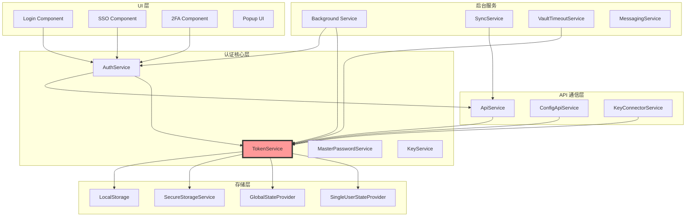
```mermaid
graph TB
    subgraph "认证核心层"
        TS[TokenService]
        AS[AuthService]
        MS[MasterPasswordService]
        KS[KeyService]
    end
    
    subgraph "API 通信层"
        API[ApiService]
        CONFIG[ConfigApiService]
        KC[KeyConnectorService]
    end
    
    subgraph "存储层"
        SSP[SingleUserStateProvider]
        GSP[GlobalStateProvider]
        SS[SecureStorageService]
        LS[LocalStorage]
    end
    
    subgraph "UI 层"
        LOGIN[Login Component]
        SSO[SSO Component]
        2FA[2FA Component]
        POPUP[Popup UI]
    end
    
    subgraph "后台服务"
        BG[Background Service]
        SYNC[SyncService]
        VT[VaultTimeoutService]
        MSG[MessagingService]
    end
    
    TS --> SSP
    TS --> GSP
    TS --> SS
    
    API --> TS
    CONFIG --> TS
    KC --> TS
    
    AS --> TS
    AS --> API
    
    BG --> TS
    BG --> AS
    
    LOGIN --> AS
    SSO --> AS
    2FA --> AS
    
    SYNC --> API
    VT --> TS
    
    TS --> LS
    
    style TS fill:#ff9999,stroke:#333,stroke-width:4px
```

## TokenService 的初始化流程

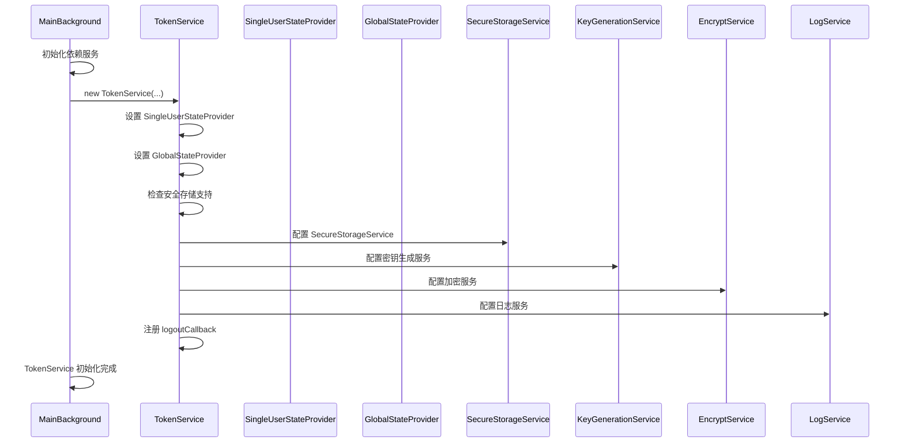
```mermaid
sequenceDiagram
    participant MB as MainBackground
    participant TS as TokenService
    participant SSP as SingleUserStateProvider
    participant GSP as GlobalStateProvider
    participant SS as SecureStorageService
    participant KGS as KeyGenerationService
    participant ES as EncryptService
    participant LS as LogService
    
    MB->>MB: 初始化依赖服务
    MB->>TS: new TokenService(...)
    TS->>TS: 设置 SingleUserStateProvider
    TS->>TS: 设置 GlobalStateProvider
    TS->>TS: 检查安全存储支持
    TS->>SS: 配置 SecureStorageService
    TS->>KGS: 配置密钥生成服务
    TS->>ES: 配置加密服务
    TS->>LS: 配置日志服务
    TS->>TS: 注册 logoutCallback
    MB->>MB: TokenService 初始化完成
```

### 初始化代码位置

```typescript
// src/background/main.background.ts:629-638
this.tokenService = new TokenService(
  this.singleUserStateProvider,      // 单用户状态管理
  this.globalStateProvider,          // 全局状态管理
  this.platformUtilsService.supportsSecureStorage(), // 是否支持安全存储
  this.secureStorageService,         // 安全存储服务
  this.keyGenerationService,         // 密钥生成
  this.encryptService,               // 加密服务
  this.logService,                   // 日志
  logoutCallback,                    // 登出回调
);
```

## TokenService 的核心功能

### 1. Token 存储架构

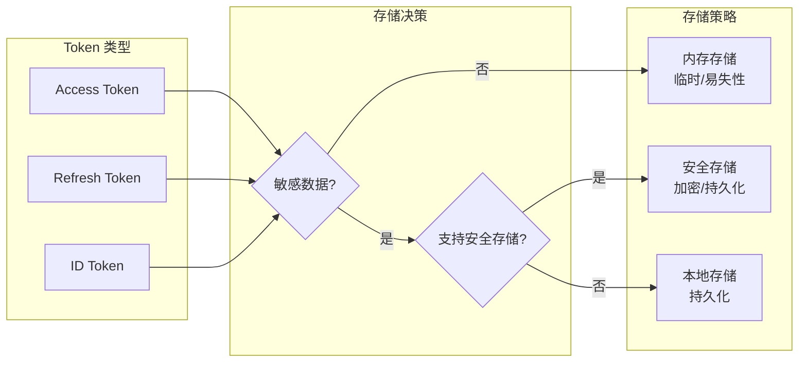
```mermaid
graph LR
    subgraph "Token 类型"
        AT[Access Token]
        RT[Refresh Token]
        IDT[ID Token]
    end
    
    subgraph "存储策略"
        MEM[内存存储<br/>临时/易失性]
        SEC[安全存储<br/>加密/持久化]
        LOCAL[本地存储<br/>持久化]
    end
    
    subgraph "存储决策"
        SECURE_CHECK{支持安全存储?}
        SENSITIVE{敏感数据?}
    end
    
    AT --> SENSITIVE
    RT --> SENSITIVE
    IDT --> SENSITIVE
    
    SENSITIVE -->|是| SECURE_CHECK
    SECURE_CHECK -->|是| SEC
    SECURE_CHECK -->|否| LOCAL
    SENSITIVE -->|否| MEM
```

### 2. Token 生命周期管理

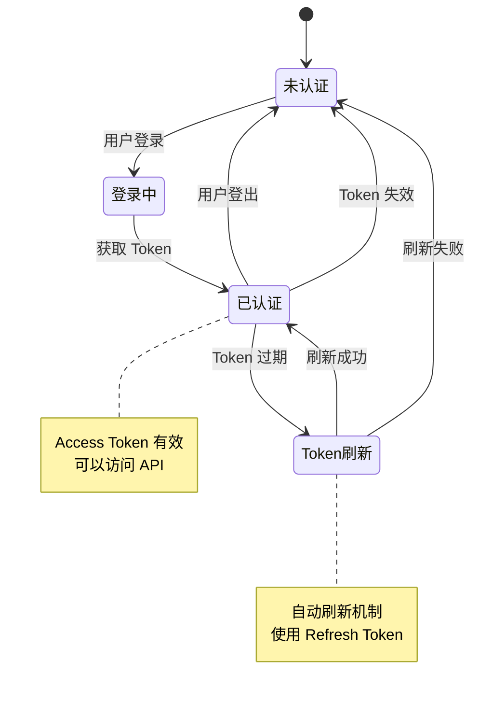
```mermaid
stateDiagram-v2
    [*] --> 未认证
    未认证 --> 登录中: 用户登录
    登录中 --> 已认证: 获取 Token
    已认证 --> Token刷新: Token 过期
    Token刷新 --> 已认证: 刷新成功
    Token刷新 --> 未认证: 刷新失败
    已认证 --> 未认证: 用户登出
    已认证 --> 未认证: Token 失效
    
    note right of Token刷新
        自动刷新机制
        使用 Refresh Token
    end note
    
    note right of 已认证
        Access Token 有效
        可以访问 API
    end note
```

## TokenService 与其他服务的交互

### 1. ApiService 集成

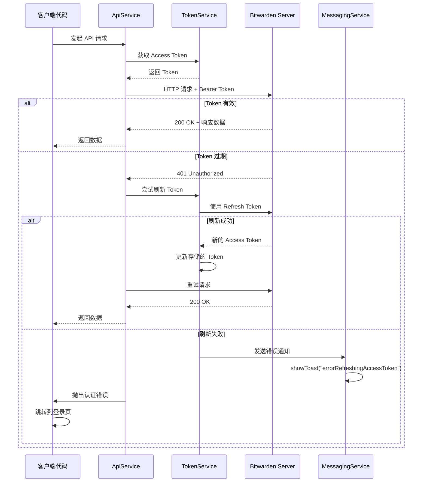
```mermaid
sequenceDiagram
    participant Client as 客户端代码
    participant API as ApiService
    participant TS as TokenService
    participant Server as Bitwarden Server
    participant MSG as MessagingService
    
    Client->>API: 发起 API 请求
    API->>TS: 获取 Access Token
    TS-->>API: 返回 Token
    API->>Server: HTTP 请求 + Bearer Token
    
    alt Token 有效
        Server-->>API: 200 OK + 响应数据
        API-->>Client: 返回数据
    else Token 过期
        Server-->>API: 401 Unauthorized
        API->>TS: 尝试刷新 Token
        TS->>Server: 使用 Refresh Token
        
        alt 刷新成功
            Server-->>TS: 新的 Access Token
            TS->>TS: 更新存储的 Token
            API->>Server: 重试请求
            Server-->>API: 200 OK
            API-->>Client: 返回数据
        else 刷新失败
            TS->>MSG: 发送错误通知
            MSG->>MSG: showToast("errorRefreshingAccessToken")
            API->>Client: 抛出认证错误
            Client->>Client: 跳转到登录页
        end
    end
```

### 2. AuthService 协作

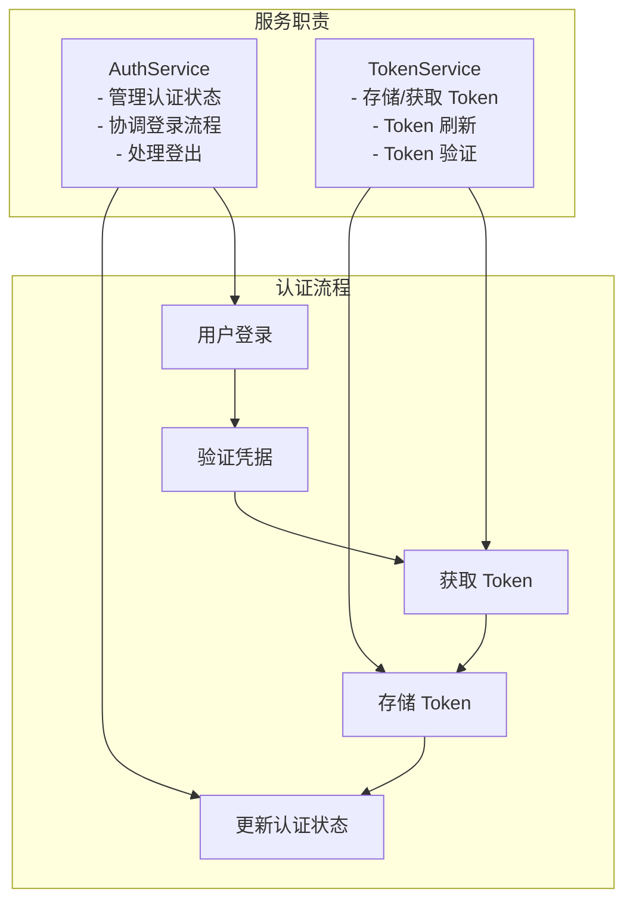
```mermaid
graph TB
    subgraph "认证流程"
        LOGIN[用户登录]
        CRED[验证凭据]
        TOKEN[获取 Token]
        STORE[存储 Token]
        AUTH[更新认证状态]
    end
    
    subgraph "服务职责"
        AS_RESP[AuthService<br/>- 管理认证状态<br/>- 协调登录流程<br/>- 处理登出]
        TS_RESP[TokenService<br/>- 存储/获取 Token<br/>- Token 刷新<br/>- Token 验证]
    end
    
    LOGIN --> CRED
    CRED --> TOKEN
    TOKEN --> STORE
    STORE --> AUTH
    
    AS_RESP --> LOGIN
    AS_RESP --> AUTH
    TS_RESP --> TOKEN
    TS_RESP --> STORE
```

### 3. 与 KeyConnectorService 的交互

```typescript
// src/background/main.background.ts:761-772
this.keyConnectorService = new KeyConnectorService(
  this.accountService,
  this.masterPasswordService,
  this.keyService,
  this.apiService,
  this.tokenService,  // TokenService 作为依赖
  this.logService,
  this.organizationService,
  this.keyGenerationService,
  logoutCallback,
  this.stateProvider,
);
```

## 复杂的认证流程

### 1. SSO 认证流程

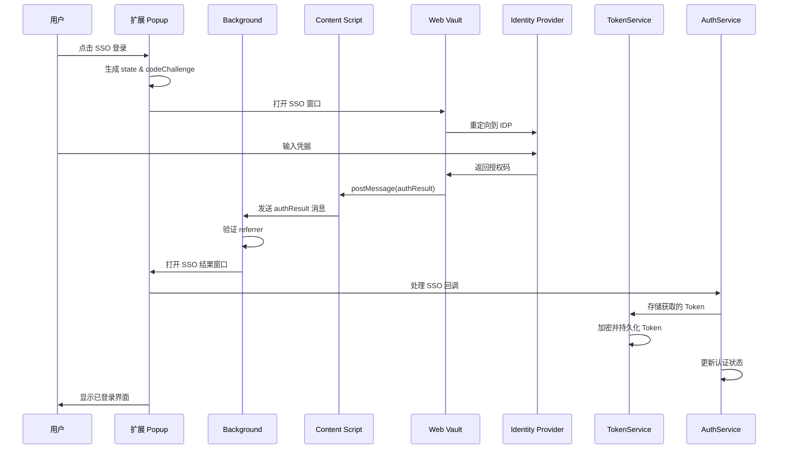
```mermaid
sequenceDiagram
    participant User as 用户
    participant Ext as 扩展 Popup
    participant BG as Background
    participant CS as Content Script
    participant Web as Web Vault
    participant IDP as Identity Provider
    participant TS as TokenService
    participant AS as AuthService
    
    User->>Ext: 点击 SSO 登录
    Ext->>Ext: 生成 state & codeChallenge
    Ext->>Web: 打开 SSO 窗口
    Web->>IDP: 重定向到 IDP
    User->>IDP: 输入凭据
    IDP->>Web: 返回授权码
    Web->>CS: postMessage(authResult)
    CS->>BG: 发送 authResult 消息
    BG->>BG: 验证 referrer
    BG->>Ext: 打开 SSO 结果窗口
    Ext->>AS: 处理 SSO 回调
    AS->>TS: 存储获取的 Token
    TS->>TS: 加密并持久化 Token
    AS->>AS: 更新认证状态
    Ext->>User: 显示已登录界面
```

### 2. 双因素认证 (2FA) 流程

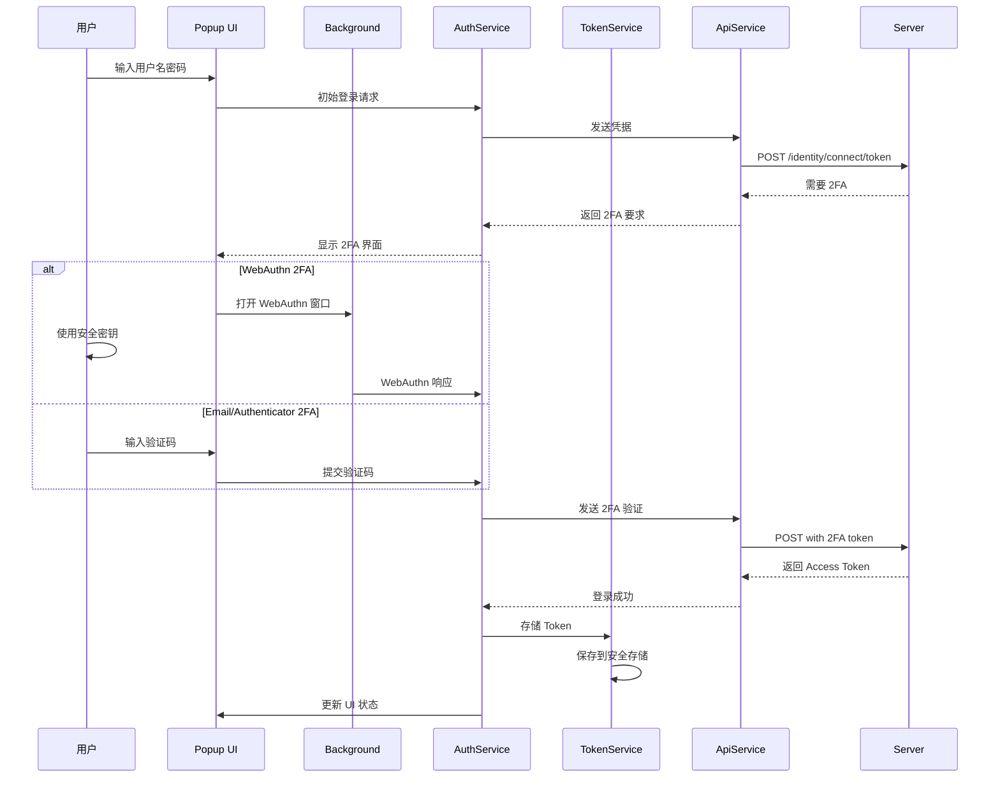
```mermaid
sequenceDiagram
    participant User as 用户
    participant Popup as Popup UI
    participant BG as Background
    participant AS as AuthService
    participant TS as TokenService
    participant API as ApiService
    participant Server as Server
    
    User->>Popup: 输入用户名密码
    Popup->>AS: 初始登录请求
    AS->>API: 发送凭据
    API->>Server: POST /identity/connect/token
    Server-->>API: 需要 2FA
    API-->>AS: 返回 2FA 要求
    AS-->>Popup: 显示 2FA 界面
    
    alt WebAuthn 2FA
        Popup->>BG: 打开 WebAuthn 窗口
        User->>User: 使用安全密钥
        BG->>AS: WebAuthn 响应
    else Email/Authenticator 2FA
        User->>Popup: 输入验证码
        Popup->>AS: 提交验证码
    end
    
    AS->>API: 发送 2FA 验证
    API->>Server: POST with 2FA token
    Server-->>API: 返回 Access Token
    API-->>AS: 登录成功
    AS->>TS: 存储 Token
    TS->>TS: 保存到安全存储
    AS->>Popup: 更新 UI 状态
```

### 3. Token 刷新错误处理

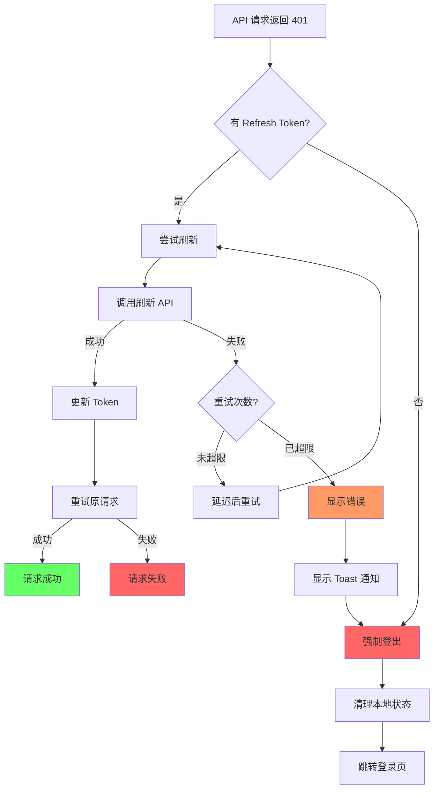
```mermaid
flowchart TB
    START[API 请求返回 401] --> CHECK_RT{有 Refresh Token?}
    
    CHECK_RT -->|是| TRY_REFRESH[尝试刷新]
    CHECK_RT -->|否| LOGOUT[强制登出]
    
    TRY_REFRESH --> REFRESH_API[调用刷新 API]
    
    REFRESH_API -->|成功| UPDATE_TOKEN[更新 Token]
    REFRESH_API -->|失败| CHECK_RETRY{重试次数?}
    
    UPDATE_TOKEN --> RETRY_REQUEST[重试原请求]
    
    CHECK_RETRY -->|未超限| DELAY[延迟后重试]
    CHECK_RETRY -->|已超限| SHOW_ERROR[显示错误]
    
    DELAY --> TRY_REFRESH
    
    SHOW_ERROR --> TOAST[显示 Toast 通知]
    TOAST --> LOGOUT
    
    LOGOUT --> CLEAR[清理本地状态]
    CLEAR --> REDIRECT[跳转登录页]
    
    RETRY_REQUEST -->|成功| END_SUCCESS[请求成功]
    RETRY_REQUEST -->|失败| END_FAIL[请求失败]
    
    style LOGOUT fill:#ff6666
    style SHOW_ERROR fill:#ff9966
    style END_SUCCESS fill:#66ff66
    style END_FAIL fill:#ff6666
```

### 4. 登出流程中的 Token 清理

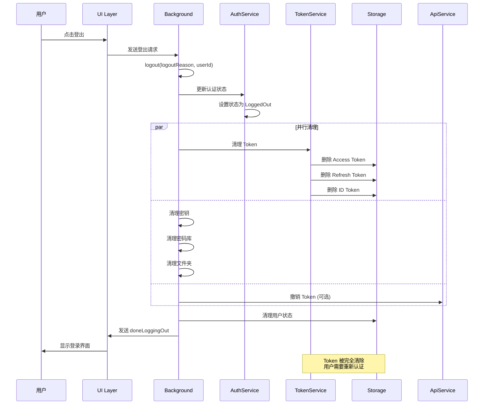
```mermaid
sequenceDiagram
    participant User as 用户
    participant UI as UI Layer
    participant BG as Background
    participant AS as AuthService
    participant TS as TokenService
    participant Storage as Storage
    participant API as ApiService
    
    User->>UI: 点击登出
    UI->>BG: 发送登出请求
    BG->>BG: logout(logoutReason, userId)
    
    BG->>AS: 更新认证状态
    AS->>AS: 设置状态为 LoggedOut
    
    par 并行清理
        BG->>TS: 清理 Token
        TS->>Storage: 删除 Access Token
        TS->>Storage: 删除 Refresh Token
        TS->>Storage: 删除 ID Token
    and
        BG->>BG: 清理密钥
        BG->>BG: 清理密码库
        BG->>BG: 清理文件夹
    and
        BG->>API: 撤销 Token (可选)
    end
    
    BG->>Storage: 清理用户状态
    BG->>UI: 发送 doneLoggingOut
    UI->>User: 显示登录界面
    
    note over TS, Storage: Token 被完全清除<br/>用户需要重新认证
```

## TokenService 的关键交互点

### 1. 依赖 TokenService 的服务

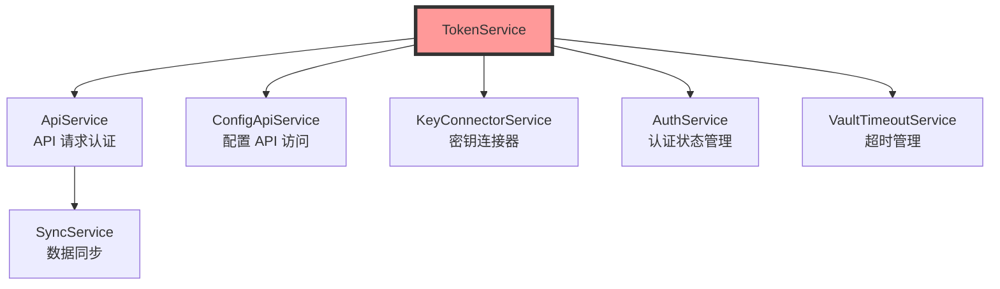
```mermaid
graph TD
    TS[TokenService]
    
    API[ApiService<br/>API 请求认证]
    CONFIG[ConfigApiService<br/>配置 API 访问]
    KC[KeyConnectorService<br/>密钥连接器]
    AUTH[AuthService<br/>认证状态管理]
    VTS[VaultTimeoutService<br/>超时管理]
    SYNC[SyncService<br/>数据同步]
    
    TS --> API
    TS --> CONFIG
    TS --> KC
    TS --> AUTH
    TS --> VTS
    API --> SYNC
    
    style TS fill:#ff9999,stroke:#333,stroke-width:4px
```

### 2. Token 刷新回调机制

```typescript
// src/background/main.background.ts:467-474
const refreshAccessTokenErrorCallback = () => {
  // 当 Token 刷新失败时的处理
  this.messagingService.send("showToast", {
    type: "error",
    title: this.i18nService.t("errorRefreshingAccessToken"),
    message: this.i18nService.t("errorRefreshingAccessTokenDesc"),
  });
};
```

## 安全考虑

### 1. Token 存储安全

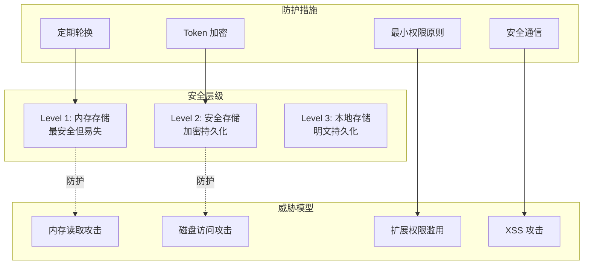
```mermaid
graph TB
    subgraph "安全层级"
        L1[Level 1: 内存存储<br/>最安全但易失]
        L2[Level 2: 安全存储<br/>加密持久化]
        L3[Level 3: 本地存储<br/>明文持久化]
    end
    
    subgraph "威胁模型"
        T1[内存读取攻击]
        T2[磁盘访问攻击]
        T3[扩展权限滥用]
        T4[XSS 攻击]
    end
    
    subgraph "防护措施"
        P1[Token 加密]
        P2[定期轮换]
        P3[最小权限原则]
        P4[安全通信]
    end
    
    L1 -.->|防护| T1
    L2 -.->|防护| T2
    P1 --> L2
    P2 --> L1
    P3 --> T3
    P4 --> T4
```

### 2. Token 生命周期安全

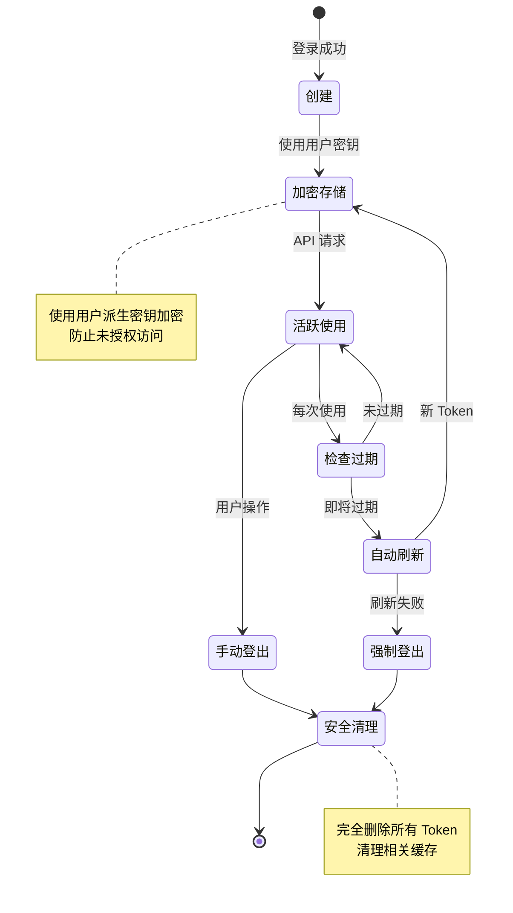
```mermaid
stateDiagram-v2
    [*] --> 创建: 登录成功
    创建 --> 加密存储: 使用用户密钥
    加密存储 --> 活跃使用: API 请求
    活跃使用 --> 检查过期: 每次使用
    检查过期 --> 活跃使用: 未过期
    检查过期 --> 自动刷新: 即将过期
    自动刷新 --> 加密存储: 新 Token
    活跃使用 --> 手动登出: 用户操作
    自动刷新 --> 强制登出: 刷新失败
    手动登出 --> 安全清理
    强制登出 --> 安全清理
    安全清理 --> [*]
    
    note right of 加密存储
        使用用户派生密钥加密
        防止未授权访问
    end note
    
    note right of 安全清理
        完全删除所有 Token
        清理相关缓存
    end note
```

## 复杂和难懂的部分

### 1. 多账户 Token 管理

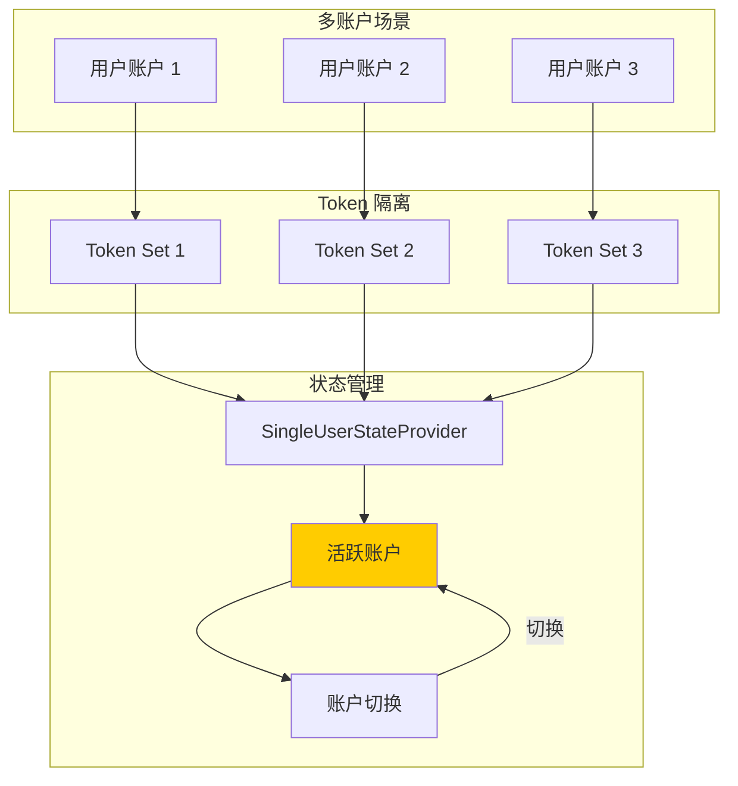
```mermaid
graph TB
    subgraph "多账户场景"
        U1[用户账户 1]
        U2[用户账户 2]
        U3[用户账户 3]
    end
    
    subgraph "Token 隔离"
        T1[Token Set 1]
        T2[Token Set 2]
        T3[Token Set 3]
    end
    
    subgraph "状态管理"
        SSP[SingleUserStateProvider]
        ACTIVE[活跃账户]
        SWITCH[账户切换]
    end
    
    U1 --> T1
    U2 --> T2
    U3 --> T3
    
    T1 --> SSP
    T2 --> SSP
    T3 --> SSP
    
    SSP --> ACTIVE
    ACTIVE --> SWITCH
    SWITCH --> |切换| ACTIVE
    
    style ACTIVE fill:#ffcc00
```

### 2. Token 刷新竞态条件

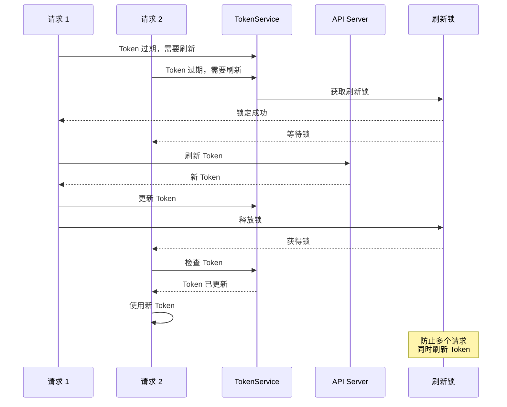
```mermaid
sequenceDiagram
    participant R1 as 请求 1
    participant R2 as 请求 2
    participant TS as TokenService
    participant API as API Server
    participant LOCK as 刷新锁
    
    R1->>TS: Token 过期，需要刷新
    R2->>TS: Token 过期，需要刷新
    
    TS->>LOCK: 获取刷新锁
    LOCK-->>R1: 锁定成功
    LOCK-->>R2: 等待锁
    
    R1->>API: 刷新 Token
    API-->>R1: 新 Token
    R1->>TS: 更新 Token
    R1->>LOCK: 释放锁
    
    LOCK-->>R2: 获得锁
    R2->>TS: 检查 Token
    TS-->>R2: Token 已更新
    R2->>R2: 使用新 Token
    
    note over LOCK: 防止多个请求<br/>同时刷新 Token
```

### 3. 离线场景处理

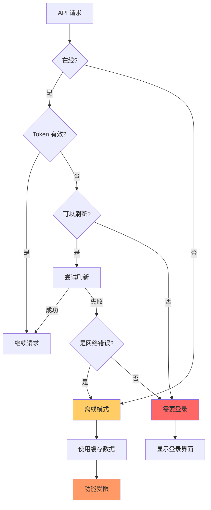
```mermaid
flowchart TB
    REQ[API 请求] --> ONLINE{在线?}
    
    ONLINE -->|是| CHECK_TOKEN{Token 有效?}
    ONLINE -->|否| OFFLINE_MODE[离线模式]
    
    CHECK_TOKEN -->|是| PROCEED[继续请求]
    CHECK_TOKEN -->|否| REFRESH{可以刷新?}
    
    REFRESH -->|是| TRY_REFRESH[尝试刷新]
    REFRESH -->|否| REQUIRE_LOGIN[需要登录]
    
    TRY_REFRESH -->|成功| PROCEED
    TRY_REFRESH -->|失败| OFFLINE_CHECK{是网络错误?}
    
    OFFLINE_CHECK -->|是| OFFLINE_MODE
    OFFLINE_CHECK -->|否| REQUIRE_LOGIN
    
    OFFLINE_MODE --> USE_CACHE[使用缓存数据]
    USE_CACHE --> LIMITED[功能受限]
    
    REQUIRE_LOGIN --> LOGIN_UI[显示登录界面]
    
    style OFFLINE_MODE fill:#ffcc66
    style LIMITED fill:#ff9966
    style REQUIRE_LOGIN fill:#ff6666
```

## 性能优化

### 1. Token 缓存策略

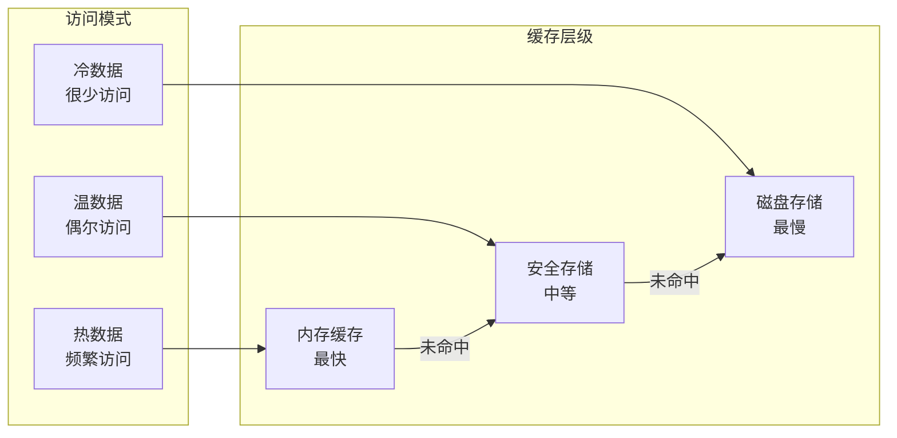
```mermaid
graph LR
    subgraph "缓存层级"
        MEM[内存缓存<br/>最快]
        SEC[安全存储<br/>中等]
        DISK[磁盘存储<br/>最慢]
    end
    
    subgraph "访问模式"
        HOT[热数据<br/>频繁访问]
        WARM[温数据<br/>偶尔访问]
        COLD[冷数据<br/>很少访问]
    end
    
    HOT --> MEM
    WARM --> SEC
    COLD --> DISK
    
    MEM -->|未命中| SEC
    SEC -->|未命中| DISK
```

### 2. 批量请求优化

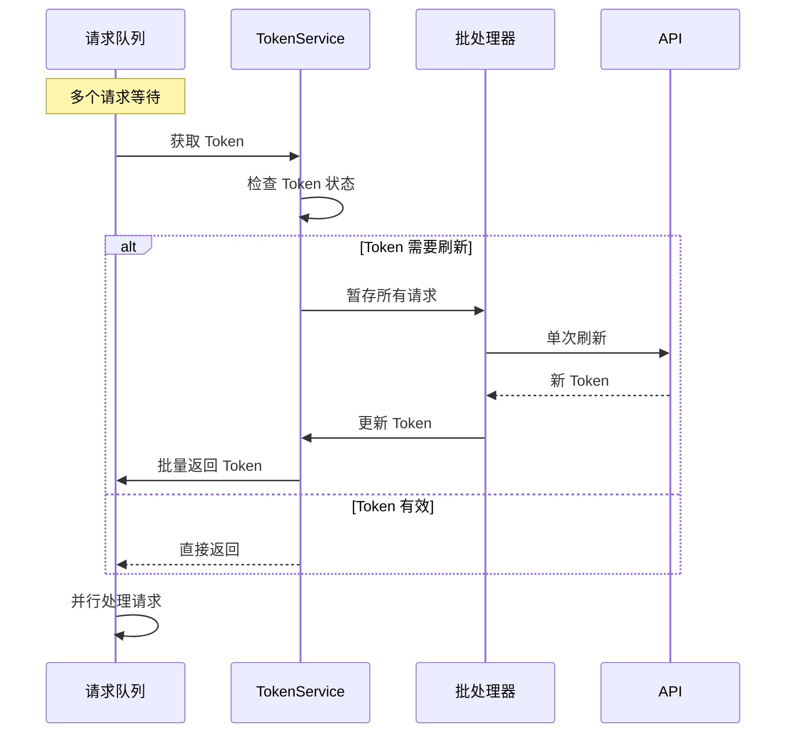
```mermaid
sequenceDiagram
    participant Q as 请求队列
    participant TS as TokenService
    participant B as 批处理器
    participant API as API
    
    Note over Q: 多个请求等待
    Q->>TS: 获取 Token
    TS->>TS: 检查 Token 状态
    
    alt Token 需要刷新
        TS->>B: 暂存所有请求
        B->>API: 单次刷新
        API-->>B: 新 Token
        B->>TS: 更新 Token
        TS->>Q: 批量返回 Token
    else Token 有效
        TS-->>Q: 直接返回
    end
    
    Q->>Q: 并行处理请求
```

## 调试和监控

### 1. Token 状态调试

```javascript
// 在浏览器控制台调试 Token 状态
chrome.runtime.sendMessage({
  command: "debugTokenStatus"
}, (response) => {
  console.log("Token Status:", response);
});
```

### 2. 常见问题诊断

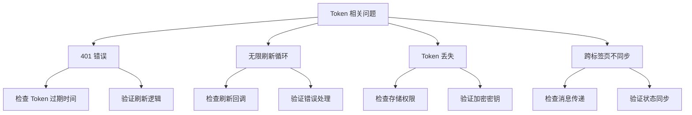
```mermaid
graph TD
    ISSUE[Token 相关问题]
    
    I1[401 错误]
    I2[无限刷新循环]
    I3[Token 丢失]
    I4[跨标签页不同步]
    
    ISSUE --> I1
    ISSUE --> I2
    ISSUE --> I3
    ISSUE --> I4
    
    I1 --> C1[检查 Token 过期时间]
    I1 --> C2[验证刷新逻辑]
    
    I2 --> C3[检查刷新回调]
    I2 --> C4[验证错误处理]
    
    I3 --> C5[检查存储权限]
    I3 --> C6[验证加密密钥]
    
    I4 --> C7[检查消息传递]
    I4 --> C8[验证状态同步]
```

## 总结

TokenService 虽然代码实现相对简单，但它在整个扩展架构中的作用极其重要：

1. **核心地位**：几乎所有需要认证的操作都依赖 TokenService
2. **安全关键**：负责敏感认证信息的安全存储和管理
3. **性能影响**：Token 管理的效率直接影响用户体验
4. **复杂交互**：与多个服务协同工作，处理各种边缘情况

### 关键挑战

- **多账户管理**：需要隔离不同账户的 Token
- **并发控制**：防止 Token 刷新的竞态条件
- **安全存储**：平衡安全性和可用性
- **错误恢复**：优雅处理各种失败场景
- **性能优化**：减少不必要的 Token 验证和刷新

### 最佳实践

1. 始终使用安全存储（如果可用）
2. 实现 Token 刷新的防抖和节流
3. 正确处理离线场景
4. 定期清理过期 Token
5. 监控 Token 刷新失败率
6. 实现适当的重试机制