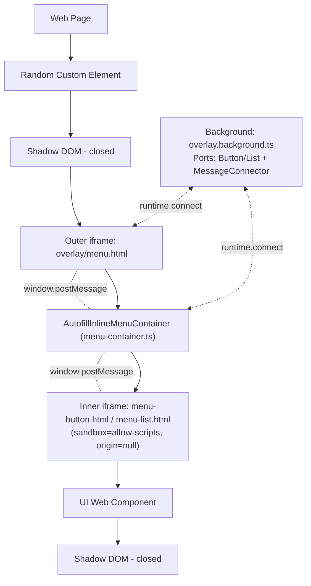
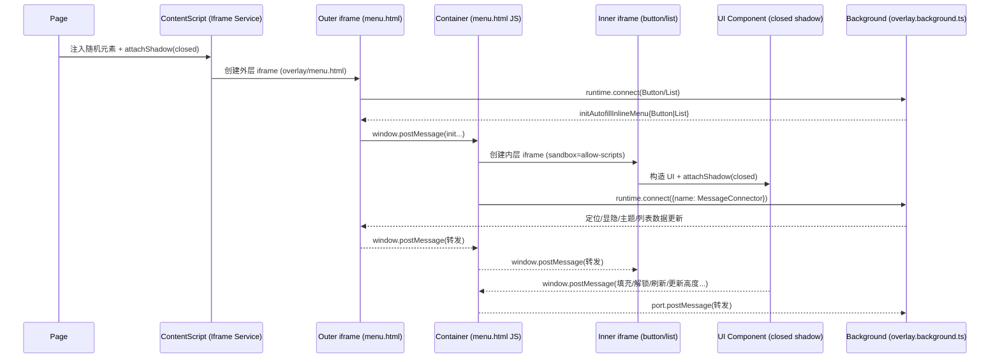

# Autofill Inline Menu 组件包装器设计与流程（基于 apps/browser 实际代码）

本文档基于仓库 apps/browser 目录下的真实实现文件，系统化说明 Autofill Inline Menu 组件包装器的架构、权限与隔离策略、消息流转与关键代码。文中所有代码与路径均来自实际代码库，不做臆造。

- 范围：`apps/browser/src/autofill/overlay/inline-menu/**`、`apps/browser/src/autofill/background/**`
- 目标：清晰解释“随机元素 → Shadow DOM(closed) → 外层 iframe → 内层 iframe → Shadow DOM(closed) → 真实 UI”的多层结构及其通信流程与安全动机。

---

## 一、总体架构（结构图）



要点：
- 页面中注入“随机命名”的宿主元素并 `attachShadow({mode: "closed"})`，在 Shadow DOM 内插入“外层 iframe”。
- 外层 iframe 运行在扩展源（chrome-extension://），可与背景页建立端口；容器脚本负责创建“内层 iframe”。
- 内层 iframe 采用 `sandbox=allow-scripts`（origin=null），仅能执行脚本，不能直接使用扩展 API，仅通过 `window.postMessage` 与容器通信；内层页面的 UI 也使用 `closed Shadow DOM`。

---

## 二、层次职责与关键代码

### 1) 页面注入与随机元素 + closed Shadow DOM + 外层 iframe

- 文件：`apps/browser/src/autofill/overlay/inline-menu/content/autofill-inline-menu-content.service.ts`

创建“随机自定义元素”并在其构造函数里实例化外层 iframe 封装（Button/List 两类）：

```ts
// createButtonElement（节选）
// Firefox 分支省略，这里展示随机标签名 + 自定义元素方式
const customElementName = this.generateRandomCustomElementName();
globalThis.customElements?.define(
  customElementName,
  class extends HTMLElement {
    constructor() {
      super();
      new AutofillInlineMenuButtonIframe(this);
    }
  },
);
this.buttonElement = globalThis.document.createElement(customElementName);
```

- 文件：`apps/browser/src/autofill/overlay/inline-menu/iframe-content/autofill-inline-menu-iframe-element.ts`

在宿主元素上创建 closed Shadow DOM，并交由服务创建外层 iframe：

```ts
export class AutofillInlineMenuIframeElement {
  constructor(
    element: HTMLElement,
    portName: string,
    initStyles: Partial<CSSStyleDeclaration>,
    iframeTitle: string,
    ariaAlert?: string,
  ) {
    const shadow: ShadowRoot = element.attachShadow({ mode: "closed" });
    const service = new AutofillInlineMenuIframeService(
      shadow,
      portName,
      initStyles,
      iframeTitle,
      ariaAlert,
    );
    service.initMenuIframe();
  }
}
```

- 文件：`apps/browser/src/autofill/overlay/inline-menu/iframe-content/autofill-inline-menu-iframe.service.ts`

外层 iframe 的创建、样式与端口连接：

```ts
initMenuIframe() {
  this.defaultIframeAttributes.src = chrome.runtime.getURL("overlay/menu.html");
  this.defaultIframeAttributes.title = this.iframeTitle;

  this.iframe = globalThis.document.createElement("iframe");
  for (const [attribute, value] of Object.entries(this.defaultIframeAttributes)) {
    this.iframe.setAttribute(attribute, value);
  }
  this.iframeStyles = { ...this.iframeStyles, ...this.initStyles };
  this.setElementStyles(this.iframe, this.iframeStyles, true);
  this.iframe.addEventListener(EVENTS.LOAD, this.setupPortMessageListener);

  if (this.ariaAlert) {
    this.createAriaAlertElement();
  }

  this.shadow.appendChild(this.iframe);
  this.observeIframe();
}

private setupPortMessageListener = () => {
  this.port = chrome.runtime.connect({ name: this.portName });
  this.port.onDisconnect.addListener(this.handlePortDisconnect);
  this.port.onMessage.addListener(this.handlePortMessage);
  this.announceAriaAlert(this.ariaAlert, 2000);
};
```

### 2) 容器脚本（外层 iframe 内）创建内层 iframe（sandbox）与消息桥接

- 文件：`apps/browser/src/autofill/overlay/inline-menu/pages/menu-container/autofill-inline-menu-container.ts`

内层 iframe 的默认属性包含 `sandbox: "allow-scripts"`，确保其为 null 源：

```ts
private readonly defaultIframeAttributes: Record<string, string> = {
  src: "",
  title: "",
  sandbox: "allow-scripts",
  allowtransparency: "true",
  tabIndex: "-1",
};
```

收到初始化消息后，创建内层 iframe，并在 load 后与背景建立“消息连接器端口”：

```ts
private handleInitInlineMenuIframe(message: InitAutofillInlineMenuElementMessage) {
  this.defaultIframeAttributes.src = message.iframeUrl;
  this.defaultIframeAttributes.title = message.pageTitle;
  this.portName = message.portName;

  this.inlineMenuPageIframe = globalThis.document.createElement("iframe");
  this.setElementStyles(this.inlineMenuPageIframe, this.iframeStyles, true);
  for (const [attribute, value] of Object.entries(this.defaultIframeAttributes)) {
    this.inlineMenuPageIframe.setAttribute(attribute, value);
  }
  const onLoad = () => {
    this.inlineMenuPageIframe.removeEventListener(EVENTS.LOAD, onLoad);
    this.setupPortMessageListener(message);
  };
  this.inlineMenuPageIframe.addEventListener(EVENTS.LOAD, onLoad);
  globalThis.document.body.appendChild(this.inlineMenuPageIframe);
}

private setupPortMessageListener = (message: InitAutofillInlineMenuElementMessage) => {
  this.port = chrome.runtime.connect({ name: this.portName });
  this.postMessageToInlineMenuPage(message);
};
```

消息路由与校验（来源与 portKey）：

```ts
private handleWindowMessage = (event: MessageEvent) => {
  const message = event.data;
  if (this.isForeignWindowMessage(event)) {
    return;
  }

  if (this.windowMessageHandlers[message.command]) {
    this.windowMessageHandlers[message.command](message);
    return;
  }

  if (this.isMessageFromParentWindow(event)) {
    this.postMessageToInlineMenuPage(message);
    return;
  }

  this.postMessageToBackground(message);
};

private isForeignWindowMessage(event: MessageEvent) {
  if (!event.data.portKey) {
    return true;
  }
  if (this.isMessageFromParentWindow(event)) {
    return false;
  }
  return !this.isMessageFromInlineMenuPageIframe(event);
}

constructor() {
  this.extensionOriginsSet = new Set([
    chrome.runtime.getURL("").slice(0, -1).toLowerCase(),
    "null",
  ]);
  globalThis.addEventListener("message", this.handleWindowMessage);
}
```

### 3) 内层页面：UI 组件 + closed Shadow DOM + 与容器的消息

- 文件：`apps/browser/src/autofill/overlay/inline-menu/pages/shared/autofill-inline-menu-page-element.ts`

基础组件：在内层页面中也使用 closed Shadow DOM，并提供 `postMessageToParent`：

```ts
export class AutofillInlineMenuPageElement extends HTMLElement {
  protected shadowDom: ShadowRoot;
  protected messageOrigin: string;
  protected translations: Record<string, string>;
  private portKey: string;

  constructor() {
    super();
    this.shadowDom = this.attachShadow({ mode: "closed" });
  }

  protected postMessageToParent(message: any) {
    globalThis.parent.postMessage({ portKey: this.portKey, ...message }, "*");
  }
}
```

- 文件：`apps/browser/src/autofill/overlay/inline-menu/pages/list/autofill-inline-menu-list.ts`

示例：点击“填充选中条目”时发命令给容器转发到背景：

```ts
private triggerFillCipherClickEvent = (cipher: InlineMenuCipherData, usePasskey: boolean) => {
  if (usePasskey) {
    this.createPasskeyAuthenticatingLoader();
  }

  this.postMessageToParent({
    command: "fillAutofillInlineMenuCipher",
    inlineMenuCipherId: cipher.id,
    usePasskey,
  });
};
```

### 4) 背景页：端口接入与初始化消息下发

- 文件：`apps/browser/src/autofill/background/overlay.background.ts`

在 `onConnect` 回调中识别端口类型（Button/List），生成 `portKey` 并向外层 iframe 下发初始化消息（含 `iframeUrl`、`styleSheetUrl`、`translations`、`portKey`、`portName` 等），随后触发定位：

```ts
private handlePortOnConnect = async (port: chrome.runtime.Port) => {
  if (!this.validPortConnections.has(port.name)) {
    return;
  }

  this.storeOverlayPort(port);
  port.onMessage.addListener(this.handleOverlayElementPortMessage);

  const isListPort = port.name === AutofillOverlayPort.List;
  if (!isListPort && port.name !== AutofillOverlayPort.Button) {
    return;
  }

  if (!this.portKeyForTab[port.sender.tab.id]) {
    this.portKeyForTab[port.sender.tab.id] = generateRandomChars(12);
  }

  port.onDisconnect.addListener(this.handlePortOnDisconnect);

  const authStatus = await this.getAuthStatus();
  const showInlineMenuAccountCreation = this.shouldShowInlineMenuAccountCreation();
  const showSaveLoginMenu = (await this.checkFocusedFieldHasValue(port.sender.tab)) &&
    (await this.shouldShowSaveLoginInlineMenuList(port.sender.tab));

  this.postMessageToPort(port, {
    command: `initAutofillInlineMenu${isListPort ? "List" : "Button"}`,
    iframeUrl: chrome.runtime.getURL(`overlay/menu-${isListPort ? "list" : "button"}.html`),
    pageTitle: chrome.i18n.getMessage(isListPort ? "bitwardenVault" : "bitwardenOverlayButton"),
    styleSheetUrl: chrome.runtime.getURL(`overlay/menu-${isListPort ? "list" : "button"}.css`),
    theme: await firstValueFrom(this.themeStateService.selectedTheme$),
    translations: this.getInlineMenuTranslations(),
    ciphers: isListPort ? await this.getInlineMenuCipherData() : null,
    portKey: this.portKeyForTab[port.sender.tab.id],
    portName: isListPort ? AutofillOverlayPort.ListMessageConnector : AutofillOverlayPort.ButtonMessageConnector,
    inlineMenuFillType: this.focusedFieldData?.inlineMenuFillType,
    showPasskeysLabels: this.showPasskeysLabelsWithinInlineMenu,
    generatedPassword: null,
    showSaveLoginMenu,
    showInlineMenuAccountCreation,
    authStatus,
  });

  this.updateInlineMenuPosition(
    port.sender,
    isListPort ? AutofillOverlayElement.List : AutofillOverlayElement.Button,
  ).catch((error) => this.logService.error(error));
};
```

---

## 三、消息流转（时序图）



---

## 四、权限与隔离策略（外层 vs 内层）

- 外层 iframe（overlay/menu.html，扩展源）
  - 允许：使用 `chrome.runtime.connect` 建立“元素端口”（Button/List），以及窗口消息桥接
  - 样式：定位与显隐由外层服务统一控制；对样式与属性做 MutationObserver 回滚

- 内层 iframe（overlay/menu-button.html / overlay/menu-list.html，`sandbox=allow-scripts`）
  - 仅脚本执行，origin=null（不可同源访问/不可直接调用扩展 API/不可顶层导航/不可弹窗/不可表单等）
  - 仅通过 `window.postMessage` 与容器通信；UI 内部再用 `closed Shadow DOM` 渲染

---

## 五、反篡改与稳健性（节选代码）

- 外层 iframe 服务对自身样式/属性做回滚：

```ts
private handleMutations = (mutations: MutationRecord[]) => {
  for (const mutation of mutations) {
    if (mutation.type !== "attributes") continue;
    const element = mutation.target as HTMLElement;
    if (mutation.attributeName !== "style") {
      this.handleElementAttributeMutation(element);
      continue;
    }
    this.iframe.removeAttribute("style");
    this.updateElementStyles(this.iframe, this.iframeStyles);
  }
};
```

- 内容脚本对宿主/容器元素也做回滚：

```ts
private handleInlineMenuElementMutationObserverUpdate = (records: MutationRecord[]) => {
  for (const record of records) {
    if (record.type !== "attributes") continue;
    const element = record.target as HTMLElement;
    if (record.attributeName !== "style") {
      this.removeModifiedElementAttributes(element);
      continue;
    }
    element.removeAttribute("style");
    this.updateCustomElementDefaultStyles(element);
  }
};
```

---

## 六、为何采用多层嵌套（基于应用场景）

- 对抗站点 CSS/脚本与反自动填充：随机元素 + 双层 closed Shadow DOM + 双 iframe + 观察回滚，多重隔离防御
- 能力最小化：扩展 API 能力只在外层/容器，内层运行在沙盒 null 源，UI 即便受 XSS 也无法触达扩展 API
- 工程解耦：容器负责消息转发与校验，UI 专注渲染交互，背景编排业务；定位/ARIA/滚动/键盘导航等复杂性分层消化

---

## 七、文件索引与快速定位

- 注入与宿主/外层 iframe：
  - `overlay/inline-menu/content/autofill-inline-menu-content.service.ts`
  - `overlay/inline-menu/iframe-content/autofill-inline-menu-iframe-element.ts`
  - `overlay/inline-menu/iframe-content/autofill-inline-menu-iframe.service.ts`
- 容器与内层 iframe：
  - `overlay/inline-menu/pages/menu-container/autofill-inline-menu-container.ts`
  - `overlay/inline-menu/pages/menu-container/menu-container.html`
- 内层页面与 UI：
  - `overlay/inline-menu/pages/shared/autofill-inline-menu-page-element.ts`
  - `overlay/inline-menu/pages/button/*`
  - `overlay/inline-menu/pages/list/*`
- 背景页：
  - `autofill/background/overlay.background.ts`

---

以上所有内容与代码片段均来源于 `apps/browser` 目录的实际实现文件。
