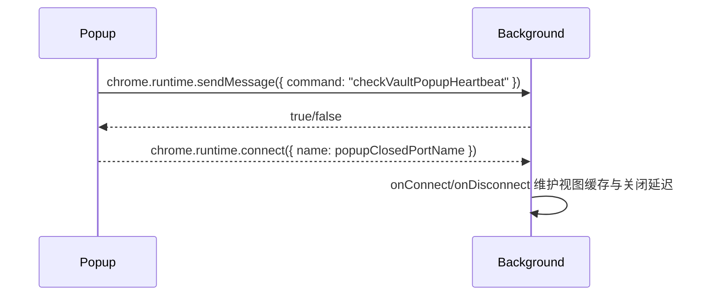

### Bitwarden 浏览器扩展架构图（严格基于 apps/browser 目录）

本文档基于 `apps/browser` 实际代码与构建产物关系，梳理浏览器扩展在 MV2/MV3 下的结构、数据流与构建流程。所有组件、文件与交互均来自该目录内现有实现。

---

## 清单与运行时形态

- Manifest V2（`src/manifest.json`）
  - Background Page：`background.html` + 持久后台
    - 引导自：`src/platform/background.ts` → Webpack 产出 `background.html`、`vendor.js`、`background.js`
    - 清单片段：
      ```json
      {
        "manifest_version": 2,
        "background": { "page": "background.html", "persistent": true },
        "browser_action": { "default_popup": "popup/index.html" },
        "content_scripts": [
          { "js": ["content/content-message-handler.js"], "run_at": "document_start" },
          { "css": ["content/autofill.css"], "js": ["content/trigger-autofill-script-injection.js"], "all_frames": true }
        ],
        "permissions": ["webRequest", "webRequestBlocking", "tabs", "storage", "contextMenus", "notifications", "alarms", "idle", "unlimitedStorage", "webNavigation", "clipboardRead", "clipboardWrite", "<all_urls>"]
      }
      ```

- Manifest V3（`src/manifest.v3.json`）
  - Background Service Worker：`background.js`
    - 产出自：`src/platform/background.ts`
  - `action.default_popup`: `popup/index.html`
  - 关键权限：`scripting`、`offscreen`、`webRequest`、`webRequestAuthProvider`、`tabs`、`storage`、`notifications` 等
  - 清单片段：
    ```json
    {
      "manifest_version": 3,
      "background": { "service_worker": "background.js" },
      "action": { "default_popup": "popup/index.html" },
      "permissions": ["scripting", "offscreen", "webRequest", "webRequestAuthProvider", "tabs", "storage", "notifications"],
      "web_accessible_resources": [{ "resources": ["content/fido2-page-script.js", "overlay/*", "popup/fonts/*"], "matches": ["<all_urls>"] }]
    }
    ```

参考构建位于 `webpack.config.js`：

```startLine:endLine:apps/browser/webpack.config.js
136:       new CopyWebpackPlugin({
139:         from: manifestVersion == 3 ? "./src/manifest.v3.json" : "./src/manifest.json",
140:         to: "manifest.json",
141:         transform: manifest.transform(browser),
...
343:   const backgroundConfig = {
350:     entry: "./src/platform/background.ts",
353:       filename: "background.js",
```

---

## 顶层架构（模块与关系）

```mermaid
graph TD
  subgraph Extension
    BG["Background\n(MV2: background.html + background.js\nMV3: background.js SW)\n源: src/platform/background.ts → background/main.background.ts"]
    POP["Popup (Angular)\npopup/index.html\n源: src/popup"]
    CS["Content Scripts\n源: src/autofill/content/*, src/platform/ipc/content/*, src/vault/content/*"]
    OFF["Offscreen Document (MV3)\n源: src/platform/offscreen-document/*"]
  end

  subgraph Services in Background
    MBG["MainBackground\n源: src/background/main.background.ts"]
    WR["WebRequest 监听\n源: src/autofill/background/*web-request*.ts, overlay-notifications.background.ts, auto-submit-login.background.ts"]
    IPC["IPC\n源: src/platform/ipc/ipc-background.service.ts, ipc-content-script-manager.service.ts"]
    FIDO2BG["FIDO2 Background\n源: src/autofill/fido2/background/*"]
    BADGE["Badge 服务\n源: src/platform/badge/*"]
    STORE["Storage\n背景/前台/会话存储\n源: src/platform/storage/*, src/platform/services/local-backed-session-storage.service.ts"]
    NAT["Native Messaging\n源: src/background/nativeMessaging.background.ts"]
  end

  BG -->|chrome.runtime 消息| POP
  BG -->|chrome.tabs.sendMessage| CS
  CS -->|chrome.runtime.sendMessage| BG
  CS <-->|window.postMessage + MessageChannel| PAGE[页面 JS]
  BG --> WR
  BG --> IPC
  BG --> FIDO2BG
  BG --> BADGE
  BG --> STORE
  BG -->|connectNative| NAT
  BG -. MV3: chrome.scripting.registerContentScripts .-> CS
  BG -. MV3: Offscreen API .-> OFF
```

关键入口与胶水层：

- Background 组装：`src/background/main.background.ts`（集中注册 WebRequest、IPC、Autofill、FIDO2、存储、Badge、NativeMessaging 等）
- Popup 应用：`src/popup/*`（Angular 应用，`index.ejs` → `popup/index.html`）
- 内容脚本：`src/autofill/content/*`、`src/platform/ipc/content/ipc-content-script.ts`、`src/vault/content/*`
- MV3 动态脚本注册：`src/platform/browser/browser-api.ts#registerContentScriptsMv3`

代码引用：

```startLine:endLine:apps/browser/src/platform/browser/browser-api.ts
722:   static async registerContentScriptsMv3(
727:     scripts: chrome.scripting.RegisteredContentScript[],
729:     await chrome.scripting.registerContentScripts(scripts);
```

---

## 主要数据流与交互

### 1) 安装/初始化与内容脚本注入

- 触发窗口与内容脚本注入：
  - `src/autofill/services/autofill.service.ts` 负责在安装时注入、以及必要时重载脚本。

```startLine:endLine:apps/browser/src/autofill/services/autofill.service.ts
175:   /**
176:    * Triggers on installation of the extension Handles injecting
177:    * content scripts into all tabs that are currently open, and
178:    * sets up a listener to ensure content scripts can identify
179:    * if the extension context has been disconnected.
```

### 2) Popup 打开/关闭心跳与视图缓存



相关代码：

```startLine:endLine:apps/browser/src/platform/services/popup-view-cache-background.service.ts
124:     // on popup closed, with 2 minute delay that is cancelled by re-opening the popup
126:     fromChromeEvent(chrome.runtime.onConnect)
190: export const initPopupClosedListener = () => {
191:   chrome.runtime.connect({ name: popupClosedPortName });
```

### 3) FIDO2 页面脚本 ↔ 内容脚本 ↔ 后台

- 页面与内容脚本通过 `window.postMessage + MessageChannel` 进行请求/响应，内容脚本再与后台通信。

```startLine:endLine:apps/browser/src/autofill/fido2/content/messaging/messenger.ts
31:   /**
32:    * Creates a messenger that uses the browser's `window.postMessage` API to initiate
33:    * requests in the content script. Every request will then create it's own
34:    * `MessageChannel` through which all subsequent communication will be sent through.
```

### 4) WebRequest 监听（自动提交、通知栏等）

- 监听器集中在 Background：
  - `src/autofill/background/auto-submit-login.background.ts`
  - `src/autofill/background/overlay-notifications.background.ts`
  - `src/autofill/background/web-request.background.ts`

```startLine:endLine:apps/browser/src/autofill/background/auto-submit-login.background.ts
124:     chrome.webRequest.onBeforeRequest.addListener(this.handleOnBeforeRequest, {
128:     chrome.webRequest.onBeforeRedirect.addListener(this.handleWebRequestOnBeforeRedirect, {
```

### 5) 原生通信（Native Messaging）

- 后台通过 `connectNative` 与宿主通信，权限通常在运行时按需申请：

```startLine:endLine:apps/browser/src/background/nativeMessaging.background.ts
98:       // Reload extension to activate nativeMessaging
108:     if (!(await BrowserApi.permissionsGranted(["nativeMessaging"]))) {
124:       const port = BrowserApi.connectNative("com.8bit.bitwarden");
```

---

## 存储与状态

- 会话存储（前台持久在后台进程）：`src/platform/services/local-backed-session-storage.service.ts`
  - 通过 `chrome.runtime.Port` 在前景与后台之间同步 session 值，避免 MV3 service worker 生命周期带来的丢失。

```startLine:endLine:apps/browser/src/platform/services/local-backed-session-storage.service.ts
27:   private ports: Set<chrome.runtime.Port> = new Set([]);
42:     BrowserApi.addListener(chrome.runtime.onConnect, (port) => {
149:     if (message.originator === "background") {
181:   private sendMessageTo(
```

- 其他存储：
  - `src/platform/storage/background-memory-storage.service.ts`
  - `src/platform/storage/foreground-memory-storage.service.ts`
  - `src/platform/storage/offscreen-storage.service.ts`
  - `@bitwarden/common` 中的 `PrimarySecondaryStorageService`、`WindowStorageService` 在后台/前台被装配（见 `main.background.ts`、`popup/services/services.module.ts`）

---

## 构建与产物

```mermaid
flowchart LR
  A[Webpack main] -->|HtmlWebpackPlugin| PHTML[popup/index.html]
  A -->|entries| CS1[content/* 多入口]
  A -->|CopyWebpackPlugin| MAN[manifest.json]
  A -->|HtmlWebpackPlugin| OHTML[overlay/menu*.html]
  A -->|HtmlWebpackPlugin (MV2)| BGH[background.html]
  A -->|entry (MV2)| BGS[background.js]
  B{MANIFEST_VERSION} -->|2| A
  B -->|3| BGW
  BGW[Webpack background] --> SW[background.js (MV3 Service Worker)]
  BGW -->|非 Firefox| OFF[offscreen-document/index.html + *.js]
```

关键入口（节选）：

```startLine:endLine:apps/browser/webpack.config.js
173: const mainConfig = {
178:   "popup/polyfills": "./src/popup/polyfills.ts",
179:   "popup/main": "./src/popup/main.ts",
180:   "content/trigger-autofill-script-injection": "./src/autofill/content/trigger-autofill-script-injection.ts",
191:   "content/content-message-handler": "./src/autofill/content/content-message-handler.ts",
192:   "content/fido2-content-script": "./src/autofill/fido2/content/fido2-content-script.ts",
193:   "content/fido2-page-script": "./src/autofill/fido2/content/fido2-page-script.ts",
194:   "content/ipc-content-script": "./src/platform/ipc/content/ipc-content-script.ts",
195:   "notification/bar": "./src/autofill/notification/bar.ts",
321:   mainConfig.entry.background = "./src/platform/background.ts"; // MV2
329:   mainConfig.entry["offscreen-document/offscreen-document"] = "./src/platform/offscreen-document/offscreen-document.ts"; // MV3 非 Firefox
350:   entry: "./src/platform/background.ts", // MV3 背景
353:   filename: "background.js",
```

---

## 运行时 API 封装

- `src/platform/browser/browser-api.ts`：统一封装 `chrome.*`/`browser.*` API（如 `runtime`, `tabs`, `storage`, `scripting`），并处理 MV2/MV3 差异（如 `getBackgroundPage` 在 MV3 返回 `null`）。

```startLine:endLine:apps/browser/src/platform/browser/browser-api.ts
320:   /** Gets the background page ... will return null for MV3 SW */
533:   /** Reloads all open extension views, except the background page. */
707:   /** registerContentScriptsMv2 */
722:   /** registerContentScriptsMv3 */
```

---

## Popup 与弹出窗口（Popout）

- Popup Angular 应用位于 `src/popup/*`，通过 `BrowserPopupUtils` 打开/关闭 popout；URL 构建依赖 `chrome.runtime.getURL("popup/index.html")`。

```startLine:endLine:apps/browser/src/platform/browser/browser-popup-utils.ts
179:   static async closeSingleActionPopout(popoutKey: string, delayClose = 0):
281:   private static buildPopoutUrl(extensionUrlPath: string, singleActionKey: string)
```

---

## 权限与多浏览器适配

- 可选权限：`nativeMessaging`、`privacy`（见两版 manifest）。
- Firefox：MV3 背景使用 `__firefox__background.scripts` 兼容。
- Safari：MV3 构建时复制 `fake-background.html` 与 `vendor.js` 以契合桌面打包（见 `src/safari/mv3`）。

---

## 附：模块清单速查（按子域）

- Background 聚合：`src/background/main.background.ts`
- WebRequest：`src/autofill/background/auto-submit-login.background.ts`、`overlay-notifications.background.ts`、`web-request.background.ts`
- IPC：`src/platform/ipc/ipc-background.service.ts`、`ipc-content-script-manager.service.ts`、`content/ipc-content-script.ts`
- Autofill 内容脚本：`src/autofill/content/*`
- FIDO2：`src/autofill/fido2/content/*`、`src/autofill/fido2/background/*`
- Popup：`src/popup/*`、`src/platform/popup/*`
- 存储：`src/platform/storage/*`、`src/platform/services/local-backed-session-storage.service.ts`
- 徽章：`src/platform/badge/*`
- 原生通信：`src/background/nativeMessaging.background.ts`

---

以上架构图与说明完全根据 `apps/browser` 目录中的实际文件与实现整理，无外部假设。


